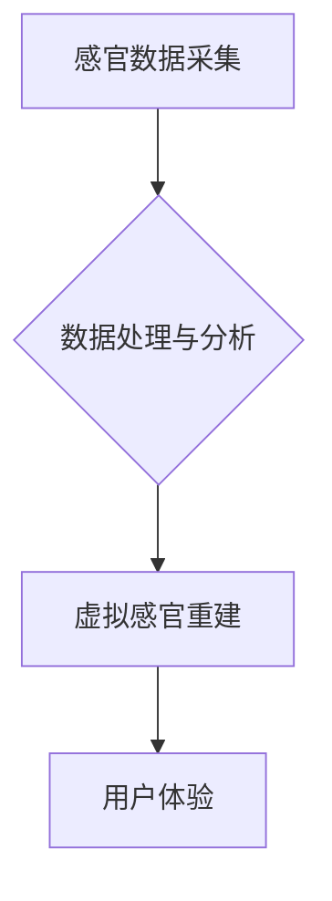

                 

## 感官模拟：AI创造的超现实体验

> 关键词：人工智能、感官模拟、虚拟现实、增强现实、神经网络、深度学习、计算机视觉、音频处理、触觉反馈

## 1. 背景介绍

人类感知世界的方式依赖于五官：视觉、听觉、嗅觉、味觉和触觉。这些感官接收并处理来自环境的信息，构建我们对现实的理解。近年来，人工智能（AI）技术取得了飞速发展，特别是深度学习的突破，为模拟和重建人类感官体验提供了新的可能性。

传统的虚拟现实（VR）和增强现实（AR）技术主要通过视觉和听觉刺激来营造沉浸式的体验，但缺乏对其他感官的模拟，导致体验不够真实。而AI驱动的感官模拟技术，则旨在通过更先进的算法和传感器，模拟更丰富的感官信息，创造更加逼真的超现实体验。

## 2. 核心概念与联系

感官模拟的核心概念是将真实世界中的感官信息转化为数字信号，并通过AI算法进行处理和重建，最终以虚拟形式呈现给用户。

**核心概念：**

* **感官数据采集:** 利用各种传感器收集真实世界中的视觉、听觉、嗅觉、味觉和触觉信息。
* **数据处理与分析:** 使用AI算法，例如深度学习，对采集到的感官数据进行分析、识别和理解。
* **虚拟感官重建:** 根据处理后的数据，生成虚拟的感官刺激，并通过相应的设备（如VR头显、触觉反馈装置）呈现给用户。

**架构图：**



## 3. 核心算法原理 & 具体操作步骤

### 3.1  算法原理概述

感官模拟的核心算法主要包括：

* **计算机视觉:** 用于模拟视觉体验，识别物体、场景和运动，并生成逼真的图像和视频。
* **音频处理:** 用于模拟听觉体验，识别声音、音乐和环境音效，并生成逼真的音频信号。
* **嗅觉和味觉模拟:** 这是一个相对较新的研究领域，目前主要通过化学物质的释放和味觉传感器来模拟嗅觉和味觉体验。
* **触觉反馈:** 用于模拟触觉体验，通过机械振动、压力传感器和气动反馈等技术，模拟物体形状、温度和材质。

### 3.2  算法步骤详解

**以视觉模拟为例，算法步骤如下：**

1. **图像采集:** 使用摄像头或其他传感器采集真实世界的图像数据。
2. **图像预处理:** 对图像数据进行预处理，例如调整亮度、对比度和色彩平衡，去除噪声等。
3. **物体识别和跟踪:** 使用计算机视觉算法，识别图像中的物体和场景，并跟踪物体的运动轨迹。
4. **三维重建:** 根据图像数据，构建物体的三维模型。
5. **虚拟场景渲染:** 使用图形渲染技术，将三维模型渲染成逼真的虚拟图像，并根据用户的视角和运动轨迹进行动态更新。

### 3.3  算法优缺点

**优点:**

* 可以创造更加逼真的虚拟体验，增强用户沉浸感。
* 可以模拟各种难以实现的感官体验，例如超感官感知。
* 可以应用于各种领域，例如游戏、教育、医疗和设计。

**缺点:**

* 算法复杂度高，需要强大的计算能力。
* 感官模拟技术还处于发展初期，存在一些技术瓶颈。
* 虚拟感官体验可能无法完全复制真实感官体验。

### 3.4  算法应用领域

* **游戏:** 创建更加沉浸式的游戏体验，例如模拟触觉反馈和环境音效。
* **教育:** 提供更加生动的学习体验，例如虚拟实验室和模拟手术。
* **医疗:** 用于训练医学生、进行虚拟手术模拟和治疗心理疾病。
* **设计:** 用于虚拟设计和原型制作，例如建筑设计和产品设计。

## 4. 数学模型和公式 & 详细讲解 & 举例说明

### 4.1  数学模型构建

感官模拟的数学模型主要基于以下几个方面：

* **信号处理:** 使用数学公式和算法对感官数据进行滤波、变换和压缩。
* **图像处理:** 使用数学模型和算法对图像进行识别、分割、重建和渲染。
* **音频处理:** 使用数学模型和算法对音频信号进行分析、合成和编码。
* **神经网络:** 使用神经网络模型模拟人类大脑对感官信息的处理方式。

### 4.2  公式推导过程

**以图像处理为例，以下是一些常用的数学公式：**

* **傅里叶变换:** 用于将图像从时域转换为频域，以便进行滤波和压缩。

$$
F(\omega) = \int_{-\infty}^{\infty} f(t) e^{-i\omega t} dt
$$

* **卷积:** 用于将图像与滤波器进行操作，例如边缘检测和图像模糊。

$$
g(x,y) = \int_{-\infty}^{\infty} \int_{-\infty}^{\infty} f(u,v) h(x-u,y-v) du dv
$$

* **深度学习:** 使用神经网络模型进行图像识别和分类。

### 4.3  案例分析与讲解

**例如，使用深度学习模型进行图像识别，可以将图像数据作为输入，训练模型识别图像中的物体类别。**

训练过程可以利用大量的标注图像数据，通过反向传播算法调整模型参数，使模型能够准确识别图像中的物体。

## 5. 项目实践：代码实例和详细解释说明

### 5.1  开发环境搭建

感官模拟项目开发环境通常需要以下软件和硬件：

* **操作系统:** Windows、Linux或macOS
* **编程语言:** Python、C++或Java
* **深度学习框架:** TensorFlow、PyTorch或Keras
* **图形渲染引擎:** OpenGL、Vulkan或DirectX
* **传感器设备:** 摄像头、麦克风、触觉反馈装置等

### 5.2  源代码详细实现

以下是一个简单的Python代码示例，使用OpenCV库进行图像处理：

```python
import cv2

# 读取图像
image = cv2.imread("image.jpg")

# 转换图像到灰度
gray = cv2.cvtColor(image, cv2.COLOR_BGR2GRAY)

# 显示图像
cv2.imshow("Image", image)
cv2.imshow("Gray", gray)

# 等待按键按下
cv2.waitKey(0)

# 关闭窗口
cv2.destroyAllWindows()
```

### 5.3  代码解读与分析

这段代码首先使用OpenCV库读取一张图像文件，然后将图像转换为灰度图像。最后，使用cv2.imshow函数显示图像，并等待用户按下按键关闭窗口。

### 5.4  运行结果展示

运行这段代码后，将显示两张窗口：一张显示原始图像，另一张显示灰度图像。

## 6. 实际应用场景

### 6.1  游戏开发

感官模拟技术可以为游戏开发带来革命性的改变，例如：

* **沉浸式体验:** 通过模拟触觉反馈和环境音效，让玩家更加沉浸在游戏世界中。
* **更真实的物理模拟:** 通过模拟物体形状、材质和重量，让游戏中的物理交互更加真实。
* **新的游戏玩法:** 通过模拟超感官感知，例如热力感知和磁场感知，创造全新的游戏玩法。

### 6.2  教育培训

感官模拟技术可以为教育培训提供更加生动的学习体验，例如：

* **虚拟实验室:** 模拟真实的实验室环境，让学生进行虚拟实验，例如化学反应和生物显微镜观察。
* **模拟手术:** 提供虚拟手术环境，让医学生进行模拟手术练习，提高手术技能。
* **沉浸式历史体验:** 通过虚拟现实技术，让学生身临其境地体验历史事件，例如古埃及文明和古代罗马帝国。

### 6.3  医疗保健

感官模拟技术可以应用于医疗保健领域，例如：

* **康复治疗:** 通过触觉反馈装置，帮助患者恢复肢体功能。
* **心理治疗:** 通过虚拟现实技术，模拟恐怖场景或社交情境，帮助患者克服心理障碍。
* **疼痛管理:** 通过模拟触觉和视觉刺激，帮助患者缓解疼痛。

### 6.4  未来应用展望

感官模拟技术的发展潜力巨大，未来可能应用于更多领域，例如：

* **艺术创作:** 使用感官模拟技术创作更加沉浸式的艺术作品，例如虚拟音乐会和互动艺术展览。
* **社交互动:** 通过虚拟现实技术，创造更加真实的社交体验，例如虚拟会议和远程陪伴。
* **个性化体验:** 根据用户的感官偏好，定制个性化的感官体验，例如虚拟旅游和个性化教育。

## 7. 工具和资源推荐

### 7.1  学习资源推荐

* **书籍:**
    * "Deep Learning" by Ian Goodfellow, Yoshua Bengio, and Aaron Courville
    * "Computer Vision: Algorithms and Applications" by Richard Szeliski
    * "Speech and Language Processing" by Daniel Jurafsky and James H. Martin
* **在线课程:**
    * Coursera: Deep Learning Specialization
    * Udacity: Artificial Intelligence Nanodegree
    * edX: Artificial Intelligence

### 7.2  开发工具推荐

* **深度学习框架:** TensorFlow, PyTorch, Keras
* **图像处理库:** OpenCV, Pillow
* **音频处理库:** Librosa, PyDub
* **虚拟现实平台:** Unity, Unreal Engine, Oculus SDK

### 7.3  相关论文推荐

* "Generative Adversarial Networks" by Ian Goodfellow et al.
* "Deep Residual Learning for Image Recognition" by Kaiming He et al.
* "Attention Is All You Need" by Ashish Vaswani et al.

## 8. 总结：未来发展趋势与挑战

### 8.1  研究成果总结

感官模拟技术近年来取得了显著进展，特别是深度学习算法的突破，为模拟和重建人类感官体验提供了新的可能性。

### 8.2  未来发展趋势

未来感官模拟技术的发展趋势包括：

* **更加逼真的感官体验:** 通过更先进的算法和传感器，模拟更加丰富的感官信息，例如触觉、嗅觉和味觉。
* **更广泛的应用场景:** 感官模拟技术将应用于更多领域，例如教育、医疗、艺术和社交互动。
* **个性化体验:** 根据用户的感官偏好，定制个性化的感官体验。

### 8.3  面临的挑战

感官模拟技术还面临一些挑战，例如：

* **算法复杂度:** 感官模拟算法复杂度高，需要强大的计算能力。
* **传感器技术:** 目前传感器技术还无法完全模拟人类感官的灵敏度和范围。
* **伦理问题:** 感官模拟技术可能引发一些伦理问题，例如虚拟现实成瘾和虚假信息传播。

### 8.4  研究展望

未来研究方向包括：

* **开发更先进的感官模拟算法:** 例如，开发能够模拟人类大脑对感官信息的处理方式的神经网络模型。
* **开发更先进的传感器技术:** 例如，开发能够模拟人类触觉和嗅觉的传感器。
* **探索感官模拟技术的伦理问题:** 例如，研究如何防止虚拟现实成瘾和虚假信息传播。

## 9. 附录：常见问题与解答

**Q1: 感官模拟技术与虚拟现实技术有什么区别？**

**A1:** 虚拟现实技术主要通过视觉和听觉刺激来营造沉浸式的体验，而感官模拟技术则旨在模拟更丰富的感官信息，例如触觉、嗅觉和味觉。

**Q2: 感官模拟技术有哪些应用场景？**

**A2:** 感官模拟技术可以应用于游戏开发、教育培训、医疗保健、艺术创作、社交互动等多个领域。

**Q3: 感官模拟技术有哪些挑战？**

**A3:** 感官模拟技术面临的挑战包括算法复杂度、传感器技术和伦理问题。

**Q4: 未来感官模拟技术的发展趋势是什么？**

**A4:** 未来感官模拟技术将更加逼真、应用场景更加广泛，并更加个性化。


作者：禅与计算机程序设计艺术 / Zen and the Art of Computer Programming 
<end_of_turn>

