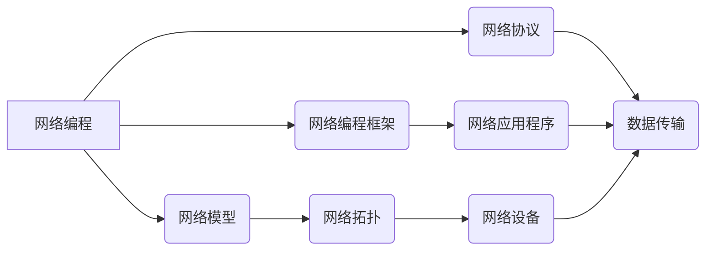

                 

## 技术大会：networking与机遇

> 关键词：网络编程, 网络协议, 网络安全, 软件架构, 云计算, 容器化, microservices

### 1. 背景介绍

在当今数字化时代，网络已成为连接世界、促进信息流动和推动创新发展的关键基础设施。随着互联网的蓬勃发展和云计算、物联网、大数据等新兴技术的兴起，网络编程和网络架构面临着前所未有的挑战和机遇。

技术大会作为科技领域的重要交流平台，汇聚了来自全球各地的技术专家、学者和企业家。今年的主题“networking与机遇”旨在探讨网络技术在未来发展中的趋势和挑战，并为开发者、架构师和企业提供最新的技术洞察和实践经验。

### 2. 核心概念与联系

**2.1 网络编程**

网络编程是指利用编程语言和网络协议，实现计算机之间的数据传输和通信。它涉及到以下核心概念：

* **网络协议**: 网络协议是计算机之间通信的规则和规范，例如TCP/IP协议、HTTP协议、FTP协议等。
* **网络模型**: 网络模型描述了网络的结构和功能，例如OSI七层模型、TCP/IP四层模型等。
* **网络编程框架**: 网络编程框架提供了用于开发网络应用程序的工具和库，例如Socket编程、HTTP库、Web框架等。

**2.2 网络架构**

网络架构是指网络的整体设计和组织结构，包括网络拓扑、网络设备、网络安全等方面。常见的网络架构模式包括：

* **集中式架构**: 所有网络资源都集中在中央服务器上，例如传统的企业局域网。
* **分布式架构**: 网络资源分散在多个节点上，例如云计算平台和微服务架构。
* **云计算架构**: 网络资源以服务的形式提供，用户可以按需使用，例如AWS、Azure、GCP等云平台。

**2.3 联系**

网络编程和网络架构是相互关联的。网络编程实现网络通信，而网络架构提供网络通信的平台和环境。



### 3. 核心算法原理 & 具体操作步骤

**3.1 算法原理概述**

网络编程中常用的算法包括：

* **路由算法**: 用于确定数据包在网络中传输的最佳路径。常见的路由算法包括RIP、OSPF、BGP等。
* **流量控制算法**: 用于控制网络流量，避免网络拥塞。常见的流量控制算法包括TCP拥塞控制、滑动窗口协议等。
* **错误检测和纠正算法**: 用于检测和纠正网络传输过程中可能出现的错误。常见的错误检测和纠正算法包括CRC、校验和、ARQ协议等。

**3.2 算法步骤详解**

以TCP拥塞控制算法为例，其步骤如下：

1. 发送方根据拥塞窗口大小发送数据包。
2. 接收方确认收到数据包，并发送确认报文。
3. 发送方根据确认报文更新拥塞窗口大小。
4. 如果出现数据包丢失或超时，发送方会缩小拥塞窗口大小。

**3.3 算法优缺点**

* **优点**: 能够有效地控制网络流量，避免网络拥塞。
* **缺点**: 算法复杂，需要大量的计算资源。

**3.4 算法应用领域**

路由算法、流量控制算法和错误检测和纠正算法广泛应用于网络通信、云计算、物联网等领域。

### 4. 数学模型和公式 & 详细讲解 & 举例说明

**4.1 数学模型构建**

TCP拥塞控制算法的数学模型可以描述为一个动态系统，其中拥塞窗口大小是系统状态变量，数据包发送率是系统输入，确认报文和数据包丢失是系统输出。

**4.2 公式推导过程**

TCP拥塞控制算法的拥塞窗口大小更新公式如下：

$$
\text{拥塞窗口大小} = \text{拥塞窗口大小} \times (1 - \text{丢失率})
$$

其中，丢失率是指在一定时间内丢失的数据包数量占总发送数据包数量的比例。

**4.3 案例分析与讲解**

假设初始拥塞窗口大小为10，丢失率为0.1，则拥塞窗口大小更新后为：

$$
\text{拥塞窗口大小} = 10 \times (1 - 0.1) = 9
$$

可见，当数据包丢失率增加时，拥塞窗口大小会相应减少，从而降低网络流量，避免网络拥塞。

### 5. 项目实践：代码实例和详细解释说明

**5.1 开发环境搭建**

* 操作系统：Linux
* 编程语言：Python
* 网络库：socket

**5.2 源代码详细实现**

```python
import socket

# 创建套接字
s = socket.socket(socket.AF_INET, socket.SOCK_STREAM)

# 绑定地址和端口
s.bind(('127.0.0.1', 8080))

# 监听连接
s.listen(5)

# 接受连接
conn, addr = s.accept()

# 接收数据
data = conn.recv(1024)

# 处理数据
print('Received data:', data.decode())

# 发送数据
conn.sendall(b'Hello, world!')

# 关闭连接
conn.close()
```

**5.3 代码解读与分析**

* `socket.socket()` 创建一个套接字对象。
* `socket.bind()` 将套接字绑定到指定的地址和端口。
* `socket.listen()` 监听来自客户端的连接请求。
* `socket.accept()` 接受来自客户端的连接请求，并返回一个新的套接字对象和客户端地址。
* `conn.recv()` 从客户端接收数据。
* `conn.sendall()` 向客户端发送数据。
* `conn.close()` 关闭连接。

**5.4 运行结果展示**

运行上述代码后，会在本地创建一个服务器，监听端口8080。当客户端连接到服务器时，服务器会接收客户端发送的数据，并将其打印到控制台。然后，服务器会向客户端发送“Hello, world!”消息。

### 6. 实际应用场景

**6.1 网络游戏**

网络游戏需要实时的数据传输和通信，因此需要使用高效的网络编程算法和架构。例如，TCP协议可以保证数据包的可靠传输，而UDP协议可以提供更低的延迟。

**6.2 云计算**

云计算平台需要提供大量的网络资源，例如虚拟机、存储和网络带宽。微服务架构可以帮助云计算平台实现更灵活、可扩展和可靠的网络服务。

**6.3 物联网**

物联网设备需要连接到网络，以便收集和传输数据。MQTT协议是一种轻量级的物联网通信协议，可以支持大量设备的连接和数据传输。

**6.4 未来应用展望**

随着人工智能、区块链等新兴技术的兴起，网络编程和网络架构将面临新的挑战和机遇。例如，人工智能可以用于网络安全、流量预测和网络优化；区块链可以用于网络信任和数据安全。

### 7. 工具和资源推荐

**7.1 学习资源推荐**

* **书籍**:
    * 《计算机网络》
    * 《TCP/IP详解》
    * 《网络编程艺术》
* **在线课程**:
    * Coursera: Network Programming
    * Udemy: Python Network Programming
    * edX: Introduction to Computer Networks

**7.2 开发工具推荐**

* **网络分析工具**: Wireshark, tcpdump
* **网络调试工具**: ngrep, netcat
* **代码编辑器**: VS Code, Sublime Text

**7.3 相关论文推荐**

* TCP拥塞控制算法
* 微服务架构
* 物联网通信协议

### 8. 总结：未来发展趋势与挑战

**8.1 研究成果总结**

近年来，网络编程和网络架构领域取得了显著的进展，例如：

* **微服务架构**: 提高了网络服务的灵活性和可扩展性。
* **容器化技术**: 简化了网络服务的部署和管理。
* **软件定义网络 (SDN)**: 提供了更灵活和可编程的网络控制。

**8.2 未来发展趋势**

* **人工智能驱动的网络**: 利用人工智能技术进行网络安全、流量预测和网络优化。
* **边缘计算**: 将计算和存储资源部署到网络边缘，降低网络延迟和提高数据处理效率。
* **网络虚拟化**: 虚拟化网络资源，提高网络资源利用率和灵活性。

**8.3 面临的挑战**

* **网络安全**: 网络攻击越来越复杂，网络安全面临着新的挑战。
* **网络可扩展性**: 随着网络规模的不断扩大，网络可扩展性成为一个重要问题。
* **网络可靠性**: 网络服务需要保证高可靠性，以满足用户对服务的依赖。

**8.4 研究展望**

未来，网络编程和网络架构领域的研究将继续关注以下几个方面：

* **人工智能驱动的网络安全**: 利用人工智能技术识别和防御网络攻击。
* **边缘计算和网络虚拟化**: 研究边缘计算和网络虚拟化技术，提高网络效率和可靠性。
* **网络可编程性**: 开发更灵活和可编程的网络控制方案。

### 9. 附录：常见问题与解答

**9.1 如何选择合适的网络协议？**

选择合适的网络协议取决于具体的应用场景。例如，对于需要保证数据可靠传输的应用，可以选择TCP协议；对于需要低延迟的应用，可以选择UDP协议。

**9.2 如何解决网络拥塞问题？**

网络拥塞问题可以通过流量控制算法、网络带宽优化和网络拓扑设计等方式解决。

**9.3 如何提高网络安全？**

提高网络安全可以通过防火墙、入侵检测系统、数据加密等方式实现。


作者：禅与计算机程序设计艺术 / Zen and the Art of Computer Programming 
<end_of_turn>

