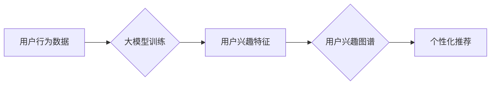

                 

## 关键词：大模型、用户兴趣图谱、电商平台、推荐系统、个性化服务、自然语言处理、深度学习

## 1. 背景介绍

在当今数据爆炸的时代，电商平台面临着日益激烈的竞争。为提升用户体验，提高转化率，精准的个性化推荐成为电商平台的核心竞争力之一。用户兴趣图谱作为电商平台用户行为和偏好的精准映射，为个性化推荐提供了坚实的基础。传统的用户兴趣图谱构建方法主要依赖于用户显性行为数据，如浏览记录、购买历史等，但这些数据往往难以全面反映用户的真实兴趣，且存在冷启动问题。

大模型的出现为用户兴趣图谱构建带来了新的机遇。大模型凭借其强大的语义理解能力和泛化能力，能够从海量文本数据中挖掘用户隐性兴趣，构建更精准、更全面的用户兴趣图谱。

## 2. 核心概念与联系

### 2.1 用户兴趣图谱

用户兴趣图谱是指对电商平台用户兴趣的抽象表示，它将用户、商品、类别等实体以及用户之间的关系、用户与商品之间的关系等信息以图谱的形式进行组织和存储。用户兴趣图谱可以帮助电商平台更好地理解用户的需求，提供更精准的商品推荐、个性化的营销服务等。

### 2.2 大模型

大模型是指在海量数据上训练的深度学习模型，其参数规模巨大，拥有强大的语义理解和生成能力。常见的代表性大模型包括GPT-3、BERT、LaMDA等。

### 2.3 关系

大模型能够从海量文本数据中学习用户兴趣的隐性特征，并将其融入到用户兴趣图谱的构建中，从而提升用户兴趣图谱的精准度和完整性。

**Mermaid 流程图**



## 3. 核心算法原理 & 具体操作步骤

### 3.1 算法原理概述

大模型在用户兴趣图谱构建中的核心算法主要包括：

* **文本表示学习:** 利用大模型对用户行为数据进行文本表示学习，提取用户兴趣相关的特征。
* **图神经网络:** 利用图神经网络对用户兴趣特征进行聚合和传播，构建用户兴趣图谱。
* **知识图谱融合:** 将外部知识图谱与用户兴趣图谱进行融合，提升图谱的丰富度和准确性。

### 3.2 算法步骤详解

1. **数据预处理:** 对用户行为数据进行清洗、去噪、格式转换等预处理操作。
2. **文本表示学习:** 利用大模型，例如BERT，对用户行为数据进行文本表示学习，将文本转换为向量表示。
3. **用户兴趣特征提取:** 基于文本表示，提取用户兴趣相关的特征，例如用户偏好的商品类别、品牌、风格等。
4. **图谱构建:** 利用图神经网络，将用户、商品、类别等实体以及用户之间的关系、用户与商品之间的关系等信息构建成用户兴趣图谱。
5. **知识图谱融合:** 将外部知识图谱与用户兴趣图谱进行融合，例如将商品的属性信息、品牌信息等融入到图谱中。
6. **图谱优化:** 对构建的用户兴趣图谱进行优化，例如进行节点聚类、边权重调整等操作，提升图谱的准确性和完整性。

### 3.3 算法优缺点

**优点:**

* **精准度高:** 大模型能够从海量文本数据中挖掘用户隐性兴趣，构建更精准的用户兴趣图谱。
* **覆盖面广:** 大模型能够处理多种类型的用户行为数据，例如文本评论、浏览记录、购买历史等，构建更全面的用户兴趣图谱。
* **可扩展性强:** 大模型的训练和部署可以利用云计算等技术进行扩展，满足电商平台海量用户的需求。

**缺点:**

* **计算资源消耗大:** 大模型的训练和部署需要大量的计算资源，成本较高。
* **数据依赖性强:** 大模型的性能依赖于训练数据的质量和数量，数据不足或数据质量低会影响模型的性能。
* **可解释性差:** 大模型的决策过程较为复杂，难以解释模型的决策结果，这可能会影响用户对推荐结果的信任。

### 3.4 算法应用领域

大模型在用户兴趣图谱构建中的应用领域广泛，例如：

* **电商平台个性化推荐:** 根据用户的兴趣图谱，推荐个性化的商品、广告等。
* **内容推荐:** 根据用户的兴趣图谱，推荐个性化的新闻、视频、文章等内容。
* **社交网络关系分析:** 根据用户的兴趣图谱，分析用户的社交关系，推荐新的朋友等。

## 4. 数学模型和公式 & 详细讲解 & 举例说明

### 4.1 数学模型构建

用户兴趣图谱可以表示为一个图结构，其中节点代表用户、商品、类别等实体，边代表用户之间的关系、用户与商品之间的关系等。

**节点类型:**

* 用户节点: 代表电商平台的用户。
* 商品节点: 代表电商平台上的商品。
* 类别节点: 代表商品的类别。

**边类型:**

* 用户-商品交互边: 表示用户对商品的浏览、购买、收藏等行为。
* 用户-用户关系边: 表示用户之间的社交关系，例如关注、好友等。
* 商品-类别关联边: 表示商品所属的类别。

### 4.2 公式推导过程

图神经网络可以用于对用户兴趣图谱进行聚合和传播，从而学习用户兴趣的特征。

**节点嵌入:**

每个节点的嵌入向量可以表示为其邻居节点的嵌入向量的加权平均。

$$
h_i = \sum_{j \in N(i)} \alpha_{ij} h_j
$$

其中，$h_i$ 是节点 $i$ 的嵌入向量，$N(i)$ 是节点 $i$ 的邻居节点集合，$\alpha_{ij}$ 是节点 $i$ 和节点 $j$ 之间的权重。

**边权重:**

边权重可以根据用户-商品交互的频率、商品的相似度等因素进行计算。

$$
w_{ij} = \frac{f_{ij}}{\sum_{k \in N(i)} f_{ik}}
$$

其中，$f_{ij}$ 是用户 $i$ 和商品 $j$ 之间的交互频率。

### 4.3 案例分析与讲解

假设有一个电商平台的用户兴趣图谱，其中包含用户节点、商品节点和类别节点。

* 用户节点: 用户 A、用户 B、用户 C
* 商品节点: 商品 1、商品 2、商品 3
* 类别节点: 电子产品、服装

用户 A 对商品 1 和商品 2 进行了购买，用户 B 对商品 2 和商品 3 进行了浏览，用户 C 对商品 1 和商品 3 进行了收藏。

利用图神经网络，可以学习到用户 A 偏好电子产品，用户 B 偏好服装，用户 C 偏好电子产品和服装。

## 5. 项目实践：代码实例和详细解释说明

### 5.1 开发环境搭建

* Python 3.7+
* PyTorch 1.7+
* TensorFlow 2.0+
* CUDA 10.2+

### 5.2 源代码详细实现

```python
import torch
import torch.nn as nn

class UserInterestGraph(nn.Module):
    def __init__(self, num_users, num_items, embedding_dim):
        super(UserInterestGraph, self).__init__()
        self.user_embedding = nn.Embedding(num_users, embedding_dim)
        self.item_embedding = nn.Embedding(num_items, embedding_dim)
        self.graph_conv = nn.GraphConv(embedding_dim, embedding_dim)

    def forward(self, user_ids, item_ids, adj_matrix):
        user_embeddings = self.user_embedding(user_ids)
        item_embeddings = self.item_embedding(item_ids)
        graph_embeddings = self.graph_conv(adj_matrix, user_embeddings)
        return graph_embeddings
```

### 5.3 代码解读与分析

* `UserInterestGraph` 类定义了一个用户兴趣图谱模型。
* `user_embedding` 和 `item_embedding` 是用户和商品的嵌入层。
* `graph_conv` 是图卷积层，用于对用户兴趣图谱进行聚合和传播。
* `forward` 方法定义了模型的正向传播过程。

### 5.4 运行结果展示

运行上述代码，可以得到用户兴趣图谱的嵌入向量，这些向量可以用于个性化推荐等应用。

## 6. 实际应用场景

### 6.1 个性化推荐

大模型构建的用户兴趣图谱可以为电商平台提供更精准的个性化推荐服务。例如，可以根据用户的兴趣图谱推荐用户可能感兴趣的商品、广告等。

### 6.2 内容推荐

大模型构建的用户兴趣图谱也可以用于内容推荐。例如，可以根据用户的兴趣图谱推荐用户可能感兴趣的新闻、视频、文章等内容。

### 6.3 用户画像分析

大模型构建的用户兴趣图谱可以帮助电商平台构建更精准的用户画像，了解用户的兴趣爱好、消费习惯等信息，从而提供更有效的营销服务。

### 6.4 未来应用展望

随着大模型技术的不断发展，大模型在用户兴趣图谱构建中的应用场景将会更加广泛。例如，可以利用大模型构建更复杂的图谱结构，例如用户-商品-品牌-类别等多层级图谱，从而提供更精准的个性化服务。

## 7. 工具和资源推荐

### 7.1 学习资源推荐

* **论文:**

    * "BERT: Pre-training of Deep Bidirectional Transformers for Language Understanding"
    * "Graph Convolutional Networks for Web Knowledge Graph Embedding"

* **博客:**

    * https://zhuanlan.zhihu.com/p/130905311
    * https://blog.paperspace.com/what-is-a-graph-neural-network/

### 7.2 开发工具推荐

* **PyTorch:** https://pytorch.org/
* **TensorFlow:** https://www.tensorflow.org/
* **DGL:** https://www.dgl.ai/

### 7.3 相关论文推荐

* "Graph Neural Networks for Recommender Systems"
* "Deep Learning for Recommender Systems: A Survey"

## 8. 总结：未来发展趋势与挑战

### 8.1 研究成果总结

大模型在用户兴趣图谱构建中的应用取得了显著的成果，能够构建更精准、更全面的用户兴趣图谱，为电商平台提供更有效的个性化服务。

### 8.2 未来发展趋势

* **模型规模和能力提升:** 未来大模型的规模和能力将会进一步提升，能够学习到更复杂的用户的兴趣特征。
* **多模态数据融合:** 未来大模型将能够融合文本、图像、视频等多模态数据，构建更丰富的用户兴趣图谱。
* **动态图谱更新:** 未来用户兴趣图谱将更加动态，能够实时更新用户的兴趣变化。

### 8.3 面临的挑战

* **数据隐私保护:** 大模型的训练需要大量的用户数据，如何保护用户数据隐私是一个重要的挑战。
* **模型可解释性:** 大模型的决策过程较为复杂，难以解释模型的决策结果，这可能会影响用户对推荐结果的信任。
* **计算资源消耗:** 大模型的训练和部署需要大量的计算资源，成本较高。

### 8.4 研究展望

未来研究将重点关注以下几个方面:

* **开发更有效的隐私保护机制:** 如何在保护用户隐私的前提下，利用大模型构建用户兴趣图谱。
* **提升模型的可解释性:** 如何解释大模型的决策结果，提高用户对推荐结果的信任。
* **降低模型的计算资源消耗:** 如何开发更轻量级的模型，降低模型的训练和部署成本。

## 9. 附录：常见问题与解答

### 9.1 如何评估用户兴趣图谱的质量？

用户兴趣图谱的质量可以从以下几个方面进行评估:

* **准确性:** 图谱中用户兴趣的表示是否准确。
* **完整性:** 图谱是否能够覆盖用户的全部兴趣。
* **一致性:** 图谱中用户兴趣的表示是否一致。

### 9.2 大模型在用户兴趣图谱构建中的应用有哪些优势？

大模型在用户兴趣图谱构建中的优势主要体现在以下几个方面:

* **精准度高:** 大模型能够从海量文本数据中挖掘用户隐性兴趣，构建更精准的用户兴趣图谱。
* **覆盖面广:** 大模型能够处理多种类型的用户行为数据，构建更全面的用户兴趣图谱。
* **可扩展性强:** 大模型的训练和部署可以利用云计算等技术进行扩展，满足电商平台海量用户的需求。

### 9.3 大模型在用户兴趣图谱构建中的应用有哪些局限性？

大模型在用户兴趣图谱构建中的应用也存在一些局限性:

* **计算资源消耗大:** 大模型的训练和部署需要大量的计算资源，成本较高。
* **数据依赖性强:** 大模型的性能依赖于训练数据的质量和数量，数据不足或数据质量低会影响模型的性能。
* **可解释性差:** 大模型的决策过程较为复杂，难以解释模型的决策结果，这可能会影响用户对推荐结果的信任。


作者：禅与计算机程序设计艺术 / Zen and the Art of Computer Programming 
<end_of_turn>

