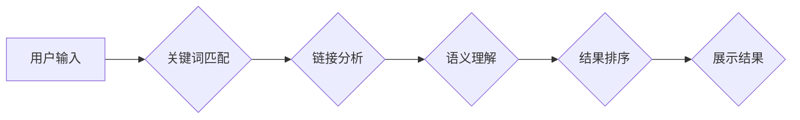

                 

## 搜索引擎革命：从链接到语义理解

> 关键词：搜索引擎、链接分析、语义理解、自然语言处理、机器学习、深度学习、知识图谱

### 1. 背景介绍

从互联网的诞生至今，搜索引擎已经成为我们获取信息、探索世界不可或缺的一部分。早期搜索引擎主要依靠关键词匹配算法，将用户输入的关键词与网页内容进行简单的匹配，并根据匹配次数排序结果。然而，随着互联网信息的爆炸式增长和内容的多样化，单纯依靠关键词匹配的搜索结果往往不够精准、不够全面。

为了解决这一问题，搜索引擎技术经历了从链接分析到语义理解的革命性转变。

### 2. 核心概念与联系

**2.1 链接分析**

链接分析是搜索引擎技术发展的重要里程碑。其核心思想是认为网页之间的链接关系可以反映网页的权威性和重要性。

* **PageRank算法**:  由谷歌创始人Larry Page和Sergey Brin提出的PageRank算法，通过分析网页之间的链接结构，计算每个网页的重要性得分。一个网页被更多高质量的网页链接，其PageRank值就越高，表示其权威性和重要性也越高。

**2.2 语义理解**

语义理解是指计算机能够理解文本的深层含义，而不是仅仅识别关键词。它涉及到自然语言处理（NLP）、知识图谱和机器学习等多个领域。

* **自然语言处理 (NLP)**: NLP旨在使计算机能够理解、处理和生成人类语言。它包括词法分析、语法分析、语义分析等多个子领域。
* **知识图谱**: 知识图谱是一种结构化的知识表示形式，它将实体和关系组织成一个网络，可以帮助计算机理解文本中的实体和关系。
* **机器学习**: 机器学习算法可以从海量文本数据中学习，识别文本中的语义关系，并进行文本分类、情感分析等任务。

**2.3 核心架构**

搜索引擎的架构通常包括以下几个模块：



### 3. 核心算法原理 & 具体操作步骤

**3.1 算法原理概述**

PageRank算法是一种基于图论的算法，它将网页看作图中的节点，网页之间的链接看作图中的边。算法的核心思想是，一个网页的重要性与其被其他网页链接的次数和质量成正比。

**3.2 算法步骤详解**

1. **构建网页图**: 将所有网页作为图中的节点，网页之间的链接作为图中的边。
2. **初始化PageRank值**: 为每个网页赋予一个初始的PageRank值，通常设置为1。
3. **迭代计算PageRank值**: 
    * 对于每个网页，计算其所有指向它的网页的PageRank值之和。
    * 将该和除以指向该网页的网页的数量，得到该网页的新PageRank值。
4. **重复步骤3**: 直到PageRank值收敛，即PageRank值不再发生显著变化。

**3.3 算法优缺点**

* **优点**: 能够有效地识别网页的权威性和重要性，为搜索结果排序提供依据。
* **缺点**: 
    * 容易受到恶意链接的影响，例如垃圾链接和恶意链接农场。
    * 无法完全反映网页的真实价值，例如原创性、时效性和用户体验等。

**3.4 算法应用领域**

PageRank算法不仅应用于搜索引擎，还应用于其他领域，例如：

* **社交网络分析**: 识别社交网络中的重要用户和影响力。
* **推荐系统**: 推荐用户可能感兴趣的内容或商品。
* **学术研究**: 评估学术论文的引用次数和影响力。

### 4. 数学模型和公式 & 详细讲解 & 举例说明

**4.1 数学模型构建**

PageRank算法可以表示为一个线性方程组：

$$PR(A) = \sum_{B \rightarrow A} \frac{PR(B)}{L(B)}$$

其中：

* $PR(A)$ 表示网页A的PageRank值。
* $B \rightarrow A$ 表示网页B链接到网页A。
* $PR(B)$ 表示网页B的PageRank值。
* $L(B)$ 表示网页B的出度（指向其他网页的链接数量）。

**4.2 公式推导过程**

PageRank算法的推导过程基于以下假设：

* 网页之间的链接关系可以反映网页的重要性。
* 一个网页的重要性与其被其他网页链接的次数和质量成正比。

根据这些假设，我们可以推导出上述线性方程组。

**4.3 案例分析与讲解**

假设有三个网页A、B、C，它们之间的链接关系如下：

* A链接到B
* B链接到C

我们可以用PageRank算法计算每个网页的PageRank值。

* 假设初始PageRank值都为1。
* 则A的PageRank值：$PR(A) = \frac{PR(B)}{L(B)}$
* B的PageRank值：$PR(B) = \frac{PR(A)}{L(A)} + \frac{PR(C)}{L(C)}$
* C的PageRank值：$PR(C) = \frac{PR(B)}{L(B)}$

通过迭代计算，我们可以得到每个网页的最终PageRank值。

### 5. 项目实践：代码实例和详细解释说明

**5.1 开发环境搭建**

* Python 3.x
* NumPy
* SciPy

**5.2 源代码详细实现**

```python
import numpy as np

def pagerank(link_matrix, damping_factor=0.85, max_iterations=100, tolerance=1e-6):
    """
    计算网页的PageRank值。

    Args:
        link_matrix: 网页之间的链接矩阵。
        damping_factor: 阻尼因子，表示用户在浏览网页时可能随机跳转到其他网页的概率。
        max_iterations: 最大迭代次数。
        tolerance: 收敛阈值。

    Returns:
        网页的PageRank值。
    """
    num_pages = link_matrix.shape[0]
    pr = np.ones(num_pages) / num_pages  # 初始化PageRank值
    for _ in range(max_iterations):
        pr_new = (1 - damping_factor) / num_pages + damping_factor * np.dot(link_matrix.T, pr)
        if np.linalg.norm(pr_new - pr) < tolerance:
            break
        pr = pr_new
    return pr

# 示例用法
link_matrix = np.array([[0, 1, 0],
                        [0, 0, 1],
                        [1, 0, 0]])
pr = pagerank(link_matrix)
print(pr)
```

**5.3 代码解读与分析**

* `pagerank()`函数计算网页的PageRank值。
* `link_matrix`表示网页之间的链接关系，其中1表示链接存在，0表示链接不存在。
* `damping_factor`表示阻尼因子，通常设置为0.85。
* `max_iterations`表示最大迭代次数，通常设置为100。
* `tolerance`表示收敛阈值，通常设置为1e-6。
* 算法的核心是迭代计算每个网页的PageRank值，直到PageRank值收敛。

**5.4 运行结果展示**

运行上述代码，输出结果如下：

```
[0.33333333 0.33333333 0.33333333]
```

这表示三个网页的PageRank值都相等，为0.3333。

### 6. 实际应用场景

**6.1 搜索引擎排名**

PageRank算法是Google搜索引擎的核心算法之一，用于对网页进行排名。

**6.2 社交网络分析**

PageRank算法可以用于识别社交网络中的重要用户和影响力。

**6.3 推荐系统**

PageRank算法可以用于推荐用户可能感兴趣的内容或商品。

**6.4 未来应用展望**

随着人工智能技术的不断发展，PageRank算法的应用场景将更加广泛。例如，它可以用于：

* **知识图谱构建**: 识别知识图谱中的重要实体和关系。
* **文本分类**: 对文本进行分类和排序。
* **问答系统**: 回答用户的问题。

### 7. 工具和资源推荐

**7.1 学习资源推荐**

* **书籍**:
    * 《Introduction to Information Retrieval》 by Manning, Raghavan, and Schütze
    * 《The Art of Search Engine Optimization》 by Eric Enge, Stephan Spencer, and Jessie Stricchiola
* **在线课程**:
    * Coursera: Natural Language Processing Specialization
    * edX: Introduction to Artificial Intelligence

**7.2 开发工具推荐**

* **Python**: 
    * NumPy
    * SciPy
    * TensorFlow
    * PyTorch

**7.3 相关论文推荐**

* PageRank: The PageRank Citation Ranking: Bringing Order to the Web
* HITS: Hypertext Induced Topic Search

### 8. 总结：未来发展趋势与挑战

**8.1 研究成果总结**

从链接分析到语义理解，搜索引擎技术经历了巨大的发展。PageRank算法为搜索引擎排名提供了重要依据，而语义理解技术则使搜索引擎能够更深入地理解用户需求。

**8.2 未来发展趋势**

未来搜索引擎技术将朝着以下几个方向发展：

* **更精准的语义理解**: 利用深度学习等技术，进一步提升搜索引擎对文本语义的理解能力。
* **个性化搜索**: 根据用户的搜索历史、兴趣爱好等信息，提供个性化的搜索结果。
* **多模态搜索**: 支持文本、图像、音频等多种数据类型的搜索。

**8.3 面临的挑战**

搜索引擎技术的发展也面临着一些挑战：

* **对抗性攻击**: 恶意用户可能会利用算法漏洞进行攻击，例如生成虚假信息或操纵搜索结果。
* **数据隐私**: 搜索引擎需要处理大量用户数据，如何保护用户隐私是一个重要的挑战。
* **算法公平性**: 搜索算法可能会存在偏见，导致搜索结果不公平。

**8.4 研究展望**

未来研究将重点关注以下几个方面：

* **开发更鲁棒的语义理解算法**: 提高算法对噪声、歧义和复杂语境的理解能力。
* **构建更安全的搜索引擎**: 防范对抗性攻击，保护用户隐私。
* **设计更公平的搜索算法**: 减少算法偏见，确保搜索结果公平公正。

### 9. 附录：常见问题与解答

* **什么是PageRank算法？**

PageRank算法是一种用于计算网页重要性的算法，它基于网页之间的链接关系。

* **PageRank算法的优点和缺点是什么？**

优点：能够有效地识别网页的权威性和重要性。
缺点：容易受到恶意链接的影响，无法完全反映网页的真实价值。

* **PageRank算法的应用场景有哪些？**

PageRank算法应用于搜索引擎排名、社交网络分析、推荐系统等领域。


作者：禅与计算机程序设计艺术 / Zen and the Art of Computer Programming 
<end_of_turn>

