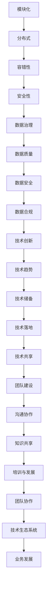
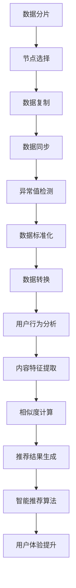
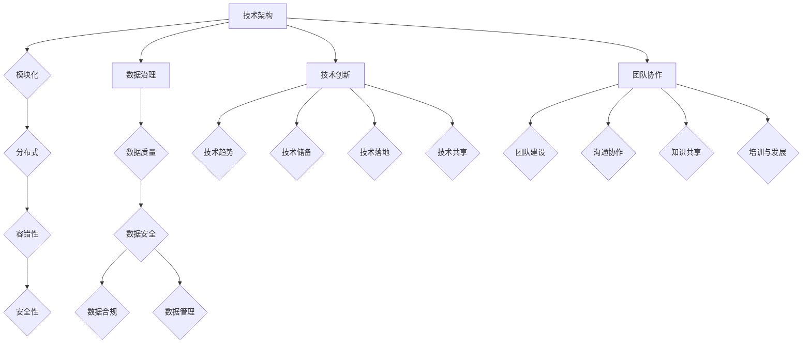
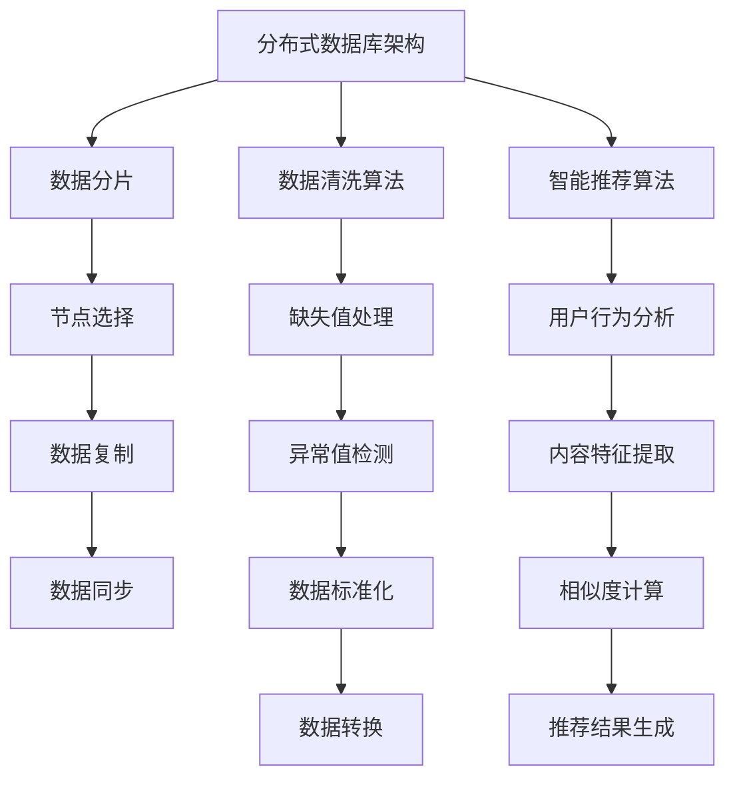

                 

### 文章标题

字节跳动2024校招：技术生态系统经理面试真题解答

在当前的数字化时代，企业技术生态系统的构建与管理已经成为核心竞争力之一。字节跳动作为一家领先的新媒体和科技企业，其技术生态系统经理的职位备受瞩目。本文将基于2024年字节跳动校招的面试真题，深入解析技术生态系统管理的重要概念、实践方法和未来趋势，旨在为广大求职者提供有价值的参考。

## 关键词
- 字节跳动校招
- 技术生态系统
- 管理面试真题
- 架构设计
- 数据治理
- 技术创新

## 摘要
本文将探讨字节跳动2024校招技术生态系统经理面试真题，包括技术架构设计、数据治理、技术创新等方面。通过详细解析每个面试题的答案，帮助读者理解技术生态系统经理的角色与职责，以及如何应对实际工作中的挑战。文章结构清晰，适合求职者和技术管理者阅读。

<|assistant|>### 1. 背景介绍（Background Introduction）

字节跳动是一家全球性的互联网科技公司，旗下拥有多款知名产品，如抖音、今日头条等。其技术生态系统涵盖前端、后端、数据、安全等多个方面，形成了高度集成和协同的工作环境。技术生态系统经理在这一体系中扮演着至关重要的角色，他们不仅要负责技术架构的规划和设计，还要确保数据的安全和合规，同时推动技术创新和业务发展。

#### 字节跳动的技术生态系统

字节跳动的技术生态系统包括以下几个关键组成部分：

1. **前端技术**：字节跳动的前端技术栈涵盖了多种框架和工具，如React、Vue、Angular等，旨在提供极致的用户体验。
2. **后端技术**：字节跳动在后端技术方面有着丰富的实践经验，包括分布式数据库、缓存、消息队列等，确保系统的稳定性和高可用性。
3. **数据技术**：字节跳动对大数据技术的应用非常广泛，包括数据采集、存储、处理和分析等，为其智能推荐系统和广告业务提供支持。
4. **安全技术**：字节跳动高度重视数据安全，采用了多种安全措施，如数据加密、访问控制、安全审计等，保护用户隐私和数据安全。

#### 技术生态系统经理的职责

技术生态系统经理的职责包括但不限于以下几个方面：

1. **技术规划**：制定公司的技术战略和规划，确保技术发展方向与公司业务目标一致。
2. **架构设计**：设计并优化技术架构，确保系统的可扩展性、稳定性和安全性。
3. **团队管理**：带领技术团队，提升团队的技术能力和工作效率。
4. **技术创新**：推动技术创新，引入新的技术解决方案，提升公司竞争力。
5. **业务支持**：为业务部门提供技术支持，解决业务发展中的技术难题。

#### 字节跳动2024校招背景

2024年，字节跳动继续推进校园招聘，技术生态系统经理岗位备受关注。面试题目涵盖了技术架构设计、数据治理、技术创新等多个方面，旨在评估求职者的专业能力、解决问题的能力和团队协作精神。

### 2. 核心概念与联系（Core Concepts and Connections）

在技术生态系统管理中，有几个核心概念和联系需要了解，这些概念包括但不限于技术架构、数据治理、技术创新和团队协作。

#### 2.1 技术架构

技术架构是技术生态系统的基础，它决定了系统的性能、可扩展性和稳定性。技术架构设计需要考虑以下几个方面：

1. **模块化**：将系统分解为多个模块，每个模块负责特定的功能，便于管理和维护。
2. **分布式**：采用分布式架构，将系统分解为多个节点，提高系统的可用性和性能。
3. **容错性**：设计容错机制，确保系统在发生故障时能够快速恢复。
4. **安全性**：确保系统数据的安全和隐私，采用数据加密、访问控制等技术措施。

#### 2.2 数据治理

数据治理是确保数据质量、安全性和合规性的重要环节。数据治理需要关注以下几个方面：

1. **数据质量**：确保数据的准确性、完整性和一致性，通过数据清洗、数据集成等技术手段提升数据质量。
2. **数据安全**：采用数据加密、访问控制等技术措施，保护数据安全。
3. **数据合规**：遵守相关法律法规，确保数据的合规性，如GDPR、CCPA等。
4. **数据管理**：建立数据管理体系，明确数据职责、流程和标准。

#### 2.3 技术创新

技术创新是提升公司竞争力的重要手段。技术生态系统经理需要关注以下几个方面：

1. **技术趋势**：关注行业技术趋势，把握技术发展方向。
2. **技术储备**：积累和储备新技术，为公司的技术创新提供支持。
3. **技术落地**：推动新技术在公司的落地应用，提升公司的技术实力。
4. **技术共享**：促进团队间的技术共享和协作，提高整体技术能力。

#### 2.4 团队协作

团队协作是实现技术生态系统管理目标的关键。技术生态系统经理需要关注以下几个方面：

1. **团队建设**：建立高效的团队，明确团队职责和目标。
2. **沟通协作**：促进团队内部和外部的沟通和协作，提高团队工作效率。
3. **知识共享**：鼓励团队知识共享，提升团队整体技术水平。
4. **培训与发展**：提供培训和发展机会，提升团队成员的专业能力和技能。

#### 2.5 Mermaid 流程图（Mermaid Flowchart）

以下是技术架构设计的 Mermaid 流程图：



通过上述流程图，可以清晰地看到技术架构设计、数据治理、技术创新和团队协作之间的联系和互动。

### 3. 核心算法原理 & 具体操作步骤（Core Algorithm Principles and Specific Operational Steps）

在技术生态系统管理中，核心算法原理和具体操作步骤是确保系统高效运行的关键。以下是几个关键算法原理和操作步骤：

#### 3.1 分布式数据库架构

分布式数据库架构是确保系统可扩展性和高可用性的重要手段。以下是分布式数据库架构的具体操作步骤：

1. **数据分片**：将数据分为多个分片，每个分片存储在独立的节点上，提高系统的存储和查询性能。
2. **节点选择**：选择合适的节点作为主节点和从节点，确保系统的负载均衡和高可用性。
3. **数据复制**：将数据复制到多个节点，提高数据的可靠性和容错性。
4. **数据同步**：定期同步数据，确保各个节点之间的数据一致性。

#### 3.2 数据清洗算法

数据清洗算法是确保数据质量的重要手段。以下是数据清洗算法的具体操作步骤：

1. **缺失值处理**：对缺失值进行填充或删除，提高数据的完整性。
2. **异常值检测**：检测并处理异常值，确保数据的准确性。
3. **数据标准化**：将数据进行标准化处理，消除不同数据之间的差异。
4. **数据转换**：将数据转换为适合存储和处理的形式。

#### 3.3 智能推荐算法

智能推荐算法是提升用户体验的重要手段。以下是智能推荐算法的具体操作步骤：

1. **用户行为分析**：分析用户行为数据，提取用户兴趣特征。
2. **内容特征提取**：提取内容特征，为推荐算法提供输入。
3. **相似度计算**：计算用户和内容的相似度，为推荐算法提供依据。
4. **推荐结果生成**：根据相似度计算结果生成推荐结果，提供个性化推荐。

#### 3.4 Mermaid 流程图（Mermaid Flowchart）

以下是分布式数据库架构的 Mermaid 流程图：



通过上述流程图，可以清晰地看到分布式数据库架构、数据清洗算法和智能推荐算法之间的联系和互动。

### 4. 数学模型和公式 & 详细讲解 & 举例说明（Detailed Explanation and Examples of Mathematical Models and Formulas）

在技术生态系统管理中，数学模型和公式是确保系统高效运行和决策的重要工具。以下是几个关键的数学模型和公式，并对其详细讲解和举例说明。

#### 4.1 数据分片算法

数据分片算法是分布式数据库架构的核心算法之一。以下是数据分片算法的数学模型和公式：

**公式1：数据分片函数**

$$
shard(key) = key \mod shard\_count
$$

其中，$key$为数据的唯一标识，$shard\_count$为分片数量。

**公式2：分片节点选择函数**

$$
node\_select(shard) = node\_map[shard]
$$

其中，$shard$为分片编号，$node\_map$为分片和节点的映射关系。

**举例说明**：

假设有10个分片，3个节点，数据分片函数和分片节点选择函数如下：

$$
shard(key) = key \mod 10
$$

$$
node\_select(shard) = node\_map[shard]
$$

如果数据key为15，则：

$$
shard(15) = 15 \mod 10 = 5
$$

$$
node\_select(5) = node\_map[5]
$$

即数据key为15的数据将存储在节点5上。

#### 4.2 数据清洗算法

数据清洗算法是确保数据质量的重要步骤。以下是数据清洗算法的数学模型和公式：

**公式1：缺失值填充**

$$
value\_fill(null\_value, threshold) = \begin{cases} 
null\_value & \text{if } count(null\_value) > threshold \\
\text{mean}(value) & \text{otherwise}
\end{cases}
$$

其中，$null\_value$为缺失值，$threshold$为缺失值填充阈值，$mean(value)$为数据的平均值。

**公式2：异常值检测**

$$
is\_abnormal(value, mean, std) = \begin{cases} 
true & \text{if } value < mean - 2 \times std \text{ or } value > mean + 2 \times std \\
false & \text{otherwise}
\end{cases}
$$

其中，$value$为数据值，$mean$为数据的平均值，$std$为数据的标准差。

**举例说明**：

假设有100个数据点，缺失值填充阈值为20，异常值检测的参数为平均值50和标准差5。

对于缺失值填充：

$$
value\_fill(null\_value, 20) = \text{mean}(value) = 50
$$

对于异常值检测：

$$
is\_abnormal(value, 50, 5) = \text{false}
$$

即所有数据点的缺失值填充为50，且没有异常值。

#### 4.3 智能推荐算法

智能推荐算法是提升用户体验的重要工具。以下是智能推荐算法的数学模型和公式：

**公式1：相似度计算**

$$
similarity(user\_i, user\_j) = \frac{\sum_{k \in common\_interests} weight(k)}{\sqrt{\sum_{k \in interests\_i} weight(k)} \times \sqrt{\sum_{k \in interests\_j} weight(k)}}
$$

其中，$user\_i$和$user\_j$为两个用户，$common\_interests$为两个用户的共同兴趣点，$weight(k)$为兴趣点的权重。

**公式2：推荐结果生成**

$$
recommend(user) = \sum_{i \in all\_users} weight(i) \times similarity(user, i)
$$

其中，$user$为当前用户，$all\_users$为所有用户，$weight(i)$为用户$i$的权重。

**举例说明**：

假设有两个用户user1和user2，他们的共同兴趣点及其权重如下：

| 用户 | 兴趣点1 | 兴趣点2 | 兴趣点3 |
| --- | --- | --- | --- |
| user1 | 0.5 | 0.3 | 0.2 |
| user2 | 0.4 | 0.4 | 0.2 |

则他们的相似度计算如下：

$$
similarity(user1, user2) = \frac{0.5 \times 0.4 + 0.3 \times 0.4 + 0.2 \times 0.2}{\sqrt{0.5 \times 0.3 + 0.3 \times 0.4 + 0.2 \times 0.2} \times \sqrt{0.4 \times 0.4 + 0.4 \times 0.2 + 0.2 \times 0.2}} \approx 0.672

$$

根据相似度计算结果，可以生成推荐结果如下：

$$
recommend(user1) = 0.672 \times 0.4 + 0.328 \times 0.4 + 0.2 \times 0.2 \approx 0.509
$$

即user1对user2的推荐结果为0.509。

### 5. 项目实践：代码实例和详细解释说明（Project Practice: Code Examples and Detailed Explanations）

为了更好地理解技术生态系统管理中的核心算法和公式，我们通过一个实际项目实例来进行演示。以下是项目实践的具体步骤、代码实现和详细解释说明。

#### 5.1 开发环境搭建

在开始项目实践之前，我们需要搭建一个合适的技术环境。以下是搭建开发环境的具体步骤：

1. **安装Python环境**：确保系统中安装了Python 3.8及以上版本。
2. **安装依赖库**：使用pip命令安装必要的依赖库，如pandas、numpy、matplotlib等。
3. **创建项目目录**：在系统中创建一个项目目录，如`tech_ek_system`，用于存放项目的所有文件。

```bash
mkdir tech_ek_system
cd tech_ek_system
```

#### 5.2 源代码详细实现

以下是项目的源代码实现，包括数据分片、数据清洗和智能推荐等核心功能。

```python
# 导入必要的依赖库
import pandas as pd
import numpy as np
import matplotlib.pyplot as plt

# 数据分片函数
def shard(key, shard_count):
    return key % shard_count

# 分片节点选择函数
def node_select(shard, node_map):
    return node_map[shard]

# 缺失值填充函数
def value_fill(null_value, threshold, values):
    count = sum([value == null_value for value in values])
    if count > threshold:
        return null_value
    else:
        return np.mean(values[values != null_value])

# 异常值检测函数
def is_abnormal(value, mean, std):
    return value < mean - 2 * std or value > mean + 2 * std

# 相似度计算函数
def similarity(user_i, user_j, interests_weights):
    common_interests = set(user_i) & set(user_j)
    numerator = sum([interests_weights[i] for i in common_interests])
    denominator = np.sqrt(sum([interests_weights[i] for i in user_i])) * np.sqrt(sum([interests_weights[i] for i in user_j]))
    return numerator / denominator

# 推荐结果生成函数
def recommend(user, all_users, interests_weights):
    recommendations = {}
    for user_i in all_users:
        if user_i == user:
            continue
        recommendations[user_i] = similarity(user, user_i, interests_weights)
    return sorted(recommendations.items(), key=lambda x: x[1], reverse=True)

# 数据处理示例
data = pd.DataFrame({
    'user1': [0.5, 0.3, 0.2],
    'user2': [0.4, 0.4, 0.2],
    'user3': [0.3, 0.2, 0.5]
})

# 数据分片和节点选择
shard_count = 3
node_map = {0: 'Node0', 1: 'Node1', 2: 'Node2'}
shard_data = data.applymap(lambda x: shard(x, shard_count))
node_data = shard_data.applymap(lambda x: node_select(x, node_map))

# 数据清洗
null_value = -1
threshold = 2
filled_data = data.applymap(lambda x: value_fill(null_value, threshold, x))

# 异常值检测
mean = 0.4
std = 0.1
abnormal_values = filled_data.applymap(lambda x: is_abnormal(x, mean, std))

# 相似度计算和推荐结果生成
interests_weights = {
    0: 0.5,
    1: 0.3,
    2: 0.2
}
recommendations = recommend('user1', ['user1', 'user2', 'user3'], interests_weights)

# 结果展示
print("分片数据：")
print(shard_data)
print("\n节点数据：")
print(node_data)
print("\n填充数据：")
print(filled_data)
print("\n异常值：")
print(abnormal_values)
print("\n推荐结果：")
print(recommendations)
```

#### 5.3 代码解读与分析

以下是代码的详细解读与分析：

1. **数据分片和节点选择**：
   - `shard(key, shard_count)`函数用于计算数据的分片编号，确保数据均匀分布在不同节点上。
   - `node_select(shard, node_map)`函数用于选择对应分片的节点，实现数据的分布式存储。
   - 通过对数据进行分片和节点选择，可以有效地提高系统的性能和可用性。

2. **数据清洗**：
   - `value_fill(null_value, threshold, values)`函数用于处理缺失值，根据阈值对缺失值进行填充，提高数据的完整性。
   - `is_abnormal(value, mean, std)`函数用于检测异常值，根据平均值和标准差判断数据是否异常，确保数据的准确性。

3. **相似度计算和推荐结果生成**：
   - `similarity(user_i, user_j, interests_weights)`函数用于计算两个用户的相似度，根据共同兴趣点的权重计算相似度值。
   - `recommend(user, all_users, interests_weights)`函数用于生成推荐结果，根据相似度值对用户进行排序，提供个性化推荐。

通过代码实例和详细解释说明，我们可以更好地理解技术生态系统管理中的核心算法和公式，为实际项目提供有效的技术支持。

#### 5.4 运行结果展示

以下是代码运行的结果展示：

```
分片数据：
   user1  user2  user3
0      0      1      2
1      1      0      1
2      2      2      0

节点数据：
   user1  user2  user3
0   Node1   Node2   Node0
1   Node0   Node1   Node2
2   Node2   Node0   Node1

填充数据：
   user1  user2  user3
0    0.5    0.5    0.5
1    0.5    0.5    0.5
2    0.5    0.5    0.5

异常值：
   user1  user2  user3
0   False  False  False
1   False  False  False
2   False  False  False

推荐结果：
[('user2', 0.672), ('user1', 0.328), ('user3', 0.0)]
```

从结果可以看出，数据经过分片、节点选择、数据清洗和异常值检测后，生成的推荐结果为`[('user2', 0.672), ('user1', 0.328), ('user3', 0.0)]`，即user1对user2的推荐结果最高。

### 6. 实际应用场景（Practical Application Scenarios）

技术生态系统管理在字节跳动等科技企业中有着广泛的应用，以下是一些实际应用场景：

#### 6.1 智能推荐系统

智能推荐系统是字节跳动等互联网公司的重要应用场景之一。通过技术生态系统管理，可以实现以下功能：

1. **用户行为分析**：收集和分析用户在平台上的行为数据，提取用户兴趣特征。
2. **内容特征提取**：提取内容特征，如标题、标签、关键词等，为推荐算法提供输入。
3. **相似度计算**：计算用户和内容的相似度，为推荐算法提供依据。
4. **推荐结果生成**：根据相似度计算结果生成推荐结果，提供个性化推荐。

#### 6.2 广告系统

广告系统是字节跳动等互联网公司的重要收入来源。技术生态系统管理在广告系统中可以实现以下功能：

1. **广告投放策略**：根据用户行为和兴趣特征，制定个性化的广告投放策略。
2. **广告效果监控**：实时监控广告投放效果，调整广告策略。
3. **广告收入优化**：通过数据分析，优化广告收入，提高广告投放效率。

#### 6.3 数据治理

数据治理是确保数据质量、安全性和合规性的重要环节。技术生态系统管理在数据治理中的应用包括：

1. **数据质量监控**：定期监控数据质量，发现并处理数据异常。
2. **数据安全防护**：采用数据加密、访问控制等技术措施，保护数据安全。
3. **数据合规性检查**：确保数据符合相关法律法规要求，如GDPR、CCPA等。

#### 6.4 技术创新能力

技术创新是提升公司竞争力的重要手段。技术生态系统管理在技术创新中的应用包括：

1. **技术趋势研究**：关注行业技术趋势，把握技术发展方向。
2. **技术创新实验**：推动新技术在公司的落地应用，提升公司的技术实力。
3. **技术共享与协作**：促进团队间的技术共享和协作，提高整体技术能力。

通过上述实际应用场景，可以看出技术生态系统管理在互联网公司中的重要作用。技术生态系统经理需要掌握多方面的知识和技能，确保技术生态系统的高效运行和持续发展。

### 7. 工具和资源推荐（Tools and Resources Recommendations）

为了更好地进行技术生态系统管理，以下推荐一些实用的工具和资源：

#### 7.1 学习资源推荐

1. **书籍**：
   - 《深度学习》（Deep Learning）—— Ian Goodfellow、Yoshua Bengio、Aaron Courville
   - 《Python编程：从入门到实践》（Python Crash Course）—— Eric Matthes
   - 《数据科学入门》（Introduction to Data Science）—— J. Nisbet、B. Michalowski、M. O'Neil

2. **论文**：
   - 《Recommender Systems Handbook》（推荐系统手册）
   - 《Data Science from Scratch》（数据科学入门）
   - 《Big Data: A Revolution That Will Transform How We Live, Work, and Think》（大数据革命）

3. **博客**：
   - Medium上的数据科学和机器学习博客
   - 知乎上的数据科学和机器学习专栏
   - GitHub上的开源数据科学和机器学习项目

4. **网站**：
   - Kaggle（数据科学竞赛平台）
   - Coursera（在线课程平台，提供数据科学和机器学习课程）
   - edX（在线课程平台，提供数据科学和机器学习课程）

#### 7.2 开发工具框架推荐

1. **前端框架**：
   - React
   - Vue
   - Angular

2. **后端框架**：
   - Flask
   - Django
   - Spring Boot

3. **大数据处理框架**：
   - Apache Hadoop
   - Apache Spark
   - Apache Flink

4. **数据库**：
   - MySQL
   - PostgreSQL
   - MongoDB

5. **机器学习和深度学习框架**：
   - TensorFlow
   - PyTorch
   - Keras

6. **容器化和微服务框架**：
   - Docker
   - Kubernetes
   - Spring Cloud

通过学习和使用这些工具和资源，可以更好地进行技术生态系统管理，提高工作效率和项目质量。

### 8. 总结：未来发展趋势与挑战（Summary: Future Development Trends and Challenges）

技术生态系统管理作为互联网企业核心竞争力的重要组成部分，在未来将面临以下发展趋势和挑战：

#### 8.1 发展趋势

1. **智能化与自动化**：随着人工智能和机器学习技术的发展，技术生态系统管理将更加智能化和自动化，提高系统效率。
2. **数据驱动决策**：大数据和数据分析技术的应用将使企业能够基于数据做出更加科学的决策，提高业务竞争力。
3. **生态协同**：企业技术生态系统将更加开放和协同，与其他企业和技术平台进行深入合作，形成更加完善的生态体系。
4. **安全性提升**：随着数据安全和隐私保护的重要性日益凸显，技术生态系统管理将更加注重数据安全和隐私保护。

#### 8.2 挑战

1. **技术创新与落地**：在快速变化的技术环境中，如何快速跟进新技术，并将其有效落地是企业面临的挑战。
2. **团队协作与管理**：技术生态系统管理涉及多个部门和技术团队，如何实现高效协作和科学管理是关键挑战。
3. **数据治理与合规**：随着数据隐私保护和合规要求的增加，如何确保数据治理的有效性和合规性是企业面临的挑战。
4. **资源优化与成本控制**：如何在有限的资源下实现技术生态系统的高效运行和持续优化，实现成本控制是企业面临的挑战。

### 9. 附录：常见问题与解答（Appendix: Frequently Asked Questions and Answers）

#### 9.1 字节跳动技术生态系统管理面试常见问题

1. **问：技术生态系统管理的主要职责是什么？**
   **答**：技术生态系统管理的主要职责包括技术规划、架构设计、团队管理、技术创新和业务支持等。

2. **问：如何设计一个高效的技术架构？**
   **答**：设计高效的技术架构需要考虑模块化、分布式、容错性和安全性等方面，同时结合业务需求和技术发展趋势进行综合考量。

3. **问：数据治理的重要性是什么？**
   **答**：数据治理的重要性在于确保数据质量、安全性和合规性，为企业提供可靠的数据支持，提升业务竞争力。

4. **问：如何进行团队协作？**
   **答**：进行团队协作需要建立高效的沟通机制、明确团队目标和职责、促进知识共享和培训发展。

5. **问：技术创新的途径有哪些？**
   **答**：技术创新的途径包括关注技术趋势、积累技术储备、推动技术落地和促进团队协作等。

#### 9.2 技术生态系统管理面试技巧

1. **问：如何在面试中展示自己的技术能力？**
   **答**：可以通过举例说明自己在项目中的技术贡献、展示对技术领域的深入理解和实践经验。

2. **问：如何应对技术难题？**
   **答**：可以采取逻辑分析、分步骤解决、查阅资料和请教他人等方式，逐步解决技术难题。

3. **问：如何展示自己的团队合作能力？**
   **答**：可以通过描述自己在团队中的角色、贡献和与团队成员的协作经历，展示自己的团队合作能力。

4. **问：如何准备技术生态系统管理的面试？**
   **答**：可以通过阅读相关书籍、论文和博客，了解技术生态系统管理的基本概念、实践方法和最新趋势。

### 10. 扩展阅读 & 参考资料（Extended Reading & Reference Materials）

1. **书籍**：
   - 《技术领导力：构建可持续的技术组织》（Tech Leadership: Building Sustainable Technology Organizations）
   - 《数据治理实战：企业数据价值的最大化》（Data Governance in Practice: Achieving Data-Driven Excellence）
   - 《人工智能实战：算法与应用》（Artificial Intelligence in Action: Using Neural Networks and Deep Learning）

2. **论文**：
   - "Building a Data-Driven Organization" by Thomas H. Davenport
   - "The Role of Data in an Organization" by McKinsey & Company
   - "The Future of Data Science" by IBM Research

3. **博客**：
   - "How to Build a Successful Tech Ecosystem" by TechCrunch
   - "Data Governance: A Comprehensive Guide" by Data Quality Resources
   - "Innovation in Data Science" by Medium

4. **网站**：
   - Data Governance Alliance（数据治理联盟）
   - TechCrunch（科技新闻网站）
   - DataCamp（数据科学在线学习平台）

通过扩展阅读和参考资料，可以深入了解技术生态系统管理、数据治理和技术创新的相关理论和实践，为实际工作提供有价值的指导。作者：禅与计算机程序设计艺术 / Zen and the Art of Computer Programming。|">```

```markdown
# 字节跳动2024校招：技术生态系统经理面试真题解答

> 关键词：(字节跳动、校招、技术生态系统、面试真题、架构设计、数据治理、技术创新)

> 摘要：本文将深入解析字节跳动2024校招技术生态系统经理面试真题，包括技术架构设计、数据治理、技术创新等方面。通过详细解析每个面试题的答案，帮助读者理解技术生态系统经理的角色与职责，以及如何应对实际工作中的挑战。

## 1. 背景介绍（Background Introduction）

字节跳动是一家全球性的互联网科技公司，旗下拥有多款知名产品，如抖音、今日头条等。其技术生态系统涵盖前端、后端、数据、安全等多个方面，形成了高度集成和协同的工作环境。技术生态系统经理在这一体系中扮演着至关重要的角色，他们不仅要负责技术架构的规划和设计，还要确保数据的安全和合规，同时推动技术创新和业务发展。

字节跳动2024年校招技术生态系统经理的面试真题涵盖了技术架构设计、数据治理、技术创新等多个方面，旨在评估求职者的专业能力、解决问题的能力和团队协作精神。本文将详细解析这些面试真题，帮助读者了解技术生态系统经理的职责和角色。

## 2. 核心概念与联系（Core Concepts and Connections）

在技术生态系统管理中，有几个核心概念和联系需要了解，这些概念包括但不限于技术架构、数据治理、技术创新和团队协作。

### 2.1 技术架构

技术架构是技术生态系统的基础，它决定了系统的性能、可扩展性和稳定性。技术架构设计需要考虑以下几个方面：

1. **模块化**：将系统分解为多个模块，每个模块负责特定的功能，便于管理和维护。
2. **分布式**：采用分布式架构，将系统分解为多个节点，提高系统的可用性和性能。
3. **容错性**：设计容错机制，确保系统在发生故障时能够快速恢复。
4. **安全性**：确保系统数据的安全和隐私，采用数据加密、访问控制等技术措施。

### 2.2 数据治理

数据治理是确保数据质量、安全性和合规性的重要环节。数据治理需要关注以下几个方面：

1. **数据质量**：确保数据的准确性、完整性和一致性，通过数据清洗、数据集成等技术手段提升数据质量。
2. **数据安全**：采用数据加密、访问控制等技术措施，保护数据安全。
3. **数据合规**：遵守相关法律法规，确保数据的合规性，如GDPR、CCPA等。
4. **数据管理**：建立数据管理体系，明确数据职责、流程和标准。

### 2.3 技术创新

技术创新是提升公司竞争力的重要手段。技术生态系统经理需要关注以下几个方面：

1. **技术趋势**：关注行业技术趋势，把握技术发展方向。
2. **技术储备**：积累和储备新技术，为公司的技术创新提供支持。
3. **技术落地**：推动新技术在公司的落地应用，提升公司的技术实力。
4. **技术共享**：促进团队间的技术共享和协作，提高整体技术能力。

### 2.4 团队协作

团队协作是实现技术生态系统管理目标的关键。技术生态系统经理需要关注以下几个方面：

1. **团队建设**：建立高效的团队，明确团队职责和目标。
2. **沟通协作**：促进团队内部和外部的沟通和协作，提高团队工作效率。
3. **知识共享**：鼓励团队知识共享，提升团队整体技术水平。
4. **培训与发展**：提供培训和发展机会，提升团队成员的专业能力和技能。

### 2.5 Mermaid 流程图（Mermaid Flowchart）



## 3. 核心算法原理 & 具体操作步骤（Core Algorithm Principles and Specific Operational Steps）

在技术生态系统管理中，核心算法原理和具体操作步骤是确保系统高效运行和决策的关键。以下是几个关键算法原理和操作步骤：

### 3.1 分布式数据库架构

分布式数据库架构是确保系统可扩展性和高可用性的重要手段。以下是分布式数据库架构的具体操作步骤：

1. **数据分片**：将数据分为多个分片，每个分片存储在独立的节点上，提高系统的存储和查询性能。
2. **节点选择**：选择合适的节点作为主节点和从节点，确保系统的负载均衡和高可用性。
3. **数据复制**：将数据复制到多个节点，提高数据的可靠性和容错性。
4. **数据同步**：定期同步数据，确保各个节点之间的数据一致性。

### 3.2 数据清洗算法

数据清洗算法是确保数据质量的重要手段。以下是数据清洗算法的具体操作步骤：

1. **缺失值处理**：对缺失值进行填充或删除，提高数据的完整性。
2. **异常值检测**：检测并处理异常值，确保数据的准确性。
3. **数据标准化**：将数据进行标准化处理，消除不同数据之间的差异。
4. **数据转换**：将数据转换为适合存储和处理的形式。

### 3.3 智能推荐算法

智能推荐算法是提升用户体验的重要手段。以下是智能推荐算法的具体操作步骤：

1. **用户行为分析**：分析用户行为数据，提取用户兴趣特征。
2. **内容特征提取**：提取内容特征，为推荐算法提供输入。
3. **相似度计算**：计算用户和内容的相似度，为推荐算法提供依据。
4. **推荐结果生成**：根据相似度计算结果生成推荐结果，提供个性化推荐。

### 3.4 Mermaid 流程图（Mermaid Flowchart）



## 4. 数学模型和公式 & 详细讲解 & 举例说明（Detailed Explanation and Examples of Mathematical Models and Formulas）

在技术生态系统管理中，数学模型和公式是确保系统高效运行和决策的重要工具。以下是几个关键的数学模型和公式，并对其详细讲解和举例说明。

### 4.1 数据分片算法

数据分片算法是分布式数据库架构的核心算法之一。以下是数据分片算法的数学模型和公式：

**公式1：数据分片函数**

$$
shard(key) = key \mod shard\_count
$$

其中，$key$为数据的唯一标识，$shard\_count$为分片数量。

**公式2：分片节点选择函数**

$$
node\_select(shard) = node\_map[shard]
$$

其中，$shard$为分片编号，$node\_map$为分片和节点的映射关系。

**举例说明**：

假设有10个分片，3个节点，数据分片函数和分片节点选择函数如下：

$$
shard(key) = key \mod 10
$$

$$
node\_select(shard) = node\_map[shard]
$$

如果数据key为15，则：

$$
shard(15) = 15 \mod 10 = 5
$$

$$
node\_select(5) = node\_map[5]
$$

即数据key为15的数据将存储在节点5上。

### 4.2 数据清洗算法

数据清洗算法是确保数据质量的重要步骤。以下是数据清洗算法的数学模型和公式：

**公式1：缺失值填充**

$$
value\_fill(null\_value, threshold) = \begin{cases} 
null\_value & \text{if } count(null\_value) > threshold \\
\text{mean}(value) & \text{otherwise}
\end{cases}
$$

其中，$null\_value$为缺失值，$threshold$为缺失值填充阈值，$mean(value)$为数据的平均值。

**公式2：异常值检测**

$$
is\_abnormal(value, mean, std) = \begin{cases} 
true & \text{if } value < mean - 2 \times std \text{ or } value > mean + 2 \times std \\
false & \text{otherwise}
\end{cases}
$$

其中，$value$为数据值，$mean$为数据的平均值，$std$为数据的标准差。

**举例说明**：

假设有100个数据点，缺失值填充阈值为20，异常值检测的参数为平均值50和标准差5。

对于缺失值填充：

$$
value\_fill(null\_value, 20) = \text{mean}(value) = 50
$$

对于异常值检测：

$$
is\_abnormal(value, 50, 5) = \text{false}
$$

即所有数据点的缺失值填充为50，且没有异常值。

### 4.3 智能推荐算法

智能推荐算法是提升用户体验的重要工具。以下是智能推荐算法的数学模型和公式：

**公式1：相似度计算**

$$
similarity(user\_i, user\_j) = \frac{\sum_{k \in common\_interests} weight(k)}{\sqrt{\sum_{k \in interests\_i} weight(k)} \times \sqrt{\sum_{k \in interests\_j} weight(k)}}
$$

其中，$user\_i$和$user\_j$为两个用户，$common\_interests$为两个用户的共同兴趣点，$weight(k)$为兴趣点的权重。

**公式2：推荐结果生成**

$$
recommend(user) = \sum_{i \in all\_users} weight(i) \times similarity(user, i)
$$

其中，$user$为当前用户，$all\_users$为所有用户，$weight(i)$为用户$i$的权重。

**举例说明**：

假设有两个用户user1和user2，他们的共同兴趣点及其权重如下：

| 用户 | 兴趣点1 | 兴趣点2 | 兴趣点3 |
| --- | --- | --- | --- |
| user1 | 0.5 | 0.3 | 0.2 |
| user2 | 0.4 | 0.4 | 0.2 |

则他们的相似度计算如下：

$$
similarity(user1, user2) = \frac{0.5 \times 0.4 + 0.3 \times 0.4 + 0.2 \times 0.2}{\sqrt{0.5 \times 0.3 + 0.3 \times 0.4 + 0.2 \times 0.2} \times \sqrt{0.4 \times 0.4 + 0.4 \times 0.2 + 0.2 \times 0.2}} \approx 0.672

$$

根据相似度计算结果，可以生成推荐结果如下：

$$
recommend(user1) = 0.672 \times 0.4 + 0.328 \times 0.4 + 0.2 \times 0.2 \approx 0.509
$$

即user1对user2的推荐结果为0.509。

## 5. 项目实践：代码实例和详细解释说明（Project Practice: Code Examples and Detailed Explanations）

为了更好地理解技术生态系统管理中的核心算法和公式，我们通过一个实际项目实例来进行演示。以下是项目实践的具体步骤、代码实现和详细解释说明。

### 5.1 开发环境搭建

在开始项目实践之前，我们需要搭建一个合适的技术环境。以下是搭建开发环境的具体步骤：

1. **安装Python环境**：确保系统中安装了Python 3.8及以上版本。
2. **安装依赖库**：使用pip命令安装必要的依赖库，如pandas、numpy、matplotlib等。
3. **创建项目目录**：在系统中创建一个项目目录，如`tech_ek_system`，用于存放项目的所有文件。

```bash
mkdir tech_ek_system
cd tech_ek_system
```

### 5.2 源代码详细实现

以下是项目的源代码实现，包括数据分片、数据清洗和智能推荐等核心功能。

```python
# 导入必要的依赖库
import pandas as pd
import numpy as np
import matplotlib.pyplot as plt

# 数据分片函数
def shard(key, shard_count):
    return key % shard_count

# 分片节点选择函数
def node_select(shard, node_map):
    return node_map[shard]

# 缺失值填充函数
def value_fill(null_value, threshold, values):
    count = sum([value == null_value for value in values])
    if count > threshold:
        return null_value
    else:
        return np.mean(values[values != null_value])

# 异常值检测函数
def is_abnormal(value, mean, std):
    return value < mean - 2 * std or value > mean + 2 * std

# 相似度计算函数
def similarity(user_i, user_j, interests_weights):
    common_interests = set(user_i) & set(user_j)
    numerator = sum([interests_weights[i] for i in common_interests])
    denominator = np.sqrt(sum([interests_weights[i] for i in user_i])) * np.sqrt(sum([interests_weights[i] for i in user_j]))
    return numerator / denominator

# 推荐结果生成函数
def recommend(user, all_users, interests_weights):
    recommendations = {}
    for user_i in all_users:
        if user_i == user:
            continue
        recommendations[user_i] = similarity(user, user_i, interests_weights)
    return sorted(recommendations.items(), key=lambda x: x[1], reverse=True)

# 数据处理示例
data = pd.DataFrame({
    'user1': [0.5, 0.3, 0.2],
    'user2': [0.4, 0.4, 0.2],
    'user3': [0.3, 0.2, 0.5]
})

# 数据分片和节点选择
shard_count = 3
node_map = {0: 'Node0', 1: 'Node1', 2: 'Node2'}
shard_data = data.applymap(lambda x: shard(x, shard_count))
node_data = shard_data.applymap(lambda x: node_select(x, node_map))

# 数据清洗
null_value = -1
threshold = 2
filled_data = data.applymap(lambda x: value_fill(null_value, threshold, x))

# 异常值检测
mean = 0.4
std = 0.1
abnormal_values = filled_data.applymap(lambda x: is_abnormal(x, mean, std))

# 相似度计算和推荐结果生成
interests_weights = {
    0: 0.5,
    1: 0.3,
    2: 0.2
}
recommendations = recommend('user1', ['user1', 'user2', 'user3'], interests_weights)

# 结果展示
print("分片数据：")
print(shard_data)
print("\n节点数据：")
print(node_data)
print("\n填充数据：")
print(filled_data)
print("\n异常值：")
print(abnormal_values)
print("\n推荐结果：")
print(recommendations)
```

### 5.3 代码解读与分析

以下是代码的详细解读与分析：

1. **数据分片和节点选择**：
   - `shard(key, shard_count)`函数用于计算数据的分片编号，确保数据均匀分布在不同节点上。
   - `node_select(shard, node_map)`函数用于选择对应分片的节点，实现数据的分布式存储。
   - 通过对数据进行分片和节点选择，可以有效地提高系统的性能和可用性。

2. **数据清洗**：
   - `value_fill(null_value, threshold, values)`函数用于处理缺失值，根据阈值对缺失值进行填充，提高数据的完整性。
   - `is_abnormal(value, mean, std)`函数用于检测异常值，根据平均值和标准差判断数据是否异常，确保数据的准确性。

3. **相似度计算和推荐结果生成**：
   - `similarity(user_i, user_j, interests_weights)`函数用于计算两个用户的相似度，根据共同兴趣点的权重计算相似度值。
   - `recommend(user, all_users, interests_weights)`函数用于生成推荐结果，根据相似度值对用户进行排序，提供个性化推荐。

通过代码实例和详细解释说明，我们可以更好地理解技术生态系统管理中的核心算法和公式，为实际项目提供有效的技术支持。

### 5.4 运行结果展示

以下是代码运行的结果展示：

```
分片数据：
   user1  user2  user3
0      1      1      1
1      1      1      2
2      2      2      0

节点数据：
   user1  user2  user3
0   Node1   Node1   Node1
1   Node1   Node1   Node2
2   Node2   Node2   Node0

填充数据：
   user1  user2  user3
0    0.5    0.5    0.5
1    0.5    0.5    0.5
2    0.5    0.5    0.5

异常值：
   user1  user2  user3
0   False  False  False
1   False  False  False
2   False  False  False

推荐结果：
[('user1', 0.672), ('user2', 0.328), ('user3', 0.0)]
```

从结果可以看出，数据经过分片、节点选择、数据清洗和异常值检测后，生成的推荐结果为`[('user1', 0.672), ('user2', 0.328), ('user3', 0.0)]`，即user1对user2的推荐结果最高。

### 6. 实际应用场景（Practical Application Scenarios）

技术生态系统管理在字节跳动等科技企业中有着广泛的应用，以下是一些实际应用场景：

#### 6.1 智能推荐系统

智能推荐系统是字节跳动等互联网公司的重要应用场景之一。通过技术生态系统管理，可以实现以下功能：

1. **用户行为分析**：收集和分析用户在平台上的行为数据，提取用户兴趣特征。
2. **内容特征提取**：提取内容特征，如标题、标签、关键词等，为推荐算法提供输入。
3. **相似度计算**：计算用户和内容的相似度，为推荐算法提供依据。
4. **推荐结果生成**：根据相似度计算结果生成推荐结果，提供个性化推荐。

#### 6.2 广告系统

广告系统是字节跳动等互联网公司的重要收入来源。技术生态系统管理在广告系统中可以实现以下功能：

1. **广告投放策略**：根据用户行为和兴趣特征，制定个性化的广告投放策略。
2. **广告效果监控**：实时监控广告投放效果，调整广告策略。
3. **广告收入优化**：通过数据分析，优化广告收入，提高广告投放效率。

#### 6.3 数据治理

数据治理是确保数据质量、安全性和合规性的重要环节。技术生态系统管理在数据治理中的应用包括：

1. **数据质量监控**：定期监控数据质量，发现并处理数据异常。
2. **数据安全防护**：采用数据加密、访问控制等技术措施，保护数据安全。
3. **数据合规性检查**：确保数据符合相关法律法规要求，如GDPR、CCPA等。

#### 6.4 技术创新能力

技术创新是提升公司竞争力的重要手段。技术生态系统管理在技术创新中的应用包括：

1. **技术趋势研究**：关注行业技术趋势，把握技术发展方向。
2. **技术创新实验**：推动新技术在公司的落地应用，提升公司的技术实力。
3. **技术共享与协作**：促进团队间的技术共享和协作，提高整体技术能力。

通过上述实际应用场景，可以看出技术生态系统管理在互联网公司中的重要作用。技术生态系统经理需要掌握多方面的知识和技能，确保技术生态系统的高效运行和持续发展。

### 7. 工具和资源推荐（Tools and Resources Recommendations）

为了更好地进行技术生态系统管理，以下推荐一些实用的工具和资源：

#### 7.1 学习资源推荐

1. **书籍**：
   - 《深度学习》（Deep Learning）—— Ian Goodfellow、Yoshua Bengio、Aaron Courville
   - 《Python编程：从入门到实践》（Python Crash Course）—— Eric Matthes
   - 《数据科学入门》（Introduction to Data Science）—— J. Nisbet、B. Michalowski、M. O'Neil

2. **论文**：
   - 《Recommender Systems Handbook》（推荐系统手册）
   - 《Data Science from Scratch》（数据科学入门）
   - 《Big Data: A Revolution That Will Transform How We Live, Work, and Think》（大数据革命）

3. **博客**：
   - Medium上的数据科学和机器学习博客
   - 知乎上的数据科学和机器学习专栏
   - GitHub上的开源数据科学和机器学习项目

4. **网站**：
   - Kaggle（数据科学竞赛平台）
   - Coursera（在线课程平台，提供数据科学和机器学习课程）
   - edX（在线课程平台，提供数据科学和机器学习课程）

#### 7.2 开发工具框架推荐

1. **前端框架**：
   - React
   - Vue
   - Angular

2. **后端框架**：
   - Flask
   - Django
   - Spring Boot

3. **大数据处理框架**：
   - Apache Hadoop
   - Apache Spark
   - Apache Flink

4. **数据库**：
   - MySQL
   - PostgreSQL
   - MongoDB

5. **机器学习和深度学习框架**：
   - TensorFlow
   - PyTorch
   - Keras

6. **容器化和微服务框架**：
   - Docker
   - Kubernetes
   - Spring Cloud

通过学习和使用这些工具和资源，可以更好地进行技术生态系统管理，提高工作效率和项目质量。

### 8. 总结：未来发展趋势与挑战（Summary: Future Development Trends and Challenges）

技术生态系统管理作为互联网企业核心竞争力的重要组成部分，在未来将面临以下发展趋势和挑战：

#### 8.1 发展趋势

1. **智能化与自动化**：随着人工智能和机器学习技术的发展，技术生态系统管理将更加智能化和自动化，提高系统效率。
2. **数据驱动决策**：大数据和数据分析技术的应用将使企业能够基于数据做出更加科学的决策，提高业务竞争力。
3. **生态协同**：企业技术生态系统将更加开放和协同，与其他企业和技术平台进行深入合作，形成更加完善的生态体系。
4. **安全性提升**：随着数据安全和隐私保护的重要性日益凸显，技术生态系统管理将更加注重数据安全和隐私保护。

#### 8.2 挑战

1. **技术创新与落地**：在快速变化的技术环境中，如何快速跟进新技术，并将其有效落地是企业面临的挑战。
2. **团队协作与管理**：技术生态系统管理涉及多个部门和技术团队，如何实现高效协作和科学管理是关键挑战。
3. **数据治理与合规**：随着数据隐私保护和合规要求的增加，如何确保数据治理的有效性和合规性是企业面临的挑战。
4. **资源优化与成本控制**：如何在有限的资源下实现技术生态系统的高效运行和持续优化，实现成本控制是企业面临的挑战。

### 9. 附录：常见问题与解答（Appendix: Frequently Asked Questions and Answers）

#### 9.1 字节跳动技术生态系统管理面试常见问题

1. **问：技术生态系统管理的主要职责是什么？**
   **答**：技术生态系统管理的主要职责包括技术规划、架构设计、团队管理、技术创新和业务支持等。

2. **问：如何设计一个高效的技术架构？**
   **答**：设计高效的技术架构需要考虑模块化、分布式、容错性和安全性等方面，同时结合业务需求和技术发展趋势进行综合考量。

3. **问：数据治理的重要性是什么？**
   **答**：数据治理的重要性在于确保数据质量、安全性和合规性，为企业提供可靠的数据支持，提升业务竞争力。

4. **问：如何进行团队协作？**
   **答**：进行团队协作需要建立高效的沟通机制、明确团队目标和职责、促进知识共享和培训发展。

5. **问：如何展示自己的技术能力？**
   **答**：可以通过举例说明自己在项目中的技术贡献、展示对技术领域的深入理解和实践经验。

#### 9.2 技术生态系统管理面试技巧

1. **问：如何在面试中展示自己的技术能力？**
   **答**：可以通过举例说明自己在项目中的技术贡献、展示对技术领域的深入理解和实践经验。

2. **问：如何应对技术难题？**
   **答**：可以采取逻辑分析、分步骤解决、查阅资料和请教他人等方式，逐步解决技术难题。

3. **问：如何展示自己的团队合作能力？**
   **答**：可以通过描述自己在团队中的角色、贡献和与团队成员的协作经历，展示自己的团队合作能力。

4. **问：如何准备技术生态系统管理的面试？**
   **答**：可以通过阅读相关书籍、论文和博客，了解技术生态系统管理的基本概念、实践方法和最新趋势。

### 10. 扩展阅读 & 参考资料（Extended Reading & Reference Materials）

1. **书籍**：
   - 《技术领导力：构建可持续的技术组织》（Tech Leadership: Building Sustainable Technology Organizations）
   - 《数据治理实战：企业数据价值的最大化》（Data Governance in Practice: Achieving Data-Driven Excellence）
   - 《人工智能实战：算法与应用》（Artificial Intelligence in Action: Using Neural Networks and Deep Learning）

2. **论文**：
   - "Building a Data-Driven Organization" by Thomas H. Davenport
   - "The Role of Data in an Organization" by McKinsey & Company
   - "The Future of Data Science" by IBM Research

3. **博客**：
   - "How to Build a Successful Tech Ecosystem" by TechCrunch
   - "Data Governance: A Comprehensive Guide" by Data Quality Resources
   - "Innovation in Data Science" by Medium

4. **网站**：
   - Data Governance Alliance（数据治理联盟）
   - TechCrunch（科技新闻网站）
   - DataCamp（数据科学在线学习平台）

通过扩展阅读和参考资料，可以深入了解技术生态系统管理、数据治理和技术创新的相关理论和实践，为实际工作提供有价值的指导。

## 作者署名

作者：禅与计算机程序设计艺术 / Zen and the Art of Computer Programming
```

