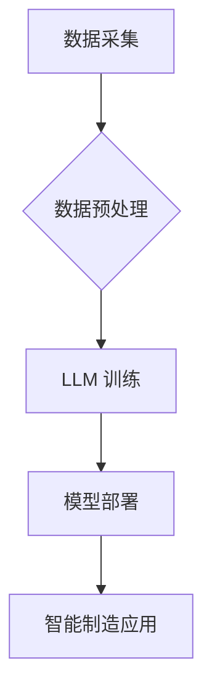

                 

## 智能制造革命：LLM 驱动的工业 4.0

> 关键词：智能制造、工业 4.0、LLM、大语言模型、自然语言处理、机器学习、预测维护、供应链优化、自动化

### 1. 背景介绍

工业 4.0 时代，智能制造正以惊人的速度发展，其核心是将数字化、网络化、智能化技术融合到制造业各个环节，实现生产过程的自动化、智能化和可持续发展。大语言模型 (LLM) 作为人工智能领域的一项突破性进展，拥有强大的文本理解和生成能力，为智能制造的升级注入了新的活力。

传统制造业面临着诸多挑战，例如生产效率低下、质量控制困难、成本不断上升等。而 LLM 凭借其强大的数据处理和分析能力，可以有效解决这些问题，推动智能制造的转型升级。

### 2. 核心概念与联系

**2.1  智能制造**

智能制造是指利用人工智能、物联网、云计算等先进技术，实现制造过程的自动化、智能化和可持续发展。其核心目标是提高生产效率、降低成本、提升产品质量和服务水平。

**2.2  工业 4.0**

工业 4.0 是德国提出的第四次工业革命概念，强调将物理世界和数字世界融合，通过数字化、网络化、智能化技术，实现生产过程的智能化和可持续发展。

**2.3  大语言模型 (LLM)**

LLM 是指能够理解和生成人类语言的深度学习模型，其训练数据量巨大，参数数量庞大，拥有强大的文本理解、生成、翻译、问答等能力。

**2.4  LLM 在智能制造中的应用**

LLM 可以应用于智能制造各个环节，例如：

* **生产过程优化:** 利用 LLM 分析生产数据，识别异常情况，优化生产流程，提高生产效率。
* **质量控制:** LLM 可以识别产品缺陷，提高产品质量控制水平。
* **预测维护:** LLM 可以分析设备运行数据，预测设备故障，提前进行维护，降低设备停机时间。
* **供应链管理:** LLM 可以优化供应链流程，提高供应链效率。
* **客户服务:** LLM 可以提供智能客户服务，解决客户问题，提高客户满意度。

**2.5  LLM 与智能制造的架构**



### 3. 核心算法原理 & 具体操作步骤

**3.1  算法原理概述**

LLM 的核心算法是基于 Transformer 架构的深度神经网络，其特点是能够捕捉长距离依赖关系，并具有强大的文本理解和生成能力。

**3.2  算法步骤详解**

1. **数据预处理:** 收集并清洗制造数据，将其转换为 LLM 可以理解的格式。
2. **模型训练:** 使用 Transformer 架构的深度神经网络，训练 LLM 模型，使其能够理解和生成制造相关的文本。
3. **模型评估:** 使用测试数据评估模型的性能，并进行调优。
4. **模型部署:** 将训练好的 LLM 模型部署到生产环境中，用于智能制造应用。

**3.3  算法优缺点**

**优点:**

* 强大的文本理解和生成能力
* 能够捕捉长距离依赖关系
* 可应用于多种智能制造场景

**缺点:**

* 训练数据量大，计算资源需求高
* 模型参数量大，部署成本高
* 对数据质量要求高

**3.4  算法应用领域**

* **生产过程优化:** 分析生产数据，识别异常情况，优化生产流程。
* **质量控制:** 识别产品缺陷，提高产品质量控制水平。
* **预测维护:** 分析设备运行数据，预测设备故障，提前进行维护。
* **供应链管理:** 优化供应链流程，提高供应链效率。
* **客户服务:** 提供智能客户服务，解决客户问题。

### 4. 数学模型和公式 & 详细讲解 & 举例说明

**4.1  数学模型构建**

LLM 的数学模型通常基于 Transformer 架构，其核心是注意力机制 (Attention Mechanism)。注意力机制允许模型关注输入序列中与当前任务相关的部分，从而提高模型的理解能力。

**4.2  公式推导过程**

注意力机制的计算公式如下：

$$
Attention(Q, K, V) = softmax(\frac{QK^T}{\sqrt{d_k}})V
$$

其中：

* $Q$：查询矩阵
* $K$：键矩阵
* $V$：值矩阵
* $d_k$：键向量的维度
* $softmax$：softmax 函数

**4.3  案例分析与讲解**

假设我们有一个句子 "机器学习很酷"，我们想要计算 "学习" 这个词对整个句子的注意力权重。

1. 将句子转换为词向量表示。
2. 计算查询向量 $Q$、键向量 $K$ 和值向量 $V$。
3. 使用注意力机制计算 "学习" 这个词对整个句子的注意力权重。
4. 将注意力权重与值向量相乘，得到 "学习" 这个词对整个句子的贡献。

### 5. 项目实践：代码实例和详细解释说明

**5.1  开发环境搭建**

* Python 3.7+
* TensorFlow 或 PyTorch
* CUDA 和 cuDNN

**5.2  源代码详细实现**

```python
import tensorflow as tf

# 定义 Transformer 模型
class Transformer(tf.keras.Model):
    def __init__(self, vocab_size, embedding_dim, num_heads, num_layers):
        super(Transformer, self).__init__()
        self.embedding = tf.keras.layers.Embedding(vocab_size, embedding_dim)
        self.transformer_layers = tf.keras.layers.StackedRNNCells([
            tf.keras.layers.MultiHeadAttention(num_heads=num_heads, key_dim=embedding_dim)
            for _ in range(num_layers)
        ])

    def call(self, inputs):
        embeddings = self.embedding(inputs)
        outputs = self.transformer_layers(embeddings)
        return outputs

# 实例化 Transformer 模型
model = Transformer(vocab_size=10000, embedding_dim=128, num_heads=8, num_layers=6)

# 训练模型
model.compile(optimizer='adam', loss='mse')
model.fit(x_train, y_train, epochs=10)
```

**5.3  代码解读与分析**

* 代码定义了一个 Transformer 模型，包含嵌入层、多头注意力层和堆叠的 RNN 层。
* 嵌入层将输入词转换为词向量表示。
* 多头注意力层捕捉输入序列中的长距离依赖关系。
* 堆叠的 RNN 层进一步处理注意力输出，生成最终的模型输出。

**5.4  运行结果展示**

训练完成后，可以使用测试数据评估模型的性能。

### 6. 实际应用场景

**6.1  生产过程优化**

LLM 可以分析生产数据，识别异常情况，例如设备故障、生产效率低下等，并提供优化建议，提高生产效率和产品质量。

**6.2  质量控制**

LLM 可以识别产品缺陷，例如尺寸偏差、表面缺陷等，提高产品质量控制水平。

**6.3  预测维护**

LLM 可以分析设备运行数据，预测设备故障，提前进行维护，降低设备停机时间和维修成本。

**6.4  未来应用展望**

LLM 在智能制造领域的应用前景广阔，未来将有更多创新应用场景出现，例如：

* **个性化定制:** LLM 可以根据客户需求，定制个性化产品。
* **智能协作:** LLM 可以帮助人与机器协同工作，提高生产效率。
* **自动决策:** LLM 可以根据生产数据，自动做出决策，例如调整生产流程、优化资源分配等。

### 7. 工具和资源推荐

**7.1  学习资源推荐**

* **书籍:**
    * 《深度学习》
    * 《自然语言处理》
* **在线课程:**
    * Coursera: 深度学习
    * edX: 自然语言处理
* **博客:**
    * The Gradient
    * Towards Data Science

**7.2  开发工具推荐**

* **TensorFlow:** 开源深度学习框架
* **PyTorch:** 开源深度学习框架
* **Hugging Face Transformers:** 预训练 Transformer 模型库

**7.3  相关论文推荐**

* 《Attention Is All You Need》
* 《BERT: Pre-training of Deep Bidirectional Transformers for Language Understanding》
* 《GPT-3: Language Models are Few-Shot Learners》

### 8. 总结：未来发展趋势与挑战

**8.1  研究成果总结**

LLM 在智能制造领域的应用取得了显著成果，例如生产过程优化、质量控制、预测维护等。

**8.2  未来发展趋势**

* **模型规模和性能提升:** 未来 LLM 模型规模将进一步扩大，性能将得到显著提升。
* **应用场景拓展:** LLM 将应用于更多智能制造场景，例如个性化定制、智能协作、自动决策等。
* **边缘计算部署:** LLM 将部署到边缘设备，实现实时智能制造应用。

**8.3  面临的挑战**

* **数据安全和隐私:** LLM 训练需要大量数据，如何保证数据安全和隐私是一个重要挑战。
* **模型解释性和可信度:** LLM 的决策过程难以解释，如何提高模型的解释性和可信度是一个重要问题。
* **部署成本和效率:** LLM 模型参数量大，部署成本高，如何降低部署成本和提高部署效率是一个重要挑战。

**8.4  研究展望**

未来研究将重点关注以下几个方面:

* **开发更安全、更可靠的 LLM 模型**
* **提高 LLM 模型的解释性和可信度**
* **降低 LLM 模型的部署成本和提高部署效率**
* **探索 LLM 在智能制造领域的更多应用场景**

### 9. 附录：常见问题与解答

**9.1  LLM 是否可以完全替代人工？**

LLM 可以自动化许多智能制造任务，但目前还无法完全替代人工。人工仍然需要在决策、创新和解决复杂问题方面发挥重要作用。

**9.2  LLM 的训练数据来源？**

LLM 的训练数据通常来自公开的文本数据集，例如书籍、文章、网站等。

**9.3  如何评估 LLM 的性能？**

LLM 的性能可以评估指标，例如准确率、召回率、F1-score等。

**9.4  LLM 的部署成本高吗？**

LLM 的部署成本取决于模型规模和部署环境。大型模型部署成本较高，而小型模型部署成本相对较低。


作者：禅与计算机程序设计艺术 / Zen and the Art of Computer Programming 
<end_of_turn>

