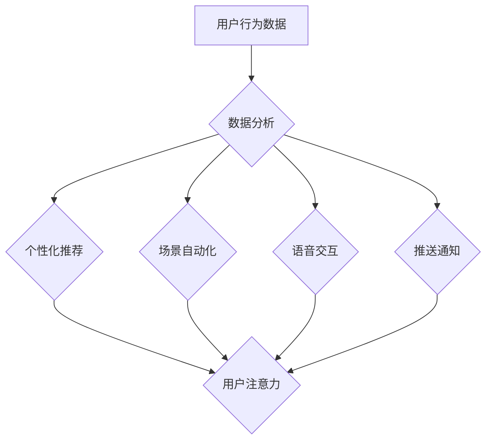

                 

## 智能家居如何争夺用户注意力

> 关键词：智能家居、用户注意力、算法、机器学习、自然语言处理、个性化推荐、数据分析、隐私保护

## 1. 背景介绍

智能家居正以惊人的速度发展，从简单的智能照明和温控系统，演变为能够感知用户需求、自动执行任务、提供个性化服务的复杂生态系统。然而，在智能家居市场日益激烈的竞争中，如何有效地吸引和留住用户注意力成为了摆在各家厂商面前的关键问题。

用户注意力是宝贵的资源，在信息爆炸的时代，人们面临着来自各个方向的纷繁信息。智能家居想要脱颖而出，必须能够精准地抓住用户的注意力，并提供真正有价值的服务。

## 2. 核心概念与联系

### 2.1 用户注意力模型

用户注意力模型试图解释用户如何选择和分配注意力，以及哪些因素会影响用户的注意力。常见的模型包括：

* **资源有限模型:** 假设用户注意力是一个有限的资源，需要根据不同信息的重要性进行分配。
* **选择性注意模型:**  强调用户在信息洪流中主动选择关注特定信息的能力。
* **认知负载模型:**  认为用户注意力受认知负载的影响，当认知负载过高时，注意力会分散。

### 2.2 智能家居生态系统

智能家居生态系统由各种智能设备、平台和服务组成，它们相互连接，共同为用户提供智能化体验。

* **智能设备:** 包括智能照明、智能音箱、智能门锁、智能摄像头等，它们是智能家居的基础。
* **平台:**  提供设备连接、数据管理、用户交互等功能，例如亚马逊Alexa、谷歌Home、苹果HomeKit等。
* **服务:**  基于智能设备和平台提供的增值服务，例如智能家居控制、场景自动化、语音助手、个性化推荐等。

### 2.3 用户注意力争夺机制

智能家居厂商通过以下机制争夺用户注意力：

* **个性化推荐:**  根据用户的行为数据和偏好，推荐个性化的内容和服务。
* **场景自动化:**  自动执行用户预设的场景，例如起床时自动打开窗帘、播放音乐。
* **语音交互:**  通过语音助手，方便快捷地控制智能设备和获取信息。
* **推送通知:**  及时推送重要信息和提醒，例如设备故障、预约提醒等。

**Mermaid 流程图**



## 3. 核心算法原理 & 具体操作步骤

### 3.1 算法原理概述

智能家居争夺用户注意力的核心算法主要包括：

* **机器学习算法:** 用于分析用户行为数据，识别用户偏好和需求，并进行个性化推荐。
* **自然语言处理算法:** 用于理解用户的语音指令，并执行相应的操作。
* **时间序列分析算法:** 用于预测用户的行为模式，并进行场景自动化。

### 3.2 算法步骤详解

**1. 数据收集:** 收集用户使用智能家居设备的行为数据，例如设备使用频率、操作时间、偏好设置等。

**2. 数据预处理:** 对收集到的数据进行清洗、转换和特征提取，以便于后续算法的训练和应用。

**3. 模型训练:** 使用机器学习算法对预处理后的数据进行训练，建立用户行为预测模型和个性化推荐模型。

**4. 模型评估:** 使用测试数据对训练好的模型进行评估，并根据评估结果进行模型优化。

**5. 推送和交互:** 将个性化推荐结果推送给用户，并通过语音交互等方式与用户进行交互，收集用户反馈数据，不断优化模型。

### 3.3 算法优缺点

**优点:**

* **个性化:**  能够根据用户的具体需求和偏好提供个性化的服务。
* **智能化:**  能够自动学习和适应用户的行为模式，提供更智能化的体验。
* **效率提升:**  能够自动执行重复性任务，提高用户效率。

**缺点:**

* **数据隐私:**  收集和使用用户数据可能会引发隐私安全问题。
* **算法偏差:**  机器学习模型可能会存在算法偏差，导致推荐结果不准确或不公平。
* **用户依赖:**  过度依赖智能家居的个性化服务可能会导致用户失去自主性和思考能力。

### 3.4 算法应用领域

* **智能家居控制:**  根据用户的习惯和需求，自动控制智能设备，例如灯光、温度、窗帘等。
* **场景自动化:**  自动执行用户预设的场景，例如起床时自动打开窗帘、播放音乐，睡觉时自动关闭灯光。
* **个性化推荐:**  根据用户的兴趣和偏好，推荐个性化的内容和服务，例如音乐、电影、新闻等。
* **语音助手:**  理解用户的语音指令，并执行相应的操作，例如播放音乐、设置闹钟、查询天气等。

## 4. 数学模型和公式 & 详细讲解 & 举例说明

### 4.1 数学模型构建

用户注意力模型可以采用马尔科夫链模型来描述用户在不同信息之间的跳转过程。

* 状态空间:  包含所有可能的注意力状态，例如关注新闻、关注社交媒体、关注智能家居设备等。
* 转移概率:  描述用户从一个状态跳转到另一个状态的概率，受用户偏好、信息内容、时间等因素影响。

### 4.2 公式推导过程

用户在时间步t的注意力状态为St，则转移到时间步t+1的注意力状态St+1的概率可以表示为：

$$P(S_{t+1} | S_t) = \sum_{s \in S} P(S_{t+1} | S_t, s) P(s | S_t)$$

其中：

* $P(S_{t+1} | S_t, s)$ 是给定当前状态St和下一个状态s的转移概率。
* $P(s | S_t)$ 是当前状态St下出现下一个状态s的概率。

### 4.3 案例分析与讲解

假设用户在时间步t关注智能家居设备，则在时间步t+1可能关注以下几种状态：

* 继续关注智能家居设备
* 转移到关注新闻
* 转移到关注社交媒体

转移概率可以根据用户的历史行为数据进行估计，例如用户在过去一周内关注智能家居设备的时间比例、关注新闻的时间比例等。

## 5. 项目实践：代码实例和详细解释说明

### 5.1 开发环境搭建

* 操作系统: Ubuntu 20.04
* Python 版本: 3.8
* 依赖库: pandas, numpy, scikit-learn, tensorflow

### 5.2 源代码详细实现

```python
import pandas as pd
from sklearn.model_selection import train_test_split
from sklearn.linear_model import LogisticRegression

# 加载用户行为数据
data = pd.read_csv("user_behavior.csv")

# 特征工程
features = ["device_usage_time", "app_usage_time", "news_reading_time"]
target = "attention_state"

# 数据分割
X_train, X_test, y_train, y_test = train_test_split(data[features], data[target], test_size=0.2)

# 模型训练
model = LogisticRegression()
model.fit(X_train, y_train)

# 模型评估
accuracy = model.score(X_test, y_test)
print("模型准确率:", accuracy)

# 推送个性化推荐
new_user_data = pd.DataFrame({"device_usage_time": [120], "app_usage_time": [60], "news_reading_time": [30]})
predicted_state = model.predict(new_user_data)
print("预测的用户注意力状态:", predicted_state)
```

### 5.3 代码解读与分析

* 代码首先加载用户行为数据，并进行特征工程，提取用户行为特征。
* 然后使用sklearn库中的train_test_split函数将数据分割为训练集和测试集。
* 使用LogisticRegression模型对训练集进行训练，并使用测试集评估模型的准确率。
* 最后，使用训练好的模型对新用户的行为数据进行预测，并推送个性化推荐。

### 5.4 运行结果展示

运行结果将显示模型的准确率以及对新用户的注意力状态预测结果。

## 6. 实际应用场景

### 6.1 智能家居场景推荐

根据用户的行为数据和偏好，智能家居平台可以推荐个性化的场景，例如：

* **起床场景:**  自动打开窗帘、播放音乐、调节温度。
* **烹饪场景:**  自动打开灯光、调节温度、播放烹饪音乐。
* **睡眠场景:**  关闭灯光、调节温度、播放白噪音。

### 6.2 个性化内容推荐

智能家居平台可以根据用户的兴趣和偏好，推荐个性化的内容，例如：

* **音乐推荐:**  根据用户的音乐播放历史，推荐相似的音乐。
* **新闻推荐:**  根据用户的阅读习惯，推荐相关的新闻。
* **视频推荐:**  根据用户的观看历史，推荐相似的视频。

### 6.3 智能家居设备控制

用户可以通过语音交互或手机APP控制智能家居设备，例如：

* **语音控制:**  使用语音助手控制灯光、温度、窗帘等设备。
* **手机APP控制:**  通过手机APP远程控制智能家居设备，设置定时开关、场景自动化等功能。

### 6.4 未来应用展望

未来，智能家居将更加智能化、个性化和安全。

* **更精准的个性化推荐:**  利用更先进的机器学习算法和数据分析技术，提供更精准的个性化推荐。
* **更丰富的场景自动化:**  支持更复杂的场景自动化，例如根据用户的日程安排自动执行任务。
* **更安全的隐私保护:**  采用更安全的加密技术和隐私保护机制，保障用户的隐私安全。

## 7. 工具和资源推荐

### 7.1 学习资源推荐

* **书籍:**  《深度学习》、《机器学习实战》
* **在线课程:**  Coursera、edX、Udacity
* **博客:**  Towards Data Science、Machine Learning Mastery

### 7.2 开发工具推荐

* **Python:**  主流的机器学习和数据分析语言
* **TensorFlow:**  开源深度学习框架
* **PyTorch:**  开源深度学习框架
* **Scikit-learn:**  机器学习库

### 7.3 相关论文推荐

* **Attention Is All You Need:**  Transformer模型的论文
* **BERT: Pre-training of Deep Bidirectional Transformers for Language Understanding:**  BERT模型的论文
* **Recurrent Neural Networks for Sequence Learning:**  RNN模型的论文

## 8. 总结：未来发展趋势与挑战

### 8.1 研究成果总结

智能家居争夺用户注意力的研究取得了显著进展，机器学习、自然语言处理等技术为个性化推荐、场景自动化、语音交互等功能提供了技术支撑。

### 8.2 未来发展趋势

* **更智能的算法:**  利用更先进的机器学习算法和数据分析技术，实现更精准的个性化推荐和更复杂的场景自动化。
* **更丰富的交互方式:**  除了语音交互和手机APP控制，探索更多交互方式，例如手势识别、体感交互等。
* **更安全的隐私保护:**  采用更安全的加密技术和隐私保护机制，保障用户的隐私安全。

### 8.3 面临的挑战

* **数据隐私:**  收集和使用用户数据可能会引发隐私安全问题，需要制定有效的隐私保护机制。
* **算法偏差:**  机器学习模型可能会存在算法偏差，导致推荐结果不准确或不公平，需要不断改进算法模型和数据质量。
* **用户体验:**  智能家居的个性化服务需要与用户的实际需求相匹配，否则可能会导致用户体验下降。

### 8.4 研究展望

未来，智能家居争夺用户注意力的研究将更加注重用户体验、隐私保护和算法公平性，并探索更多新的交互方式和应用场景。


## 9. 附录：常见问题与解答

* **Q1: 智能家居如何保护用户隐私？**

* **A1:**  智能家居厂商可以通过以下方式保护用户隐私：
    * **数据加密:**  对用户数据进行加密，防止未经授权的访问。
    * **匿名化处理:**  对用户数据进行匿名化处理，去除个人识别信息。
    * **数据最小化:**  只收集必要的用户数据，避免过度收集。
    * **透明度:**  向用户公开数据收集和使用政策，并获得用户的同意。

* **Q2: 智能家居的个性化推荐是否会让人产生依赖？**

* **A2:**  过度依赖智能家居的个性化推荐可能会让人失去自主性和思考能力。因此，用户需要保持理性，并适度使用智能家居服务。

* **Q3: 智能家居的未来发展趋势是什么？**

* **A3:**  智能家居的未来发展趋势包括：
    * 更智能的算法
    * 更丰富的交互方式
    * 更安全的隐私保护
    * 更广泛的应用场景


作者：禅与计算机程序设计艺术 / Zen and the Art of Computer Programming 
<end_of_turn>

