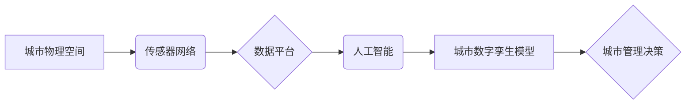

                 

## 关键词：城市数字孪生、智慧应急、人工智能、大数据、物联网、云计算、仿真模拟

## 1. 背景介绍

随着全球人口的持续增长和城市化的加速推进，城市面临着日益严峻的挑战，包括环境污染、资源短缺、交通拥堵、公共安全风险等。为了应对这些挑战，构建智慧城市成为全球共识。智慧城市利用信息技术和数据分析，提升城市管理效率、提升居民生活品质、促进经济发展。

城市数字孪生作为智慧城市建设的关键技术之一，以其强大的模拟和预测能力，为城市管理和应急决策提供了全新的思路。城市数字孪生是指利用三维建模、传感器数据、人工智能等技术，构建城市物理空间的虚拟镜像，并通过实时数据更新和仿真模拟，实现城市运行状态的数字化表达和模拟。

## 2. 核心概念与联系

### 2.1 城市数字孪生

城市数字孪生是城市信息化建设的重要组成部分，它将城市物理空间、网络空间和数据空间有机结合，构建一个动态、交互的虚拟城市模型。

**核心要素：**

* **三维建模:** 利用激光扫描、遥感影像等技术，构建城市物理空间的精细三维模型。
* **传感器网络:** 通过部署各种传感器，实时采集城市环境、交通、能源、民生等方面的关键数据。
* **数据平台:** 建立统一的数据平台，对来自不同来源的数据进行存储、处理、分析和共享。
* **人工智能:** 利用人工智能算法，对城市数据进行分析和预测，为城市管理决策提供智能支持。

**架构图:**



### 2.2 智慧应急

智慧应急是指利用信息技术和数据分析，提高城市应急预警、应急响应和应急处置的效率和水平。

**核心要素：**

* **预警监测:** 利用传感器数据、人工智能算法，对城市运行状态进行实时监测，预警潜在的风险和灾害。
* **应急响应:** 建立快速高效的应急响应机制，及时组织资源，快速处置突发事件。
* **应急处置:** 利用数据分析和仿真模拟，优化应急处置方案，提高应急处置效率。

**联系:**

城市数字孪生为智慧应急提供了强大的技术支撑。通过城市数字孪生模型的仿真模拟，可以提前预演各种突发事件，评估应急方案的有效性，优化应急资源配置，提高应急处置效率。

## 3. 核心算法原理 & 具体操作步骤

### 3.1 算法原理概述

城市数字孪生与智慧应急的核心算法主要包括：

* **数据采集与融合:** 利用传感器网络、卫星遥感、社会媒体等多种数据源，采集城市运行状态的各种数据，并进行数据清洗、格式转换、数据融合等处理。
* **三维建模与空间分析:** 利用三维建模技术，构建城市物理空间的精细模型，并利用空间分析算法，分析城市空间结构、交通流量、人口分布等信息。
* **人工智能算法:** 利用机器学习、深度学习等人工智能算法，对城市数据进行分析和预测，例如预测交通拥堵、预测环境污染、预测灾害风险等。
* **仿真模拟与优化:** 利用仿真模拟技术，模拟城市运行状态，并根据预设的场景和目标，优化城市管理决策，例如优化交通流量、优化资源配置、优化应急处置方案等。

### 3.2 算法步骤详解

**数据采集与融合:**

1. 确定数据源：根据城市管理需求，确定需要采集的数据类型和来源，例如交通流量、环境监测、社会治安等。
2. 数据采集：利用传感器网络、卫星遥感、社会媒体等数据源，采集城市运行状态的数据。
3. 数据清洗：对采集到的数据进行清洗，去除噪声、缺失值等异常数据。
4. 数据格式转换：将不同数据源的数据格式进行转换，统一到一个标准格式。
5. 数据融合：将不同类型的数据进行融合，构建城市运行状态的综合数据模型。

**三维建模与空间分析:**

1. 三维建模：利用激光扫描、遥感影像等技术，构建城市物理空间的精细三维模型。
2. 空间分析：利用空间分析算法，分析城市空间结构、交通流量、人口分布等信息。

**人工智能算法:**

1. 数据预处理：对城市数据进行预处理，例如特征提取、数据归一化等。
2. 模型选择：根据城市管理需求，选择合适的机器学习算法，例如回归算法、分类算法、聚类算法等。
3. 模型训练：利用训练数据，训练机器学习模型。
4. 模型评估：利用测试数据，评估模型的性能。
5. 模型部署：将训练好的模型部署到生产环境中，用于城市数据分析和预测。

**仿真模拟与优化:**

1. 场景设定：根据预设的场景和目标，设定城市运行状态的初始条件。
2. 模型运行：利用仿真模拟技术，模拟城市运行状态，并收集仿真数据。
3. 结果分析：对仿真数据进行分析，评估不同决策方案的效果。
4. 优化决策：根据仿真结果，优化城市管理决策，例如优化交通流量、优化资源配置、优化应急处置方案等。

### 3.3 算法优缺点

**优点:**

* **数据驱动:** 城市数字孪生与智慧应急算法基于大量数据，能够提供更准确、更可靠的决策支持。
* **实时性:** 城市数字孪生模型能够实时更新城市运行状态，能够及时响应突发事件。
* **可视化:** 城市数字孪生模型能够直观地展示城市运行状态，方便决策者理解和分析。
* **预测能力:** 城市数字孪生与智慧应急算法能够对城市运行状态进行预测，帮助决策者提前预警和应对风险。

**缺点:**

* **数据质量:** 城市数字孪生与智慧应急算法的准确性依赖于数据质量，数据不准确或不完整会导致算法结果不准确。
* **计算复杂度:** 城市数字孪生模型的构建和仿真模拟计算量较大，需要强大的计算资源支持。
* **模型精度:** 城市数字孪生模型的精度有限，无法完全模拟城市复杂运行状态。
* **伦理问题:** 城市数字孪生与智慧应急算法的应用可能涉及到隐私保护、数据安全等伦理问题。

### 3.4 算法应用领域

城市数字孪生与智慧应急算法在以下领域具有广泛的应用前景:

* **交通管理:** 优化交通流量、预测交通拥堵、提高交通安全。
* **环境监测:** 监测空气质量、水质、噪声污染等环境指标，预测环境风险。
* **公共安全:** 预警和应对突发事件，例如火灾、地震、洪水等。
* **城市规划:** 优化城市布局、规划城市基础设施、提高城市可持续发展水平。
* **医疗卫生:** 预警和应对传染病疫情，优化医疗资源配置。

## 4. 数学模型和公式 & 详细讲解 & 举例说明

### 4.1 数学模型构建

城市数字孪生与智慧应急的数学模型主要包括：

* **城市运行状态模型:** 描述城市各个要素之间的相互关系，例如交通流量模型、环境质量模型、人口流动模型等。
* **预测模型:** 利用历史数据和人工智能算法，预测城市运行状态的未来变化趋势。
* **优化模型:** 根据预设的目标，优化城市管理决策，例如优化交通流量分配、优化资源配置等。

### 4.2 公式推导过程

**交通流量模型:**

假设城市道路网络可以表示为一个图，其中节点代表道路交叉口，边代表道路。交通流量可以表示为每条道路上的车辆流量。

**目标:** 优化交通流量分配，减少交通拥堵。

**公式:**

$$
\min \sum_{i=1}^{n} \text{delay}_i
$$

$$
\text{subject to}
$$

$$
\text{flow}_i \leq \text{capacity}_i
$$

$$
\text{flow}_i = \text{flow}_{in} - \text{flow}_{out}
$$

其中:

* $\text{delay}_i$ 代表道路 $i$ 上的车辆平均等待时间。
* $\text{flow}_i$ 代表道路 $i$ 上的车辆流量。
* $\text{capacity}_i$ 代表道路 $i$ 的承载能力。
* $\text{flow}_{in}$ 代表进入道路 $i$ 的车辆流量。
* $\text{flow}_{out}$ 代表离开道路 $i$ 的车辆流量。

**举例说明:**

假设城市道路网络有 3 条道路，每条道路的承载能力分别为 1000、800 和 1200 辆/小时。

如果道路 1 上的车辆流量为 1200 辆/小时，道路 2 上的车辆流量为 900 辆/小时，道路 3 上的车辆流量为 1000 辆/小时，则需要优化交通流量分配，减少拥堵。

### 4.3 案例分析与讲解

**案例:** 利用城市数字孪生模型模拟城市交通拥堵情况，并优化交通信号灯控制策略。

**分析:**

1. 利用三维建模技术构建城市道路网络模型。
2. 利用传感器数据采集城市交通流量信息。
3. 利用仿真模拟技术模拟城市交通拥堵情况。
4. 根据仿真结果，优化交通信号灯控制策略，例如调整信号灯时长、调整信号灯顺序等。
5. 验证优化后的交通信号灯控制策略效果，并进行持续改进。

**讲解:**

通过城市数字孪生模型的仿真模拟，可以快速评估不同交通信号灯控制策略的效果，并找到最优的控制策略，从而有效缓解城市交通拥堵问题。

## 5. 项目实践：代码实例和详细解释说明

### 5.1 开发环境搭建

* 操作系统: Ubuntu 20.04 LTS
* 编程语言: Python 3.8
* 软件环境:

    * Jupyter Notebook
    * TensorFlow 2.0
    * Pandas
    * Matplotlib
    * NetworkX

### 5.2 源代码详细实现

```python
# 导入必要的库
import pandas as pd
import numpy as np
import matplotlib.pyplot as plt
import networkx as nx

# 加载交通流量数据
traffic_data = pd.read_csv("traffic_data.csv")

# 构建道路网络图
G = nx.Graph()
for i in range(len(traffic_data)):
    G.add_edge(traffic_data["road_id"][i], traffic_data["connected_road_id"][i], capacity=traffic_data["capacity"][i])

# 计算道路上的车辆流量
flow = nx.get_edge_attributes(G, "capacity")

# 仿真模拟交通流量
for i in range(100):
    # 更新道路上的车辆流量
    for edge in G.edges():
        flow[edge] = flow[edge] + np.random.normal(0, 10)

    # 限制道路上的车辆流量
    for edge in G.edges():
        flow[edge] = min(flow[edge], G.edges[edge]["capacity"])

# 绘制道路网络图
nx.draw(G, with_labels=True, node_color="lightblue", edge_color="gray")
plt.show()

# 打印道路上的车辆流量
print(flow)
```

### 5.3 代码解读与分析

* 代码首先导入必要的库，包括 Pandas 用于数据处理、NumPy 用于数值计算、Matplotlib 用于数据可视化和 NetworkX 用于构建网络图。
* 然后，代码加载交通流量数据，并构建道路网络图。
* 接着，代码计算道路上的车辆流量，并利用仿真模拟技术模拟交通流量变化。
* 最后，代码绘制道路网络图，并打印道路上的车辆流量。

### 5.4 运行结果展示

运行代码后，会生成一个道路网络图，并显示每条道路上的车辆流量。

## 6. 实际应用场景

### 6.1 城市交通管理

城市数字孪生可以帮助城市交通管理部门实时监测交通流量、预测交通拥堵情况，并优化交通信号灯控制策略、调整道路限行措施等，从而提高城市交通效率和安全性。

### 6.2 环境监测与管理

城市数字孪生可以帮助城市环境管理部门监测空气质量、水质、噪声污染等环境指标，预测环境风险，并制定相应的环境保护措施。

### 6.3 公共安全应急

城市数字孪生可以帮助城市应急管理部门模拟各种突发事件，例如火灾、地震、洪水等，评估应急处置方案的有效性，并优化应急资源配置，提高应急处置效率。

### 6.4 未来应用展望

随着人工智能、物联网、云计算等技术的不断发展，城市数字孪生将在未来发挥更加重要的作用，例如：

* **个性化城市服务:** 根据市民的需求和喜好，提供个性化的城市服务，例如推荐路线、提供实时交通信息、预警天气变化等。
* **智慧城市管理:** 利用城市数字孪生模型，实现城市资源的优化配置、城市运行状态的实时监控、城市发展规划的科学决策等。
* **城市可持续发展:** 利用城市数字孪生模型，评估城市环境、资源、社会等方面的可持续发展水平，并制定相应的可持续发展策略。

## 7. 工具和资源推荐

### 7.1 学习资源推荐

* **书籍:**

    * 《城市数字孪生》
    * 《智慧城市建设》
    * 《人工智能算法》

* **在线课程:**

    * Coursera: 城市智能化
    * edX: 智慧城市
    * Udemy: 城市数据分析

### 7.2 开发工具推荐

* **三维建模软件:**

    * ArcGIS
    * AutoCAD
    * Blender

* **数据分析平台:**

    * Hadoop
    * Spark
    * TensorFlow

* **仿真模拟软件:**

    * AnyLogic
    * Simulink
    * NetLogo

### 7.3 相关论文推荐

* **城市数字孪生:**

    * "Digital Twin: Definition, Characteristics, and Applications"
    * "A Review of Digital Twin Technologies for Smart Cities"

* **智慧应急:**

    * "Smart Emergency Response Systems: A Survey"
    * "Digital Twin-Based Simulation for Disaster Response"

## 8. 总结：未来发展趋势与挑战

### 8.1 研究成果总结

城市数字孪生与智慧应急技术在近年来取得了显著的进展，为城市管理和应急决策提供了新的思路和方法。

### 8.2 未来发展趋势

* **模型精度提升:** 利用更先进的机器学习算法和数据分析技术，提高城市数字孪生模型的精度和可靠性。
* **多源数据融合:** 将来自不同来源的数据融合到城市数字孪生模型中，构建更全面的城市运行状态模型。
* **实时性增强:** 利用边缘计算和云计算技术，提高城市数字孪生模型的实时性，能够及时响应突发事件。
* **应用场景拓展:** 将城市数字孪生技术应用到更多领域，例如城市规划、城市能源管理、城市医疗卫生等。

### 8.3 面临的挑战

* **数据质量问题:** 城市数字孪生模型的准确性依赖于数据质量，如何获取高质量的数据仍然是一个挑战。
* **计算资源需求:** 城市数字孪生模型的构建和仿真模拟计算量较大，需要强大的计算资源支持。
* **模型复杂度:** 城市数字孪生模型的复杂度较高，需要不断改进模型算法和架构，提高模型的可解释性和可维护性。
* **伦理问题:** 城市数字孪生技术应用可能涉及到隐私保护、数据安全等伦理问题，需要制定相应的规范和政策。

### 8.4 研究展望

未来，城市数字孪生与智慧应急技术将继续发展，为城市建设和管理提供更强大的技术支撑。

## 9. 附录：常见问题与解答

**常见问题:**

* **城市数字孪生与城市仿真有什么区别？**

**解答:** 城市数字孪生和城市仿真都是模拟城市运行状态的技术，但两者在应用场景和技术实现上有所区别。城市仿真通常用于研究城市发展趋势和规划方案，而城市数字孪生则更侧重于实时监测和决策支持。

* **城市数字孪生需要哪些数据支持？**

**解答:** 城市数字孪生需要多种数据支持，包括三维建模数据、传感器数据、社会媒体数据、人口数据等。

* **城市数字孪生技术有哪些应用场景？**

**解答:** 城市数字孪生技术应用场景广泛，包括交通管理、环境监测、公共安全应急、城市规划等。

作者：禅与计算机程序设计艺术 / Zen and the Art of Computer Programming


<end_of_turn>

