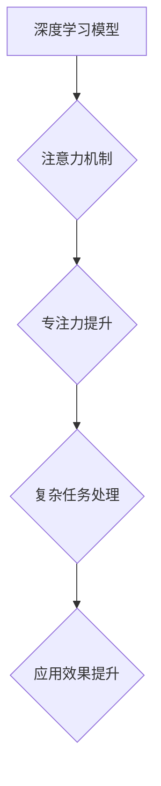

                 

## 注意力深度学习专家：AI优化的专注力培养研究员

> 关键词：深度学习、注意力机制、专注力、AI优化、研究员培养

### 1. 背景介绍

在当今数据爆炸的时代，深度学习作为人工智能领域最具潜力的技术之一，在各个领域取得了突破性的进展。从图像识别、自然语言处理到语音合成，深度学习模型的性能不断提升，为人类社会带来了前所未有的便利。然而，深度学习模型的训练和应用也面临着诸多挑战，其中之一便是如何提高模型的专注力，使其能够更有效地处理复杂的任务。

注意力机制作为深度学习领域的重要创新，为解决这个问题提供了新的思路。注意力机制能够帮助模型聚焦于输入数据中最重要的部分，从而提高模型的学习效率和准确性。近年来，注意力机制在各种深度学习模型中得到了广泛应用，并取得了显著的成果。

然而，注意力机制的应用仍然存在一些局限性。例如，现有的注意力机制往往难以处理长序列数据，并且在某些情况下可能过于依赖于局部信息，而忽略了全局上下文。因此，如何进一步优化注意力机制，使其能够更好地处理复杂的任务，是深度学习领域亟待解决的关键问题。

### 2. 核心概念与联系

#### 2.1 注意力机制

注意力机制是一种模仿人类注意力机制的机器学习技术。它允许模型在处理输入数据时，根据数据的不同重要性分配不同的权重，从而聚焦于最重要的信息。

#### 2.2 深度学习

深度学习是一种基于多层神经网络的机器学习方法。它能够从海量数据中学习复杂的特征表示，并用于各种任务，例如图像识别、自然语言处理和语音合成。

#### 2.3 专注力培养

专注力是指一个人能够集中注意力在特定任务或目标上，并排除干扰的能力。

**注意力机制与深度学习、专注力培养之间的联系：**

深度学习模型可以通过注意力机制模拟人类的注意力机制，从而提高其专注力。而注意力机制的优化可以帮助深度学习模型更好地处理复杂的任务，进而提升其在各个领域的应用效果。

**Mermaid 流程图：**



### 3. 核心算法原理 & 具体操作步骤

#### 3.1 算法原理概述

注意力机制的核心思想是通过计算每个输入元素的权重，来决定模型对每个元素的关注程度。这些权重可以被理解为每个元素的重要性得分，模型会根据这些得分来分配计算资源，从而聚焦于最重要的信息。

#### 3.2 算法步骤详解

1. **计算注意力权重:** 对于每个输入元素，计算其与模型输出的相似度，并将其转换为注意力权重。常用的计算方法包括点积注意力、加性注意力等。
2. **加权求和:** 将注意力权重与输入元素相乘，并对所有元素进行加权求和，得到最终的输出。

#### 3.3 算法优缺点

**优点:**

* **提高模型的专注力:** 通过聚焦于最重要的信息，注意力机制可以帮助模型提高学习效率和准确性。
* **处理长序列数据:** 注意力机制能够有效地处理长序列数据，例如文本和音频。
* **可解释性:** 注意力权重可以直观地反映模型对输入数据的关注程度，从而提高模型的可解释性。

**缺点:**

* **计算复杂度:** 计算注意力权重需要大量的计算资源，尤其是在处理长序列数据时。
* **参数量:** 注意力机制需要额外的参数，例如注意力权重，这可能会增加模型的复杂度和训练难度。

#### 3.4 算法应用领域

注意力机制在各个深度学习领域都有广泛的应用，例如：

* **自然语言处理:** 机器翻译、文本摘要、问答系统等。
* **计算机视觉:** 图像识别、目标检测、图像 Captioning 等。
* **语音识别:** 语音转文本、语音合成等。

### 4. 数学模型和公式 & 详细讲解 & 举例说明

#### 4.1 数学模型构建

注意力机制的数学模型通常基于以下公式：

**注意力权重计算:**

$$
\alpha_{ij} = \frac{\exp(e_{ij})}{\sum_{k=1}^{n} \exp(e_{ik})}
$$

其中：

* $i$ 表示输入元素的索引。
* $j$ 表示输出元素的索引。
* $n$ 表示输入元素的总数。
* $e_{ij}$ 表示输入元素 $i$ 与输出元素 $j$ 之间的相似度得分。

**加权求和:**

$$
\mathbf{z}_j = \sum_{i=1}^{n} \alpha_{ij} \mathbf{x}_i
$$

其中：

* $\mathbf{z}_j$ 表示输出元素 $j$ 的最终表示。
* $\mathbf{x}_i$ 表示输入元素 $i$ 的表示。

#### 4.2 公式推导过程

注意力权重计算公式的推导过程基于softmax函数，其目的是将相似度得分转换为概率分布，使得每个输入元素的权重之和为1。

加权求和公式则将注意力权重与输入元素相乘，并对所有元素进行加权求和，从而得到最终的输出。

#### 4.3 案例分析与讲解

**举例说明:**

假设我们有一个句子 "The cat sat on the mat"，我们要使用注意力机制来理解这句话的含义。

1. 首先，我们将句子中的每个单词转换为向量表示。
2. 然后，我们将每个单词的向量与模型输出的向量进行点积运算，得到每个单词的相似度得分。
3. 将这些得分转换为注意力权重，并将其与单词向量相乘，得到加权求和后的输出。

通过这种方式，模型能够聚焦于句子中最重要的单词，例如 "cat" 和 "sat"，从而更好地理解句子的含义。

### 5. 项目实践：代码实例和详细解释说明

#### 5.1 开发环境搭建

* Python 3.6+
* TensorFlow 2.0+
* PyTorch 1.0+

#### 5.2 源代码详细实现

```python
import tensorflow as tf

# 定义注意力机制层
class AttentionLayer(tf.keras.layers.Layer):
    def __init__(self, units):
        super(AttentionLayer, self).__init__()
        self.W1 = tf.keras.layers.Dense(units)
        self.W2 = tf.keras.layers.Dense(units)
        self.v = tf.keras.layers.Dense(1)

    def call(self, inputs):
        # 计算注意力权重
        scores = self.v(tf.tanh(self.W1(inputs) + self.W2(inputs)))
        attention_weights = tf.nn.softmax(scores, axis=-1)
        # 加权求和
        context_vector = tf.matmul(attention_weights, inputs)
        return context_vector

# 定义模型
model = tf.keras.Sequential([
    tf.keras.layers.Embedding(input_dim=10000, output_dim=128),
    AttentionLayer(units=64),
    tf.keras.layers.Dense(units=10, activation='softmax')
])

# 训练模型
model.compile(optimizer='adam', loss='sparse_categorical_crossentropy', metrics=['accuracy'])
model.fit(x_train, y_train, epochs=10)
```

#### 5.3 代码解读与分析

* `AttentionLayer` 类定义了一个注意力机制层，包含三个密集层：`W1`、`W2` 和 `v`。
* `call` 方法计算注意力权重并进行加权求和，得到最终的输出。
* `model` 定义了一个简单的深度学习模型，包含嵌入层、注意力机制层和全连接层。
* `compile` 方法配置模型的训练参数，包括优化器、损失函数和指标。
* `fit` 方法训练模型，使用训练数据 `x_train` 和标签 `y_train`。

#### 5.4 运行结果展示

训练完成后，可以使用测试数据 `x_test` 来评估模型的性能，并打印出准确率等指标。

### 6. 实际应用场景

#### 6.1 机器翻译

注意力机制可以帮助机器翻译模型更好地理解源语言和目标语言之间的关系，从而提高翻译的准确性和流畅度。

#### 6.2 文本摘要

注意力机制可以帮助文本摘要模型聚焦于文本中最关键的信息，并生成更简洁、更准确的摘要。

#### 6.3 问答系统

注意力机制可以帮助问答系统更好地理解问题和上下文，从而给出更准确和相关的答案。

#### 6.4 未来应用展望

随着深度学习技术的不断发展，注意力机制将在更多领域得到应用，例如：

* **医疗诊断:** 帮助医生更好地理解患者的病历和症状，从而做出更准确的诊断。
* **金融分析:** 帮助分析师识别市场趋势和风险，从而做出更明智的投资决策。
* **自动驾驶:** 帮助自动驾驶系统更好地理解周围环境，从而提高驾驶安全性和效率。

### 7. 工具和资源推荐

#### 7.1 学习资源推荐

* **书籍:**

    * "深度学习" by Ian Goodfellow, Yoshua Bengio, and Aaron Courville
    * "Attention Is All You Need" by Vaswani et al.

* **在线课程:**

    * Coursera: Deep Learning Specialization
    * Udacity: Deep Learning Nanodegree

#### 7.2 开发工具推荐

* **TensorFlow:** https://www.tensorflow.org/
* **PyTorch:** https://pytorch.org/

#### 7.3 相关论文推荐

* "Attention Is All You Need" (https://arxiv.org/abs/1706.03762)
* "BERT: Pre-training of Deep Bidirectional Transformers for Language Understanding" (https://arxiv.org/abs/1810.04805)

### 8. 总结：未来发展趋势与挑战

#### 8.1 研究成果总结

注意力机制在深度学习领域取得了显著的成果，为解决复杂任务提供了新的思路。

#### 8.2 未来发展趋势

* **更有效的注意力机制:** 研究更有效的注意力机制，例如自注意力机制、多头注意力机制等，以提高模型的性能和效率。
* **注意力机制的泛化性:** 研究注意力机制的泛化性，使其能够应用于更多领域和任务。
* **注意力机制的可解释性:** 研究注意力机制的可解释性，使其能够更好地理解模型的决策过程。

#### 8.3 面临的挑战

* **计算复杂度:** 计算注意力权重需要大量的计算资源，尤其是在处理长序列数据时。
* **参数量:** 注意力机制需要额外的参数，这可能会增加模型的复杂度和训练难度。
* **数据依赖性:** 注意力机制的性能依赖于训练数据的质量和数量。

#### 8.4 研究展望

未来，注意力机制将继续是深度学习领域的重要研究方向，并将在更多领域得到应用。


### 9. 附录：常见问题与解答

**Q1: 注意力机制与卷积神经网络有什么区别？**

**A1:** 卷积神经网络通过卷积操作提取图像特征，而注意力机制通过计算注意力权重聚焦于输入数据中最重要的部分。

**Q2: 注意力机制的计算复杂度如何？**

**A2:** 注意力机制的计算复杂度与输入数据的长度有关，对于长序列数据，计算复杂度会比较高。

**Q3: 注意力机制的应用领域有哪些？**

**A3:** 注意力机制在各个深度学习领域都有广泛的应用，例如自然语言处理、计算机视觉和语音识别等。


作者：禅与计算机程序设计艺术 / Zen and the Art of Computer Programming<end_of_turn>

