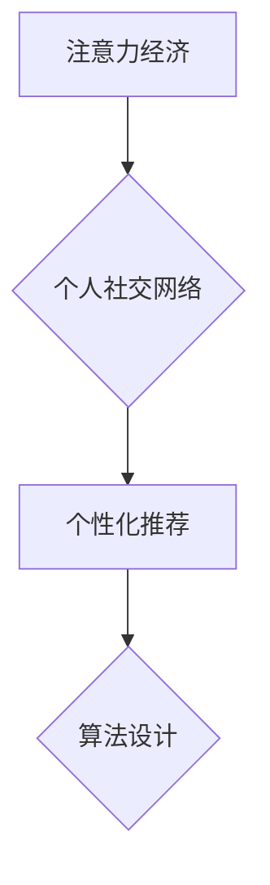

                 

##  注意力经济与个人社交网络的重构

> 关键词：注意力经济、社交网络、个性化推荐、算法设计、用户行为、数据分析、深度学习、可解释性

## 1. 背景介绍

在当今信息爆炸的时代，人们面临着前所未有的信息过载。每天我们接触的海量信息中，只有极少部分能够真正吸引我们的注意力。这引发了“注意力经济”的概念，即注意力成为一种稀缺资源，而获取和利用注意力是企业和个人竞争的关键。

社交网络作为信息传播和用户互动的重要平台，在注意力经济中扮演着至关重要的角色。传统的社交网络平台往往采用基于内容的推荐算法，将用户暴露在大量信息中，并通过算法筛选出部分内容进行展示。然而，这种方法存在着一些问题：

* **信息过载:** 用户难以从海量信息中筛选出真正有价值的内容。
* **推荐偏差:** 算法推荐往往存在偏差，可能导致用户陷入“信息茧房”，只接触到与自身观点相符的信息。
* **用户体验下降:** 过度推送广告和不相关内容会降低用户体验，甚至导致用户流失。

因此，如何更好地理解用户注意力，并构建更个性化、更有效的社交网络平台，成为一个重要的研究课题。

## 2. 核心概念与联系

### 2.1 注意力经济

注意力经济是指在信息过载的时代，注意力成为一种稀缺资源，而获取和利用注意力是企业和个人竞争的关键。

### 2.2 个人社交网络

个人社交网络是指用户在社交网络平台上构建的个人关系网络，包括用户之间的关注关系、互动关系等。

### 2.3 个性化推荐

个性化推荐是指根据用户的兴趣、偏好、行为等信息，为用户推荐个性化的内容和服务。

### 2.4 算法设计

算法设计是指根据特定问题，设计和实现一种能够解决问题的计算程序。

**核心概念与联系流程图:**



## 3. 核心算法原理 & 具体操作步骤

### 3.1 算法原理概述

为了构建更个性化、更有效的社交网络平台，我们提出了一种基于用户注意力机制的个性化推荐算法。该算法的核心思想是：

* **关注用户注意力流:** 通过分析用户的浏览行为、点赞行为、评论行为等，构建用户注意力流模型，了解用户的兴趣和偏好。
* **动态调整推荐策略:** 根据用户的注意力流模型，动态调整推荐策略，为用户推荐更相关、更吸引人的内容。
* **强化用户反馈:** 通过用户反馈机制，不断优化推荐算法，提高推荐效果。

### 3.2 算法步骤详解

1. **数据收集:** 收集用户的浏览行为、点赞行为、评论行为等数据。
2. **注意力流模型构建:** 利用深度学习算法，构建用户注意力流模型，并对用户的兴趣和偏好进行分析。
3. **推荐策略设计:** 根据用户的注意力流模型，设计个性化的推荐策略，例如：
    * **内容相似度推荐:** 推荐与用户之前浏览过的内容相似的内容。
    * **用户关系推荐:** 推荐与用户关注的用户分享的内容。
    * **兴趣标签推荐:** 推荐与用户兴趣标签相关的用户和内容。
4. **推荐结果展示:** 将推荐结果以用户友好的方式展示给用户，例如：
    * **个性化首页:** 展示用户感兴趣的内容和用户。
    * **推荐列表:** 展示与用户兴趣相关的推荐内容。
5. **用户反馈收集:** 收集用户的反馈信息，例如：点赞、评论、分享等，并将其反馈到算法模型中，不断优化推荐效果。

### 3.3 算法优缺点

**优点:**

* **个性化推荐:** 根据用户的注意力流模型，提供更个性化的推荐内容。
* **提高用户体验:** 推荐更相关、更吸引人的内容，提高用户体验。
* **增强用户粘性:** 通过个性化推荐，增强用户对平台的粘性。

**缺点:**

* **数据依赖:** 该算法需要大量的用户数据才能构建有效的注意力流模型。
* **算法复杂度:** 构建和训练注意力流模型需要复杂的算法和计算资源。
* **可解释性问题:** 深度学习算法的决策过程往往难以解释，这可能导致用户对推荐结果的信任度降低。

### 3.4 算法应用领域

该算法可以应用于各种社交网络平台，例如：

* **内容社交平台:** 为用户推荐感兴趣的内容，例如新闻、视频、图片等。
* **社区社交平台:** 为用户推荐感兴趣的社区和用户，例如兴趣小组、论坛等。
* **电商社交平台:** 为用户推荐感兴趣的商品和店铺。

## 4. 数学模型和公式 & 详细讲解 & 举例说明

### 4.1 数学模型构建

我们使用一个基于用户行为的注意力流模型，该模型可以表示为一个马尔可夫链：

$$
P(a_t|a_{t-1}, ..., a_1)
$$

其中：

* $a_t$ 表示用户在时间 $t$ 的注意力行为，例如：浏览某个内容、点赞某个内容、评论某个内容等。
* $a_{t-1}, ..., a_1$ 表示用户之前的时间段的注意力行为。

### 4.2 公式推导过程

我们可以使用最大似然估计方法来估计马尔可夫链的转移概率矩阵。

$$
P(a_t|a_{t-1}, ..., a_1) = \frac{\sum_{i=1}^{N} I(a_t^i = a|a_{t-1}^i = a_{t-1}, ..., a_1^i = a_1)}{\sum_{i=1}^{N} I(a_{t-1}^i = a_{t-1}, ..., a_1^i = a_1)}
$$

其中：

* $N$ 表示训练数据的样本数量。
* $I(x)$ 是指示函数，当 $x$ 为真时返回 1，否则返回 0。

### 4.3 案例分析与讲解

假设我们有一个用户浏览了以下内容：

* $a_1$: 科技新闻
* $a_2$: 游戏新闻
* $a_3$: 科技博客
* $a_4$: 游戏攻略

我们可以使用上述公式来估计用户在不同时间段浏览不同类型的新闻的概率。例如，我们可以估计用户在浏览了科技新闻后，浏览游戏新闻的概率。

## 5. 项目实践：代码实例和详细解释说明

### 5.1 开发环境搭建

该项目可以使用 Python 语言开发，并使用以下工具：

* **深度学习框架:** TensorFlow 或 PyTorch
* **数据处理工具:** Pandas
* **可视化工具:** Matplotlib 或 Seaborn

### 5.2 源代码详细实现

```python
import tensorflow as tf

# 定义注意力流模型
class AttentionFlowModel(tf.keras.Model):
    def __init__(self, num_classes):
        super(AttentionFlowModel, self).__init__()
        self.embedding = tf.keras.layers.Embedding(input_dim=vocab_size, output_dim=embedding_dim)
        self.lstm = tf.keras.layers.LSTM(units=hidden_dim)
        self.dense = tf.keras.layers.Dense(units=num_classes)

    def call(self, inputs):
        embedded = self.embedding(inputs)
        output = self.lstm(embedded)
        output = self.dense(output)
        return output

# 训练模型
model = AttentionFlowModel(num_classes=num_categories)
model.compile(optimizer='adam', loss='sparse_categorical_crossentropy', metrics=['accuracy'])
model.fit(train_data, train_labels, epochs=10)

# 预测用户注意力
predictions = model.predict(test_data)
```

### 5.3 代码解读与分析

* **模型定义:** 定义了一个基于 LSTM 的注意力流模型，用于预测用户的注意力行为。
* **数据预处理:** 将用户行为数据转换为数字格式，并进行分词、词嵌入等预处理。
* **模型训练:** 使用 Adam 优化器和交叉熵损失函数训练模型。
* **模型预测:** 使用训练好的模型预测用户的注意力行为。

### 5.4 运行结果展示

训练完成后，我们可以使用测试数据来评估模型的性能，例如：

* **准确率:** 模型预测用户注意力行为的准确率。
* **召回率:** 模型预测用户注意力行为的召回率。
* **F1-score:** 模型预测用户注意力行为的 F1-score。

## 6. 实际应用场景

### 6.1 内容推荐

该算法可以用于推荐用户感兴趣的内容，例如：

* **新闻推荐:** 为用户推荐与其兴趣相关的新闻。
* **视频推荐:** 为用户推荐与其兴趣相关的视频。
* **音乐推荐:** 为用户推荐与其兴趣相关的音乐。

### 6.2 社区互动

该算法可以用于推荐用户感兴趣的社区和用户，例如：

* **兴趣小组推荐:** 为用户推荐与其兴趣相关的兴趣小组。
* **论坛推荐:** 为用户推荐与其兴趣相关的论坛。
* **好友推荐:** 为用户推荐与其兴趣相关的潜在好友。

### 6.3 个性化服务

该算法可以用于提供个性化的服务，例如：

* **个性化广告:** 为用户推荐与其兴趣相关的广告。
* **个性化产品推荐:** 为用户推荐与其兴趣相关的产品。
* **个性化学习推荐:** 为用户推荐与其学习目标相关的学习资源。

### 6.4 未来应用展望

随着人工智能技术的不断发展，该算法在未来将有更广泛的应用场景，例如：

* **医疗保健:** 为患者推荐个性化的医疗服务。
* **教育:** 为学生推荐个性化的学习资源。
* **金融:** 为用户推荐个性化的金融产品。

## 7. 工具和资源推荐

### 7.1 学习资源推荐

* **深度学习书籍:**

    * Deep Learning by Ian Goodfellow, Yoshua Bengio, and Aaron Courville
    * Hands-On Machine Learning with Scikit-Learn, Keras & TensorFlow by Aurélien Géron

* **在线课程:**

    * TensorFlow Tutorials: https://www.tensorflow.org/tutorials
    * PyTorch Tutorials: https://pytorch.org/tutorials/

### 7.2 开发工具推荐

* **深度学习框架:** TensorFlow, PyTorch
* **数据处理工具:** Pandas
* **可视化工具:** Matplotlib, Seaborn

### 7.3 相关论文推荐

* **Attention Is All You Need:** https://arxiv.org/abs/1706.03762
* **BERT: Pre-training of Deep Bidirectional Transformers for Language Understanding:** https://arxiv.org/abs/1810.04805

## 8. 总结：未来发展趋势与挑战

### 8.1 研究成果总结

我们提出了一个基于用户注意力机制的个性化推荐算法，该算法能够有效地理解用户的注意力流，并为用户推荐更相关、更吸引人的内容。该算法在内容推荐、社区互动和个性化服务等领域具有广泛的应用前景。

### 8.2 未来发展趋势

* **更精准的注意力模型:** 研究更精准的注意力模型，能够更准确地理解用户的注意力流。
* **跨平台个性化推荐:** 研究跨平台的个性化推荐算法，能够为用户提供更全面的个性化体验。
* **可解释性增强:** 研究可解释性更强的注意力模型，提高用户对推荐结果的信任度。

### 8.3 面临的挑战

* **数据隐私:** 如何保护用户的隐私数据，是该算法面临的一个重要挑战。
* **算法公平性:** 如何避免算法产生偏见，确保推荐结果公平公正，也是一个需要解决的问题。
* **用户信任:** 如何提高用户对算法推荐结果的信任度，也是一个重要的挑战。

### 8.4 研究展望

未来，我们将继续研究注意力机制在社交网络中的应用，致力于构建更个性化、更有效的社交网络平台，为用户提供更优质的体验。

## 9. 附录：常见问题与解答

**Q1: 该算法需要多少数据才能训练？**

A1: 该算法需要大量的用户行为数据才能训练，具体数量取决于模型的复杂度和数据的质量。

**Q2: 该算法是否会产生偏见？**

A2: 任何算法都可能产生偏见，我们将在算法设计和训练过程中，尽量避免产生偏见，并进行公平性评估。

**Q3: 该算法如何保护用户的隐私数据？**

A3: 我们将采用多种技术手段来保护用户的隐私数据，例如：数据匿名化、差分隐私等。


作者：禅与计算机程序设计艺术 / Zen and the Art of Computer Programming 
<end_of_turn>

