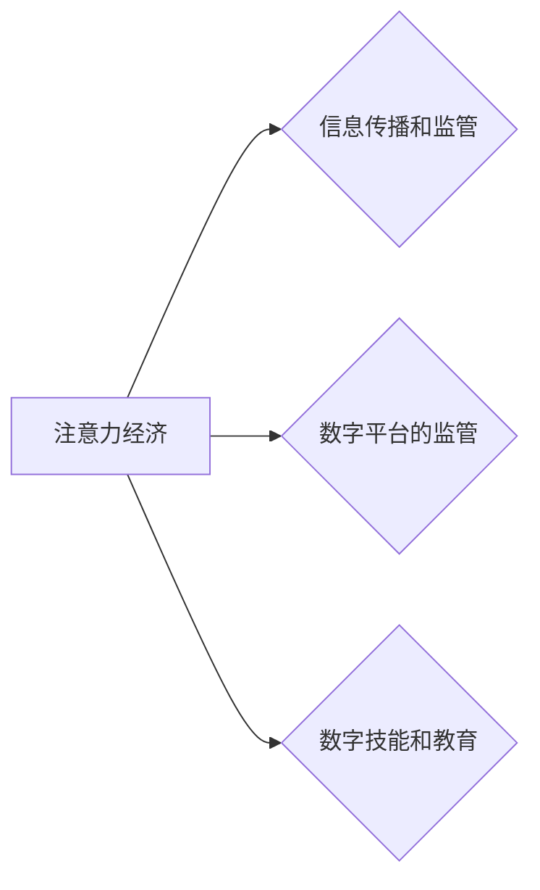

                 

## 1. 背景介绍

在当今数字时代，信息爆炸和网络技术的飞速发展，使得人们面临着前所未有的信息过载。如何有效地获取、处理和利用信息，成为一个至关重要的挑战。注意力，作为人类认知的核心能力之一，在信息时代显得尤为珍贵。

注意力经济的概念应运而生，它强调了在信息过载的时代，人们对信息的注意力是稀缺资源，而能够有效吸引和利用用户注意力的产品和服务，将拥有巨大的商业价值。注意力经济的兴起，深刻地改变了人们获取信息、消费内容和进行社交的方式，也对公共政策制定产生了深远的影响。

## 2. 核心概念与联系

### 2.1 注意力经济

注意力经济是指在信息时代，人们对信息的注意力是稀缺资源，而能够有效吸引和利用用户注意力的产品和服务，将拥有巨大的商业价值。

注意力经济的核心在于：

* **注意力是稀缺资源:**  在信息爆炸的时代，人们每天接触的信息量巨大，难以集中注意力。
* **注意力是可交易的:**  企业可以通过各种手段，例如个性化推荐、内容推送、广告投放等，来获取用户的注意力。
* **注意力决定价值:**  能够有效吸引和利用用户注意力的产品和服务，能够获得更高的用户粘性、转化率和商业价值。

### 2.2 公共政策

公共政策是指政府为了实现社会目标，通过制定和实施各种法规、制度和措施，来引导和调节社会行为的活动。

注意力经济对公共政策的影响主要体现在以下几个方面：

* **信息传播和监管:**  政府需要制定政策，规范网络信息传播，防止虚假信息和有害内容的传播，同时也要保护公民的隐私和数据安全。
* **数字平台的监管:**  政府需要制定政策，规范数字平台的运营，防止平台滥用用户数据，侵犯用户权益，以及营造公平竞争的市场环境。
* **数字技能和教育:**  政府需要加强数字技能的培训和教育，帮助公民适应信息时代，提高信息获取和利用的能力。

### 2.3  注意力经济与公共政策的联系

**Mermaid 流程图**



## 3. 核心算法原理 & 具体操作步骤

### 3.1 算法原理概述

注意力机制是一种模仿人类注意力机制的机器学习算法，它能够学习到输入数据中哪些部分更重要，并对这些重要部分给予更多的关注。

注意力机制的核心思想是：

* **权重分配:**  对输入数据中的每个元素分配一个权重，权重代表该元素的重要性。
* **加权求和:**  根据权重，对输入数据进行加权求和，得到最终的输出。

### 3.2 算法步骤详解

1. **输入数据:**  将输入数据作为注意力模型的输入。
2. **编码器:**  使用编码器网络对输入数据进行编码，得到隐藏状态。
3. **注意力计算:**  计算每个隐藏状态与所有输入数据元素之间的注意力权重。
4. **加权求和:**  根据注意力权重，对输入数据进行加权求和，得到上下文向量。
5. **解码器:**  使用解码器网络对上下文向量进行解码，得到最终的输出。

### 3.3 算法优缺点

**优点:**

* **能够学习到输入数据中哪些部分更重要:**  注意力机制能够自动地学习到输入数据中哪些部分更重要，并对这些重要部分给予更多的关注。
* **能够处理长序列数据:**  注意力机制能够有效地处理长序列数据，例如文本和语音。
* **能够提高模型的性能:**  注意力机制能够提高机器学习模型的性能，例如机器翻译、文本摘要和问答系统。

**缺点:**

* **计算复杂度高:**  注意力机制的计算复杂度较高，需要大量的计算资源。
* **训练难度大:**  注意力机制的训练难度较大，需要大量的训练数据和经验。
* **可解释性差:**  注意力机制的内部机制比较复杂，难以解释其决策过程。

### 3.4 算法应用领域

注意力机制在机器学习领域有着广泛的应用，例如：

* **机器翻译:**  注意力机制能够帮助机器翻译模型更好地理解句子结构和语义，提高翻译质量。
* **文本摘要:**  注意力机制能够帮助文本摘要模型识别出文本中最关键的信息，生成更准确的摘要。
* **问答系统:**  注意力机制能够帮助问答系统更好地理解问题和上下文，给出更准确的答案。
* **图像识别:**  注意力机制能够帮助图像识别模型关注图像中最关键的区域，提高识别精度。

## 4. 数学模型和公式 & 详细讲解 & 举例说明

### 4.1 数学模型构建

注意力机制的数学模型可以概括为以下公式：

$$
\text{Attention}(Q, K, V) = \text{softmax}\left(\frac{Q K^T}{\sqrt{d_k}}\right) V
$$

其中：

* $Q$：查询矩阵
* $K$：键矩阵
* $V$：值矩阵
* $d_k$：键向量的维度
* $\text{softmax}$：softmax函数，用于将注意力权重归一化

### 4.2 公式推导过程

1. **计算注意力权重:**  首先，计算查询矩阵 $Q$ 与键矩阵 $K$ 的点积，然后除以 $\sqrt{d_k}$，得到一个注意力得分矩阵。

$$
\text{Score}(Q, K) = \frac{Q K^T}{\sqrt{d_k}}
$$

2. **应用 softmax 函数:**  对注意力得分矩阵应用 softmax 函数，得到注意力权重矩阵。

$$
\text{Attention}(Q, K, V) = \text{softmax}(\text{Score}(Q, K)) V
$$

3. **加权求和:**  将注意力权重矩阵与值矩阵 $V$ 进行加权求和，得到最终的上下文向量。

### 4.3 案例分析与讲解

假设我们有一个句子 "The cat sat on the mat"，我们想使用注意力机制来理解每个单词对句子的整体意义。

* $Q$：查询向量，表示我们想要关注的单词。
* $K$：键向量，表示每个单词的语义信息。
* $V$：值向量，表示每个单词的具体含义。

通过计算注意力权重，我们可以发现 "sat" 这个单词对句子的整体意义最为重要，因为它描述了猫的行为。

## 5. 项目实践：代码实例和详细解释说明

### 5.1 开发环境搭建

* Python 3.6+
* TensorFlow 或 PyTorch

### 5.2 源代码详细实现

```python
import tensorflow as tf

# 定义注意力机制
def attention_layer(inputs, key, value, mask=None):
    # 计算注意力得分
    scores = tf.matmul(inputs, key, transpose_b=True) / tf.math.sqrt(tf.shape(key)[-1])
    # 应用 softmax 函数
    attention_weights = tf.nn.softmax(scores, axis=-1)
    # 加权求和
    output = tf.matmul(attention_weights, value)
    return output

# 示例代码
# 输入数据
inputs = tf.random.normal([3, 5, 128])
key = tf.random.normal([3, 5, 64])
value = tf.random.normal([3, 5, 128])

# 计算注意力输出
output = attention_layer(inputs, key, value)
print(output.shape)
```

### 5.3 代码解读与分析

* `attention_layer` 函数定义了注意力机制的计算过程。
* `scores` 计算了查询向量与键向量的点积，并进行归一化。
* `attention_weights` 应用 softmax 函数对注意力得分进行归一化，得到注意力权重。
* `output` 将注意力权重与值向量进行加权求和，得到最终的上下文向量。

### 5.4 运行结果展示

运行上述代码，会输出一个形状为 `(3, 5, 128)` 的张量，表示注意力机制的输出。

## 6. 实际应用场景

### 6.1 信息过滤和推荐

注意力机制可以用于过滤信息流，识别用户感兴趣的内容，并进行个性化推荐。例如，社交媒体平台可以使用注意力机制来推荐用户可能感兴趣的帖子和视频。

### 6.2 内容创作和编辑

注意力机制可以帮助内容创作者更好地理解读者需求，并创作更吸引人的内容。例如，新闻网站可以使用注意力机制来识别新闻文章中最关键的信息，并生成更简洁的摘要。

### 6.3 教育和培训

注意力机制可以用于个性化教育和培训，根据学生的学习进度和兴趣，提供更精准的学习内容和指导。

### 6.4 未来应用展望

注意力机制在未来将有更广泛的应用，例如：

* **医疗诊断:**  注意力机制可以帮助医生识别医学图像中的关键特征，提高诊断准确率。
* **金融风险管理:**  注意力机制可以帮助金融机构识别潜在的风险，并进行有效的风险控制。
* **自动驾驶:**  注意力机制可以帮助自动驾驶系统更好地理解周围环境，提高驾驶安全性。

## 7. 工具和资源推荐

### 7.1 学习资源推荐

* **书籍:**  "深度学习" by Ian Goodfellow, Yoshua Bengio, and Aaron Courville
* **在线课程:**  Coursera, edX, Udacity

### 7.2 开发工具推荐

* **TensorFlow:**  https://www.tensorflow.org/
* **PyTorch:**  https://pytorch.org/

### 7.3 相关论文推荐

* "Attention Is All You Need" by Vaswani et al. (2017)
* "BERT: Pre-training of Deep Bidirectional Transformers for Language Understanding" by Devlin et al. (2018)

## 8. 总结：未来发展趋势与挑战

### 8.1 研究成果总结

注意力机制在机器学习领域取得了显著的成果，并在多个应用场景中展现出强大的性能。

### 8.2 未来发展趋势

* **更有效的注意力机制:**  研究人员将继续探索更有效的注意力机制，例如自注意力机制、多头注意力机制等。
* **注意力机制的解释性:**  研究人员将致力于提高注意力机制的解释性，使其决策过程更加透明可理解。
* **注意力机制的应用扩展:**  注意力机制将应用于更多领域，例如医疗、金融、自动驾驶等。

### 8.3 面临的挑战

* **计算复杂度:**  注意力机制的计算复杂度较高，需要大量的计算资源。
* **训练难度:**  注意力机制的训练难度较大，需要大量的训练数据和经验。
* **可解释性差:**  注意力机制的内部机制比较复杂，难以解释其决策过程。

### 8.4 研究展望

未来，注意力机制将继续是一个重要的研究方向，研究人员将致力于解决上述挑战，并探索注意力机制的更多应用场景。

## 9. 附录：常见问题与解答

* **什么是注意力机制？**

注意力机制是一种模仿人类注意力机制的机器学习算法，它能够学习到输入数据中哪些部分更重要，并对这些重要部分给予更多的关注。

* **注意力机制的应用场景有哪些？**

注意力机制在机器学习领域有着广泛的应用，例如机器翻译、文本摘要、问答系统、图像识别等。

* **注意力机制的优缺点是什么？**

注意力机制的优点是能够学习到输入数据中哪些部分更重要，并提高模型的性能。缺点是计算复杂度高、训练难度大、可解释性差。


作者：禅与计算机程序设计艺术 / Zen and the Art of Computer Programming 
<end_of_turn>

