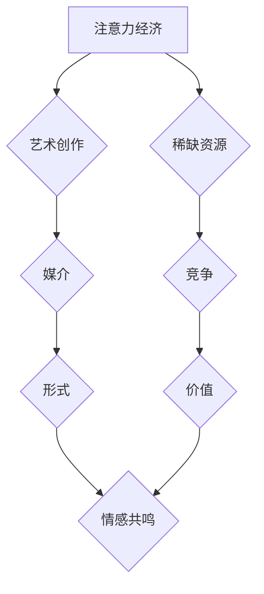

                 

## 1. 背景介绍

在当今信息爆炸的时代，人们面临着前所未有的信息过载。如何有效地获取和处理信息成为了一个至关重要的挑战。注意力经济应运而生，它强调了注意力作为一种稀缺资源，并探讨了如何更好地管理和利用注意力。

艺术创作，作为人类表达情感、思想和体验的重要方式，也受到注意力经济的影响。艺术家们需要在竞争激烈的环境中吸引观众的注意力，并通过作品传递情感和价值观。同时，注意力经济也为艺术创作提供了新的可能性，例如利用新技术和媒介来创造更具吸引力的艺术体验。

## 2. 核心概念与联系

### 2.1 注意力经济

注意力经济的核心概念是将注意力视为一种稀缺资源，并探讨如何有效地获取、分配和利用注意力。

* **注意力稀缺性:** 人类对信息的处理能力有限，无法同时关注所有信息。因此，注意力成为了一个稀缺资源，需要被有效地管理和分配。
* **注意力竞争:** 在信息爆炸的时代，人们面临着来自各种渠道的信息竞争。社交媒体、新闻网站、广告等都争夺着人们的注意力。
* **注意力价值:** 拥有和控制注意力意味着拥有影响力和价值。艺术家、企业家、政治家等都需要通过吸引和留住观众的注意力来实现自己的目标。

### 2.2 艺术创作

艺术创作是指人类通过各种媒介和技巧，表达情感、思想和体验的过程。

* **媒介多样化:** 艺术创作的媒介包括绘画、雕塑、音乐、舞蹈、戏剧、电影、数字艺术等。
* **表达形式丰富:** 艺术创作可以采用各种形式，例如抽象、写实、表现主义、超现实主义等。
* **情感共鸣:** 艺术创作旨在引发观众的情感共鸣，并传递艺术家想要表达的思想和价值观。

### 2.3 联系

注意力经济与艺术创作之间存在着密切的联系。

* **注意力是艺术创作的基础:** 艺术家需要吸引观众的注意力，才能传递自己的作品。
* **注意力经济影响艺术创作的趋势:**  信息爆炸和注意力竞争导致艺术创作更加多元化、碎片化和互动化。
* **艺术创作可以利用注意力经济的原理:** 艺术家可以通过设计更具吸引力的作品、利用新技术和媒介来更好地获取和利用观众的注意力。

**Mermaid 流程图**



## 3. 核心算法原理 & 具体操作步骤

### 3.1 算法原理概述

注意力机制是一种模仿人类注意力机制的算法，它能够帮助模型专注于输入数据中最重要的部分。

注意力机制的核心思想是通过一个注意力权重来分配输入数据的权重，从而突出重要信息，抑制无关信息。

### 3.2 算法步骤详解

1. **计算注意力权重:**  使用一个注意力函数计算每个输入数据元素的注意力权重。注意力函数通常是一个基于神经网络的函数，它会根据输入数据和模型的当前状态计算每个元素的重要性。
2. **加权求和:** 将注意力权重与输入数据相乘，然后对结果进行求和，得到一个加权后的输出向量。
3. **输出:** 将加权后的输出向量作为模型的输入，用于后续的处理。

### 3.3 算法优缺点

**优点:**

* **提高模型性能:** 注意力机制能够帮助模型专注于重要信息，从而提高模型的准确性和效率。
* **解释性增强:** 注意力权重可以提供模型对输入数据的关注点，从而提高模型的解释性。

**缺点:**

* **计算复杂度高:** 注意力机制的计算复杂度较高，尤其是在处理大型数据集时。
* **参数量大:** 注意力机制需要更多的参数，这可能会导致模型训练时间更长。

### 3.4 算法应用领域

注意力机制在许多领域都有广泛的应用，例如：

* **自然语言处理:** 机器翻译、文本摘要、问答系统等。
* **计算机视觉:** 图像分类、目标检测、图像 Captioning 等。
* **语音识别:** 语音转文本、语音合成等。

## 4. 数学模型和公式 & 详细讲解 & 举例说明

### 4.1 数学模型构建

注意力机制的数学模型通常基于一个注意力函数，该函数计算每个输入数据元素的注意力权重。

一个常见的注意力函数是基于softmax函数的注意力函数，其公式如下：

$$
\alpha_{i} = \frac{exp(e_{i})}{\sum_{j=1}^{n} exp(e_{j})}
$$

其中：

* $\alpha_{i}$ 是第 $i$ 个输入数据元素的注意力权重。
* $e_{i}$ 是第 $i$ 个输入数据元素的得分。
* $n$ 是输入数据的总数。

### 4.2 公式推导过程

注意力函数的推导过程基于以下几个假设：

* **输入数据可以表示为一个向量:**  每个输入数据元素都可以用一个向量来表示。
* **每个输入数据元素都有一个得分:**  得分可以表示该元素的重要性。
* **注意力权重应该满足归一化条件:**  所有注意力权重的和应该等于 1。

基于这些假设，我们可以使用softmax函数来计算注意力权重。softmax函数将每个元素的得分转换为一个概率分布，其中每个元素的概率代表其重要性。

### 4.3 案例分析与讲解

例如，在机器翻译任务中，注意力机制可以帮助模型关注源语言中与目标语言中的单词相关的部分。

假设我们有一个源语言句子 "The cat sat on the mat"，目标语言句子 "Le chat s'est assis sur le tapis"。

使用注意力机制，模型可以计算每个源语言单词与每个目标语言单词之间的相关性，并根据相关性计算注意力权重。

例如，模型可能会将 "cat" 和 "chat" 之间的关系得分设置为较高，并将 "sat" 和 "s'est assis" 之间的关系得分设置为较高，从而将注意力集中在这些关键单词上。

## 5. 项目实践：代码实例和详细解释说明

### 5.1 开发环境搭建

* Python 3.6+
* TensorFlow 2.0+
* PyTorch 1.0+

### 5.2 源代码详细实现

```python
import tensorflow as tf

# 定义注意力机制
def attention_mechanism(query, key, value, mask=None):
    # 计算注意力权重
    scores = tf.matmul(query, key, transpose_b=True)
    if mask is not None:
        scores += (1 - mask) * -1e9
    attention_weights = tf.nn.softmax(scores, axis=-1)
    # 计算加权后的输出
    context_vector = tf.matmul(attention_weights, value)
    return context_vector, attention_weights

# 示例代码
query = tf.random.normal([1, 5, 128])
key = tf.random.normal([1, 10, 128])
value = tf.random.normal([1, 10, 256])

context_vector, attention_weights = attention_mechanism(query, key, value)
print(context_vector.shape)
print(attention_weights.shape)
```

### 5.3 代码解读与分析

* `attention_mechanism` 函数定义了注意力机制的核心逻辑。
* `scores` 计算了查询向量与键向量的点积，表示每个查询元素与每个键元素之间的相关性。
* `attention_weights` 使用 softmax 函数将 `scores` 转换为概率分布，表示每个查询元素对每个键元素的注意力权重。
* `context_vector` 通过将注意力权重与值向量相乘，计算出加权后的输出向量。

### 5.4 运行结果展示

运行上述代码，会输出 `context_vector` 和 `attention_weights` 的形状。

* `context_vector` 的形状为 `(1, 5, 256)`，表示每个查询元素的加权后的输出向量。
* `attention_weights` 的形状为 `(1, 5, 10)`，表示每个查询元素对每个键元素的注意力权重。

## 6. 实际应用场景

### 6.1 艺术创作中的注意力机制

注意力机制可以应用于各种艺术创作领域，例如：

* **绘画:**  注意力机制可以帮助艺术家更好地关注绘画中的关键元素，并突出重要的细节。
* **音乐:**  注意力机制可以帮助音乐家更好地理解音乐结构，并突出音乐中的关键旋律和节奏。
* **舞蹈:**  注意力机制可以帮助舞者更好地理解舞蹈动作，并突出舞蹈中的关键动作和情感表达。

### 6.2 艺术作品的推荐与展示

注意力机制可以用于推荐和展示艺术作品，例如：

* **个性化推荐:**  根据用户的兴趣和偏好，推荐与用户相关的艺术作品。
* **智能展示:**  根据用户的行为和互动，智能地展示艺术作品，并引导用户探索更多作品。

### 6.3 艺术创作辅助工具

注意力机制可以用于开发艺术创作辅助工具，例如：

* **自动生成艺术作品:**  利用注意力机制，可以训练模型自动生成艺术作品，例如绘画、音乐、舞蹈等。
* **艺术风格转换:**  利用注意力机制，可以将一种艺术风格转换为另一种艺术风格，例如将绘画风格转换为音乐风格。

### 6.4 未来应用展望

注意力机制在艺术创作领域的应用前景广阔，未来可能会有更多新的应用场景和工具出现。

例如：

* **沉浸式艺术体验:**  利用注意力机制，可以创建更具沉浸感的艺术体验，例如虚拟现实艺术、增强现实艺术等。
* **跨界艺术创作:**  利用注意力机制，可以促进不同艺术领域的跨界创作，例如将绘画、音乐、舞蹈等艺术形式融合在一起。
* **艺术教育:**  利用注意力机制，可以开发更具互动性和趣味性的艺术教育工具，帮助人们更好地理解和体验艺术。

## 7. 工具和资源推荐

### 7.1 学习资源推荐

* **书籍:**
    * 《深度学习》 by Ian Goodfellow, Yoshua Bengio, and Aaron Courville
    * 《Attention Is All You Need》 by Vaswani et al.
* **在线课程:**
    * Coursera: Deep Learning Specialization
    * Udacity: Deep Learning Nanodegree
* **博客和网站:**
    * TensorFlow Blog
    * PyTorch Blog
    * Towards Data Science

### 7.2 开发工具推荐

* **TensorFlow:**  一个开源的机器学习框架。
* **PyTorch:**  一个开源的机器学习框架。
* **Keras:**  一个基于 TensorFlow 的高层机器学习框架。

### 7.3 相关论文推荐

* **Attention Is All You Need:** https://arxiv.org/abs/1706.03762
* **BERT: Pre-training of Deep Bidirectional Transformers for Language Understanding:** https://arxiv.org/abs/1810.04805
* **Transformer-XL: Attentive Language Models Beyond a Fixed-Length Context:** https://arxiv.org/abs/1901.08316

## 8. 总结：未来发展趋势与挑战

### 8.1 研究成果总结

注意力机制在自然语言处理、计算机视觉等领域取得了显著的成果，并逐渐应用于艺术创作领域。

注意力机制能够帮助模型关注输入数据中的重要信息，提高模型的性能和解释性。

### 8.2 未来发展趋势

* **更强大的注意力机制:**  研究人员将继续探索更强大的注意力机制，例如自注意力机制、多头注意力机制等。
* **注意力机制的应用扩展:**  注意力机制将应用于更多新的领域，例如艺术创作、医疗诊断、金融预测等。
* **注意力机制的解释性增强:**  研究人员将致力于提高注意力机制的解释性，以便更好地理解模型的决策过程。

### 8.3 面临的挑战

* **计算复杂度:**  注意力机制的计算复杂度较高，尤其是在处理大型数据集时。
* **参数量:**  注意力机制需要更多的参数，这可能会导致模型训练时间更长。
* **数据标注:**  训练注意力机制模型需要大量的标注数据，这可能会是一个挑战。

### 8.4 研究展望

未来，注意力机制的研究将继续深入，并取得更多突破。

例如：

* **开发更有效的注意力机制算法:**  研究人员将探索更有效的注意力机制算法，以降低计算复杂度和参数量。
* **研究注意力机制的生物学基础:**  研究人员将试图从生物学角度理解注意力机制的工作原理。
* **将注意力机制应用于更广泛的领域:**  注意力机制将应用于更多新的领域，并带来更多创新应用。

## 9. 附录：常见问题与解答

### 9.1 什么是注意力机制？

注意力机制是一种模仿人类注意力机制的算法，它能够帮助模型专注于输入数据中最重要的部分。

### 9.2 注意力机制的应用场景有哪些？

注意力机制在许多领域都有广泛的应用，例如：

* 自然语言处理: 机器翻译、文本摘要、问答系统等。
* 计算机视觉: 图像分类、目标检测、图像 Captioning 等。
* 语音识别: 语音转文本、语音合成等。

### 9.3 注意力机制的优缺点是什么？

**优点:**

* 提高模型性能
* 解释性增强

**缺点:**

* 计算复杂度高
* 参数量大

### 9.4 如何实现注意力机制？

可以使用 TensorFlow 或 PyTorch 等机器学习框架实现注意力机制。

### 9.5 注意力机制的未来发展趋势是什么？

注意力机制的研究将继续深入，并取得更多突破。例如：

* 开发更有效的注意力机制算法
* 研究注意力机制的生物学基础
* 将注意力机制应用于更广泛的领域


作者：禅与计算机程序设计艺术 / Zen and the Art of Computer Programming<end_of_turn>

