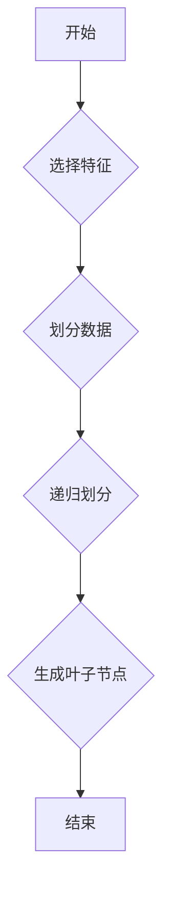

                 

## 洞察力与决策：智慧选择的基础

> 关键词：人工智能、决策树、机器学习、数据分析、洞察力、预测模型、算法

### 1. 背景介绍

在当今数据爆炸的时代，信息过载已成为普遍现象。海量的数字数据蕴藏着宝贵的洞察力，但如何从纷繁的数据中提取有价值的信息，并将其转化为明智的决策，是摆在我们面前的重大挑战。人工智能（AI）作为一种强大的工具，为我们提供了新的视角和方法，帮助我们突破信息壁垒，洞察数据背后的规律，从而做出更精准、更有效的决策。

决策树作为一种经典的机器学习算法，在数据分析和决策支持领域发挥着重要作用。它以树状结构的形式，将数据进行分层分类，并根据特征的组合，预测目标变量的取值。决策树算法易于理解和解释，并且能够处理多种数据类型，因此在各个行业得到了广泛应用，例如金融风险评估、医疗诊断、客户关系管理等。

### 2. 核心概念与联系

决策树算法的核心在于构建一个决策树模型，该模型能够根据输入数据，逐步进行决策，最终预测目标变量的输出结果。决策树的构建过程可以概括为以下几个步骤：

1. **选择特征:** 从所有特征中选择最优的特征作为决策节点。
2. **划分数据:** 根据选择的特征，将数据划分为不同的子集。
3. **递归划分:** 对每个子集重复步骤1和步骤2，直到满足停止条件。
4. **生成叶子节点:** 每个叶子节点代表一个决策结果。

**Mermaid 流程图:**



### 3. 核心算法原理 & 具体操作步骤

#### 3.1 算法原理概述

决策树算法的核心思想是通过一系列的决策规则，将数据逐步分类，最终预测目标变量的取值。决策规则的制定基于特征的属性和数据分布，目标是找到最能区分不同类别数据的特征组合。

常见的决策树算法包括ID3、C4.5和CART等。这些算法都遵循类似的构建决策树的过程，但它们在特征选择、数据划分和停止条件等方面有所不同。

#### 3.2 算法步骤详解

以ID3算法为例，其构建决策树的步骤如下：

1. **选择最优特征:** 使用信息增益或信息增益比等指标，选择最能区分不同类别数据的特征作为根节点。
2. **划分数据:** 根据选择的特征，将数据划分为不同的子集，每个子集包含具有相同特征值的样本。
3. **递归划分:** 对每个子集重复步骤1和步骤2，直到满足停止条件。
4. **生成叶子节点:** 当子集中的样本属于同一类别时，生成一个叶子节点，该节点代表该类别的决策结果。

#### 3.3 算法优缺点

**优点:**

* 易于理解和解释：决策树的结构清晰直观，决策规则易于理解和解释。
* 能够处理多种数据类型：决策树算法可以处理数值型、分类型和混合型数据。
* 训练速度快：决策树算法的训练速度相对较快，适合处理大规模数据。

**缺点:**

* 容易过拟合：决策树容易过拟合训练数据，导致在测试数据上的性能下降。
* 对数据特征的依赖性强：决策树算法的性能受数据特征的选择和处理方式影响较大。
* 对于连续特征的处理不够灵活：决策树算法通常将连续特征离散化，可能会丢失部分信息。

#### 3.4 算法应用领域

决策树算法广泛应用于各个领域，例如：

* **金融风险评估:** 评估贷款申请的风险等级。
* **医疗诊断:** 根据患者的症状和病史，预测疾病的类型。
* **客户关系管理:** 预测客户的购买行为，进行精准营销。
* **图像识别:** 将图像分类到不同的类别。

### 4. 数学模型和公式 & 详细讲解 & 举例说明

#### 4.1 数学模型构建

决策树模型可以看作是一个树状结构，每个节点代表一个特征，每个分支代表一个特征的取值，每个叶子节点代表一个决策结果。

#### 4.2 公式推导过程

决策树算法的核心在于选择最优特征作为决策节点。常用的特征选择指标包括信息增益和信息增益比。

**信息增益:**

$$
Gain(S, a) = Entropy(S) - \sum_{v \in Values(a)} \frac{|S_v|}{|S|} \cdot Entropy(S_v)
$$

其中：

* $S$ 是训练数据集
* $a$ 是特征
* $Values(a)$ 是特征 $a$ 的所有取值
* $S_v$ 是特征 $a$ 取值为 $v$ 的子集
* $Entropy(S)$ 是数据集 $S$ 的熵

**信息增益比:**

$$
GainRatio(S, a) = \frac{Gain(S, a)}{SplitInfo(a)}
$$

其中：

* $SplitInfo(a)$ 是特征 $a$ 的分裂信息

#### 4.3 案例分析与讲解

假设我们有一个数据集，用于预测客户是否会购买某个产品。数据集包含以下特征：年龄、收入、性别、学历。

我们可以使用信息增益或信息增益比来选择最优特征作为根节点。例如，如果信息增益比最高的特征是“收入”，那么决策树的根节点将是“收入”特征，并根据收入的取值将数据划分为不同的子集。

### 5. 项目实践：代码实例和详细解释说明

#### 5.1 开发环境搭建

本项目使用Python语言进行开发，所需的库包括Scikit-learn、NumPy和Pandas等。

#### 5.2 源代码详细实现

```python
from sklearn.tree import DecisionTreeClassifier
from sklearn.model_selection import train_test_split
from sklearn.metrics import accuracy_score

# 加载数据
data = pd.read_csv('data.csv')

# 分割特征和目标变量
X = data.drop('target', axis=1)
y = data['target']

# 将数据划分为训练集和测试集
X_train, X_test, y_train, y_test = train_test_split(X, y, test_size=0.2, random_state=42)

# 创建决策树模型
model = DecisionTreeClassifier()

# 训练模型
model.fit(X_train, y_train)

# 对测试集进行预测
y_pred = model.predict(X_test)

# 计算模型准确率
accuracy = accuracy_score(y_test, y_pred)
print('模型准确率:', accuracy)
```

#### 5.3 代码解读与分析

这段代码首先加载数据，然后将数据分割成特征和目标变量。接着，使用train_test_split函数将数据划分为训练集和测试集。

然后，创建决策树模型，并使用fit函数对模型进行训练。最后，使用predict函数对测试集进行预测，并计算模型的准确率。

#### 5.4 运行结果展示

运行上述代码后，会输出模型的准确率。

### 6. 实际应用场景

决策树算法在各个行业都有广泛的应用场景，例如：

* **金融领域:** 评估贷款风险、预测股票价格、识别欺诈交易等。
* **医疗领域:** 诊断疾病、预测患者的预后、辅助医生进行治疗决策等。
* **电商领域:** 预测客户的购买行为、推荐商品、个性化营销等。

### 6.4 未来应用展望

随着人工智能技术的不断发展，决策树算法的应用场景将会更加广泛。例如：

* **个性化推荐:** 基于用户的历史行为和偏好，提供更精准的商品推荐。
* **自动驾驶:** 帮助车辆识别道路环境、做出决策，实现自动驾驶功能。
* **医疗诊断:** 辅助医生进行更精准的诊断，提高医疗效率。

### 7. 工具和资源推荐

#### 7.1 学习资源推荐

* **书籍:**
    * 《机器学习》 - 周志华
    * 《Python机器学习实战》 - 塞缪尔·阿布拉姆斯
* **在线课程:**
    * Coursera: Machine Learning
    * edX: Artificial Intelligence

#### 7.2 开发工具推荐

* **Scikit-learn:** Python机器学习库，包含决策树算法的实现。
* **TensorFlow:** 开源深度学习框架，可以用于构建更复杂的决策树模型。
* **PyTorch:** 开源深度学习框架，与TensorFlow类似。

#### 7.3 相关论文推荐

* **ID3 Algorithm:** Quinlan, J. R. (1986). Induction of decision trees. Machine learning, 1(1), 81-106.
* **C4.5 Algorithm:** Quinlan, J. R. (1993). C4.5: Programs for machine learning. Morgan Kaufmann.
* **CART Algorithm:** Breiman, L., Friedman, J. H., Olshen, R. A., & Stone, C. J. (1984). Classification and regression trees. Wadsworth & Brooks/Cole.

### 8. 总结：未来发展趋势与挑战

#### 8.1 研究成果总结

决策树算法作为一种经典的机器学习算法，在数据分析和决策支持领域取得了显著的成果。其易于理解、解释和应用的特点使其成为许多领域的首选算法。

#### 8.2 未来发展趋势

未来，决策树算法的发展趋势包括：

* **集成学习:** 将多个决策树模型组合起来，提高模型的精度和鲁棒性。
* **深度学习:** 将决策树与深度学习技术结合，构建更复杂的决策模型。
* **可解释性:** 提高决策树模型的可解释性，帮助用户更好地理解模型的决策过程。

#### 8.3 面临的挑战

决策树算法也面临一些挑战，例如：

* **过拟合:** 决策树容易过拟合训练数据，导致在测试数据上的性能下降。
* **数据依赖性:** 决策树算法的性能受数据特征的选择和处理方式影响较大。
* **连续特征处理:** 决策树算法通常将连续特征离散化，可能会丢失部分信息。

#### 8.4 研究展望

未来，研究者将继续探索新的算法和方法，以解决决策树算法面临的挑战，并将其应用于更广泛的领域。

### 9. 附录：常见问题与解答

**问题1:** 如何避免决策树过拟合？

**解答:** 可以使用正则化技术，例如剪枝，来避免决策树过拟合。

**问题2:** 如何选择最优特征？

**解答:** 可以使用信息增益或信息增益比等指标来选择最优特征。

**问题3:** 决策树算法适用于哪些类型的数据？

**解答:** 决策树算法可以处理数值型、分类型和混合型数据。


作者：禅与计算机程序设计艺术 / Zen and the Art of Computer Programming 
<end_of_turn>

