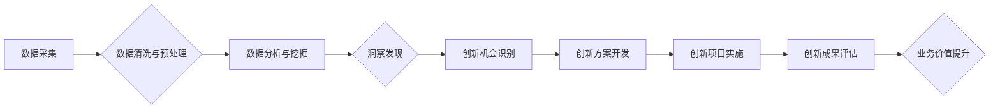

                 

## 洞察力与创新管理：企业竞争力的源泉

> 关键词：洞察力、创新管理、数据分析、人工智能、机器学习、商业模式、竞争力、数字化转型

## 1. 背景介绍

在当今瞬息万变的数字化时代，企业面临着前所未有的挑战和机遇。技术创新日新月异，市场竞争日益激烈，消费者需求不断变化。在这种环境下，企业唯有不断提升自身洞察力和创新能力，才能在激烈的市场竞争中立于不败之地。

传统企业管理模式往往侧重于内部流程优化和资源配置，而忽视了外部环境变化和市场趋势的洞察。随着大数据、人工智能等技术的快速发展，企业拥有了更强大的数据分析和预测能力，可以更深入地了解市场需求、用户行为和竞争对手动态。

洞察力与创新管理成为企业在数字化时代的核心竞争力。洞察力是指企业能够从海量数据中提取有价值的信息，并将其转化为行动决策的能力。创新管理是指企业能够有效地识别、开发和实施新产品、新服务、新商业模式的能力。

## 2. 核心概念与联系

**2.1 洞察力**

洞察力是企业在数据时代的核心驱动力。它源于对数据进行深入分析和解读，并从中发现隐藏的模式、趋势和洞察。

**2.2 创新管理**

创新管理是企业将洞察转化为实际行动的机制。它包括识别创新机会、开发创新解决方案、实施创新项目、评估创新成果等各个环节。

**2.3 联系**

洞察力和创新管理相互依存、相互促进。洞察力为创新管理提供数据支撑，而创新管理则将洞察转化为实际价值。

**Mermaid 流程图**



## 3. 核心算法原理 & 具体操作步骤

**3.1 算法原理概述**

在洞察力与创新管理中，常用的算法包括数据挖掘、机器学习、自然语言处理等。这些算法能够帮助企业从海量数据中提取有价值的信息，并进行预测和分析。

**3.2 算法步骤详解**

**数据挖掘:**

1. 数据收集：从各种数据源收集相关数据。
2. 数据预处理：清洗、转换、整合数据，使其符合算法要求。
3. 数据建模：选择合适的算法模型，进行数据建模。
4. 模型评估：评估模型的性能，并进行调整优化。
5. 结果分析：对挖掘出的结果进行分析和解读，并将其转化为可行动的决策。

**机器学习:**

1. 数据准备：收集、清洗、预处理数据。
2. 模型选择：根据任务类型选择合适的机器学习算法。
3. 模型训练：使用训练数据训练模型，使其能够学习数据中的模式。
4. 模型评估：使用测试数据评估模型的性能。
5. 模型部署：将训练好的模型部署到生产环境中，用于预测和分析。

**自然语言处理:**

1. 文本预处理：对文本进行清洗、分词、词性标注等预处理。
2. 模型训练：使用训练数据训练自然语言处理模型。
3. 模型评估：使用测试数据评估模型的性能。
4. 模型应用：将训练好的模型应用于文本分类、情感分析、机器翻译等任务。

**3.3 算法优缺点**

**数据挖掘:**

* 优点：能够发现隐藏的模式和趋势，提供数据驱动的洞察。
* 缺点：需要大量的历史数据，对数据质量要求高，结果解释性较弱。

**机器学习:**

* 优点：能够自动学习数据中的模式，提高预测准确率，适应不断变化的数据环境。
* 缺点：需要大量的训练数据，模型训练时间长，对算法选择和参数调优要求高。

**自然语言处理:**

* 优点：能够理解和处理人类语言，应用于文本分析、对话系统等领域。
* 缺点：处理复杂语言结构和语义理解能力有限，需要不断改进算法和模型。

**3.4 算法应用领域**

* **市场营销:** 预测客户行为、个性化推荐、精准营销。
* **产品开发:** 识别用户需求、优化产品设计、开发新产品。
* **运营管理:** 优化资源配置、提高运营效率、降低成本。
* **风险管理:** 识别潜在风险、预测风险发生概率、制定风险应对策略。

## 4. 数学模型和公式 & 详细讲解 & 举例说明

**4.1 数学模型构建**

在洞察力与创新管理中，可以使用数学模型来描述和分析各种现象。例如，可以使用回归模型来预测销售额，可以使用分类模型来识别客户类型，可以使用聚类模型来发现用户群组。

**4.2 公式推导过程**

具体的数学模型和公式推导过程取决于具体的应用场景。例如，线性回归模型的公式如下：

$$y = mx + c$$

其中，y是预测值，x是输入变量，m是斜率，c是截距。

**4.3 案例分析与讲解**

假设一家电商公司想要预测用户的购买行为。可以使用线性回归模型来预测用户的购买金额，输入变量可以是用户的浏览历史、购买历史、年龄、性别等信息。

通过训练模型，可以得到用户的购买金额与输入变量之间的关系，并预测新用户的购买金额。

## 5. 项目实践：代码实例和详细解释说明

**5.1 开发环境搭建**

可以使用Python语言和相关的库来实现洞察力与创新管理的项目。例如，可以使用Pandas库进行数据处理，可以使用Scikit-learn库进行机器学习，可以使用NLTK库进行自然语言处理。

**5.2 源代码详细实现**

```python
import pandas as pd
from sklearn.linear_model import LinearRegression

# 数据加载
data = pd.read_csv('user_data.csv')

# 特征选择
features = ['浏览历史', '购买历史', '年龄', '性别']
target = '购买金额'

# 数据分割
X = data[features]
y = data[target]

# 模型训练
model = LinearRegression()
model.fit(X, y)

# 模型预测
new_user_data = pd.DataFrame({
    '浏览历史': [10, 5],
    '购买历史': [2, 1],
    '年龄': [25, 30],
    '性别': ['男', '女']
})
predicted_amount = model.predict(new_user_data)

# 结果展示
print(predicted_amount)
```

**5.3 代码解读与分析**

这段代码首先加载用户数据，然后选择特征变量和目标变量。接着，使用线性回归模型训练模型，并使用训练好的模型预测新用户的购买金额。

**5.4 运行结果展示**

运行代码后，会输出新用户的预测购买金额。

## 6. 实际应用场景

**6.1 市场营销**

* **客户画像:** 利用数据挖掘和机器学习，分析客户的购买行为、浏览习惯、兴趣爱好等，构建客户画像，进行精准营销。
* **个性化推荐:** 根据用户的历史购买记录和浏览记录，推荐个性化的产品和服务，提高用户体验和转化率。
* **广告投放:** 利用数据分析，预测广告的点击率和转化率，优化广告投放策略，提高广告效果。

**6.2 产品开发**

* **需求分析:** 利用自然语言处理技术，分析用户对产品的评论和反馈，挖掘用户需求，为产品开发提供数据支持。
* **产品优化:** 利用数据分析，了解用户使用产品的行为模式，发现产品使用中的痛点，进行产品优化。
* **新产品开发:** 利用数据分析，预测市场趋势和用户需求，为新产品开发提供方向和灵感。

**6.3 运营管理**

* **资源优化:** 利用数据分析，了解资源的利用情况，优化资源配置，提高资源利用率。
* **流程改进:** 利用数据分析，发现运营流程中的瓶颈和问题，提出改进方案，提高运营效率。
* **成本控制:** 利用数据分析，识别成本控制的重点，制定成本控制措施，降低运营成本。

**6.4 未来应用展望**

随着人工智能、大数据等技术的不断发展，洞察力与创新管理将发挥更加重要的作用。未来，企业将更加注重数据驱动决策，利用人工智能技术进行智能分析和预测，实现更加精准的洞察和创新。

## 7. 工具和资源推荐

**7.1 学习资源推荐**

* **书籍:**
    * 《数据挖掘：概念与技术》
    * 《机器学习》
    * 《自然语言处理》
* **在线课程:**
    * Coursera
    * edX
    * Udemy

**7.2 开发工具推荐**

* **Python:** 
    * Pandas
    * Scikit-learn
    * NLTK
* **R:** 
    * Tidyverse
    * caret
* **云平台:**
    * AWS
    * Azure
    * Google Cloud

**7.3 相关论文推荐**

* **数据挖掘:**
    * 《数据挖掘：概念与技术》
* **机器学习:**
    * 《机器学习》
* **自然语言处理:**
    * 《自然语言处理》

## 8. 总结：未来发展趋势与挑战

**8.1 研究成果总结**

洞察力与创新管理的研究取得了显著成果，为企业提供了更加有效的决策支持和创新驱动机制。

**8.2 未来发展趋势**

* **人工智能技术的融合:** 将人工智能技术与洞察力与创新管理相结合，实现更加智能的分析和预测。
* **数据可视化的提升:** 开发更加直观、易懂的数据可视化工具，帮助企业更好地理解数据洞察。
* **跨领域协同创新:** 促进不同领域之间的协同创新，挖掘跨领域的新兴机会。

**8.3 面临的挑战**

* **数据质量问题:** 数据质量问题是洞察力与创新管理面临的重大挑战。
* **算法解释性问题:** 一些机器学习算法的解释性较弱，难以理解模型的决策过程。
* **人才短缺问题:** 洞察力与创新管理需要具备数据分析、机器学习、自然语言处理等方面的专业人才。

**8.4 研究展望**

未来，洞察力与创新管理的研究将更加注重人工智能技术的融合、数据可视化的提升、跨领域协同创新，并积极应对数据质量问题、算法解释性问题、人才短缺问题等挑战。


## 9. 附录：常见问题与解答

**9.1 如何提高数据质量？**

* 数据清洗：去除数据中的重复、缺失、错误等信息。
* 数据标准化：将数据转换为统一的格式和单位。
* 数据验证：对数据进行验证，确保数据的准确性和一致性。

**9.2 如何解释机器学习模型的决策过程？**

* 使用可解释性机器学习算法，例如线性回归、决策树等。
* 使用特征重要性分析，识别模型中最重要的特征。
* 使用模型可视化工具，直观地展示模型的决策过程。

**9.3 如何培养洞察力与创新管理人才？**

* 提供数据分析、机器学习、自然语言处理等方面的培训课程。
* 鼓励员工参与数据分析项目，积累实践经验。
* 建立数据驱动文化，鼓励员工以数据为基础进行决策。


作者：禅与计算机程序设计艺术 / Zen and the Art of Computer Programming 
<end_of_turn>

