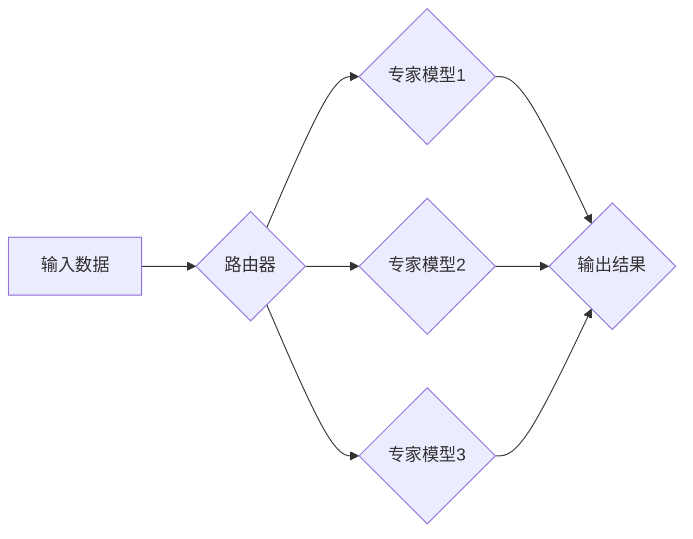

                 

## 混合专家模型（MoE）：提高大语言模型效率的新方向

> 关键词：混合专家模型，MoE，大语言模型，效率，参数量，计算资源，模型压缩，可扩展性

### 1. 背景介绍

近年来，大语言模型（LLM）在自然语言处理领域取得了显著的进展，例如GPT-3、BERT、LaMDA等模型展现出强大的文本生成、理解和翻译能力。然而，这些模型通常拥有数十亿甚至数千亿的参数，这导致训练和部署成本极高，对计算资源要求也十分苛刻。如何提高LLM的效率，使其更易于部署和应用，成为了一个重要的研究方向。

混合专家模型（MoE）应运而生，它提供了一种新的思路，通过将大型模型拆分成多个小型专家模型，并根据输入任务动态地选择合适的专家进行推理，从而在保证模型性能的同时，显著降低计算成本。

### 2. 核心概念与联系

MoE的核心概念是将一个大型模型拆分成多个小型专家模型，每个专家模型专注于处理特定类型的任务或知识领域。这些专家模型在训练过程中共享相同的参数，但只在需要时被激活。

**MoE 架构流程图**



**MoE 的工作原理：**

1. **路由器:**  根据输入数据，路由器会选择最合适的专家模型进行推理。路由器可以是基于输入特征的静态路由，也可以是基于动态学习的策略。
2. **专家模型:**  每个专家模型都训练在一个特定的任务或知识领域，拥有相对较小的参数量。
3. **融合:**  多个专家模型的输出结果会被融合在一起，最终生成最终的输出结果。融合方法可以是简单的平均，也可以是更复杂的注意力机制。

### 3. 核心算法原理 & 具体操作步骤

#### 3.1 算法原理概述

MoE 的核心算法原理是将大型模型拆分成多个小型专家模型，并通过路由机制动态地选择合适的专家进行推理。这种方法可以有效地降低模型的计算成本，同时保持模型的性能。

#### 3.2 算法步骤详解

1. **模型拆分:** 将大型模型拆分成多个小型专家模型，每个专家模型专注于处理特定类型的任务或知识领域。
2. **专家模型训练:**  每个专家模型分别训练，共享相同的参数，但只在需要时被激活。
3. **路由器设计:** 设计一个路由器，根据输入数据选择最合适的专家模型进行推理。
4. **输出融合:**  多个专家模型的输出结果会被融合在一起，最终生成最终的输出结果。

#### 3.3 算法优缺点

**优点:**

* **效率提升:**  MoE 可以显著降低模型的计算成本，因为只有在需要时才会激活专家模型。
* **可扩展性:**  MoE 可以轻松地扩展到更大的模型规模，因为只需要增加新的专家模型即可。
* **参数量压缩:**  MoE 可以有效地压缩模型参数量，降低存储和传输成本。

**缺点:**

* **路由策略设计:**  路由策略的设计对模型性能至关重要，需要进行大量的实验和调优。
* **融合机制:**  融合机制的选择也会影响模型性能，需要进行仔细的评估和选择。
* **训练复杂度:**  MoE 的训练过程比传统的单模型训练更加复杂，需要考虑多个专家模型的训练和融合。

#### 3.4 算法应用领域

MoE 在以下领域具有广泛的应用前景：

* **自然语言处理:**  文本生成、翻译、问答、对话系统等。
* **计算机视觉:**  图像分类、目标检测、图像生成等。
* **语音识别:**  语音转文本、语音合成等。
* **推荐系统:**  个性化推荐、内容过滤等。

### 4. 数学模型和公式 & 详细讲解 & 举例说明

#### 4.1 数学模型构建

MoE 可以用一个混合专家网络来表示，其中每个专家模型是一个独立的子网络，它们共享相同的参数。

假设我们有 $K$ 个专家模型，每个专家模型的参数为 $\theta_k$，输入数据为 $x$，输出为 $y_k$。

#### 4.2 公式推导过程

MoE 的输出可以表示为：

$$
y = \sum_{k=1}^{K} \alpha_k y_k
$$

其中，$\alpha_k$ 是专家模型 $k$ 的权重，表示该专家模型在输出结果中所占的比例。

路由器根据输入数据 $x$ 计算出每个专家模型的权重 $\alpha_k$。

#### 4.3 案例分析与讲解

例如，在文本分类任务中，我们可以将一个大型语言模型拆分成多个专家模型，每个专家模型专注于分类不同的文本类型，例如新闻、博客、评论等。

路由器可以根据输入文本的主题或关键词，选择最合适的专家模型进行分类。

### 5. 项目实践：代码实例和详细解释说明

#### 5.1 开发环境搭建

MoE 的开发环境搭建需要以下软件：

* Python 3.x
* PyTorch 或 TensorFlow
* CUDA 和 cuDNN (如果使用 GPU)

#### 5.2 源代码详细实现

以下是一个简单的 MoE 代码示例，使用 PyTorch 实现：

```python
import torch
import torch.nn as nn

class Expert(nn.Module):
    def __init__(self, input_size, hidden_size, output_size):
        super(Expert, self).__init__()
        self.linear1 = nn.Linear(input_size, hidden_size)
        self.linear2 = nn.Linear(hidden_size, output_size)

    def forward(self, x):
        x = torch.relu(self.linear1(x))
        x = self.linear2(x)
        return x

class Router(nn.Module):
    def __init__(self, input_size, num_experts):
        super(Router, self).__init__()
        self.linear = nn.Linear(input_size, num_experts)

    def forward(self, x):
        x = self.linear(x)
        x = torch.softmax(x, dim=1)
        return x

class MoE(nn.Module):
    def __init__(self, input_size, hidden_size, output_size, num_experts):
        super(MoE, self).__init__()
        self.experts = nn.ModuleList([Expert(input_size, hidden_size, output_size) for _ in range(num_experts)])
        self.router = Router(input_size, num_experts)

    def forward(self, x):
        # 获取每个专家的输出
        outputs = [expert(x) for expert in self.experts]
        # 获取路由器输出的权重
        weights = self.router(x)
        # 融合专家输出
        output = torch.sum(weights.unsqueeze(1) * torch.stack(outputs), dim=1)
        return output
```

#### 5.3 代码解读与分析

* `Expert` 类定义了每个专家模型的结构，包含两个全连接层。
* `Router` 类定义了路由器，根据输入数据计算出每个专家模型的权重。
* `MoE` 类定义了混合专家模型的整体结构，包含多个专家模型和一个路由器。
* `forward` 方法定义了模型的推理过程，首先获取每个专家的输出，然后根据路由器输出的权重融合专家输出。

#### 5.4 运行结果展示

运行上述代码，可以训练一个简单的 MoE 模型，并进行文本分类任务的评估。

### 6. 实际应用场景

MoE 在实际应用场景中具有广泛的应用前景，例如：

* **个性化推荐:**  根据用户的历史行为和偏好，选择合适的专家模型进行推荐。
* **智能客服:**  根据用户的咨询内容，选择合适的专家模型进行回复。
* **医疗诊断:**  根据患者的症状和病史，选择合适的专家模型进行诊断。

#### 6.4 未来应用展望

随着计算资源的不断发展，MoE 的应用场景将会更加广泛，例如：

* **多模态理解:**  将文本、图像、音频等多种模态数据融合在一起，构建更强大的多模态模型。
* **边缘计算:**  将 MoE 部署到边缘设备上，实现更低延迟和更高效率的推理。
* **可解释性增强:**  通过分析专家模型的输出，提高模型的可解释性。

### 7. 工具和资源推荐

#### 7.1 学习资源推荐

* **论文:**  
    * "Mixture of Experts" by  Jacobs et al. (1991)
    * "Efficient Mixture of Experts" by  Shazeer et al. (2019)
    * "Scaling Mixture-of-Experts Language Models" by  Kaplan et al. (2020)
* **博客:**  
    * https://towardsdatascience.com/mixture-of-experts-for-efficient-large-language-models-a-comprehensive-guide-94976690623c
    * https://blog.openai.com/scaling-language-models/

#### 7.2 开发工具推荐

* **PyTorch:**  https://pytorch.org/
* **TensorFlow:**  https://www.tensorflow.org/

#### 7.3 相关论文推荐

* **MoE 相关论文:**  
    * https://arxiv.org/abs/1901.03864
    * https://arxiv.org/abs/2006.08848
    * https://arxiv.org/abs/2103.03791

### 8. 总结：未来发展趋势与挑战

#### 8.1 研究成果总结

MoE 是一种高效的模型压缩技术，可以有效地降低大型模型的计算成本，同时保持模型性能。MoE 在自然语言处理、计算机视觉等领域具有广泛的应用前景。

#### 8.2 未来发展趋势

MoE 的未来发展趋势包括：

* **更有效的路由策略:**  设计更有效的路由策略，能够更准确地选择合适的专家模型。
* **动态专家模型选择:**  根据输入数据动态地选择专家模型，提高模型的适应性。
* **混合专家模型的并行化:**  利用并行计算技术，提高混合专家模型的训练和推理效率。

#### 8.3 面临的挑战

MoE 还面临一些挑战，例如：

* **路由策略的设计和优化:**  路由策略的设计对模型性能至关重要，需要大量的实验和调优。
* **专家模型的训练和融合:**  训练和融合多个专家模型是一个复杂的过程，需要考虑模型的规模和复杂度。
* **可解释性和可控性:**  混合专家模型的决策过程相对复杂，需要提高模型的可解释性和可控性。

#### 8.4 研究展望

未来，MoE 将继续是一个重要的研究方向，随着计算资源的不断发展和算法的不断改进，MoE 将在更多领域得到应用，并推动人工智能技术的发展。

### 9. 附录：常见问题与解答

**Q1: MoE 与传统的单模型相比，有什么优势？**

**A1:** MoE 可以有效地降低模型的计算成本，同时保持模型性能。

**Q2: MoE 的路由策略如何设计？**

**A2:** 路由策略的设计需要根据具体的应用场景和模型结构进行设计，常用的方法包括基于输入特征的静态路由和基于动态学习的策略。

**Q3: MoE 的训练过程复杂吗？**

**A3:** 训练 MoE 模型比传统的单模型训练更加复杂，需要考虑多个专家模型的训练和融合。

**作者：禅与计算机程序设计艺术 / Zen and the Art of Computer Programming**


<end_of_turn>

