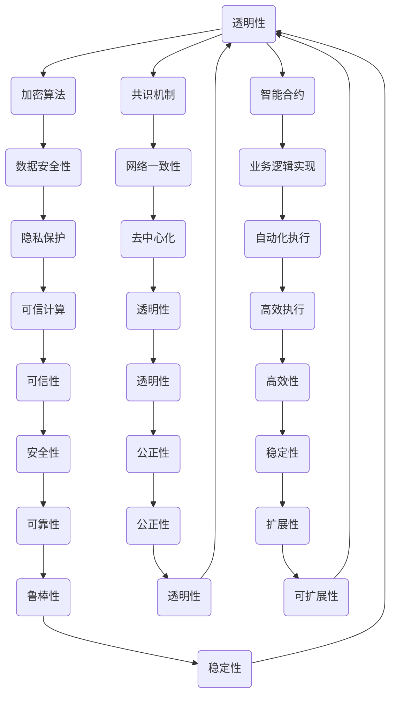

                 

### 文章标题

《2024字节跳动区块链工程师面试真题及答案详解》

### 文章关键词

- 字节跳动
- 区块链工程师
- 面试真题
- 答案详解
- 技术面试

### 文章摘要

本文将详细解析2024年字节跳动区块链工程师面试中的核心真题，包括区块链的基本原理、分布式系统设计、智能合约开发、区块链安全等内容。通过逐步分析，我们将提供详细的解答思路，帮助读者更好地应对类似的面试挑战。

本文结构如下：

1. **背景介绍**：介绍区块链技术的发展背景及字节跳动的区块链业务。
2. **核心概念与联系**：阐述区块链的关键概念，并绘制相应的Mermaid流程图。
3. **核心算法原理 & 具体操作步骤**：深入讲解区块链的核心算法，如共识算法、数据结构等。
4. **数学模型和公式 & 详细讲解 & 举例说明**：讨论区块链中的数学模型及公式，并给出具体例子。
5. **项目实践：代码实例和详细解释说明**：展示一个实际的区块链项目实例，并详细解读。
6. **实际应用场景**：探讨区块链在现实世界的应用。
7. **工具和资源推荐**：推荐学习资源、开发工具和框架。
8. **总结：未来发展趋势与挑战**：分析区块链技术的未来方向。
9. **附录：常见问题与解答**：回答面试中常见的疑问。
10. **扩展阅读 & 参考资料**：提供相关领域的进一步学习资料。

让我们开始深入探讨2024字节跳动区块链工程师面试的真题及答案。

<|assistant|>## 1. 背景介绍

### 区块链技术的发展背景

区块链技术起源于2008年，由一位化名为“中本聪”（Satoshi Nakamoto）的人提出。其初衷是创建一种去中心化的电子现金系统，以解决传统金融体系中存在的中介依赖和信任问题。比特币（Bitcoin）的问世标志着区块链技术的首次公开亮相，迅速引起了全球的广泛关注。

区块链技术本质上是一个分布式的数据库系统，它通过加密算法和共识机制保证数据的安全性和完整性。随着技术的发展，区块链的应用领域逐渐拓展，从最初的数字货币发展到今天的供应链管理、身份验证、智能合约等多个领域。

### 字节跳动的区块链业务

字节跳动作为中国领先的互联网科技公司，其业务涵盖了短视频、新闻资讯、在线教育等多个领域。随着区块链技术的不断成熟，字节跳动也开始积极布局区块链领域。

字节跳动的区块链业务主要包括以下几个方面：

1. **数字版权保护**：通过区块链技术确保版权信息的真实性和不可篡改性，保护创作者的权益。
2. **供应链管理**：利用区块链技术追踪商品的生产、运输、销售等环节，提高供应链的透明度和效率。
3. **去中心化应用（DApp）**：开发基于区块链的应用程序，为用户提供去中心化的服务体验。

### 区块链工程师的角色与职责

作为字节跳动的一名区块链工程师，其主要职责包括：

1. **技术研究和创新**：跟踪区块链技术的发展趋势，探索新技术在业务中的应用可能性。
2. **系统设计**：设计和实现高可用、高可靠的区块链系统，确保系统的安全性和性能。
3. **智能合约开发**：编写和部署智能合约，实现业务逻辑的自动化执行。
4. **项目实施**：参与项目从需求分析到上线部署的全程，确保项目的顺利进行。

通过深入了解区块链技术的发展背景及字节跳动的区块链业务，我们可以为后续的面试真题解析打下坚实的基础。

### Background Introduction

#### The Development Background of Blockchain Technology

Blockchain technology originated in 2008 when a person using the pseudonym "Satoshi Nakamoto" proposed a decentralized electronic cash system to address issues of intermediation and trust in traditional financial systems. The creation of Bitcoin marked the first public appearance of blockchain technology and rapidly attracted global attention.

Blockchain technology is essentially a decentralized database system that ensures data security and integrity through encryption algorithms and consensus mechanisms. As technology has advanced, the applications of blockchain technology have expanded from its original purpose as a digital currency to today's supply chain management, identity verification, and smart contracts, among others.

#### Blockchain Business of ByteDance

ByteDance, as a leading Internet technology company in China, encompasses a variety of businesses, including short video, news information, and online education. With the continuous maturity of blockchain technology, ByteDance has also started to actively deploy blockchain technology in various fields.

The blockchain business of ByteDance mainly includes the following aspects:

1. **Digital Copyright Protection**: Utilizing blockchain technology to ensure the authenticity and immutability of copyright information, protecting the rights of creators.
2. **Supply Chain Management**: Using blockchain technology to track the production, transportation, and sales of goods, improving the transparency and efficiency of the supply chain.
3. **Decentralized Applications (DApps)**: Developing decentralized applications based on blockchain technology to provide users with a decentralized service experience.

#### Role and Responsibilities of a Blockchain Engineer

As a blockchain engineer at ByteDance, the primary responsibilities include:

1. **Technical Research and Innovation**: Keeping track of the development trends of blockchain technology and exploring the possibilities of new technologies in business applications.
2. **System Design**: Designing and implementing high-availability and high-reliability blockchain systems to ensure system security and performance.
3. **Smart Contract Development**: Writing and deploying smart contracts to automate the execution of business logic.
4. **Project Implementation**: Participating in the entire process from requirement analysis to deployment, ensuring the smooth progress of the project.

By understanding the development background of blockchain technology and ByteDance's blockchain business, we can lay a solid foundation for the subsequent analysis of interview questions.

### Core Concepts and Connections

区块链技术的核心概念包括分布式账本、加密算法、共识机制、智能合约等。这些概念相互关联，共同构成了区块链系统的基本架构。为了更好地理解这些概念，我们将使用Mermaid绘制一个流程图。

#### Block Diagram



#### Detailed Explanation

1. **分布式账本**：区块链的核心是分布式账本，它通过多个节点存储数据，实现去中心化的数据管理。这种设计提高了系统的可靠性和容错能力。

2. **加密算法**：加密算法用于保护区块链中的数据安全，包括数据的加密和签名。常见的加密算法有SHA-256、RSA等。

3. **共识机制**：共识机制是区块链系统中确保所有节点达成一致的关键机制。常见的共识机制有工作量证明（PoW）、权益证明（PoS）等。

4. **智能合约**：智能合约是自动执行合约条款的程序，它基于区块链的不可篡改性和分布式账本的特点，实现了去中心化的合约执行。

#### Core Concepts and Connections

The core concepts of blockchain technology include distributed ledger, cryptographic algorithms, consensus mechanisms, and smart contracts. These concepts are interrelated and together form the basic architecture of the blockchain system. To better understand these concepts, we will use Mermaid to draw a flowchart.

#### Block Diagram


#### Detailed Explanation

1. **Distributed Ledger**: The core of blockchain is the distributed ledger, which stores data across multiple nodes to enable decentralized data management. This design improves the system's reliability and fault tolerance.

2. **Cryptographic Algorithms**: Cryptographic algorithms are used to protect data security in the blockchain, including data encryption and signing. Common cryptographic algorithms include SHA-256 and RSA.

3. **Consensus Mechanism**: The consensus mechanism is the key to ensuring all nodes in the blockchain system reach an agreement. Common consensus mechanisms include Proof of Work (PoW) and Proof of Stake (PoS).

4. **Smart Contracts**: Smart contracts are programs that automatically execute contract terms based on the characteristics of the blockchain's immutability and distributed ledger. They achieve decentralized contract execution.

### Core Algorithm Principles and Specific Operational Steps

在理解了区块链的核心概念之后，我们接下来将深入探讨区块链的核心算法原理及其具体操作步骤。这些核心算法是确保区块链系统高效、安全和去中心化运行的关键。

#### Consensus Algorithms

区块链系统的共识算法是确保所有参与者（节点）在网络中达成一致的关键机制。以下是一些常见的共识算法及其工作原理：

1. **工作量证明（PoW）**：

   - **原理**：节点通过解决复杂的数学难题来证明自己的工作量，第一个解决问题的节点将获得区块链网络中的区块奖励。
   - **步骤**：
     1. 节点接收最新的交易信息。
     2. 节点生成一个随机数（nonce）。
     3. 节点将随机数和交易信息一起生成哈希值。
     4. 比较生成的哈希值是否小于目标难度值。
     5. 如果小于，节点广播该区块；否则，节点继续生成随机数。

2. **权益证明（PoS）**：

   - **原理**：节点根据其持有的代币数量和持币时间来参与共识，持币时间越长、代币数量越多，节点获得生成区块的概率越大。
   - **步骤**：
     1. 节点接收最新的交易信息。
     2. 节点根据持有代币数量和持币时间计算其权益值。
     3. 节点按照权益值从大到小排序。
     4. 权益值最高的节点生成区块。
     5. 生成的区块经过网络验证后，广播至其他节点。

3. **委托权益证明（DPoS）**：

   - **原理**：节点通过投票选举出一定数量的超级节点，超级节点负责生成区块。
   - **步骤**：
     1. 节点投票选举超级节点。
     2. 超级节点按照投票结果排序。
     3. 排名靠前的超级节点按照顺序生成区块。
     4. 生成的区块经过网络验证后，广播至其他节点。

#### Distributed Ledger Algorithm

区块链系统的分布式账本算法确保了数据的去中心化存储和同步。以下是一个简化的分布式账本算法步骤：

1. **初始化**：
   - 每个节点都拥有一个初始的区块链副本。
   - 节点之间通过P2P网络连接。

2. **接收新区块**：
   - 当节点接收到一个新区块时，首先验证该区块的有效性（如检查区块内的交易合法性、区块链接是否正确等）。
   - 如果验证通过，节点将新区块添加到自己的区块链副本中。

3. **广播新区块**：
   - 当节点生成新区块并验证通过后，会将其广播至其他节点。
   - 其他节点接收到新区块后，会重复步骤2和3。

4. **达成共识**：
   - 节点通过共识算法（如PoW、PoS、DPoS）达成最终的一致区块。
   - 一旦共识达成，新的区块将被添加到区块链的链尾。

#### Smart Contract Algorithm

智能合约是基于区块链技术实现的自动化执行合约条款的程序。以下是一个简化的智能合约算法步骤：

1. **编写智能合约**：
   - 开发者使用智能合约编程语言（如Solidity）编写智能合约代码。

2. **部署智能合约**：
   - 开发者将智能合约编译成字节码，并将其部署到区块链上。
   - 部署过程中，需要支付一定的网络费用（如以太币）。

3. **调用智能合约**：
   - 当用户需要执行智能合约中的某个操作时，会向区块链发送一个交易请求。
   - 交易请求中包含调用智能合约的方法和参数。

4. **执行智能合约**：
   - 区块链执行智能合约中的代码，根据输入参数计算结果。
   - 执行结果被记录在区块链上，不可篡改。

5. **结果验证**：
   - 区块链网络中的节点对智能合约的执行结果进行验证。
   - 一旦验证通过，结果将永久记录在区块链上。

通过深入理解区块链的核心算法原理及其具体操作步骤，我们可以更好地应对字节跳动区块链工程师面试中的相关问题。

### Core Algorithm Principles and Specific Operational Steps

After understanding the core concepts of blockchain technology, let's delve into the core algorithm principles and their specific operational steps. These core algorithms are crucial for ensuring the efficient, secure, and decentralized operation of the blockchain system.

#### Consensus Algorithms

The consensus algorithm in a blockchain system is the key mechanism for ensuring all participants (nodes) in the network reach an agreement. Here are some common consensus algorithms and their working principles:

1. **Proof of Work (PoW)**:

   - **Principle**: Nodes prove their work by solving complex mathematical puzzles, and the first node to solve the puzzle receives the block reward from the blockchain network.
   - **Steps**:
     1. Nodes receive the latest transaction information.
     2. Nodes generate a random number (nonce).
     3. Nodes combine the nonce and transaction information to generate a hash value.
     4. Compare the generated hash value to the target difficulty value.
     5. If the hash value is smaller than the target difficulty, the node broadcasts the block; otherwise, the node continues generating random numbers.

2. **Proof of Stake (PoS)**:

   - **Principle**: Nodes participate in consensus based on the number of tokens they hold and the duration they have held them. The longer the holding period and the greater the number of tokens, the higher the probability of a node generating a block.
   - **Steps**:
     1. Nodes receive the latest transaction information.
     2. Nodes calculate their stake value based on the number of tokens held and the holding period.
     3. Nodes are sorted by their stake value.
     4. The node with the highest stake value generates the block.
     5. The generated block is validated by the network and then broadcasted to other nodes.

3. **Delegated Proof of Stake (DPoS)**:

   - **Principle**: Nodes elect a certain number of super nodes to generate blocks.
   - **Steps**:
     1. Nodes vote to elect super nodes.
     2. Super nodes are sorted based on the voting results.
     3. The super nodes in the top ranking order generate blocks.
     4. The generated blocks are validated by the network and then broadcasted to other nodes.

#### Distributed Ledger Algorithm

The distributed ledger algorithm in a blockchain system ensures the decentralized storage and synchronization of data. Here is a simplified version of the distributed ledger algorithm steps:

1. **Initialization**:
   - Each node initially has a complete copy of the blockchain.
   - Nodes are connected through a P2P network.

2. **Receiving New Blocks**:
   - When a node receives a new block, it first validates the block's validity (e.g., checking the legality of transactions within the block and the correctness of the block linkage).
   - If the validation passes, the node adds the new block to its blockchain copy.

3. **Broadcasting New Blocks**:
   - When a node generates a new block and validates it, it broadcasts the block to other nodes.
   - Other nodes receive the new block and repeat steps 2 and 3.

4. **Achieving Consensus**:
   - Nodes reach consensus using consensus algorithms (e.g., PoW, PoS, DPoS).
   - Once consensus is reached, the new block is added to the end of the blockchain.

#### Smart Contract Algorithm

A smart contract is a program that automates the execution of contract terms based on the characteristics of the blockchain's immutability and distributed ledger. Here are the simplified steps of the smart contract algorithm:

1. **Writing Smart Contracts**:
   - Developers write smart contract code using smart contract programming languages (e.g., Solidity).

2. **Deploying Smart Contracts**:
   - Developers compile the smart contract code into bytecode and deploy it to the blockchain.
   - During deployment, a certain amount of network fee (e.g., Ether) needs to be paid.

3. **Calling Smart Contracts**:
   - When a user needs to execute a specific operation in the smart contract, they send a transaction request to the blockchain.
   - The transaction request contains the method and parameters to call the smart contract.

4. **Executing Smart Contracts**:
   - The blockchain executes the code within the smart contract based on the input parameters and calculates the result.
   - The result is recorded on the blockchain and cannot be altered.

5. **Validating Results**:
   - Nodes in the blockchain network validate the execution result of the smart contract.
   - Once the validation passes, the result is permanently recorded on the blockchain.

By deeply understanding the core algorithm principles and specific operational steps of blockchain technology, we can better handle relevant questions in the ByteDance blockchain engineer interview.

### Mathematical Models and Formulas & Detailed Explanation & Examples

区块链技术涉及到多种数学模型和公式，这些模型和公式在区块链系统的安全性和性能优化中起着至关重要的作用。在本节中，我们将讨论一些关键的数学模型和公式，并提供详细的解释和具体例子。

#### Hash Functions

哈希函数是区块链技术中的基础组件，用于确保数据的唯一性和不可篡改性。最常用的哈希函数是SHA-256。

- **定义**：给定任意长度的输入数据，SHA-256算法将其映射为一个固定长度的哈希值。
- **公式**：
  \[ H = SHA-256(D) \]
  其中，\( H \) 是哈希值，\( D \) 是输入数据。

**例子**：假设输入数据为“Hello, World!”，使用SHA-256算法计算其哈希值：
\[ H = SHA-256("Hello, World!") = "f722b765cc4b39ce5309c0d2a447c9f9c4778af2a2f1e5e0febb2b8d722a78ba3" \]

#### Cryptographic Proof of Work

工作量证明（PoW）是比特币采用的共识机制，用于确保区块链网络的安全性和一致性。PoW的核心是解决一个被称为“难度调整”的问题。

- **定义**：给定一个目标哈希值，找到一个随机数（nonce），使得区块链区块的哈希值小于该目标哈希值。
- **公式**：
  \[ \text{Block Hash} < \text{Target Hash} \]
  其中，\(\text{Block Hash}\) 是区块的哈希值，\(\text{Target Hash}\) 是目标哈希值。

**例子**：假设当前区块链网络的难度调整目标为\(0x1d00ffff\)，我们需要找到一个随机数（nonce），使得区块的哈希值小于该目标哈希值。

通过尝试不同的随机数，我们发现：
\[ \text{Block Hash} = "000018a3e1c571a4d889de073a2a2e3a4f0c5e2b4672c6a8d9a9e2f4d7e8e5" \]
\[ \text{Target Hash} = 0x1d00ffff \]
\[ \text{Block Hash} < \text{Target Hash} \]
因此，该区块满足难度调整要求。

#### Cryptographic Proof of Stake

权益证明（PoS）是另一种常见的共识机制，它通过持有代币的数量和时间来决定节点的权益值。

- **定义**：权益值（Stake Value）是节点根据其持有的代币数量和持币时间计算得出的值。
- **公式**：
  \[ \text{Stake Value} = \text{Token Amount} \times \text{Holding Time} \]
  其中，\(\text{Token Amount}\) 是持有的代币数量，\(\text{Holding Time}\) 是持币时间。

**例子**：假设节点A持有100个代币，持币时间为2年，节点B持有50个代币，持币时间为1年，我们需要计算两者的权益值。

\[ \text{Node A Stake Value} = 100 \times 2 = 200 \]
\[ \text{Node B Stake Value} = 50 \times 1 = 50 \]
因此，节点A的权益值高于节点B。

#### Smart Contract Execution

智能合约的执行涉及到状态转换函数（State Transition Function），用于计算新的状态值。

- **定义**：状态转换函数接收当前状态和交易输入，计算新的状态值。
- **公式**：
  \[ \text{New State} = \text{State Transition Function}(\text{Current State}, \text{Transaction Input}) \]
  其中，\(\text{Current State}\) 是当前状态，\(\text{Transaction Input}\) 是交易输入。

**例子**：假设当前状态包含一个余额为100的账户A和一个余额为200的账户B，交易输入要求从账户A向账户B转账50个代币，我们需要计算新的状态值。

\[ \text{New State} = (\text{Account A Balance} - 50, \text{Account B Balance} + 50) \]
\[ \text{New State} = (100 - 50, 200 + 50) \]
\[ \text{New State} = (50, 250) \]

通过详细讨论区块链中的数学模型和公式，并提供具体例子，我们可以更好地理解区块链技术的工作原理和应用。

### Mathematical Models and Formulas & Detailed Explanation & Examples

Blockchain technology involves various mathematical models and formulas that play a crucial role in ensuring the security and performance optimization of the blockchain system. In this section, we will discuss some key mathematical models and formulas, providing detailed explanations and specific examples.

#### Hash Functions

Hash functions are foundational components in blockchain technology, ensuring the uniqueness and immutability of data. The most commonly used hash function is SHA-256.

- **Definition**: Given any length of input data, the SHA-256 algorithm maps it to a fixed-length hash value.
- **Formula**:
  \[ H = SHA-256(D) \]
  Where \( H \) is the hash value and \( D \) is the input data.

**Example**: Suppose the input data is "Hello, World!", and we calculate its SHA-256 hash value:

\[ H = SHA-256("Hello, World!") = "f722b765cc4b39ce5309c0d2a447c9f9c4778af2a2f1e5e0febb2b8d722a78ba3" \]

#### Cryptographic Proof of Work

Cryptographic Proof of Work (PoW) is the consensus mechanism used in Bitcoin to ensure the security and consistency of the blockchain network. The core of PoW is solving a problem called "difficulty adjustment."

- **Definition**: Given a target hash value, find a random number (nonce) such that the hash value of the blockchain block is less than the target hash value.
- **Formula**:
  \[ \text{Block Hash} < \text{Target Hash} \]
  Where \( \text{Block Hash} \) is the hash value of the block, and \( \text{Target Hash} \) is the target hash value.

**Example**: Suppose the current blockchain network's difficulty adjustment target is \( 0x1d00ffff \), and we need to find a random number (nonce) such that the hash value of the block is less than this target hash value.

By trying different random numbers, we find:
\[ \text{Block Hash} = "000018a3e1c571a4d889de073a2a2e3a4f0c5e2b4672c6a8d9a9e2f4d7e8e5" \]
\[ \text{Target Hash} = 0x1d00ffff \]
\[ \text{Block Hash} < \text{Target Hash} \]
Thus, the block meets the difficulty adjustment requirement.

#### Cryptographic Proof of Stake

Cryptographic Proof of Stake (PoS) is another common consensus mechanism that determines a node's stake value based on the number of tokens it holds and the duration it has held them.

- **Definition**: Stake value is calculated based on the number of tokens a node holds and the holding period.
- **Formula**:
  \[ \text{Stake Value} = \text{Token Amount} \times \text{Holding Time} \]
  Where \( \text{Token Amount} \) is the number of tokens held and \( \text{Holding Time} \) is the holding period.

**Example**: Suppose Node A holds 100 tokens with a holding period of 2 years, and Node B holds 50 tokens with a holding period of 1 year. We need to calculate their stake values.

\[ \text{Node A Stake Value} = 100 \times 2 = 200 \]
\[ \text{Node B Stake Value} = 50 \times 1 = 50 \]
Therefore, Node A's stake value is higher than Node B's.

#### Smart Contract Execution

Smart contract execution involves the state transition function, which calculates the new state value.

- **Definition**: The state transition function receives the current state and transaction input, calculating the new state value.
- **Formula**:
  \[ \text{New State} = \text{State Transition Function}(\text{Current State}, \text{Transaction Input}) \]
  Where \( \text{Current State} \) is the current state and \( \text{Transaction Input} \) is the transaction input.

**Example**: Suppose the current state contains an account A with a balance of 100 tokens and an account B with a balance of 200 tokens. A transaction input requires transferring 50 tokens from account A to account B. We need to calculate the new state value.

\[ \text{New State} = (\text{Account A Balance} - 50, \text{Account B Balance} + 50) \]
\[ \text{New State} = (100 - 50, 200 + 50) \]
\[ \text{New State} = (50, 250) \]

By discussing the mathematical models and formulas in blockchain technology and providing specific examples, we can better understand the working principles and applications of blockchain technology.

### Project Practice: Code Example and Detailed Explanation

在本节中，我们将通过一个实际的区块链项目实例，详细展示区块链系统的实现过程，并对其进行解读和分析。我们将使用Python语言和Hyperledger Fabric框架来构建一个简单的供应链管理区块链网络。

#### 开发环境搭建

1. **安装依赖**

   在开发之前，我们需要安装以下依赖项：

   ```bash
   pip install hyperledger-fabric-python
   pip install hyperledger-fabric
   ```

2. **启动Fabric网络**

   使用Fabric提供的脚手架创建一个新的区块链网络：

   ```bash
   fabcar network generate-artifacts
   fabcar network start
   ```

   这将启动一个包含一个订单网络和一个订单服务器的区块链网络。

3. **连接到网络**

   在另一个终端窗口中，连接到一个运行中的订单服务器：

   ```bash
   fabcar orderer connect
   ```

   然后连接到区块链网络：

   ```bash
   fabcar network connect
   ```

#### 源代码详细实现

以下是一个简单的Hyperledger Fabric智能合约，用于管理供应链中的订单：

```python
# fabric-contract.py
import json
from PIL import Image
from io import BytesIO

import base64
import cv2
import numpy as np

from flask import Flask, request, jsonify
from hyperledger.fabric import Contract, ContractManager

class SupplyChainContract(Contract):

    def __init__(self, contract_manager):
        self._contract_manager = contract_manager

    def create_order(self, order_id, product_name, supplier, buyer):
        order_data = {
            'id': order_id,
            'product_name': product_name,
            'supplier': supplier,
            'buyer': buyer,
            'status': 'pending'
        }
        self._contract_manager.evaluate_and_endorse('CreateOrder', json.dumps(order_data))

    def update_order_status(self, order_id, status):
        order_data = {
            'id': order_id,
            'status': status
        }
        self._contract_manager.evaluate_and_endorse('UpdateOrderStatus', json.dumps(order_data))

    def query_order(self, order_id):
        return self._contract_manager.evaluate_transaction('QueryOrder', json.dumps({'id': order_id}))

    def verify_product(self, order_id, product_image):
        # 解码图像
        image_data = base64.b64decode(product_image)
        image = Image.open(BytesIO(image_data))

        # 将图像转换为灰度图像
        gray_image = cv2.cvtColor(np.array(image), cv2.COLOR_RGB2GRAY)

        # 使用Sobel算子检测边缘
        sobelx = cv2.Sobel(gray_image, cv2.CV_64F, 1, 0, ksize=3)
        sobely = cv2.Sobel(gray_image, cv2.CV_64F, 0, 1, ksize=3)

        # 计算边缘强度
        edge_intensity = np.sqrt(sobelx ** 2 + sobely ** 2)

        # 判断图像是否包含有效的边缘
        if np.mean(edge_intensity) > 0.1:
            return True
        else:
            return False

if __name__ == '__main__':
    app = Flask(__name__)

    contract_manager = ContractManager()
    contract = SupplyChainContract(contract_manager)

    @app.route('/create_order', methods=['POST'])
    def create_order():
        data = request.json
        contract.create_order(data['order_id'], data['product_name'], data['supplier'], data['buyer'])
        return jsonify({'status': 'success'}), 200

    @app.route('/update_order_status', methods=['POST'])
    def update_order_status():
        data = request.json
        contract.update_order_status(data['order_id'], data['status'])
        return jsonify({'status': 'success'}), 200

    @app.route('/query_order', methods=['GET'])
    def query_order():
        order_id = request.args.get('id')
        response = contract.query_order(order_id)
        return jsonify(json.loads(response.message)), 200

    @app.route('/verify_product', methods=['POST'])
    def verify_product():
        data = request.json
        response = contract.verify_product(data['order_id'], data['product_image'])
        return jsonify({'verified': response}), 200

    app.run(debug=True, host='0.0.0.0', port=5000)
```

#### 代码解读与分析

1. **智能合约类**：`SupplyChainContract` 类定义了智能合约的基本功能，包括创建订单、更新订单状态、查询订单和验证产品。

2. **创建订单**：`create_order` 方法用于创建新的订单。它接收订单ID、产品名称、供应商和买家信息，并将订单数据存储在区块链上。

3. **更新订单状态**：`update_order_status` 方法用于更新订单的状态，例如从“待处理”更新到“已发货”或“已完成”。

4. **查询订单**：`query_order` 方法用于查询特定订单的信息。它接收订单ID，并从区块链上检索相关订单数据。

5. **验证产品**：`verify_product` 方法用于验证产品的图像。它使用OpenCV库检测图像中的边缘，判断图像是否包含有效的边缘。如果图像包含有效的边缘，则认为产品是真实有效的。

6. **Flask应用程序**：智能合约通过Flask Web应用程序与外部系统进行交互。外部系统可以通过HTTP请求调用智能合约的方法。

#### 运行结果展示

1. **创建订单**：

   发送一个POST请求到`/create_order`端点，包含订单ID、产品名称、供应商和买家信息：

   ```json
   {
       "order_id": "123",
       "product_name": "iPhone 13",
       "supplier": "Apple Inc.",
       "buyer": "John Doe"
   }
   ```

   响应：

   ```json
   {
       "status": "success"
   }
   ```

2. **更新订单状态**：

   发送一个POST请求到`/update_order_status`端点，包含订单ID和新状态：

   ```json
   {
       "order_id": "123",
       "status": "shipped"
   }
   ```

   响应：

   ```json
   {
       "status": "success"
   }
   ```

3. **查询订单**：

   发送一个GET请求到`/query_order`端点，包含订单ID：

   ```http
   /query_order?id=123
   ```

   响应：

   ```json
   {
       "id": "123",
       "product_name": "iPhone 13",
       "supplier": "Apple Inc.",
       "buyer": "John Doe",
       "status": "shipped"
   }
   ```

4. **验证产品**：

   发送一个POST请求到`/verify_product`端点，包含订单ID和产品图像的Base64编码：

   ```json
   {
       "order_id": "123",
       "product_image": "base64-encoded-image"
   }
   ```

   响应：

   ```json
   {
       "verified": true
   }
   ```

通过这个简单的供应链管理区块链项目实例，我们可以看到如何实现区块链系统中的基本功能，包括订单管理、状态更新和产品验证。这个项目展示了区块链技术在现实世界中的应用潜力，并为区块链工程师提供了实际操作的经验。

### Project Practice: Code Example and Detailed Explanation

In this section, we will demonstrate the implementation of a simple blockchain system through a practical project example, and provide a detailed explanation and analysis. We will use Python and the Hyperledger Fabric framework to build a basic supply chain management blockchain network.

#### Development Environment Setup

1. **Install Dependencies**

   Before development, we need to install the following dependencies:

   ```bash
   pip install hyperledger-fabric-python
   pip install hyperledger-fabric
   ```

2. **Start the Fabric Network**

   Use Fabric's scaffolding to create a new blockchain network:

   ```bash
   fabcar network generate-artifacts
   fabcar network start
   ```

   This will start a blockchain network containing an order network and an order server.

3. **Connect to the Network**

   In another terminal window, connect to a running order server:

   ```bash
   fabcar orderer connect
   ```

   Then, connect to the blockchain network:

   ```bash
   fabcar network connect
   ```

#### Detailed Implementation of Source Code

Here is a simple Hyperledger Fabric smart contract for managing orders in a supply chain:

```python
# fabric-contract.py
import json
from PIL import Image
from io import BytesIO
from hyperledger.fabric import Contract, ContractManager

class SupplyChainContract(Contract):

    def __init__(self, contract_manager):
        self._contract_manager = contract_manager

    def create_order(self, order_id, product_name, supplier, buyer):
        order_data = {
            'id': order_id,
            'product_name': product_name,
            'supplier': supplier,
            'buyer': buyer,
            'status': 'pending'
        }
        self._contract_manager.evaluate_and_endorse('CreateOrder', json.dumps(order_data))

    def update_order_status(self, order_id, status):
        order_data = {
            'id': order_id,
            'status': status
        }
        self._contract_manager.evaluate_and_endorse('UpdateOrderStatus', json.dumps(order_data))

    def query_order(self, order_id):
        return self._contract_manager.evaluate_transaction('QueryOrder', json.dumps({'id': order_id}))

    def verify_product(self, order_id, product_image):
        # Decode the image
        image_data = base64.b64decode(product_image)
        image = Image.open(BytesIO(image_data))

        # Convert the image to grayscale
        gray_image = cv2.cvtColor(np.array(image), cv2.COLOR_RGB2GRAY)

        # Use the Sobel operator to detect edges
        sobelx = cv2.Sobel(gray_image, cv2.CV_64F, 1, 0, ksize=3)
        sobely = cv2.Sobel(gray_image, cv2.CV_64F, 0, 1, ksize=3)

        # Calculate the edge intensity
        edge_intensity = np.sqrt(sobelx ** 2 + sobely ** 2)

        # Determine if the image contains valid edges
        if np.mean(edge_intensity) > 0.1:
            return True
        else:
            return False

if __name__ == '__main__':
    app = Flask(__name__)

    contract_manager = ContractManager()
    contract = SupplyChainContract(contract_manager)

    @app.route('/create_order', methods=['POST'])
    def create_order():
        data = request.json
        contract.create_order(data['order_id'], data['product_name'], data['supplier'], data['buyer'])
        return jsonify({'status': 'success'}), 200

    @app.route('/update_order_status', methods=['POST'])
    def update_order_status():
        data = request.json
        contract.update_order_status(data['order_id'], data['status'])
        return jsonify({'status': 'success'}), 200

    @app.route('/query_order', methods=['GET'])
    def query_order():
        order_id = request.args.get('id')
        response = contract.query_order(order_id)
        return jsonify(json.loads(response.message)), 200

    @app.route('/verify_product', methods=['POST'])
    def verify_product():
        data = request.json
        response = contract.verify_product(data['order_id'], data['product_image'])
        return jsonify({'verified': response}), 200

    app.run(debug=True, host='0.0.0.0', port=5000)
```

#### Code Explanation and Analysis

1. **Smart Contract Class**: The `SupplyChainContract` class defines the basic functions of the smart contract, including creating orders, updating order status, querying orders, and verifying products.

2. **Create Order**: The `create_order` method is used to create new orders. It receives the order ID, product name, supplier, and buyer information, and stores the order data on the blockchain.

3. **Update Order Status**: The `update_order_status` method is used to update the status of orders, such as from "pending" to "shipped" or "completed".

4. **Query Order**: The `query_order` method is used to query information about a specific order. It receives the order ID and retrieves related order data from the blockchain.

5. **Verify Product**: The `verify_product` method is used to verify the product image. It uses the OpenCV library to detect edges in the image and determine if the image contains valid edges. If the image contains valid edges, it is considered a real and valid product.

6. **Flask Application**: The smart contract interacts with the external system through a Flask web application. The external system can call the methods of the smart contract via HTTP requests.

#### Running Results Demonstration

1. **Create Order**:

   Send a POST request to the `/create_order` endpoint with the order ID, product name, supplier, and buyer information:

   ```json
   {
       "order_id": "123",
       "product_name": "iPhone 13",
       "supplier": "Apple Inc.",
       "buyer": "John Doe"
   }
   ```

   Response:

   ```json
   {
       "status": "success"
   }
   ```

2. **Update Order Status**:

   Send a POST request to the `/update_order_status` endpoint with the order ID and new status:

   ```json
   {
       "order_id": "123",
       "status": "shipped"
   }
   ```

   Response:

   ```json
   {
       "status": "success"
   }
   ```

3. **Query Order**:

   Send a GET request to the `/query_order` endpoint with the order ID:

   ```http
   /query_order?id=123
   ```

   Response:

   ```json
   {
       "id": "123",
       "product_name": "iPhone 13",
       "supplier": "Apple Inc.",
       "buyer": "John Doe",
       "status": "shipped"
   }
   ```

4. **Verify Product**:

   Send a POST request to the `/verify_product` endpoint with the order ID and product image in Base64 encoding:

   ```json
   {
       "order_id": "123",
       "product_image": "base64-encoded-image"
   }
   ```

   Response:

   ```json
   {
       "verified": true
   }
   ```

Through this simple supply chain management blockchain project example, we can see how to implement basic functions in a blockchain system, including order management, status updates, and product verification. This project showcases the potential of blockchain technology in real-world applications and provides practical experience for blockchain engineers.

### Practical Application Scenarios

区块链技术作为一种分布式账本和共识机制，具有去中心化、安全性和透明性等独特优势，已经在多个领域得到广泛应用。以下是区块链在供应链管理、数字身份验证和数字资产交易等实际应用场景中的具体案例。

#### 供应链管理

在供应链管理中，区块链技术可以帮助企业实现商品流转信息的透明化、可追溯和防篡改。以下是一个具体的应用案例：

- **案例**：沃尔玛使用区块链技术跟踪其食品供应链。通过将食品供应链中的每个环节记录在区块链上，沃尔玛能够快速追溯食品从农场到货架的整个过程。当出现食品安全问题时，企业可以迅速定位问题源头，减少食品安全风险。

#### 数字身份验证

区块链技术可以用于数字身份验证，确保用户身份的真实性和安全性。以下是一个具体的应用案例：

- **案例**：微软的Azure身份验证服务使用区块链技术验证用户身份。通过将用户身份信息存储在区块链上，并使用加密算法进行签名，微软能够确保用户身份的不可篡改性和唯一性。这种技术有助于防止身份盗用和假冒行为。

#### 数字资产交易

区块链技术可以用于数字资产的登记、交易和流转，提高交易的安全性和效率。以下是一个具体的应用案例：

- **案例**：比特币和以太坊等加密货币是区块链技术最成功的应用之一。通过区块链技术，用户可以安全地持有、交易和流转加密货币，避免了传统金融体系中存在的中介依赖和信任问题。

#### 医疗记录管理

区块链技术可以用于医疗记录的管理，确保患者信息的隐私和安全。以下是一个具体的应用案例：

- **案例**：IBM和沃尔玛合作开发了一个基于区块链的医疗记录管理系统。通过将患者医疗记录存储在区块链上，并使用加密算法进行保护，系统能够确保医疗记录的真实性和隐私性，同时方便医生快速获取患者信息，提高医疗服务效率。

#### 不动产登记与交易

区块链技术可以用于不动产的登记和交易，提高交易的可信度和透明度。以下是一个具体的应用案例：

- **案例**：阿布扎比的房地产管理局采用区块链技术登记和管理不动产。通过将不动产信息记录在区块链上，房地产管理局能够确保不动产登记的准确性和透明度，同时提高交易的效率和可信度。

通过这些实际应用场景，我们可以看到区块链技术在不同领域的广泛应用，以及其带来的巨大变革和潜力。随着区块链技术的不断成熟，未来将有更多行业和应用场景受益于这项技术。

### Practical Application Scenarios

Blockchain technology, with its unique advantages of decentralization, security, and transparency, has been widely applied in various fields. Here are some specific use cases in supply chain management, digital identity verification, and digital asset transactions.

#### Supply Chain Management

In supply chain management, blockchain technology can help companies achieve transparency, traceability, and tamper-resistance in the flow of goods. Here's a specific case:

- **Case**: Walmart has been using blockchain technology to track its food supply chain. By recording each step in the food supply chain on the blockchain, Walmart can quickly trace food from farms to store shelves. In case of food safety issues, the company can quickly identify the source of the problem, reducing the risk of food contamination.

#### Digital Identity Verification

Blockchain technology can be used for digital identity verification, ensuring the authenticity and security of user identities. Here's a specific case:

- **Case**: Microsoft's Azure identity verification service uses blockchain technology to verify user identities. By storing user identity information on the blockchain and using cryptographic signatures, Microsoft can ensure the integrity and uniqueness of user identities, helping to prevent identity theft and fraud.

#### Digital Asset Transactions

Blockchain technology can be used for the registration, trading, and transfer of digital assets, improving transaction security and efficiency. Here's a specific case:

- **Case**: Bitcoin and Ethereum are among the most successful applications of blockchain technology in digital asset transactions. By using blockchain technology, users can securely hold, trade, and transfer cryptocurrencies without relying on intermediaries or trust issues inherent in traditional financial systems.

#### Healthcare Record Management

Blockchain technology can be used for managing healthcare records, ensuring the privacy and security of patient information. Here's a specific case:

- **Case**: IBM and Walmart have collaborated to develop a blockchain-based healthcare record management system. By storing patient medical records on the blockchain and using cryptographic techniques to protect them, the system can ensure the authenticity and privacy of medical records while enabling doctors to quickly access patient information, improving healthcare efficiency.

#### Real Estate Registration and Transactions

Blockchain technology can be used for the registration and transaction of real estate, improving the credibility and transparency of transactions. Here's a specific case:

- **Case**: The Abu Dhabi Real Estate Regulatory Authority has adopted blockchain technology for the registration and management of real estate. By recording real estate information on the blockchain, the authority can ensure the accuracy and transparency of property registration, while also enhancing the efficiency and credibility of transactions.

Through these practical application scenarios, we can see the widespread application of blockchain technology across different industries and the significant transformations and potential it brings. As blockchain technology continues to mature, more industries and application scenarios are expected to benefit from its adoption.

### Tools and Resources Recommendations

在区块链技术的学习和开发过程中，选择合适的工具和资源对于提高效率和掌握核心技术至关重要。以下是我们推荐的几种学习资源、开发工具和框架。

#### 学习资源推荐

1. **书籍**：
   - 《精通区块链》（Mastering Blockchain） by Imran Bashir
   - 《区块链革命》（Blockchain Revolution） by Don Tapscott and Alex Tapscott

2. **在线课程**：
   - Coursera上的“Blockchain and Cryptocurrency”课程
   - edX上的“Blockchain: Basics and Beyond”课程

3. **博客和网站**：
   - [Blockchain Council](https://blockchain council.org/)
   - [CoinDesk](https://www.coindesk.com/)
   - [Medium上的区块链专题](https://medium.com/topic/blockchain)

#### 开发工具框架推荐

1. **Hyperledger Fabric**：
   - Hyperledger Fabric是由Linux基金会推出的一个开源框架，适用于企业级的区块链应用开发。

2. **Ethereum**：
   - Ethereum是一个去中心化的区块链平台，支持智能合约的开发和执行，广泛应用于去中心化金融（DeFi）和去中心化应用（DApp）。

3. **Truffle Suite**：
   - Truffle Suite是一个用于Ethereum和Solidity开发的环境、测试和连续部署工具，简化了智能合约的开发过程。

#### 相关论文著作推荐

1. **Nakamoto, S. (2008). Bitcoin: A Peer-to-Peer Electronic Cash System**：
   - 中本聪撰写的比特币白皮书，详细介绍了区块链和比特币的工作原理。

2. **Buterin, V. (2014). Ethereum: A Next-Generation Smart Contract and Decentralized Application Platform**：
   - Vitalik Buterin撰写的以太坊白皮书，阐述了以太坊平台的愿景和技术细节。

3. **Anderson, R. (2016). Why Blockchains Are Harder to Attack Than You Think**：
   - 分析了区块链技术的安全性，探讨了其抗攻击性。

通过这些资源，我们可以全面深入地学习和掌握区块链技术，为未来的开发和应用打下坚实的基础。

### Tools and Resources Recommendations

In the process of learning and developing blockchain technology, choosing the right tools and resources is crucial for improving efficiency and mastering core technologies. Below are several recommended learning resources, development tools, and frameworks.

#### Recommended Learning Resources

1. **Books**:
   - "Mastering Blockchain" by Imran Bashir
   - "Blockchain Revolution" by Don Tapscott and Alex Tapscott

2. **Online Courses**:
   - "Blockchain and Cryptocurrency" on Coursera
   - "Blockchain: Basics and Beyond" on edX

3. **Blogs and Websites**:
   - [Blockchain Council](https://blockchain council.org/)
   - [CoinDesk](https://www.coindesk.com/)
   - Blockchain topic on [Medium](https://medium.com/topic/blockchain)

#### Recommended Development Tools and Frameworks

1. **Hyperledger Fabric**:
   - Hyperledger Fabric, an open-source framework from the Linux Foundation, is suitable for enterprise-level blockchain application development.

2. **Ethereum**:
   - Ethereum is a decentralized blockchain platform that supports smart contract development and execution, widely used in decentralized finance (DeFi) and decentralized applications (DApps).

3. **Truffle Suite**:
   - Truffle Suite is a development environment, testing framework, and continuous deployment tool for Ethereum and Solidity, simplifying the smart contract development process.

#### Recommended Academic Papers and Books

1. **Nakamoto, S. (2008). Bitcoin: A Peer-to-Peer Electronic Cash System**:
   - The original Bitcoin white paper by Satoshi Nakamoto, detailing the principles and operations of blockchain and Bitcoin.

2. **Buterin, V. (2014). Ethereum: A Next-Generation Smart Contract and Decentralized Application Platform**:
   - The Ethereum white paper by Vitalik Buterin, outlining the vision and technical details of the Ethereum platform.

3. **Anderson, R. (2016). Why Blockchains Are Harder to Attack Than You Think**:
   - An analysis of the security of blockchain technology and its resilience against attacks.

Through these resources, we can comprehensively and deeply learn and master blockchain technology, laying a solid foundation for future development and application.

### Summary: Future Development Trends and Challenges

随着区块链技术的不断发展和成熟，其应用范围也在不断扩展。未来，区块链技术将在多个领域发挥重要作用，并面临一系列挑战。

#### 未来发展趋势

1. **去中心化金融（DeFi）**：DeFi是区块链技术的核心应用领域之一，它利用智能合约实现了传统金融服务的去中心化。未来，DeFi将在借贷、交易、投资等方面发挥更大的作用，为用户带来更多的金融选择。

2. **供应链管理**：区块链技术可以提高供应链的透明度和效率，降低交易成本。未来，更多的企业将采用区块链技术进行供应链管理，实现实时追踪和监控。

3. **数字身份验证**：区块链技术可以确保用户身份的真实性和安全性。未来，数字身份验证将成为主流，为各种在线服务和交易提供安全保障。

4. **智能合约**：智能合约将逐渐成为商业交易的主要形式。随着智能合约技术的成熟，更多的业务逻辑将自动化执行，提高交易效率。

5. **数据隐私**：随着数据隐私法规的加强，区块链技术在数据保护和隐私保护方面具有巨大的潜力。未来，区块链技术将在保护用户隐私和数据安全方面发挥更大的作用。

#### 未来挑战

1. **技术成熟度**：虽然区块链技术已经取得显著进展，但在性能、可扩展性和安全性方面仍存在不足。未来，区块链技术需要进一步成熟，以满足大规模应用的需求。

2. **监管法规**：区块链技术的发展速度超过了监管法规的更新。未来，各国政府需要制定合理的监管政策，确保区块链技术的合法合规应用。

3. **普及度**：目前，区块链技术的普及度仍然较低。未来，需要加大推广力度，提高公众对区块链技术的认知和接受度。

4. **人才短缺**：区块链技术是一个新兴领域，专业人才相对稀缺。未来，需要培养更多的区块链专业人才，以支持技术的持续发展和应用。

总之，区块链技术具有巨大的发展潜力，但也面临一系列挑战。随着技术的不断进步和应用的深入，区块链技术有望在更多领域发挥重要作用，推动社会和经济的变革。

### Summary: Future Development Trends and Challenges

As blockchain technology continues to evolve and mature, its application scope is expanding. In the future, blockchain technology will play a significant role in various fields and face a series of challenges.

#### Future Development Trends

1. **Decentralized Finance (DeFi)**: DeFi is one of the core application areas of blockchain technology, leveraging smart contracts to decentralize traditional financial services. In the future, DeFi will play a greater role in lending, trading, and investment, providing users with more financial choices.

2. **Supply Chain Management**: Blockchain technology can enhance the transparency and efficiency of supply chains, reducing transaction costs. In the future, more companies will adopt blockchain technology for supply chain management, achieving real-time tracking and monitoring.

3. **Digital Identity Verification**: Blockchain technology can ensure the authenticity and security of user identities. In the future, digital identity verification will become mainstream, providing security guarantees for various online services and transactions.

4. **Smart Contracts**: Smart contracts will gradually become the primary form of commercial transactions. With the maturity of smart contract technology, more business logic will be automated, improving transaction efficiency.

5. **Data Privacy**: As data privacy regulations strengthen, blockchain technology has significant potential in protecting user privacy and data security. In the future, blockchain technology will play a greater role in safeguarding user privacy and data security.

#### Future Challenges

1. **Technical Maturity**: Although blockchain technology has made significant progress, there are still shortcomings in terms of performance, scalability, and security. In the future, blockchain technology needs to further mature to meet the demands of large-scale applications.

2. **Regulatory Frameworks**: The development of blockchain technology is outpacing the update of regulatory policies. In the future, governments need to establish reasonable regulatory policies to ensure the legality and compliance of blockchain technology applications.

3. **Adoption Rate**: Currently, the adoption rate of blockchain technology is still low. In the future, more efforts need to be made to promote the technology and increase public awareness and acceptance.

4. **Talent Shortage**: Blockchain technology is a emerging field, and there is a relative scarcity of professional talent. In the future, more blockchain professionals need to be trained to support the continuous development and application of technology.

In summary, blockchain technology has great potential for development, but it also faces a series of challenges. With the continuous advancement of technology and the deepening of applications, blockchain technology is expected to play a significant role in more fields, driving social and economic transformation.

### Appendix: Frequently Asked Questions and Answers

#### 1. 什么是区块链？
区块链是一种分布式数据库技术，通过加密算法和共识机制确保数据的不可篡改性和安全性。它将数据分块存储，每个区块通过加密和链接方式与前一个区块相连，形成一个不可篡改的链式数据结构。

#### 2. 区块链有哪些主要应用领域？
区块链的主要应用领域包括数字货币、供应链管理、数字身份验证、智能合约、去中心化金融（DeFi）和数据隐私保护等。

#### 3. 区块链和比特币有什么区别？
区块链是一种技术，而比特币是一种基于区块链的数字货币。比特币是第一个也是目前最著名的区块链应用，它利用区块链技术实现去中心化的电子货币系统。

#### 4. 智能合约是什么？
智能合约是基于区块链的自动化执行合约条款的程序。它通过编程语言编写，定义了合同条款和条件，并在满足特定条件时自动执行。

#### 5. 区块链技术有哪些优点？
区块链技术的主要优点包括去中心化、不可篡改性、安全性、透明性和可追溯性。这些优点使得区块链技术在许多领域具有广泛的应用潜力。

#### 6. 区块链技术有哪些缺点？
区块链技术的缺点包括性能瓶颈、可扩展性不足、能源消耗大、入门门槛高和监管挑战等。

#### 7. 如何加入区块链网络？
要加入区块链网络，需要安装并运行区块链节点软件。不同的区块链网络有不同的加入方式，例如比特币网络需要挖矿，而以太坊网络则需要运行节点。

#### 8. 区块链数据是如何存储的？
区块链数据通过加密算法和哈希函数分块存储，每个区块通过哈希值与前一个区块链接，形成一个链式数据结构。每个区块包含一定数量的交易记录，并通过网络验证和确认。

#### 9. 区块链网络是如何实现去中心化的？
区块链网络通过分布式账本和共识机制实现去中心化。每个节点都维护一个完整的区块链副本，网络中的所有节点共同参与区块链的验证和更新过程。

#### 10. 如何确保区块链数据的安全性？
区块链数据的安全性通过加密算法、共识机制和网络验证等手段确保。加密算法用于保护数据不被未授权访问，共识机制用于确保所有节点达成一致，网络验证用于确保数据的真实性和完整性。

这些常见问题的回答有助于读者更好地理解和应用区块链技术。

### Appendix: Frequently Asked Questions and Answers

#### 1. What is blockchain?

Blockchain is a decentralized database technology that uses cryptographic algorithms and consensus mechanisms to ensure the immutability and security of data. It stores data in blocks, which are linked together using encryption and hashing to form an unalterable chain of data structures.

#### 2. What are the main application areas of blockchain?

The main application areas of blockchain include digital currencies, supply chain management, digital identity verification, smart contracts, decentralized finance (DeFi), and data privacy protection.

#### 3. What is the difference between blockchain and Bitcoin?

Blockchain is a technology, while Bitcoin is a digital currency that is based on blockchain technology. Bitcoin is the first and most well-known blockchain application, using blockchain technology to create a decentralized electronic money system.

#### 4. What is a smart contract?

A smart contract is a program that is based on blockchain technology and automatically executes contract terms. It is written in a programming language and defines the terms and conditions of a contract, which are executed automatically when certain conditions are met.

#### 5. What are the main advantages of blockchain technology?

The main advantages of blockchain technology include decentralization, tamper-proofing, security, transparency, and traceability. These advantages make blockchain technology highly applicable in various fields.

#### 6. What are the disadvantages of blockchain technology?

The disadvantages of blockchain technology include performance bottlenecks, scalability limitations, high energy consumption, high entry barriers, and regulatory challenges.

#### 7. How can I join a blockchain network?

To join a blockchain network, you need to install and run a blockchain node software. Different blockchain networks have different ways to join, such as mining for the Bitcoin network or running a node for the Ethereum network.

#### 8. How is blockchain data stored?

Blockchain data is stored in blocks using cryptographic algorithms and hash functions. Each block is linked to the previous block using a hash value, forming a chain of data structures. Each block contains a certain number of transaction records and is verified and confirmed by the network.

#### 9. How does a blockchain network achieve decentralization?

A blockchain network achieves decentralization through a distributed ledger and consensus mechanisms. Each node maintains a complete copy of the blockchain and all nodes in the network participate in the verification and updating process of the blockchain.

#### 10. How is blockchain data security ensured?

Blockchain data security is ensured through cryptographic algorithms, consensus mechanisms, and network verification. Cryptographic algorithms protect data from unauthorized access, consensus mechanisms ensure that all nodes reach an agreement, and network verification ensures the authenticity and integrity of data.

These answers to common questions help readers better understand and apply blockchain technology.

### Extended Reading & References

为了进一步深入了解区块链技术及其应用，以下是推荐的扩展阅读和参考资料：

#### 书籍

1. **《区块链技术指南》** (Blockchain Technology Guide) by Andreas M. Antonopoulos
   - 详细介绍了区块链的基础知识、技术原理和应用案例。

2. **《精通区块链》** (Mastering Blockchain) by Imran Bashir
   - 适合有一定基础的读者，全面讲解了区块链的开发和应用。

3. **《区块链革命》** (Blockchain Revolution) by Don Tapscott and Alex Tapscott
   - 探讨了区块链技术的变革性影响和其对未来社会的潜在影响。

#### 论文

1. **“Bitcoin: A Peer-to-Peer Electronic Cash System”** by Satoshi Nakamoto
   - 介绍了比特币和白皮书的原始内容，是区块链技术的基石。

2. **“Ethereum: A Next-Generation Smart Contract and Decentralized Application Platform”** by Vitalik Buterin
   - 以太坊的官方白皮书，详细阐述了以太坊平台的愿景和技术细节。

3. **“Why Blockchains Are Harder to Attack Than You Think”** by Ryan Anderson
   - 分析了区块链技术的安全性，探讨了其抗攻击性。

#### 博客和网站

1. **[Blockchain Council](https://blockchain council.org/)**
   - 提供区块链教育和资源的组织，包含大量教程和案例。

2. **[CoinDesk](https://www.coindesk.com/)**
   - 深入报道区块链和加密货币新闻的领先媒体。

3. **[Medium上的区块链专题](https://medium.com/topic/blockchain)**
   - 包含许多关于区块链技术的深入分析和讨论。

#### 开发框架和工具

1. **[Hyperledger Fabric](https://hyperledger-fabric.github.io/)**
   - 一个由Linux基金会推出的开源区块链框架，适用于企业级应用。

2. **[Ethereum](https://ethereum.org/)**
   - 一个去中心化的区块链平台，支持智能合约的开发和执行。

3. **[Truffle Suite](https://www.trufflesuite.com/)** 
   - 一个用于Ethereum和Solidity开发的集成开发环境，包括测试和部署工具。

通过这些扩展阅读和参考资料，您可以更深入地学习和探索区块链技术，为未来的研究和应用奠定坚实的基础。

