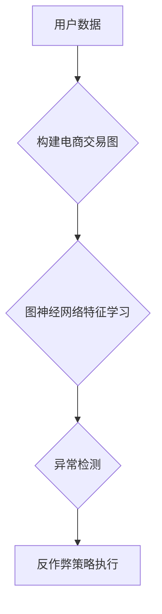

                 

## 电商反作弊中的图神经网络异常检测技术

> 关键词：电商反作弊、图神经网络、异常检测、关联规则、节点特征、边特征、图卷积网络

## 1. 背景介绍

随着电商平台的蓬勃发展，各种新型的欺诈行为也层出不穷，给电商平台带来了巨大的经济损失和安全隐患。传统的反作弊方法，例如基于规则的检测和基于统计的异常检测，在面对复杂的欺诈模式时往往显得力不从心。

图神经网络（Graph Neural Networks，GNN）作为一种新兴的机器学习方法，能够有效地学习和表示复杂网络结构中的关系信息，在异常检测领域展现出巨大的潜力。

## 2. 核心概念与联系

### 2.1 电商反作弊

电商反作弊是指电商平台为了防止各种欺诈行为而采取的一系列技术措施和策略。常见的电商欺诈行为包括：

* **虚假账户注册:** 利用虚假信息注册大量账户，用于刷单、恶意评论等。
* **刷单:** 利用多个账户或机器人进行虚假交易，以抬高商品排名或销量。
* **恶意评论:** 发布虚假或带有攻击性的评论，影响商品评价和用户体验。
* **盗号:** 窃取用户账号信息，进行非法交易或获取用户数据。
* **商品欺诈:** 销售假冒伪劣商品或虚假信息，欺骗消费者。

### 2.2 图神经网络

图神经网络（GNN）是一种能够学习和表示图结构数据的神经网络模型。图结构数据以节点和边表示，节点代表实体，边代表实体之间的关系。GNN通过对节点和边的特征进行学习，能够捕捉图结构中的复杂关系信息，并用于各种下游任务，例如节点分类、图分类、链接预测等。

### 2.3 异常检测

异常检测是指识别数据集中与大多数数据不符的异常数据点或模式。在电商反作弊中，异常检测可以用于识别欺诈行为，例如虚假账户注册、刷单、恶意评论等。

### 2.4 图神经网络异常检测

图神经网络异常检测是指利用图神经网络模型识别图结构数据中的异常节点或边。在电商反作弊中，可以将用户、商品、订单等实体作为节点，用户之间的交互、商品之间的关联、订单之间的关系等作为边，构建一个电商交易图。然后利用图神经网络模型学习图结构中的特征，识别异常节点或边，从而发现欺诈行为。

**图神经网络异常检测流程图**



## 3. 核心算法原理 & 具体操作步骤

### 3.1 算法原理概述

图神经网络异常检测算法的核心原理是利用图神经网络模型学习图结构数据中的特征，并根据学习到的特征识别异常节点或边。

常见的图神经网络异常检测算法包括：

* **图卷积网络 (Graph Convolutional Networks，GCN)**: GCN 通过对节点特征进行卷积操作，学习节点之间的关系信息，并识别异常节点。
* **图注意力网络 (Graph Attention Networks，GAT)**: GAT 通过注意力机制学习节点之间的重要性关系，并识别异常节点。
* **图生成对抗网络 (Graph Generative Adversarial Networks，GAN)**: GAN 通过生成器和判别器网络相互对抗，学习图结构数据的生成规律，并识别异常节点。

### 3.2 算法步骤详解

以图卷积网络 (GCN) 为例，详细说明其异常检测算法步骤：

1. **构建电商交易图:** 将用户、商品、订单等实体作为节点，用户之间的交互、商品之间的关联、订单之间的关系等作为边，构建一个电商交易图。
2. **节点特征提取:** 为每个节点提取特征，例如用户特征 (年龄、性别、注册时间等)、商品特征 (价格、类别、销量等)、订单特征 (金额、时间、地点等)。
3. **图卷积层:** 利用图卷积操作，对节点特征进行聚合，学习节点之间的关系信息。
4. **全连接层:** 将图卷积层的输出作为输入，经过全连接层，得到每个节点的异常得分。
5. **异常阈值设置:** 设置一个异常阈值，将异常得分高于阈值的节点识别为异常节点。

### 3.3 算法优缺点

**优点:**

* 能够有效地学习和表示复杂网络结构中的关系信息。
* 对异常数据具有较强的识别能力。
* 可以处理高维数据和非线性关系。

**缺点:**

* 需要大量的训练数据。
* 计算复杂度较高。
* 对图结构的构建和特征提取有较高的依赖性。

### 3.4 算法应用领域

图神经网络异常检测算法在电商反作弊、金融欺诈检测、网络安全等领域具有广泛的应用前景。

## 4. 数学模型和公式 & 详细讲解 & 举例说明

### 4.1 数学模型构建

图神经网络异常检测算法的数学模型可以表示为：

$$
\mathbf{h}_i^{(l+1)} = \sigma \left( \sum_{j \in \mathcal{N}(i)} \mathbf{W}^{(l)} \mathbf{h}_j^{(l)} + \mathbf{b}^{(l)} \right)
$$

其中：

* $\mathbf{h}_i^{(l)}$ 表示第 $l$ 层第 $i$ 个节点的特征向量。
* $\mathcal{N}(i)$ 表示第 $i$ 个节点的邻居节点集合。
* $\mathbf{W}^{(l)}$ 表示第 $l$ 层的权重矩阵。
* $\mathbf{b}^{(l)}$ 表示第 $l$ 层的偏置向量。
* $\sigma$ 表示激活函数。

### 4.2 公式推导过程

该公式表示图卷积操作的过程。

1. 对于每个节点 $i$，首先收集其邻居节点 $j$ 的特征向量 $\mathbf{h}_j^{(l)}$。
2. 将邻居节点的特征向量与权重矩阵 $\mathbf{W}^{(l)}$ 相乘，得到每个邻居节点对节点 $i$ 的贡献。
3. 对所有邻居节点的贡献进行求和，并加上偏置向量 $\mathbf{b}^{(l)}$。
4. 将结果通过激活函数 $\sigma$ 进行非线性变换，得到第 $l+1$ 层第 $i$ 个节点的特征向量 $\mathbf{h}_i^{(l+1)}$。

### 4.3 案例分析与讲解

假设我们有一个电商交易图，其中节点代表用户，边代表用户之间的购买关系。

我们可以利用图卷积网络学习用户之间的关系信息，并识别异常用户。例如，如果一个用户与大量其他用户进行交易，并且交易金额异常高，则该用户可能是一个刷单用户。

## 5. 项目实践：代码实例和详细解释说明

### 5.1 开发环境搭建

* Python 3.6+
* TensorFlow/PyTorch
* NetworkX

### 5.2 源代码详细实现

```python
import tensorflow as tf
from tensorflow.keras.layers import Dense, GraphConv
from tensorflow.keras.models import Model

# 定义图卷积网络模型
def build_gcn_model(input_dim, hidden_dim, output_dim):
    inputs = tf.keras.Input(shape=(input_dim,))
    x = GraphConv(hidden_dim)(inputs)
    x = Dense(hidden_dim, activation='relu')(x)
    outputs = Dense(output_dim, activation='sigmoid')(x)
    model = Model(inputs=inputs, outputs=outputs)
    return model

# 加载电商交易图数据
graph = nx.read_edgelist('ecommerce_graph.txt')

# 提取节点特征
node_features = ...

# 构建图卷积网络模型
model = build_gcn_model(input_dim=node_features.shape[1], hidden_dim=64, output_dim=1)

# 编译模型
model.compile(optimizer='adam', loss='binary_crossentropy', metrics=['accuracy'])

# 训练模型
model.fit(node_features, labels, epochs=10)

# 预测异常节点
predictions = model.predict(node_features)
```

### 5.3 代码解读与分析

* 该代码首先定义了一个图卷积网络模型，包含输入层、图卷积层、全连接层和输出层。
* 然后加载电商交易图数据，并提取节点特征。
* 构建图卷积网络模型，并使用 Adam 优化器、二元交叉熵损失函数和准确率作为评估指标进行训练。
* 最后使用训练好的模型预测异常节点。

### 5.4 运行结果展示

训练完成后，可以将模型预测结果与实际标签进行比较，评估模型的性能。

## 6. 实际应用场景

### 6.1 虚假账户检测

电商平台可以通过图神经网络识别虚假账户，例如检测注册时间短、活跃度低、关联关系稀疏的账户。

### 6.2 刷单检测

电商平台可以通过图神经网络识别刷单行为，例如检测大量用户之间频繁的交易关系、交易金额异常高、商品评价异常一致的交易记录。

### 6.3 恶意评论检测

电商平台可以通过图神经网络识别恶意评论，例如检测用户发布大量负面评论、评论内容相似度高、评论时间集中在特定时间段的评论。

### 6.4 未来应用展望

随着图神经网络技术的不断发展，其在电商反作弊领域的应用场景将更加广泛，例如：

* **商品欺诈检测:** 利用图神经网络识别假冒伪劣商品和虚假信息。
* **用户行为分析:** 利用图神经网络分析用户行为模式，识别潜在的欺诈风险。
* **个性化反作弊策略:** 利用图神经网络根据用户的特征和行为模式，制定个性化的反作弊策略。

## 7. 工具和资源推荐

### 7.1 学习资源推荐

* **书籍:**

    * 《图神经网络》 (Graph Neural Networks) by William L. Hamilton
    * 《深度学习》 (Deep Learning) by Ian Goodfellow, Yoshua Bengio, and Aaron Courville

* **在线课程:**

    * Coursera: Graph Neural Networks Specialization
    * Udacity: Deep Learning Nanodegree

### 7.2 开发工具推荐

* **TensorFlow:** https://www.tensorflow.org/
* **PyTorch:** https://pytorch.org/
* **NetworkX:** https://networkx.org/

### 7.3 相关论文推荐

* **Semi-Supervised Classification with Graph Convolutional Networks**
* **Attention Is All You Need**
* **Graph Attention Networks**

## 8. 总结：未来发展趋势与挑战

### 8.1 研究成果总结

图神经网络异常检测技术在电商反作弊领域取得了显著的成果，能够有效地识别各种欺诈行为，提高电商平台的安全性和用户体验。

### 8.2 未来发展趋势

* **模型性能提升:** 研究更强大的图神经网络模型，提高异常检测的准确率和效率。
* **数据增强:** 研究新的数据增强方法，解决图神经网络训练数据不足的问题。
* **解释性增强:** 研究更具解释性的图神经网络模型，帮助用户理解异常检测结果。
* **联邦学习:** 研究基于联邦学习的图神经网络异常检测方法，保护用户隐私。

### 8.3 面临的挑战

* **数据稀疏性:** 现实世界中的图数据往往是稀疏的，这会影响图神经网络的训练效果。
* **模型复杂度:** 图神经网络模型的复杂度较高，训练和部署成本较高。
* **可解释性:** 图神经网络模型的决策过程难以解释，这会影响用户的信任度。

### 8.4 研究展望

未来，图神经网络异常检测技术将继续发展，并应用于更多领域，为构建更加安全和可靠的数字社会做出贡献。

## 9. 附录：常见问题与解答

* **Q: 图神经网络异常检测算法的训练数据需要多大规模？**

* **A:** 图神经网络异常检测算法的训练数据规模取决于模型复杂度和数据稀疏性。一般来说，需要至少几千到几万个样本才能达到较好的效果。

* **Q: 图神经网络异常检测算法的计算复杂度较高，如何降低计算成本？**

* **A:** 可以采用一些方法降低计算成本，例如使用更小的模型、使用并行计算、使用剪枝技术等。

* **Q: 图神经网络异常检测算法的解释性较差，如何提高解释性？**

* **A:** 可以采用一些方法提高解释性，例如使用可解释的图神经网络模型、使用注意力机制分析模型的决策过程、使用可视化技术展示模型的结构和特征。


作者：禅与计算机程序设计艺术 / Zen and the Art of Computer Programming 
<end_of_turn>

