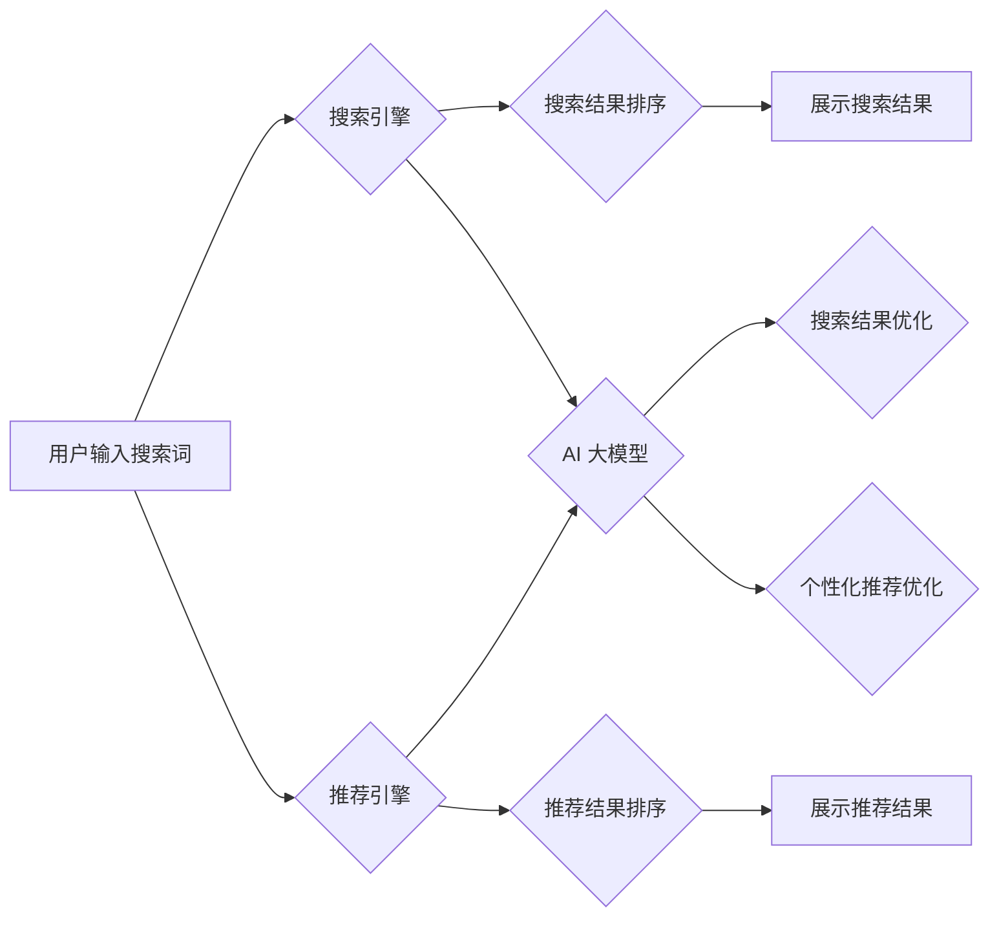

                 

## 电商平台搜索推荐系统的AI 大模型应用：提高系统性能、效率与用户体验

> 关键词：电商平台、搜索推荐系统、AI 大模型、自然语言处理、深度学习、推荐算法、用户体验、个性化推荐

## 1. 背景介绍

随着电商平台的蓬勃发展，用户对商品搜索和推荐的需求日益增长。传统的搜索推荐系统主要依赖于基于规则的算法和特征工程，难以满足用户个性化需求和海量商品数据处理能力。近年来，人工智能（AI）技术，特别是深度学习模型的快速发展，为电商平台搜索推荐系统带来了新的机遇。

AI 大模型凭借其强大的学习能力和泛化能力，能够从海量数据中学习用户行为、商品特征和市场趋势，从而提供更精准、个性化的搜索和推荐结果。这不仅可以提升用户体验，还能提高电商平台的转化率和用户粘性。

## 2. 核心概念与联系

### 2.1 搜索推荐系统

电商平台搜索推荐系统是用户在平台上搜索商品或获取推荐商品的核心功能。它通常由以下几个模块组成：

* **搜索引擎:** 处理用户搜索词，并返回与搜索词相关的商品列表。
* **推荐引擎:** 根据用户的历史行为、偏好和上下文信息，推荐用户可能感兴趣的商品。
* **排序算法:** 对搜索结果或推荐结果进行排序，将最相关的商品展示在用户面前。
* **展示引擎:** 将搜索结果或推荐结果以用户友好的方式展示给用户。

### 2.2 AI 大模型

AI 大模型是指在海量数据上训练的深度学习模型，具有强大的泛化能力和学习能力。常见的AI大模型类型包括：

* **Transformer模型:** 擅长处理自然语言文本，例如BERT、GPT-3等。
* **图神经网络模型:** 擅长处理关系数据，例如知识图谱嵌入、推荐系统等。
* **生成对抗网络(GAN):** 擅长生成新数据，例如图像、文本等。

### 2.3 核心架构

AI 大模型在电商平台搜索推荐系统中的应用主要体现在以下几个方面：

* **搜索结果提升:** 使用 Transformer 模型对用户搜索词进行理解和分析，提高搜索结果的准确性和相关性。
* **个性化推荐:** 使用深度学习模型分析用户的历史行为、偏好和上下文信息，提供更精准的个性化推荐。
* **商品特征提取:** 使用深度学习模型自动提取商品的特征，例如文本描述、图片内容、用户评论等，为推荐算法提供更丰富的输入信息。

**Mermaid 流程图**



## 3. 核心算法原理 & 具体操作步骤

### 3.1 算法原理概述

在电商平台搜索推荐系统中，常用的AI大模型算法包括：

* **协同过滤:** 基于用户的历史行为和商品的购买记录，预测用户对商品的兴趣。
* **内容过滤:** 基于商品的特征和用户偏好，推荐用户可能感兴趣的商品。
* **混合推荐:** 结合协同过滤和内容过滤算法，提高推荐效果。

### 3.2 算法步骤详解

**协同过滤算法步骤:**

1. **数据收集:** 收集用户历史行为数据，例如购买记录、浏览记录、评分等。
2. **用户-商品矩阵构建:** 将用户和商品映射到矩阵中，每个元素表示用户对商品的评分或行为。
3. **相似用户/商品查找:** 使用相似度计算方法，找到与目标用户或目标商品相似的用户或商品。
4. **预测评分:** 根据相似用户或商品的评分或行为，预测目标用户对目标商品的评分或行为。

**内容过滤算法步骤:**

1. **商品特征提取:** 从商品描述、图片、用户评论等数据中提取商品特征。
2. **用户偏好建模:** 使用机器学习模型，学习用户的商品偏好。
3. **推荐商品:** 根据商品特征和用户偏好，推荐用户可能感兴趣的商品。

### 3.3 算法优缺点

| 算法类型 | 优点 | 缺点 |
|---|---|---|
| 协同过滤 | 能够发现隐含的用户偏好 | 数据稀疏性问题、冷启动问题 |
| 内容过滤 | 能够解释推荐结果 | 难以捕捉用户隐性偏好 |
| 混合推荐 | 结合协同过滤和内容过滤的优势 | 模型复杂度较高 |

### 3.4 算法应用领域

* **电商平台:** 商品推荐、搜索结果优化
* **社交媒体:** 内容推荐、用户匹配
* **音乐平台:** 音乐推荐、用户发现
* **视频平台:** 视频推荐、用户个性化内容

## 4. 数学模型和公式 & 详细讲解 & 举例说明

### 4.1 数学模型构建

协同过滤算法的数学模型通常使用矩阵分解技术，将用户-商品矩阵分解成两个低维矩阵，分别表示用户特征和商品特征。

假设用户集合为U，商品集合为I，用户-商品交互矩阵为R，其中R(u,i)表示用户u对商品i的评分或行为。

则矩阵分解模型可以表示为：

$$R(u,i) \approx \mathbf{u}^T \mathbf{v}_i$$

其中，$\mathbf{u}$是用户u的特征向量，$\mathbf{v}_i$是商品i的特征向量。

### 4.2 公式推导过程

通过最小化预测误差与实际评分之间的差值，可以学习到用户特征和商品特征。

$$L(\mathbf{U}, \mathbf{V}) = \sum_{u \in U, i \in I} (R(u,i) - \mathbf{u}^T \mathbf{v}_i)^2$$

其中，L()是损失函数，$\mathbf{U}$是所有用户特征矩阵，$\mathbf{V}$是所有商品特征矩阵。

使用梯度下降算法，可以迭代更新用户特征和商品特征，直到损失函数最小化。

### 4.3 案例分析与讲解

假设有一个用户-商品交互矩阵，其中用户1对商品1评分为5，用户2对商品1评分为3，用户1对商品2评分为4，用户2对商品2评分为2。

使用矩阵分解模型，可以学习到用户和商品的特征向量，并预测用户对其他商品的评分。

## 5. 项目实践：代码实例和详细解释说明

### 5.1 开发环境搭建

* Python 3.x
* TensorFlow/PyTorch
* Jupyter Notebook

### 5.2 源代码详细实现

```python
import tensorflow as tf

# 定义用户-商品交互矩阵
R = tf.constant([[5, 4], [3, 2]])

# 定义用户特征和商品特征的维度
latent_dim = 2

# 定义用户特征矩阵和商品特征矩阵
U = tf.Variable(tf.random.normal([2, latent_dim]))
V = tf.Variable(tf.random.normal([2, latent_dim]))

# 定义损失函数
def loss_function(R, U, V):
    predictions = tf.matmul(U, V, transpose_b=True)
    return tf.reduce_mean(tf.square(R - predictions))

# 定义优化器
optimizer = tf.keras.optimizers.Adam()

# 训练模型
for epoch in range(100):
    with tf.GradientTape() as tape:
        loss = loss_function(R, U, V)
    gradients = tape.gradient(loss, [U, V])
    optimizer.apply_gradients(zip(gradients, [U, V]))

# 打印训练结果
print(loss)
```

### 5.3 代码解读与分析

* 代码首先定义了用户-商品交互矩阵R。
* 然后定义了用户特征和商品特征的维度latent_dim。
* 使用tf.Variable创建用户特征矩阵U和商品特征矩阵V，并随机初始化。
* 定义了损失函数loss_function，计算预测值与实际值的均方误差。
* 使用Adam优化器优化模型参数。
* 训练模型100个epoch，并打印损失值。

### 5.4 运行结果展示

训练完成后，可以将学习到的用户特征和商品特征用于预测用户对其他商品的评分。

## 6. 实际应用场景

### 6.1 个性化推荐

AI 大模型可以根据用户的历史行为、偏好和上下文信息，提供个性化的商品推荐，提高用户体验和转化率。例如，电商平台可以根据用户的浏览记录、购买历史和评分，推荐用户可能感兴趣的商品。

### 6.2 搜索结果优化

AI 大模型可以理解用户搜索词的语义，并返回更相关、更精准的搜索结果。例如，电商平台可以使用Transformer模型分析用户的搜索词，并根据用户的搜索意图返回更相关的商品列表。

### 6.3 商品分类与标签

AI 大模型可以自动提取商品的特征，并进行分类和标签化。例如，电商平台可以使用深度学习模型分析商品的图片和文本描述，自动识别商品的类别和属性。

### 6.4 未来应用展望

* **多模态推荐:** 结合文本、图片、视频等多模态数据，提供更丰富的商品推荐。
* **实时推荐:** 基于用户的实时行为，提供更精准的实时推荐。
* **跨平台推荐:** 将用户行为数据整合到多个平台，提供更全面的用户画像和个性化推荐。

## 7. 工具和资源推荐

### 7.1 学习资源推荐

* **书籍:**
    * Deep Learning by Ian Goodfellow, Yoshua Bengio, and Aaron Courville
    * Hands-On Machine Learning with Scikit-Learn, Keras & TensorFlow by Aurélien Géron
* **在线课程:**
    * TensorFlow Tutorials: https://www.tensorflow.org/tutorials
    * PyTorch Tutorials: https://pytorch.org/tutorials/

### 7.2 开发工具推荐

* **TensorFlow:** https://www.tensorflow.org/
* **PyTorch:** https://pytorch.org/
* **Scikit-learn:** https://scikit-learn.org/

### 7.3 相关论文推荐

* **BERT: Pre-training of Deep Bidirectional Transformers for Language Understanding**
* **Attention Is All You Need**
* **Recurrent Neural Network for Sequence Learning**

## 8. 总结：未来发展趋势与挑战

### 8.1 研究成果总结

AI 大模型在电商平台搜索推荐系统中的应用取得了显著成果，能够提高搜索结果的准确性、个性化推荐的精准度和用户体验。

### 8.2 未来发展趋势

* **模型规模和性能提升:** 随着计算资源的不断发展，AI 大模型的规模和性能将不断提升，能够处理更复杂的数据和任务。
* **多模态融合:** 将文本、图片、视频等多模态数据融合到推荐系统中，提供更丰富的用户体验。
* **联邦学习:** 利用联邦学习技术，在保护用户隐私的前提下，训练更强大的推荐模型。

### 8.3 面临的挑战

* **数据质量和隐私:** AI 大模型的训练需要海量数据，数据质量和隐私保护是需要解决的关键问题。
* **模型解释性和可解释性:** AI 大模型的决策过程往往是复杂的，需要提高模型的解释性和可解释性，以便更好地理解模型的推荐结果。
* **公平性和偏见:** AI 大模型可能会存在公平性和偏见问题，需要采取措施确保模型的公平性和公正性。

### 8.4 研究展望

未来，AI 大模型在电商平台搜索推荐系统中的应用将更加广泛和深入，为用户提供更个性化、更精准、更智能的购物体验。


## 9. 附录：常见问题与解答

* **Q1: AI 大模型的训练需要多少数据？**

* **A1:** AI 大模型的训练需要海量数据，通常需要百万甚至数十亿条数据才能达到较好的效果。

* **Q2: 如何解决数据稀疏性问题？**

* **A2:** 可以使用矩阵分解技术、协同过滤算法等方法来解决数据稀疏性问题。

* **Q3: 如何评估 AI 大模型的性能？**

* **A3:** 可以使用准确率、召回率、F1-score等指标来评估 AI 大模型的性能。

* **Q4: 如何确保 AI 大模型的公平性和公正性？**

* **A4:** 可以使用公平性评估指标、对抗训练等方法来确保 AI 大模型的公平性和公正性。


作者：禅与计算机程序设计艺术 / Zen and the Art of Computer Programming 
<end_of_turn>

