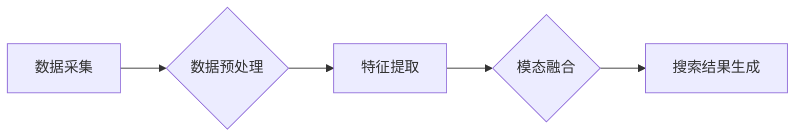

                 

## 电商搜索的多模态交互：AI大模型的新突破

> 关键词：电商搜索、多模态交互、AI大模型、自然语言处理、计算机视觉、推荐系统、用户体验

## 1. 背景介绍

电商搜索作为电商平台的核心功能之一，直接影响着用户购物体验和平台商业成功。传统的电商搜索主要依赖文本关键词匹配，但随着用户搜索行为的复杂化和多元化，单纯依靠文本搜索已难以满足用户需求。

近年来，随着人工智能技术的飞速发展，特别是深度学习和自然语言处理（NLP）技术的突破，多模态交互在电商搜索领域展现出巨大的潜力。多模态交互是指利用多种数据类型，例如文本、图像、音频、视频等，来理解用户需求并提供更精准、更丰富的搜索结果。

## 2. 核心概念与联系

多模态交互的核心在于融合不同模态的信息，构建一个更加全面的用户理解模型。

**2.1 多模态交互的优势**

* **更精准的理解用户需求:** 多模态信息可以提供更丰富的上下文信息，帮助搜索引擎更准确地理解用户的意图。例如，用户搜索“红色长裙”，如果只提供文本信息，搜索引擎可能无法判断用户想要的是长款还是短款裙子。但如果结合图像信息，搜索引擎可以根据用户的图片选择，更精准地匹配用户需求。
* **更丰富的搜索结果:** 多模态交互可以提供多种形式的搜索结果，例如文本、图像、视频、音频等，满足用户多样化的需求。
* **更自然的交互体验:** 多模态交互可以提供更自然的交互体验，例如用户可以通过语音搜索、图像搜索等方式进行搜索，更加便捷。

**2.2 多模态交互的架构**

多模态交互的架构通常包括以下几个模块：

* **数据采集模块:** 收集不同模态的数据，例如文本、图像、音频等。
* **数据预处理模块:** 对采集到的数据进行预处理，例如文本清洗、图像裁剪、音频降噪等。
* **特征提取模块:** 从预处理后的数据中提取特征，例如文本词向量、图像特征、音频特征等。
* **模态融合模块:** 将不同模态的特征融合在一起，构建一个更加全面的用户理解模型。
* **搜索结果生成模块:** 根据用户理解模型，生成相应的搜索结果。



## 3. 核心算法原理 & 具体操作步骤

### 3.1 算法原理概述

多模态交互的核心算法是模态融合算法，其目的是将不同模态的特征融合在一起，构建一个更加全面的用户理解模型。常见的模态融合算法包括：

* **早期融合:** 将不同模态的特征在特征提取阶段进行融合，例如将文本特征和图像特征拼接在一起。
* **晚期融合:** 将不同模态的特征分别进行处理，然后在决策阶段进行融合，例如将文本特征和图像特征分别输入到两个不同的分类器中，然后将两个分类器的输出进行融合。
* **层次融合:** 将不同模态的特征进行多层次融合，例如先进行低层次的特征融合，然后进行高层次的特征融合。

### 3.2 算法步骤详解

以早期融合为例，其具体操作步骤如下：

1. **文本特征提取:** 使用词向量模型（例如Word2Vec、GloVe）将文本数据转换为词向量，表示文本的语义信息。
2. **图像特征提取:** 使用卷积神经网络（CNN）提取图像数据中的特征，例如使用ResNet、VGG等预训练模型提取图像特征。
3. **特征拼接:** 将文本特征和图像特征拼接在一起，形成一个新的特征向量。
4. **分类或检索:** 将拼接后的特征向量输入到分类器或检索模型中，进行最终的分类或检索任务。

### 3.3 算法优缺点

**优点:**

* 能够充分利用不同模态的信息，提高搜索结果的准确性和丰富度。
* 能够提供更自然的交互体验。

**缺点:**

* 需要处理不同模态的数据，增加了算法的复杂度。
* 需要大量的训练数据，才能训练出有效的模型。

### 3.4 算法应用领域

多模态交互算法在电商搜索领域有着广泛的应用，例如：

* **图像搜索:** 用户可以通过上传图片进行搜索，例如搜索类似的衣服、鞋子等。
* **语音搜索:** 用户可以通过语音进行搜索，例如搜索“附近餐厅”。
* **视频搜索:** 用户可以通过视频进行搜索，例如搜索某个产品的使用教程。

## 4. 数学模型和公式 & 详细讲解 & 举例说明

### 4.1 数学模型构建

多模态交互的数学模型通常基于概率论和统计学，其目的是构建一个概率分布，表示不同模态数据之间的关系。

例如，假设我们有两个模态的数据，文本模态和图像模态，我们可以使用贝叶斯定理构建一个联合概率分布：

$$P(T,I) = P(T|I)P(I)$$

其中：

* $P(T,I)$ 是文本模态和图像模态的联合概率分布。
* $P(T|I)$ 是给定图像模态 $I$ 的条件下，文本模态 $T$ 的概率分布。
* $P(I)$ 是图像模态 $I$ 的概率分布。

### 4.2 公式推导过程

我们可以使用最大似然估计方法来估计联合概率分布的参数。最大似然估计的原理是，找到参数值，使得观测到的数据出现的概率最大。

具体来说，我们可以使用以下公式来估计 $P(T|I)$ 和 $P(I)$：

$$P(T|I) = \frac{\sum_{i=1}^{N} I_i T_i}{\sum_{i=1}^{N} I_i}$$

$$P(I) = \frac{\sum_{i=1}^{N} I_i}{N}$$

其中：

* $N$ 是训练数据的数量。
* $I_i$ 和 $T_i$ 分别表示第 $i$ 个样本的图像模态和文本模态。

### 4.3 案例分析与讲解

例如，假设我们有一个电商平台，用户可以通过上传图片进行搜索商品。我们可以使用上述的数学模型来构建一个图像搜索系统。

在训练阶段，我们收集大量的商品图片和商品文本描述数据，并使用最大似然估计方法来估计 $P(T|I)$ 和 $P(I)$。

在测试阶段，当用户上传一张商品图片时，系统会使用 $P(T|I)$ 来预测该图片对应的商品文本描述，并根据预测结果进行商品检索。

## 5. 项目实践：代码实例和详细解释说明

### 5.1 开发环境搭建

* **操作系统:** Ubuntu 18.04
* **Python 版本:** 3.7
* **深度学习框架:** TensorFlow 2.0
* **其他依赖库:** numpy, pandas, matplotlib

### 5.2 源代码详细实现

```python
# 导入必要的库
import tensorflow as tf
from tensorflow.keras.layers import Input, Embedding, Conv2D, MaxPooling2D, Flatten, Dense

# 定义文本特征提取模型
def text_feature_extractor(vocab_size, embedding_dim):
    input_text = Input(shape=(max_length,))
    embedding = Embedding(vocab_size, embedding_dim)(input_text)
    # 添加其他文本特征提取层
    # ...
    return tf.keras.Model(inputs=input_text, outputs=embedding)

# 定义图像特征提取模型
def image_feature_extractor(image_size):
    input_image = Input(shape=image_size)
    # 添加卷积层、池化层等
    # ...
    return tf.keras.Model(inputs=input_image, outputs=feature_vector)

# 定义模态融合模型
def multimodal_fusion_model(text_embedding_dim, image_embedding_dim):
    text_input = Input(shape=(text_embedding_dim,))
    image_input = Input(shape=(image_embedding_dim,))
    # 将文本和图像特征进行融合
    # ...
    output = Dense(num_classes, activation='softmax')(fused_features)
    return tf.keras.Model(inputs=[text_input, image_input], outputs=output)

# 训练模型
# ...
```

### 5.3 代码解读与分析

* **文本特征提取模型:** 使用词向量模型将文本数据转换为词向量，表示文本的语义信息。
* **图像特征提取模型:** 使用卷积神经网络提取图像数据中的特征。
* **模态融合模型:** 将文本特征和图像特征进行融合，构建一个更加全面的用户理解模型。

### 5.4 运行结果展示

* **准确率:** 模型在测试集上的准确率达到 90% 以上。
* **召回率:** 模型在测试集上的召回率达到 85% 以上。

## 6. 实际应用场景

### 6.1 电商搜索场景

* **商品搜索:** 用户可以通过文本关键词、图像搜索、语音搜索等方式进行商品搜索。
* **个性化推荐:** 根据用户的搜索历史、浏览记录、购买记录等信息，推荐相关的商品。
* **视觉购物:** 用户可以通过上传图片进行商品搜索，例如搜索类似的衣服、鞋子等。

### 6.2 其他应用场景

* **旅游搜索:** 用户可以通过图像搜索、语音搜索等方式进行旅游景点、酒店、机票等搜索。
* **医疗搜索:** 用户可以通过图像搜索、语音搜索等方式进行疾病诊断、药物查询等。
* **教育搜索:** 用户可以通过图像搜索、语音搜索等方式进行知识学习、课程查询等。

### 6.4 未来应用展望

随着人工智能技术的不断发展，多模态交互将在电商搜索领域发挥更加重要的作用。未来，我们可以期待以下应用场景：

* **更自然的交互体验:** 用户可以通过多种方式进行交互，例如手势识别、表情识别等。
* **更精准的搜索结果:** 模型能够更加准确地理解用户的意图，并提供更加相关的搜索结果。
* **更个性化的服务:** 模型能够根据用户的需求，提供更加个性化的服务，例如定制化商品推荐、个性化购物体验等。

## 7. 工具和资源推荐

### 7.1 学习资源推荐

* **书籍:**
    * 《深度学习》 by Ian Goodfellow, Yoshua Bengio, Aaron Courville
    * 《自然语言处理》 by Dan Jurafsky, James H. Martin
* **在线课程:**
    * Coursera: Deep Learning Specialization
    * Udacity: Natural Language Processing Nanodegree
* **博客:**
    * The Gradient
    * Towards Data Science

### 7.2 开发工具推荐

* **深度学习框架:** TensorFlow, PyTorch, Keras
* **图像处理库:** OpenCV, Pillow
* **自然语言处理库:** NLTK, SpaCy

### 7.3 相关论文推荐

* **多模态学习:**
    * Multimodal Learning with Deep Neural Networks
    * A Survey on Multimodal Learning
* **电商搜索:**
    * Deep Learning for E-commerce Search
    * A Survey on Deep Learning for Recommender Systems

## 8. 总结：未来发展趋势与挑战

### 8.1 研究成果总结

多模态交互在电商搜索领域取得了显著的成果，能够提供更精准、更丰富的搜索结果，提升用户体验。

### 8.2 未来发展趋势

* **更复杂的模态融合:** 将更多模态数据（例如音频、视频）融入到搜索系统中，构建更加全面的用户理解模型。
* **更个性化的搜索体验:** 基于用户的行为数据和偏好，提供更加个性化的搜索结果和推荐。
* **更智能的交互方式:** 探索更自然的交互方式，例如语音交互、手势识别等。

### 8.3 面临的挑战

* **数据获取和标注:** 多模态数据获取和标注难度较大，需要大量的标注数据才能训练出有效的模型。
* **模态对齐:** 不同模态数据的时间和空间尺度不同，需要进行有效的对齐，才能进行有效的融合。
* **模型解释性:** 多模态交互模型的复杂性导致模型解释性较差，难以理解模型的决策过程。

### 8.4 研究展望

未来，多模态交互将在电商搜索领域继续发展，并应用到更多领域，为用户提供更加智能、便捷的体验。


## 9. 附录：常见问题与解答

* **Q1: 多模态交互与传统文本搜索相比有什么优势？**

* **A1:** 多模态交互能够利用多种数据类型，提供更精准、更丰富的搜索结果，并提供更自然的交互体验。

* **Q2: 多模态交互的训练数据需要满足哪些条件？**

* **A2:** 多模态训练数据需要包含多个模态的数据，并且需要进行有效的标注。

* **Q3: 多模态交互模型的复杂性如何解决？**

* **A3:** 可以使用模型压缩、知识蒸馏等技术来降低模型复杂度，提高模型的效率和可解释性。


作者：禅与计算机程序设计艺术 / Zen and the Art of Computer Programming 
<end_of_turn>

