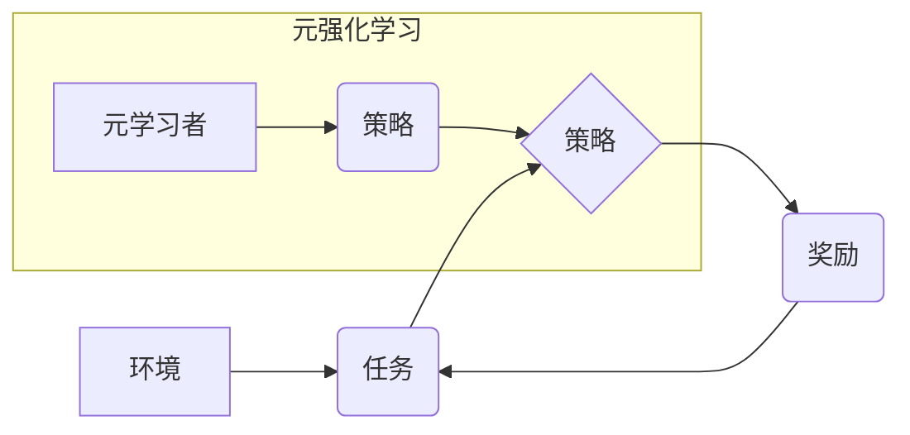

                 

##  电商行业中的元强化学习：大模型的实践与挑战

> 关键词：元强化学习、大模型、电商推荐、个性化服务、决策优化、模型训练、算法效率

## 1. 背景介绍

电子商务行业在全球范围内蓬勃发展，其核心竞争力之一在于精准的商品推荐和个性化的用户服务。传统的推荐系统主要依赖于基于内容的过滤、协同过滤等方法，但这些方法在面对海量数据和用户行为的复杂性时，往往难以提供最佳的推荐效果。近年来，深度学习和强化学习等人工智能技术在电商领域得到广泛应用，为提升推荐精准度和用户体验提供了新的思路。

元强化学习（Meta Reinforcement Learning，MRL）作为一种更高级的强化学习范式，能够学习通用的策略，并将其应用于不同的任务和环境中。它具有强大的泛化能力和适应性，在电商推荐、个性化服务、决策优化等方面展现出巨大的潜力。

## 2. 核心概念与联系

元强化学习的核心思想是学习一个“学习者”（Meta Learner），这个学习者能够从多个具体的强化学习任务中学习，并生成能够解决新任务的策略。

**元强化学习的架构：**



**核心概念原理：**

* **环境（Environment）：**电商平台的具体场景，例如用户浏览商品、添加购物车、购买等行为。
* **任务（Task）：**在特定环境下，需要解决的具体问题，例如推荐商品、优化广告投放等。
* **策略（Policy）：**根据环境状态，采取行动的规则，例如推荐给用户的商品列表。
* **奖励（Reward）：**策略执行后获得的反馈，例如用户点击率、转化率等。
* **元学习者（Meta Learner）：**学习如何学习，能够从多个任务中学习到通用的策略，并将其应用于新的任务。

## 3. 核心算法原理 & 具体操作步骤

### 3.1  算法原理概述

元强化学习算法的核心是学习一个能够学习其他强化学习策略的“元学习者”。常见的元强化学习算法包括：

* **Model-Agnostic Meta-Learning (MAML):** 通过在多个任务上进行微调，学习一个初始策略参数，使得在新的任务上快速收敛。
* **Proximal Policy Optimization with Meta-Learning (PPO-MAML):** 将PPO算法与MAML结合，在元学习框架下进行策略优化。
* **Reinforcement Learning with Meta-Learning (RL-MAML):** 将强化学习的奖励机制与元学习框架相结合，学习更有效的策略。

### 3.2  算法步骤详解

以MAML算法为例，其具体操作步骤如下：

1. **初始化元学习者参数：**随机初始化元学习者的策略参数。
2. **训练阶段：**
    * 从任务库中随机抽取多个任务。
    * 对每个任务，进行有限步的强化学习训练，更新元学习者的策略参数。
3. **测试阶段：**
    * 选择一个新的任务。
    * 使用训练好的元学习者参数，对新任务进行少量步数的微调。
    * 使用微调后的策略参数，在新的任务上进行评估。

### 3.3  算法优缺点

**优点：**

* **泛化能力强：**能够学习通用的策略，适用于不同的任务和环境。
* **适应性强：**能够快速适应新的任务和环境的变化。
* **数据效率高：**只需要少量的数据就能学习到有效的策略。

**缺点：**

* **训练复杂：**需要训练多个任务，训练时间较长。
* **参数量大：**元学习者需要学习大量的参数。
* **算法设计难度高：**需要设计合适的元学习算法和任务库。

### 3.4  算法应用领域

元强化学习在电商行业具有广泛的应用场景，例如：

* **个性化商品推荐：**根据用户的历史行为和偏好，学习个性化的推荐策略。
* **动态价格优化：**根据市场需求和竞争对手价格，学习动态调整商品价格的策略。
* **广告投放优化：**根据用户的兴趣和行为，学习优化广告投放策略，提高广告效果。
* **库存管理优化：**根据商品需求和销售趋势，学习优化库存管理策略，降低库存成本。

## 4. 数学模型和公式 & 详细讲解 & 举例说明

### 4.1  数学模型构建

元强化学习的数学模型通常基于马尔可夫决策过程（MDP）。

* **状态空间（State Space）：**电商平台的当前状态，例如用户浏览商品、购物车内容等。
* **动作空间（Action Space）：**可供选择的行动，例如推荐商品、调整价格等。
* **状态转移概率（Transition Probability）：**从一个状态到另一个状态的概率。
* **奖励函数（Reward Function）：**策略执行后获得的反馈，例如用户点击率、转化率等。

### 4.2  公式推导过程

MAML算法的目标是学习一个元学习者参数θ，使得在新的任务上，策略参数的微调能够快速收敛。

**损失函数：**

$$
L(\theta) = \sum_{t=1}^{T} \mathbb{E}_{s_t, a_t, s_{t+1} \sim \mathcal{D}} [r_t + \gamma \max_{\theta'} V(s_{t+1}, \theta')]
$$

其中：

* T 是训练步数。
* $\mathcal{D}$ 是训练数据。
* $r_t$ 是在时间步t获得的奖励。
* $\gamma$ 是折扣因子。
* $V(s_{t+1}, \theta')$ 是在状态$s_{t+1}$下，使用策略参数$\theta'$的价值函数。

**梯度下降：**

$$
\theta = \theta - \alpha \nabla_{\theta} L(\theta)
$$

其中：

* $\alpha$ 是学习率。

### 4.3  案例分析与讲解

假设我们有一个电商平台，需要推荐商品给用户。我们可以将用户浏览历史和商品信息作为状态空间，推荐商品作为动作空间。

使用MAML算法，我们可以学习一个元学习者，它能够从多个用户的浏览历史中学习到通用的推荐策略。当遇到一个新的用户时，我们可以使用元学习者学习到的策略参数，对用户的浏览历史进行微调，从而推荐更符合用户偏好的商品。

## 5. 项目实践：代码实例和详细解释说明

### 5.1  开发环境搭建

* Python 3.7+
* TensorFlow 2.0+
* PyTorch 1.0+
* CUDA 10.0+

### 5.2  源代码详细实现

```python
# MAML算法实现示例
import tensorflow as tf

class MetaLearner(tf.keras.Model):
    def __init__(self, input_dim, output_dim):
        super(MetaLearner, self).__init__()
        self.fc1 = tf.keras.layers.Dense(128, activation='relu')
        self.fc2 = tf.keras.layers.Dense(output_dim)

    def call(self, x):
        x = self.fc1(x)
        x = self.fc2(x)
        return x

# 训练任务
def train_task(meta_learner, task_data, lr):
    # ...

# 评估任务
def evaluate_task(meta_learner, task_data):
    # ...

# 元学习训练
def meta_train(meta_learner, task_data, epochs, lr):
    for epoch in range(epochs):
        for task in task_data:
            train_task(meta_learner, task, lr)
        evaluate_task(meta_learner, task_data)

# ...
```

### 5.3  代码解读与分析

* **MetaLearner类：**定义了元学习者的模型结构，包含两个全连接层。
* **train_task函数：**训练单个任务，使用梯度下降更新元学习者的参数。
* **evaluate_task函数：**评估单个任务的性能。
* **meta_train函数：**进行元学习训练，循环训练多个任务，并评估性能。

### 5.4  运行结果展示

* 训练过程中，可以监控元学习者的损失函数和性能指标的变化。
* 评估阶段，可以比较元学习者在不同任务上的性能。

## 6. 实际应用场景

### 6.1  电商推荐系统

元强化学习可以用于个性化商品推荐，根据用户的历史行为和偏好，学习更精准的推荐策略。

### 6.2  动态价格优化

元强化学习可以用于动态调整商品价格，根据市场需求和竞争对手价格，学习最优的定价策略。

### 6.3  广告投放优化

元强化学习可以用于优化广告投放，根据用户的兴趣和行为，学习更有效的广告投放策略。

### 6.4  未来应用展望

元强化学习在电商行业还有很多潜在的应用场景，例如：

* **库存管理优化：**根据商品需求和销售趋势，学习优化库存管理策略。
* **物流配送优化：**学习优化配送路线和配送时间，提高配送效率。
* **客户服务自动化：**学习自动回复客户咨询，提高客户服务效率。

## 7. 工具和资源推荐

### 7.1  学习资源推荐

* **书籍：**
    * Reinforcement Learning: An Introduction by Sutton and Barto
    * Deep Reinforcement Learning Hands-On by Maxim Lapan
* **课程：**
    * Deep Reinforcement Learning Specialization by DeepLearning.AI
    * Reinforcement Learning by David Silver (University of DeepMind)
* **博客和网站：**
    * OpenAI Blog
    * DeepMind Blog
    * Towards Data Science

### 7.2  开发工具推荐

* **TensorFlow:** https://www.tensorflow.org/
* **PyTorch:** https://pytorch.org/
* **Gym:** https://gym.openai.com/

### 7.3  相关论文推荐

* **Model-Agnostic Meta-Learning for Fast Adaptation of Deep Networks** by Finn et al. (2017)
* **Meta-Learning with Differentiable Convex Optimization** by Wang et al. (2019)
* **Proximal Policy Optimization Algorithms** by Schulman et al. (2017)

## 8. 总结：未来发展趋势与挑战

### 8.1  研究成果总结

元强化学习在电商行业展现出巨大的潜力，能够学习更精准的推荐策略、优化定价和广告投放等。

### 8.2  未来发展趋势

* **模型效率提升：**研究更轻量级、更高效的元强化学习算法。
* **数据效率提升：**研究利用少量的训练数据就能学习到有效策略的方法。
* **解释性增强：**研究更易于理解和解释的元强化学习模型。
* **多模态学习：**研究将文本、图像、视频等多模态数据融入元强化学习模型。

### 8.3  面临的挑战

* **算法复杂度高：**元强化学习算法的训练过程复杂，需要大量的计算资源。
* **数据标注成本高：**元强化学习需要大量的标注数据，标注成本较高。
* **模型泛化能力有限：**现有的元强化学习模型在面对新的任务和环境时，泛化能力有限。

### 8.4  研究展望

未来，元强化学习将在电商行业得到更广泛的应用，并不断发展和完善。

## 9. 附录：常见问题与解答

* **什么是元强化学习？**

元强化学习是一种更高级的强化学习范式，能够学习通用的策略，并将其应用于不同的任务和环境。

* **元强化学习与传统强化学习有什么区别？**

传统强化学习需要针对每个任务单独训练，而元强化学习能够学习通用的策略，适用于不同的任务。

* **元强化学习有哪些应用场景？**

元强化学习在电商行业有广泛的应用场景，例如个性化商品推荐、动态价格优化、广告投放优化等。

* **元强化学习有哪些挑战？**

元强化学习面临的挑战包括算法复杂度高、数据标注成本高、模型泛化能力有限等。


作者：禅与计算机程序设计艺术 / Zen and the Art of Computer Programming 
<end_of_turn>

