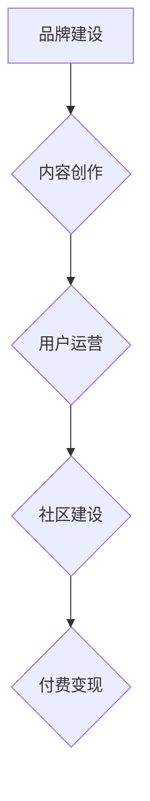

                 

## 知识付费赚钱的品牌社会化营销与内容营销策略

> 关键词：知识付费、品牌营销、社会化营销、内容营销、用户运营、社区建设、付费变现

### 1. 背景介绍

知识经济时代，知识成为最宝贵的资源。知识付费作为一种新型的商业模式，迅速崛起，为知识产权的价值实现提供了新的途径。 

随着互联网技术的不断发展，人们获取知识的方式也发生了巨大变化。传统的方式如书籍、课程等，逐渐被线上平台、直播、视频等更便捷、高效的方式所取代。知识付费平台也应运而生，为创作者提供了一个展示和分享知识的平台，为用户提供了一个便捷学习的渠道。

然而，知识付费市场竞争激烈，想要在激烈的市场竞争中脱颖而出，仅仅依靠优质的知识内容是不够的。品牌建设、社会化营销和内容营销成为知识付费平台成功的关键因素。

### 2. 核心概念与联系

**2.1 品牌社会化营销**

品牌社会化营销是指将品牌营销与社交媒体、用户互动等元素相结合，通过构建品牌社区、参与用户讨论、提供个性化服务等方式，提升品牌知名度、用户粘性以及最终的转化率。

**2.2 内容营销**

内容营销是指通过创作和传播有价值、引人入胜的内容，吸引目标用户，建立品牌信任，最终实现商业目标。

**2.3 知识付费平台的营销策略**

知识付费平台需要将品牌社会化营销和内容营销相结合，构建一个完整的营销体系。

**Mermaid 流程图**



**2.4 核心概念联系**

品牌建设是知识付费平台营销的基础，通过打造独特的品牌形象和价值观，吸引目标用户。内容创作是平台的核心竞争力，通过提供优质、有价值的内容，吸引用户关注，建立信任关系。用户运营是平台用户生命周期的关键环节，通过提供个性化服务、互动交流等方式，提升用户粘性。社区建设是平台用户参与度和互动性的关键，通过构建线上线下社区，促进用户之间的交流和互动，形成品牌忠诚度。付费变现是平台最终的目标，通过多种付费模式，实现知识价值的变现。

### 3. 核心算法原理 & 具体操作步骤

**3.1 算法原理概述**

知识付费平台的推荐算法是用户获取知识内容的关键环节，通过分析用户的学习行为、兴趣偏好等信息，推荐符合用户需求的知识内容，提升用户体验和付费意愿。

常见的推荐算法包括：

* **协同过滤算法:** 基于用户的历史行为和相似用户的信息，推荐用户可能感兴趣的内容。
* **内容基准算法:** 基于内容的主题、标签、关键词等信息，推荐与用户兴趣相关的知识内容。
* **深度学习算法:** 利用深度神经网络，学习用户行为和内容特征之间的复杂关系，进行更精准的推荐。

**3.2 算法步骤详解**

1. **数据收集:** 收集用户学习行为、兴趣偏好、评价反馈等数据。
2. **数据预处理:** 对收集到的数据进行清洗、转换、特征提取等处理，以便于算法训练和使用。
3. **模型训练:** 选择合适的推荐算法，利用预处理后的数据进行模型训练，学习用户行为和内容特征之间的关系。
4. **模型评估:** 利用测试数据对模型进行评估，评估模型的推荐效果和准确率。
5. **模型部署:** 将训练好的模型部署到线上平台，实时进行知识内容推荐。

**3.3 算法优缺点**

* **协同过滤算法:** 优点是能够发现用户之间的隐性关联，推荐个性化内容。缺点是需要大量的用户数据才能训练出有效的模型，容易出现冷启动问题。
* **内容基准算法:** 优点是能够根据内容本身的特点进行推荐，不受用户数据量的限制。缺点是推荐结果可能不够个性化。
* **深度学习算法:** 优点是能够学习用户行为和内容特征之间的复杂关系，推荐效果更精准。缺点是需要大量的计算资源和数据才能训练出有效的模型。

**3.4 算法应用领域**

知识付费平台的推荐算法广泛应用于以下领域：

* **课程推荐:** 根据用户的学习历史、兴趣偏好等信息，推荐符合用户需求的课程。
* **文章推荐:** 根据用户的阅读习惯、兴趣领域等信息，推荐相关的文章。
* **直播推荐:** 根据用户的观看历史、兴趣爱好等信息，推荐感兴趣的直播内容。

### 4. 数学模型和公式 & 详细讲解 & 举例说明

**4.1 数学模型构建**

知识付费平台的推荐算法通常基于用户-物品交互矩阵，该矩阵表示用户对不同物品的评分或行为。

假设用户集合为U，物品集合为I，则用户-物品交互矩阵为一个m x n的矩阵，其中m是用户数量，n是物品数量。矩阵中的每个元素表示用户对物品的评分或行为，例如1表示用户喜欢该物品，0表示用户不喜欢该物品。

**4.2 公式推导过程**

协同过滤算法的核心思想是基于用户的相似度或物品的相似度进行推荐。

* **用户相似度:** 计算两个用户在评分或行为上的相似度，例如余弦相似度。

$$
\text{相似度}(u_i, u_j) = \frac{\sum_{k \in I} r_{i,k} \cdot r_{j,k}}{\sqrt{\sum_{k \in I} r_{i,k}^2} \cdot \sqrt{\sum_{k \in I} r_{j,k}^2}}
$$

* **物品相似度:** 计算两个物品在用户评分或行为上的相似度，例如余弦相似度。

$$
\text{相似度}(i_p, i_q) = \frac{\sum_{u \in U} r_{u,p} \cdot r_{u,q}}{\sqrt{\sum_{u \in U} r_{u,p}^2} \cdot \sqrt{\sum_{u \in U} r_{u,q}^2}}
$$

**4.3 案例分析与讲解**

假设有两个用户A和B，他们对以下三部电影的评分如下：

| 电影 | A评分 | B评分 |
|---|---|---|
| 电影1 | 5 | 4 |
| 电影2 | 3 | 5 |
| 电影3 | 4 | 3 |

我们可以计算A和B的用户相似度：

$$
\text{相似度}(A, B) = \frac{(5 \cdot 4) + (3 \cdot 5) + (4 \cdot 3)}{\sqrt{(5^2 + 3^2 + 4^2)} \cdot \sqrt{(4^2 + 5^2 + 3^2)}} = 0.75
$$

该结果表明A和B的用户兴趣相似度较高。

### 5. 项目实践：代码实例和详细解释说明

**5.1 开发环境搭建**

* Python 3.x
* TensorFlow 或 PyTorch
* Jupyter Notebook

**5.2 源代码详细实现**

```python
# 协同过滤算法推荐

import numpy as np
from sklearn.metrics.pairwise import cosine_similarity

# 用户-物品交互矩阵
ratings = np.array([
    [5, 4, 3],
    [3, 5, 4],
    [4, 3, 5]
])

# 计算用户相似度
user_similarity = cosine_similarity(ratings)

# 获取用户A的相似用户
similar_users = np.argsort(user_similarity[0])[::-1][1:]  # 排序后取第二位及以后

# 推荐给用户A的电影
recommended_movies = np.argsort(ratings[similar_users, :])[::-1]
```

**5.3 代码解读与分析**

* 首先，我们定义了一个用户-物品交互矩阵，表示用户对不同物品的评分。
* 然后，我们使用Scikit-learn库中的`cosine_similarity`函数计算用户之间的相似度。
* 接下来，我们获取用户A的相似用户，并根据相似用户的评分，推荐给用户A的电影。

**5.4 运行结果展示**

运行上述代码，可以得到用户A的推荐电影列表。

### 6. 实际应用场景

**6.1 在线教育平台**

在线教育平台可以利用知识付费平台的推荐算法，推荐符合用户学习需求的课程，提升用户学习体验和付费意愿。

**6.2 内容创作平台**

内容创作平台可以利用知识付费平台的推荐算法，推荐符合用户兴趣的优质内容，提升用户粘性和付费意愿。

**6.3 社交电商平台**

社交电商平台可以利用知识付费平台的推荐算法，推荐符合用户需求的商品，提升用户购买意愿。

**6.4 未来应用展望**

随着人工智能技术的不断发展，知识付费平台的推荐算法将会更加精准、个性化。未来，知识付费平台的推荐算法将会应用于更多领域，为用户提供更便捷、高效的知识获取方式。

### 7. 工具和资源推荐

**7.1 学习资源推荐**

* **书籍:**

    * 《推荐系统实践》
    * 《机器学习》

* **在线课程:**

    * Coursera: Recommender Systems Specialization
    * Udacity: Machine Learning Engineer Nanodegree

**7.2 开发工具推荐**

* **Python:** 

    * TensorFlow
    * PyTorch
    * Scikit-learn

* **云平台:**

    * AWS
    * Azure
    * Google Cloud

**7.3 相关论文推荐**

* **协同过滤算法:**

    * "Collaborative Filtering: A User-Based Approach"
    * "Memory-Based Collaborative Filtering"

* **内容基准算法:**

    * "Content-Based Recommendation Systems"
    * "A Survey of Content-Based Recommendation Systems"

### 8. 总结：未来发展趋势与挑战

**8.1 研究成果总结**

知识付费平台的推荐算法已经取得了显著的成果，能够有效地推荐符合用户需求的知识内容，提升用户体验和付费意愿。

**8.2 未来发展趋势**

* **更精准的推荐:** 利用深度学习等先进算法，学习用户行为和内容特征之间的更复杂关系，实现更精准的推荐。
* **更个性化的推荐:** 结合用户画像、兴趣偏好等多方面信息，提供更个性化的推荐。
* **跨平台推荐:** 打破平台壁垒，实现跨平台的知识内容推荐。

**8.3 面临的挑战**

* **数据稀疏性:** 知识付费平台的用户数据和内容数据往往存在稀疏性，难以训练出有效的推荐模型。
* **冷启动问题:** 新用户和新内容难以获得推荐，需要开发新的算法和策略来解决冷启动问题。
* **用户隐私保护:** 知识付费平台需要保护用户的隐私信息，避免数据泄露和滥用。

**8.4 研究展望**

未来，知识付费平台的推荐算法将会更加智能化、个性化、安全可靠，为用户提供更便捷、高效、安全的知识获取方式。

### 9. 附录：常见问题与解答

**9.1 如何解决数据稀疏性问题？**

* 利用协同过滤算法中的矩阵分解技术，将用户-物品交互矩阵分解成低维空间，降低数据稀疏性。
* 利用内容基准算法，结合内容特征进行推荐，减少对用户行为数据的依赖。
* 利用迁移学习技术，将已训练好的模型迁移到新的平台或领域，解决新平台或领域的数据稀疏性问题。

**9.2 如何解决冷启动问题？**

* 利用用户画像、兴趣偏好等信息，对新用户进行个性化推荐。
* 利用内容特征、标签等信息，对新内容进行推荐。
* 利用社会化推荐，从用户的社交关系中获取推荐信息。

**9.3 如何保护用户隐私信息？**

* 使用匿名化技术，对用户数据进行脱敏处理。
* 使用加密技术，保护用户数据的传输和存储安全。
* 明确用户隐私政策，获得用户的同意。


作者：禅与计算机程序设计艺术 / Zen and the Art of Computer Programming 
<end_of_turn>

