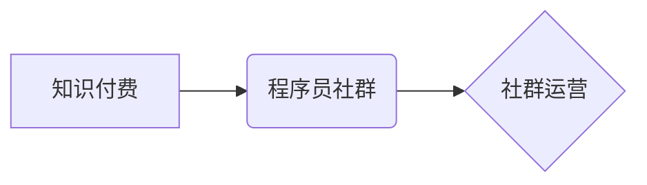

                 

## 知识付费：程序员的社群运营窍门

> 关键词：知识付费、程序员社群、运营策略、内容创作、社区建设、技术分享、商业模式

### 1. 背景介绍

在当今数字化时代，知识已成为最宝贵的资源之一。程序员作为科技领域的先锋，拥有丰富的技术经验和专业技能，他们积累的知识和洞察力对其他程序员和技术爱好者具有极高的价值。知识付费模式的兴起为程序员提供了将自身知识转化为收益的平台，同时也为程序员社群的发展提供了新的动力。

程序员社群的运营，本质上是构建一个知识共享和价值互动的平台。通过有效的运营策略，程序员社群可以成为程序员学习、交流、成长和发展的沃土。

### 2. 核心概念与联系

**2.1 知识付费**

知识付费是指通过付费的方式获取知识和技能的商业模式。它打破了传统教育模式的限制，让知识更加便捷、高效地传递。

**2.2 程序员社群**

程序员社群是指由程序员、技术爱好者和相关从业人员组成的网络或线下组织。它提供了一个平台，让成员可以分享经验、交流技术、学习新知识和拓展人脉。

**2.3 社群运营**

社群运营是指通过一系列策略和活动，维护和发展社群的运营管理工作。它包括内容运营、用户运营、社区建设等多个方面。

**2.4 核心概念关系图**



**2.5 核心概念原理**

知识付费模式为程序员社群提供了新的商业模式，可以帮助社群实现可持续发展。而社群运营则为知识付费模式提供了基础，通过有效的运营策略，可以吸引更多用户加入社群，并促进知识的传播和价值的转化。

### 3. 核心算法原理 & 具体操作步骤

**3.1 算法原理概述**

在程序员社群运营中，没有一个特定的算法可以保证成功。但我们可以借鉴一些互联网平台的运营经验，例如推荐算法、内容分发算法等，来优化社群运营策略。

**3.2 算法步骤详解**

1. **用户画像分析:** 了解社群用户的特征、兴趣爱好、需求等，以便针对不同用户群体进行个性化运营。
2. **内容策略制定:** 根据用户画像分析结果，制定内容创作计划，提供有价值、有吸引力的内容，满足用户需求。
3. **内容分发优化:** 利用算法和工具，对内容进行推荐和分发，提高内容曝光率和用户参与度。
4. **社群互动引导:** 通过活动、话题、讨论等方式，引导用户参与社群互动，增强用户粘性。
5. **数据分析与优化:** 定期分析社群运营数据，例如用户活跃度、内容阅读量、互动率等，根据数据反馈不断优化运营策略。

**3.3 算法优缺点**

* **优点:** 可以提高运营效率，精准触达目标用户，优化内容分发，增强用户互动。
* **缺点:** 需要大量数据支持，算法模型需要不断迭代优化，存在一定的技术门槛。

**3.4 算法应用领域**

* 社群运营平台
* 内容分发平台
* 个人知识付费平台

### 4. 数学模型和公式 & 详细讲解 & 举例说明

**4.1 数学模型构建**

在程序员社群运营中，我们可以使用一些数学模型来分析用户行为、内容传播效果等。例如，我们可以使用**巴贝拉指数**来衡量内容的传播速度：

$$
P(t) = P_0 * e^{rt}
$$

其中：

* $P(t)$ 是时间 $t$ 时的内容传播量
* $P_0$ 是初始传播量
* $r$ 是传播速度
* $t$ 是时间

**4.2 公式推导过程**

巴贝拉指数模型假设内容传播速度是指数增长的，即传播量随着时间的推移呈几何级数增长。这个模型可以用来预测内容的传播趋势，并帮助我们制定更有效的运营策略。

**4.3 案例分析与讲解**

假设一个程序员分享了一篇关于新技术的博客文章，初始传播量为 100 人。如果传播速度为 0.2，那么 1 天后，文章的传播量将达到 122 人，2 天后将达到 149 人，以此类推。

### 5. 项目实践：代码实例和详细解释说明

**5.1 开发环境搭建**

为了实现程序员社群运营，我们可以使用一些开源平台和工具，例如：

* **Discourse:** 一个开源的论坛平台，可以用于搭建程序员社群。
* **Slack:** 一个即时通讯平台，可以用于建立社群聊天室。
* **GitHub:** 一个代码托管平台，可以用于分享代码和项目。

**5.2 源代码详细实现**

由于篇幅限制，这里只提供一个简单的代码示例，用于演示如何使用 Python 编写一个简单的社群运营脚本：

```python
import requests
import json

# 社群 API 接口地址
api_url = "https://api.example.com/posts"

# 发送 API 请求
response = requests.post(api_url, data=json.dumps({
    "title": "新技术分享",
    "content": "今天学习了新的机器学习算法...",
}))

# 处理 API 响应
if response.status_code == 200:
    print("发布成功!")
else:
    print("发布失败!")
```

**5.3 代码解读与分析**

这段代码使用 Python 的 `requests` 库发送 POST 请求到一个假想的社群 API 接口，用于发布一条新的帖子。

**5.4 运行结果展示**

如果 API 请求成功，则会打印 "发布成功!" 的信息。否则，会打印 "发布失败!" 的信息。

### 6. 实际应用场景

**6.1 在线课程平台**

程序员可以利用知识付费模式，将自己的技术经验和技能转化为在线课程，通过在线课程平台进行销售。

**6.2 技术博客和公众号**

程序员可以通过技术博客和公众号分享技术文章、代码示例和项目经验，并通过广告、会员订阅等方式获得收益。

**6.3 社群付费会员**

程序员社群可以提供付费会员服务，为会员提供独家内容、技术支持、线下活动等权益。

**6.4 未来应用展望**

随着人工智能、大数据等技术的不断发展，程序员社群运营将更加智能化、个性化和多元化。

### 7. 工具和资源推荐

**7.1 学习资源推荐**

* **Coursera:** 提供各种编程和技术相关的在线课程。
* **Udemy:** 提供各种编程和技术相关的在线课程。
* **GitHub:** 提供开源代码和项目，可以学习其他程序员的代码和经验。

**7.2 开发工具推荐**

* **Visual Studio Code:** 一个轻量级、功能强大的代码编辑器。
* **PyCharm:** 一个专业的 Python 开发环境。
* **Git:** 一个分布式版本控制系统，用于管理代码版本。

**7.3 相关论文推荐**

* **The Social Network Effect: A Review of the Literature**
* **Community Detection in Social Networks: A Survey**
* **Knowledge Sharing in Online Communities: A Literature Review**

### 8. 总结：未来发展趋势与挑战

**8.1 研究成果总结**

程序员社群运营是一个不断发展和演变的领域。通过有效的运营策略和技术手段，程序员社群可以成为程序员学习、交流、成长的重要平台。

**8.2 未来发展趋势**

* **人工智能驱动的运营:** 利用人工智能技术，实现更智能化的社群运营，例如自动生成内容、推荐用户、分析用户行为等。
* **沉浸式体验:** 利用虚拟现实、增强现实等技术，打造更沉浸式的社群体验，例如虚拟会议、在线培训等。
* **多元化内容形式:** 除了文字和视频，还可以利用音频、直播、游戏等多种形式，丰富社群内容。

**8.3 面临的挑战**

* **内容质量控制:** 确保社群内容的质量和原创性，避免低俗、虚假信息等问题。
* **用户隐私保护:** 妥善处理用户数据，保护用户隐私安全。
* **商业模式创新:** 探索新的商业模式，实现社群的可持续发展。

**8.4 研究展望**

未来，程序员社群运营的研究将更加注重人工智能、大数据、虚拟现实等技术的应用，以及如何更好地服务于程序员的学习、交流和成长需求。

### 9. 附录：常见问题与解答

**9.1 如何吸引用户加入社群？**

* 提供有价值、有吸引力的内容
* 举办线下活动和线上活动
* 利用社交媒体进行推广
* 与其他社群合作

**9.2 如何提高用户活跃度？**

* 定期发布高质量内容
* 组织互动活动和话题讨论
* 建立社群规则和规范
* 提供良好的用户体验

**9.3 如何实现社群盈利？**

* 推广付费会员服务
* 销售线上课程和电子书
* 接受广告赞助
* 提供技术咨询服务


作者：禅与计算机程序设计艺术 / Zen and the Art of Computer Programming 
<end_of_turn>

