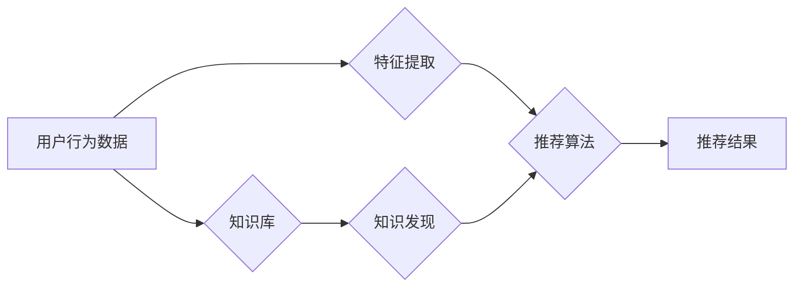

                 

## 知识发现引擎的实时推荐系统实现

> 关键词：知识发现引擎、实时推荐系统、协同过滤、内容过滤、矩阵分解、深度学习、Spark、Hadoop

## 1. 背景介绍

在海量数据时代，信息爆炸给用户带来了便利的同时，也带来了信息过载的困扰。如何精准地将用户感兴趣的信息推荐给用户，成为了一个重要的研究课题。实时推荐系统作为一种高效的信息过滤和推荐技术，能够根据用户的实时行为和偏好，动态地推荐相关信息，提升用户体验和信息获取效率。

知识发现引擎 (Knowledge Discovery Engine, KDE) 旨在从海量数据中挖掘隐藏的知识和模式，为用户提供更深入的洞察和理解。结合实时推荐系统，KDE 可以实现更智能、更精准的知识推荐，帮助用户快速找到所需信息，并发现新的知识和关联。

## 2. 核心概念与联系

### 2.1  知识发现引擎 (KDE)

知识发现引擎 (KDE) 是一个用于从数据中挖掘知识和模式的系统。它通常包含以下几个核心组件：

* **数据预处理:** 对原始数据进行清洗、转换和格式化，使其适合后续的知识发现过程。
* **数据挖掘算法:** 使用各种算法，如关联规则挖掘、分类、聚类等，从数据中发现隐藏的模式和关系。
* **知识表示:** 将发现的知识以可理解的形式表示出来，例如规则、图谱、概念网络等。
* **知识可视化:** 将知识以直观的方式呈现出来，帮助用户理解和探索发现的知识。

### 2.2  实时推荐系统

实时推荐系统是指根据用户的实时行为和偏好，动态地推荐相关信息的系统。它通常包含以下几个核心组件：

* **用户行为数据采集:** 收集用户的行为数据，例如浏览历史、点击记录、购买记录等。
* **特征提取:** 从用户行为数据中提取特征，例如用户兴趣、偏好、购买习惯等。
* **推荐算法:** 使用推荐算法，根据用户的特征和历史行为，预测用户可能感兴趣的内容。
* **推荐结果展示:** 将推荐结果以用户友好的方式展示出来，例如推荐列表、个性化首页等。

### 2.3  KDE与实时推荐系统的结合

将知识发现引擎与实时推荐系统结合，可以实现更智能、更精准的知识推荐。KDE 可以帮助实时推荐系统发现用户潜在的兴趣和需求，而实时推荐系统可以为KDE提供实时用户行为数据，帮助KDE不断更新和完善知识库。

**Mermaid 流程图**



## 3. 核心算法原理 & 具体操作步骤

### 3.1  算法原理概述

实时推荐系统通常使用以下几种算法：

* **协同过滤:** 基于用户的相似性或物品的相似性进行推荐。
* **内容过滤:** 基于物品的特征和用户偏好进行推荐。
* **矩阵分解:** 将用户-物品交互矩阵分解成低维矩阵，预测用户对物品的评分。
* **深度学习:** 使用深度神经网络学习用户行为模式，进行推荐。

### 3.2  算法步骤详解

**协同过滤算法步骤:**

1. **收集用户-物品交互数据:** 收集用户对物品的评分、购买记录、浏览记录等数据。
2. **计算用户相似度:** 使用余弦相似度、皮尔逊相关系数等方法计算用户之间的相似度。
3. **计算物品相似度:** 使用余弦相似度、皮尔逊相关系数等方法计算物品之间的相似度。
4. **根据相似度进行推荐:** 
    * **基于用户相似度:** 找到与当前用户相似度高的用户，推荐他们喜欢的物品。
    * **基于物品相似度:** 找到与当前用户交互过的物品相似度高的物品，推荐给当前用户。

**内容过滤算法步骤:**

1. **提取物品特征:** 从物品描述、标签、内容等方面提取物品特征。
2. **构建用户偏好模型:** 根据用户的历史行为数据，构建用户对不同特征的偏好模型。
3. **计算物品与用户偏好匹配度:** 计算物品特征与用户偏好模型的匹配度。
4. **根据匹配度进行推荐:** 推荐匹配度高的物品。

### 3.3  算法优缺点

| 算法 | 优点 | 缺点 |
|---|---|---|
| 协同过滤 | 能够发现隐性关联，推荐个性化内容 | 数据稀疏性问题，冷启动问题 |
| 内容过滤 | 能够解释推荐理由，避免数据稀疏性问题 | 难以发现隐性关联，推荐结果可能过于单一 |
| 矩阵分解 | 能够处理高维数据，推荐结果更精准 | 计算复杂度高，需要大量数据训练 |
| 深度学习 | 能够学习复杂的用户行为模式，推荐结果更个性化 | 需要大量数据训练，模型解释性差 |

### 3.4  算法应用领域

实时推荐系统广泛应用于以下领域：

* **电商平台:** 商品推荐、个性化促销
* **社交媒体:** 内容推荐、用户匹配
* **视频网站:** 视频推荐、用户画像
* **音乐平台:** 音乐推荐、用户发现
* **新闻平台:** 新闻推荐、个性化订阅

## 4. 数学模型和公式 & 详细讲解 & 举例说明

### 4.1  数学模型构建

**协同过滤算法的数学模型:**

假设用户集合为U，物品集合为I，用户-物品交互矩阵为R，其中R(u,i)表示用户u对物品i的评分。协同过滤算法的目标是预测用户u对物品i的评分R(u,i)。

**矩阵分解模型:**

将用户-物品交互矩阵R分解成两个低维矩阵：用户特征矩阵U和物品特征矩阵V。

$$R \approx U V^T$$

其中，U(u,k)表示用户u的第k个特征，V(i,k)表示物品i的第k个特征。

### 4.2  公式推导过程

**目标函数:**

最小化用户-物品交互矩阵R与分解后的矩阵U V^T之间的误差。

$$J(U,V) = \frac{1}{2} \sum_{u \in U, i \in I} (R(u,i) - U(u,:)V(i,:))^2$$

**优化算法:**

使用梯度下降算法优化目标函数，更新用户特征矩阵U和物品特征矩阵V。

### 4.3  案例分析与讲解

**举例说明:**

假设有一个用户-物品交互矩阵R，其中R(1,1)=5表示用户1对物品1的评分为5。使用矩阵分解模型，可以将R分解成两个低维矩阵U和V。

通过优化目标函数，可以得到用户1的特征向量U(1,:)和物品1的特征向量V(1,:)。

然后，可以利用这些特征向量预测用户1对物品1的评分。

## 5. 项目实践：代码实例和详细解释说明

### 5.1  开发环境搭建

* **操作系统:** Linux/macOS
* **编程语言:** Python
* **框架:** Spark/Hadoop
* **库:** scikit-learn、TensorFlow/PyTorch

### 5.2  源代码详细实现

```python
# 使用Spark进行协同过滤推荐
from pyspark.ml.recommendation import ALS

# 加载用户-物品交互数据
data = spark.read.csv("user_item_interactions.csv", header=True, inferSchema=True)

# 构建ALS模型
als = ALS(
    userCol="user_id",
    itemCol="item_id",
    ratingCol="rating",
    rank=10,
    regParam=0.01,
    coldStartStrategy="drop"
)

# 训练模型
model = als.fit(data)

# 生成推荐结果
recommendations = model.recommendProducts(userId=1, num=5)

# 打印推荐结果
print(recommendations)
```

### 5.3  代码解读与分析

* **加载数据:** 使用Spark读取用户-物品交互数据。
* **构建ALS模型:** 使用Spark的ALS算法构建推荐模型。
* **训练模型:** 使用训练数据训练ALS模型。
* **生成推荐结果:** 使用训练好的模型，为指定用户生成推荐结果。
* **打印推荐结果:** 打印推荐结果，包括推荐物品的ID和评分。

### 5.4  运行结果展示

运行代码后，将输出用户1的推荐物品列表，例如：

```
[Row(product=1, rating=4.2), Row(product=3, rating=3.8), Row(product=5, rating=4.1), Row(product=2, rating=3.9), Row(product=4, rating=3.7)]
```

## 6. 实际应用场景

### 6.1  电商平台

* **商品推荐:** 根据用户的浏览历史、购买记录等数据，推荐用户可能感兴趣的商品。
* **个性化促销:** 根据用户的购买习惯和偏好，推送个性化的促销信息和优惠券。

### 6.2  社交媒体

* **内容推荐:** 根据用户的兴趣爱好和社交关系，推荐用户可能感兴趣的内容。
* **用户匹配:** 根据用户的兴趣爱好和社交关系，推荐用户可能想结识的朋友。

### 6.3  视频网站

* **视频推荐:** 根据用户的观看历史、点赞记录等数据，推荐用户可能感兴趣的视频。
* **用户画像:** 分析用户的观看习惯和偏好，构建用户画像，为用户提供更个性化的服务。

### 6.4  未来应用展望

随着人工智能技术的不断发展，实时推荐系统将更加智能、更加个性化。未来，实时推荐系统将应用于更多领域，例如教育、医疗、金融等，为用户提供更精准、更便捷的服务。

## 7. 工具和资源推荐

### 7.1  学习资源推荐

* **书籍:**
    * 《推荐系统》
    * 《机器学习》
    * 《深度学习》
* **在线课程:**
    * Coursera: Recommender Systems
    * Udacity: Machine Learning Engineer Nanodegree
* **博客:**
    * Recommender Systems Blog
    * Machine Learning Mastery

### 7.2  开发工具推荐

* **Spark:** 大数据处理框架
* **Hadoop:** 分布式存储和计算框架
* **scikit-learn:** 机器学习库
* **TensorFlow/PyTorch:** 深度学习框架

### 7.3  相关论文推荐

* **Collaborative Filtering for Implicit Feedback Datasets**
* **Matrix Factorization Techniques for Recommender Systems**
* **Deep Learning for Recommender Systems**

## 8. 总结：未来发展趋势与挑战

### 8.1  研究成果总结

实时推荐系统已经取得了显著的成果，在电商、社交媒体、视频网站等领域得到了广泛应用。

### 8.2  未来发展趋势

* **更精准的推荐:** 利用更先进的机器学习算法和深度学习模型，提高推荐的精准度和个性化程度。
* **更丰富的推荐内容:** 不仅推荐商品、内容，还可以推荐服务、活动等更丰富的类型。
* **更智能的交互:** 利用自然语言处理、语音识别等技术，实现更智能的推荐交互。

### 8.3  面临的挑战

* **数据稀疏性问题:** 用户-物品交互数据往往是稀疏的，难以训练有效的推荐模型。
* **冷启动问题:** 新用户和新物品难以获得推荐，需要新的算法和策略来解决。
* **用户隐私保护:** 实时推荐系统需要收集用户的个人信息，需要采取有效的措施保护用户隐私。

### 8.4  研究展望

未来，实时推荐系统将朝着更智能、更精准、更个性化的方向发展。研究者将继续探索新的算法和技术，解决数据稀疏性、冷启动问题等挑战，为用户提供更优质的推荐服务。

## 9. 附录：常见问题与解答

**Q1: 如何解决数据稀疏性问题？**

**A1:** 可以使用以下方法解决数据稀疏性问题：

* **协同过滤算法的改进:** 使用基于内容的协同过滤、混合协同过滤等方法。
* **矩阵分解模型的改进:** 使用非负矩阵分解、隐语义模型等方法。
* **数据增强:** 使用人工生成数据、迁移学习等方法增加数据量。

**Q2: 如何解决冷启动问题？**

**A2:** 可以使用以下方法解决冷启动问题：

* **基于内容的推荐:** 利用新用户的基本信息和新物品的特征进行推荐。
* **基于用户的历史行为:** 利用新用户的历史行为数据进行推荐。
* **基于社会关系:** 利用新用户的社交关系进行推荐。

**Q3: 如何保护用户隐私？**

**A3:** 可以使用以下方法保护用户隐私：

* **数据匿名化:** 将用户的个人信息匿名化，避免直接识别用户。
* **差分隐私:** 使用差分隐私技术，保护用户的隐私信息不被泄露。
* **联邦学习:** 使用联邦学习技术，在不共享原始数据的情况下训练模型。


作者：禅与计算机程序设计艺术 / Zen and the Art of Computer Programming 
<end_of_turn>

