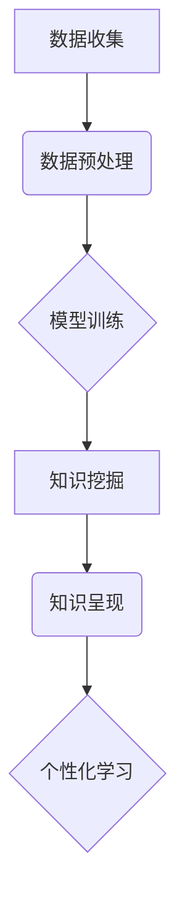

                 

## 知识发现引擎：推动教育行业的个性化变革

> 关键词：知识发现引擎、个性化学习、机器学习、数据挖掘、教育科技、人工智能、学习路径

## 1. 背景介绍

教育行业正处于数字化转型和个性化学习的浪潮中。传统的“一刀切”教学模式难以满足学生个性化的学习需求，而知识发现引擎作为一种新兴技术，为教育行业提供了新的可能性。

知识发现引擎（Knowledge Discovery Engine，KDE）是一种能够从海量数据中挖掘出有价值知识的智能系统。它利用机器学习、数据挖掘等技术，分析学生学习行为、知识结构、学习偏好等数据，并生成个性化的学习建议、学习路径、学习资源推荐等，从而实现个性化学习的目标。

## 2. 核心概念与联系

### 2.1  知识发现引擎

知识发现引擎的核心是将数据转化为知识的过程。它通过以下步骤实现：

1. **数据收集:** 收集学生学习行为、知识结构、学习偏好等数据。
2. **数据预处理:** 对收集到的数据进行清洗、转换、整合等处理，使其适合模型训练。
3. **模型训练:** 利用机器学习算法，训练模型以识别学习模式、预测学习效果等。
4. **知识挖掘:** 利用训练好的模型，从数据中挖掘出有价值的知识，例如学生学习难点、学习兴趣、个性化学习路径等。
5. **知识呈现:** 将挖掘出的知识以可理解的方式呈现给用户，例如学习建议、学习资源推荐等。

### 2.2  个性化学习

个性化学习是指根据学生的个体差异，定制化的学习方案和学习体验。它强调学生的自主学习、自驱学习和个性化发展。

### 2.3  关系图



## 3. 核心算法原理 & 具体操作步骤

### 3.1  算法原理概述

知识发现引擎的核心算法主要包括：

* **机器学习算法:** 用于分析学生学习行为、知识结构、学习偏好等数据，识别学习模式、预测学习效果等。常见的机器学习算法包括：
    * **分类算法:** 用于将学生分为不同的学习类型，例如视觉学习型、听觉学习型等。
    * **回归算法:** 用于预测学生的学习成绩、学习进度等。
    * **聚类算法:** 用于将学生按照学习行为、知识结构等特征进行分组，发现学生学习的共同特点。
* **数据挖掘算法:** 用于从海量数据中挖掘出有价值的知识，例如学生学习难点、学习兴趣、个性化学习路径等。常见的算法包括：
    * **关联规则挖掘:** 用于发现学生学习行为之间的关联关系，例如哪些知识点经常被一起学习。
    * **序列模式挖掘:** 用于发现学生学习行为的序列模式，例如学生学习知识点的顺序。
    * **异常检测:** 用于发现学生学习行为的异常情况，例如学生学习进度突然下降。

### 3.2  算法步骤详解

1. **数据收集:** 收集学生学习行为、知识结构、学习偏好等数据。数据来源可以包括：
    * 学生学习平台的学习记录
    * 学生作业和考试成绩
    * 学生在线论坛和讨论区的参与记录
    * 学生问答和反馈信息
2. **数据预处理:** 对收集到的数据进行清洗、转换、整合等处理，使其适合模型训练。
    * 数据清洗: 去除数据中的噪声、缺失值等异常数据。
    * 数据转换: 将数据转换为模型可以理解的格式。
    * 数据整合: 将来自不同来源的数据整合在一起。
3. **模型训练:** 利用机器学习算法，训练模型以识别学习模式、预测学习效果等。
    * 选择合适的机器学习算法，根据具体任务需求进行模型选择。
    * 使用训练数据训练模型，调整模型参数，使其能够准确地识别学习模式、预测学习效果等。
4. **知识挖掘:** 利用训练好的模型，从数据中挖掘出有价值的知识，例如学生学习难点、学习兴趣、个性化学习路径等。
    * 利用数据挖掘算法，从学生学习行为、知识结构等数据中挖掘出有价值的知识。
    * 将挖掘出的知识进行分析、解释，使其具有可操作性。
5. **知识呈现:** 将挖掘出的知识以可理解的方式呈现给用户，例如学习建议、学习资源推荐等。
    * 将知识以图表、文本、交互式界面等形式呈现给用户。
    * 提供个性化的学习建议、学习资源推荐等，帮助学生更好地学习。

### 3.3  算法优缺点

**优点:**

* **个性化学习:** 可以根据学生的个体差异，定制化的学习方案和学习体验。
* **提高学习效率:** 可以帮助学生更快地掌握知识，提高学习效率。
* **数据驱动:** 基于数据分析，可以更客观地评估学生的学习情况，提供更精准的学习建议。

**缺点:**

* **数据依赖:** 需要大量的数据支持，才能训练出准确的模型。
* **算法复杂:** 知识发现引擎的算法比较复杂，需要专业的技术人员进行开发和维护。
* **伦理问题:** 需要关注数据隐私和算法公平性等伦理问题。

### 3.4  算法应用领域

知识发现引擎在教育行业有着广泛的应用领域，例如：

* **个性化学习路径推荐:** 根据学生的学习能力、学习兴趣、学习目标等信息，推荐个性化的学习路径。
* **学习资源推荐:** 根据学生的学习需求，推荐相关的学习资源，例如视频、文章、练习题等。
* **学习效果评估:** 利用机器学习算法，预测学生的学习效果，及时发现学习困难，提供针对性的帮助。
* **教学策略优化:** 分析学生的学习行为数据，为教师提供教学策略优化建议。

## 4. 数学模型和公式 & 详细讲解 & 举例说明

### 4.1  数学模型构建

知识发现引擎的数学模型主要包括：

* **学生学习行为模型:** 用于描述学生的学习行为模式，例如学习时间、学习内容、学习方式等。
* **知识结构模型:** 用于描述知识之间的关系，例如概念、定义、示例等。
* **学习效果模型:** 用于预测学生的学习效果，例如学习成绩、学习进度等。

### 4.2  公式推导过程

例如，我们可以使用协同过滤算法来推荐学习资源。协同过滤算法基于用户的行为相似性来进行推荐。

假设我们有一个用户-资源评分矩阵，其中每个用户对每个资源都给出了一个评分。我们可以使用矩阵分解的方法来学习用户和资源的潜在特征。

用户 $u$ 的潜在特征向量为 $p_u$，资源 $i$ 的潜在特征向量为 $q_i$。则用户 $u$ 对资源 $i$ 的评分可以表示为：

$$r_{ui} = p_u \cdot q_i + \epsilon$$

其中 $\epsilon$ 是随机误差项。

我们可以使用梯度下降算法来优化 $p_u$ 和 $q_i$，使得预测评分与实际评分之间的误差最小。

### 4.3  案例分析与讲解

例如，我们可以使用知识图谱技术来构建知识结构模型。知识图谱是一种表示知识的图形模型，它包含实体和关系。

我们可以将学生学习到的知识点作为实体，将知识之间的关系作为关系，构建一个知识图谱。

例如，我们可以将“计算机”作为实体，将“编程”作为关系，表示“计算机”与“编程”之间存在着一种“学习”的关系。

通过分析知识图谱，我们可以发现学生学习知识的路径、知识之间的关联关系等，从而为学生提供更个性化的学习建议。

## 5. 项目实践：代码实例和详细解释说明

### 5.1  开发环境搭建

* **操作系统:** Ubuntu 20.04 LTS
* **编程语言:** Python 3.8
* **深度学习框架:** TensorFlow 2.0
* **数据处理库:** Pandas, NumPy
* **可视化库:** Matplotlib, Seaborn

### 5.2  源代码详细实现

```python
# 导入必要的库
import pandas as pd
from sklearn.model_selection import train_test_split
from sklearn.linear_model import LogisticRegression

# 加载数据
data = pd.read_csv("student_data.csv")

# 划分训练集和测试集
X_train, X_test, y_train, y_test = train_test_split(data.drop("learning_outcome", axis=1), data["learning_outcome"], test_size=0.2, random_state=42)

# 创建逻辑回归模型
model = LogisticRegression()

# 训练模型
model.fit(X_train, y_train)

# 评估模型性能
accuracy = model.score(X_test, y_test)
print(f"模型准确率: {accuracy}")

# 使用模型进行预测
predictions = model.predict(X_test)

# 打印预测结果
print(predictions)
```

### 5.3  代码解读与分析

* **数据加载:** 使用 Pandas 库加载学生学习数据。
* **数据划分:** 使用 `train_test_split` 函数将数据划分为训练集和测试集。
* **模型创建:** 使用 `LogisticRegression` 类创建逻辑回归模型。
* **模型训练:** 使用 `fit` 方法训练模型。
* **模型评估:** 使用 `score` 方法评估模型性能。
* **模型预测:** 使用 `predict` 方法对测试集进行预测。

### 5.4  运行结果展示

运行代码后，会输出模型的准确率和预测结果。

## 6. 实际应用场景

### 6.1  个性化学习路径推荐

知识发现引擎可以根据学生的学习能力、学习兴趣、学习目标等信息，推荐个性化的学习路径。例如，对于一个学习能力较强的学生，可以推荐更深入的学习内容；对于一个学习兴趣较强的学生，可以推荐更相关的学习内容。

### 6.2  学习资源推荐

知识发现引擎可以根据学生的学习需求，推荐相关的学习资源，例如视频、文章、练习题等。例如，如果学生在学习线性代数时遇到困难，知识发现引擎可以推荐相关的视频教程、练习题等。

### 6.3  学习效果评估

知识发现引擎可以利用机器学习算法，预测学生的学习效果，例如学习成绩、学习进度等。例如，如果学生的学习进度突然下降，知识发现引擎可以提醒教师及时提供帮助。

### 6.4  未来应用展望

随着人工智能技术的不断发展，知识发现引擎在教育行业的应用场景将会更加广泛。例如，可以用于自动生成个性化的学习计划、自动批改作业、自动提供学习反馈等。

## 7. 工具和资源推荐

### 7.1  学习资源推荐

* **机器学习课程:** Coursera, edX, Udacity
* **数据挖掘课程:** DataCamp, Kaggle Learn
* **人工智能书籍:** 深度学习，人工智能：一种现代方法

### 7.2  开发工具推荐

* **Python:** 编程语言
* **TensorFlow:** 深度学习框架
* **PyTorch:** 深度学习框架
* **Scikit-learn:** 机器学习库
* **Pandas:** 数据处理库
* **NumPy:** 数值计算库

### 7.3  相关论文推荐

* **Knowledge Discovery in Educational Data Mining:** https://dl.acm.org/doi/10.1145/2939672.2939705
* **Personalized Learning with Machine Learning:** https://www.frontiersin.org/articles/10.3389/feduc.2019.00083/full

## 8. 总结：未来发展趋势与挑战

### 8.1  研究成果总结

知识发现引擎在教育行业取得了显著的成果，例如个性化学习路径推荐、学习资源推荐、学习效果评估等。

### 8.2  未来发展趋势

* **更精准的个性化学习:** 利用更先进的机器学习算法，对学生的学习行为进行更精准的分析，提供更个性化的学习建议。
* **更丰富的学习资源:** 利用知识图谱、自然语言处理等技术，构建更丰富的学习资源库，满足学生的个性化学习需求。
* **更智能的教学辅助:** 利用人工智能技术，开发更智能的教学辅助工具，例如自动批改作业、自动提供学习反馈等。

### 8.3  面临的挑战

* **数据隐私保护:** 知识发现引擎需要处理大量的学生数据，因此需要关注数据隐私保护问题。
* **算法公平性:** 算法模型可能存在偏见，导致对不同学生的学习建议不公平。
* **技术可解释性:** 复杂的机器学习算法难以解释，这可能会导致教师和学生对学习建议的信任度降低。

### 8.4  研究展望

未来，知识发现引擎的研究将更加注重数据隐私保护、算法公平性、技术可解释性等方面。


## 9. 附录：常见问题与解答

### 9.1  知识发现引擎需要多少数据才能训练出准确的模型？

这取决于具体的应用场景和模型复杂度。一般来说，需要至少几千条数据才能训练出相对准确的模型。

### 9.2  知识发现引擎的算法是否会存在偏见？

是的，算法模型可能存在偏见，导致对不同学生的学习建议不公平。因此，需要在算法设计和模型训练过程中，尽量减少偏见的影响。

### 9.3  如何保证知识发现引擎的安全性？

需要采取以下措施保证知识发现引擎的安全性：

* **数据加密:** 对学生数据进行加密，防止数据泄露。
* **权限控制:** 对知识发现引擎的访问权限进行控制，防止未授权人员访问数据。
* **安全审计:** 定期对知识发现引擎的系统进行安全审计，发现并修复安全漏洞。

作者：禅与计算机程序设计艺术 / Zen and the Art of Computer Programming


<end_of_turn>

