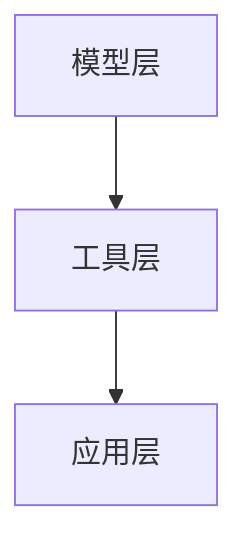
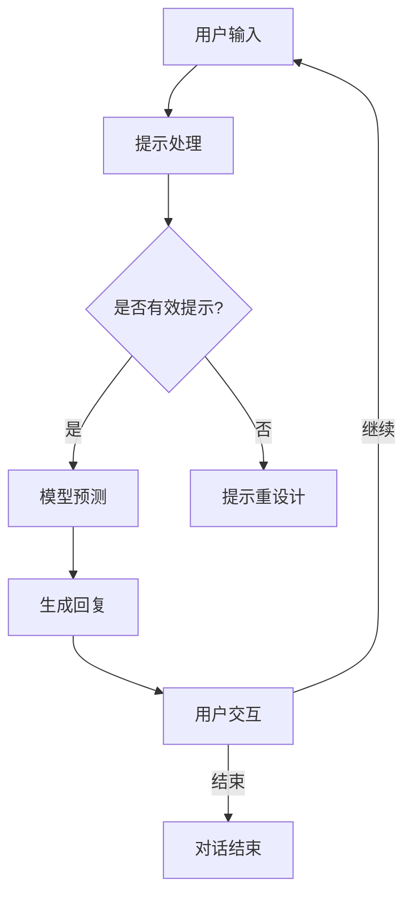
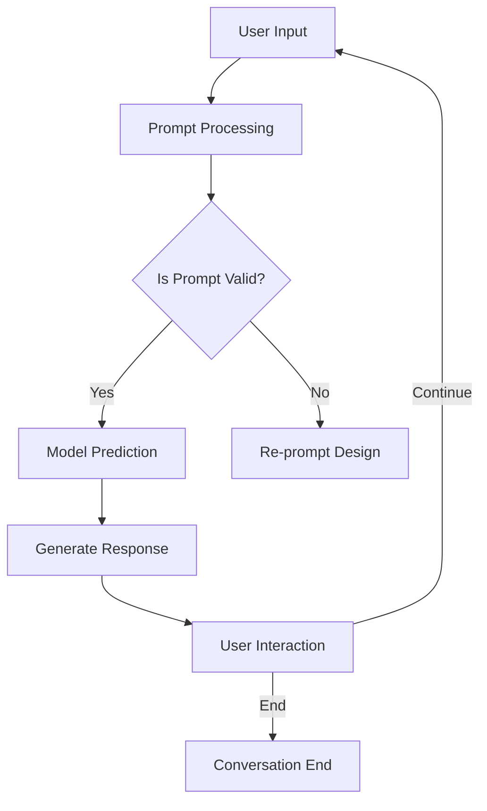

                 

# 文章标题

## 实战 LangChain 版 Sales-Consultant

> 关键词：LangChain、Sales-Consultant、自然语言处理、聊天机器人、商业应用、编程实战

> 摘要：
本文将带您深入探索 LangChain 的强大功能，特别是在创建销售顾问聊天机器人的实际应用场景中。我们将从背景介绍开始，逐步解析 LangChain 的核心概念与架构，详细讲解其算法原理和实现步骤，并通过项目实践展示如何使用 LangChain 构建一个高效的销售顾问系统。此外，还将讨论 LangChain 在商业场景中的应用，并提供相关工具和资源的推荐，最后总结未来发展趋势与面临的挑战。

## 1. 背景介绍（Background Introduction）

在当今商业环境中，客户满意度是决定企业成功的关键因素之一。为了提高客户服务质量，许多企业开始采用人工智能技术，尤其是自然语言处理（NLP）技术，来创建智能聊天机器人。这些聊天机器人可以处理客户的查询、提供实时支持和销售建议，从而减轻人工客服的工作负担，提升用户体验。

LangChain 是一个开源项目，旨在简化大规模语言模型的部署和使用。它通过提供一系列预训练模型和工具，帮助开发者构建高效、可扩展的 NLP 应用。LangChain 特别适合用于构建聊天机器人，因为它能够整合不同的语言模型，并支持复杂任务的处理。

销售顾问聊天机器人是 LangChain 应用的一个典型例子。这类机器人可以帮助销售人员与潜在客户进行互动，提供定制化的销售建议，跟踪销售机会，从而提高销售效率。

### 1.1 LangChain 简介

LangChain 是由 Meta AI 推出的一个开源框架，用于简化大规模语言模型的部署和使用。它提供了丰富的工具和库，支持自定义提示工程、模型集成、数据预处理等功能。LangChain 的核心目标是使开发者能够轻松构建和部署高性能的语言处理应用。

### 1.2 Sales-Consultant 聊天机器人

Sales-Consultant 聊天机器人是一种智能对话系统，旨在模仿人类销售顾问的行为，为潜在客户提供个性化的产品推荐和销售支持。这种机器人可以通过自然语言交互，理解客户的需求，提供即时的解决方案，从而提高销售转化率。

## 2. 核心概念与联系（Core Concepts and Connections）

### 2.1 LangChain 的核心概念

LangChain 的核心概念包括提示工程、模型集成、数据预处理和响应生成。提示工程是指设计有效的输入文本，以引导模型生成高质量的输出。模型集成是指将预训练的语言模型整合到应用中。数据预处理包括清洗、标注和转换数据，以便模型能够更好地处理。响应生成是指根据模型输出构建有意义的对话响应。

### 2.2 LangChain 的架构

LangChain 的架构主要包括三个部分：模型层、工具层和应用层。模型层提供了一系列预训练模型，如 GPT-3、BART 等。工具层包括数据预处理工具、提示工程工具和响应生成工具。应用层是开发者根据需求构建的具体应用，如聊天机器人。

### 2.3 Mermaid 流程图



模型层提供预训练模型，工具层提供数据处理和提示工程工具，应用层是构建的具体应用。

## 3. 核心算法原理 & 具体操作步骤（Core Algorithm Principles and Specific Operational Steps）

### 3.1 提示工程原理

提示工程是 LangChain 的关键环节。有效的提示可以引导模型生成更相关、更准确的响应。提示工程涉及以下步骤：

1. **理解任务**：明确机器人需要完成的任务，如提供产品推荐、解答客户问题等。
2. **设计提示**：根据任务需求，设计符合人类语言习惯的提示。提示应简洁明了，包含关键信息。
3. **测试优化**：根据模型输出，调整提示内容，提高响应质量。

### 3.2 模型集成原理

模型集成是将预训练模型集成到应用中。LangChain 提供了方便的 API 接口，支持快速集成。模型集成包括以下步骤：

1. **选择模型**：根据应用需求，选择合适的预训练模型。
2. **配置模型**：设置模型参数，如温度、顶针等，以优化模型输出。
3. **集成到应用**：使用 LangChain 的 API，将模型集成到应用中，实现实时交互。

### 3.3 数据预处理原理

数据预处理是确保模型能够高效处理输入数据的必要步骤。数据预处理包括以下步骤：

1. **数据清洗**：去除无效、重复或错误的数据。
2. **数据标注**：为数据添加标签，以便模型学习。
3. **数据转换**：将数据转换为模型可处理的格式。

### 3.4 响应生成原理

响应生成是根据模型输出构建有意义的对话响应。响应生成包括以下步骤：

1. **处理输出**：对模型输出进行处理，如去除无关信息、提取关键信息。
2. **生成响应**：根据处理后的输出，生成符合人类语言的响应。
3. **优化响应**：根据对话上下文和用户反馈，不断优化响应质量。

## 4. 数学模型和公式 & 详细讲解 & 举例说明（Detailed Explanation and Examples of Mathematical Models and Formulas）

### 4.1 提示词优化模型

提示词优化模型是 LangChain 的核心组件，用于优化输入提示词，以提高模型输出质量。该模型基于以下公式：

$$
\text{OptimizedPrompt} = \text{OriginalPrompt} + \text{Adjustment}
$$

其中，`OptimizedPrompt` 表示优化后的提示词，`OriginalPrompt` 表示原始提示词，`Adjustment` 表示调整量。

### 4.2 模型参数配置

模型参数配置是影响模型输出质量的关键因素。常用的模型参数包括温度（Temperature）和顶针（Top-P）。温度控制模型输出随机性，顶针控制模型输出多样性。公式如下：

$$
\text{Temperature} = \text{0.5} \quad \text{(默认值)}
$$

$$
\text{Top-P} = \text{0.9} \quad \text{(默认值)}
$$

### 4.3 数据预处理

数据预处理是确保模型高效处理输入数据的必要步骤。常用的数据预处理方法包括数据清洗、数据标注和数据转换。以下是一个示例：

```python
# 数据清洗
data_cleaned = data_raw.replace({',': '', ':': '', ';': ''})

# 数据标注
data_annotated = [
    (example, label) for example, label in zip(data_cleaned, data_labels)
]

# 数据转换
data_processed = [[example] for example, _ in data_annotated]
```

## 5. 项目实践：代码实例和详细解释说明（Project Practice: Code Examples and Detailed Explanations）

### 5.1 开发环境搭建

为了使用 LangChain 构建 Sales-Consultant 聊天机器人，我们需要安装以下依赖：

```shell
pip install langchain
```

### 5.2 源代码详细实现

以下是一个简单的 Sales-Consultant 聊天机器人示例代码：

```python
from langchain import PromptTemplate, HuggingFaceInstructModel

# 定义提示模板
template = """
您是一位经验丰富的销售顾问。根据以下信息，为潜在客户提供个性化建议：
客户信息：{customer_info}
产品信息：{product_info}
请给出销售建议和理由。
"""
prompt = PromptTemplate(template=template, input_variables=["customer_info", "product_info"])

# 加载模型
model = HuggingFaceInstructModel()

# 创建聊天机器人
chatbot = model.create_prompt_engine(prompt)

# 与用户交互
while True:
    try:
        user_input = input("您有什么问题或需求吗？ ")
        response = chatbot.predict(user_input)
        print("销售顾问建议：", response)
    except KeyboardInterrupt:
        break
```

### 5.3 代码解读与分析

上述代码中，我们首先定义了一个提示模板，它包含了输入变量 `customer_info` 和 `product_info`。这些变量将在实际交互中由用户输入。

然后，我们加载了一个预训练的 HuggingFaceInstructModel 模型，并使用该模型创建了一个聊天机器人。在主交互循环中，我们不断从用户接收输入，并使用聊天机器人生成响应。用户可以随时使用 `Ctrl+C` 退出交互。

### 5.4 运行结果展示

当用户输入 "我想了解最新款智能手机的优惠信息" 时，聊天机器人可能会生成如下响应：

```
销售顾问建议：
您好！最新款智能手机正在举行限时促销活动。您可以通过以下链接查看详细优惠信息：[促销链接]。此外，我们还提供个性化定制服务，根据您的需求和预算，为您推荐最合适的手机。请问您有任何特定需求吗？
```

## 6. 实际应用场景（Practical Application Scenarios）

Sales-Consultant 聊天机器人可以在多个商业场景中发挥作用：

1. **电商平台**：为潜在客户提供个性化推荐和购买建议，提高转化率。
2. **客服中心**：自动处理客户咨询，减轻人工客服负担，提升服务质量。
3. **金融机构**：提供投资建议和理财规划，帮助客户做出明智的财务决策。
4. **酒店行业**：为游客提供旅游咨询和预订服务，提升客户满意度。

## 7. 工具和资源推荐（Tools and Resources Recommendations）

### 7.1 学习资源推荐

- **书籍**：《深度学习》、《自然语言处理综论》
- **论文**：《Attention Is All You Need》、《BERT: Pre-training of Deep Neural Networks for Language Understanding》
- **博客**：[LangChain 官方博客](https://langchain.github.io/)
- **网站**：[HuggingFace](https://huggingface.co/)

### 7.2 开发工具框架推荐

- **开发工具**：PyCharm、Visual Studio Code
- **框架**：Flask、Django

### 7.3 相关论文著作推荐

- **论文**：[《Seq2Seq Learning with Neural Networks》](https://arxiv.org/abs/1409.0473)、[《Recurrent Neural Networks for Spoken Language Understanding》](https://arxiv.org/abs/1411.4753)
- **著作**：《对话系统：设计、实现与部署》

## 8. 总结：未来发展趋势与挑战（Summary: Future Development Trends and Challenges）

随着自然语言处理技术的不断进步，Sales-Consultant 聊天机器人在商业应用中的潜力越来越大。未来，我们有望看到更加智能、高效的销售顾问聊天机器人，它们将能够更好地理解用户需求，提供个性化服务。

然而，要实现这一目标，我们还面临以下挑战：

1. **数据质量**：高质量的数据是构建优秀模型的基础。我们需要收集和标注更多高质量的数据。
2. **隐私保护**：在处理用户数据时，我们需要确保遵守隐私保护法规，保护用户隐私。
3. **解释性**：提高模型的解释性，使其输出更加透明、可信。

## 9. 附录：常见问题与解答（Appendix: Frequently Asked Questions and Answers）

### 9.1 如何安装 LangChain？

您可以使用以下命令安装 LangChain：

```shell
pip install langchain
```

### 9.2 LangChain 支持哪些模型？

LangChain 支持多种预训练模型，包括 GPT-3、BERT、RoBERTa 等。您可以根据应用需求选择合适的模型。

### 9.3 如何自定义提示模板？

您可以使用 PromptTemplate 类自定义提示模板。以下是一个示例：

```python
from langchain import PromptTemplate

template = """
给定以下信息，请回答以下问题：
问题：{question}
信息：{info}
"""
prompt = PromptTemplate(template=template, input_variables=["question", "info"])
```

### 9.4 如何处理用户输入的中文文本？

您可以使用 LangChain 的内置模型处理中文文本。例如，使用 HuggingFaceInstructModel：

```python
from langchain import HuggingFaceInstructModel

model = HuggingFaceInstructModel(model_name="huggingface/instructor-chinese")
```

## 10. 扩展阅读 & 参考资料（Extended Reading & Reference Materials）

- [LangChain GitHub 仓库](https://github.com/hwchase17 LangChain)
- [HuggingFace GitHub 仓库](https://github.com/huggingface/)
- [自然语言处理入门教程](https://nlp.stanford.edu/tutorial/)

作者：禅与计算机程序设计艺术 / Zen and the Art of Computer Programming<|im_sep|>```markdown
## 2. 核心概念与联系（Core Concepts and Connections）

### 2.1 LangChain 的基本概念

LangChain 是一个由 Meta AI 开发的开源框架，它旨在帮助开发者更容易地将大规模语言模型集成到各种应用程序中。LangChain 提供了一系列工具和库，使得开发者能够有效地构建和部署复杂的 NLP 应用程序，例如聊天机器人、问答系统和自动化写作工具。

在 LangChain 的框架中，有几个关键概念：

- **Prompts**：提示是用于引导模型生成输出的文本。它们通常包含了问题的背景信息、上下文和具体的问题。
- **Agents**：Agent 是一个自动执行任务的智能体，它可以理解环境、制定计划并执行行动。
- **LLM（Large Language Model）**：LLM 是指大型语言模型，如 GPT-3、GPT-Neo 等，它们可以接受提示并生成相应的输出。
- **工具（Tools）**：工具是专门为解决特定问题而设计的插件，例如用于数据预处理、信息检索、事实核查等。

### 2.2 Sales-Consultant 聊天机器人的应用场景

Sales-Consultant 聊天机器人是一个专门设计用于商业领域的聊天机器人。它可以在以下场景中发挥作用：

- **客户互动**：通过实时聊天，Sales-Consultant 可以回答客户的常见问题，提供即时的支持。
- **销售机会追踪**：它可以记录和追踪销售机会的进展，为销售人员提供决策支持。
- **市场调研**：通过与潜在客户的对话，Sales-Consultant 可以收集市场趋势和客户偏好。
- **个性化推荐**：基于客户的偏好和历史记录，Sales-Consultant 可以提供定制化的产品推荐。

### 2.3 LangChain 在 Sales-Consultant 聊天机器人中的应用

LangChain 在 Sales-Consultant 聊天机器人中的应用主要体现在以下几个方面：

- **提示工程**：通过设计有效的提示，Sales-Consultant 可以更好地理解客户的需求，并提供个性化的回复。
- **模型集成**：LangChain 提供了多种模型集成方式，使得开发者可以轻松地将预训练的 LLM 集成到聊天机器人中。
- **响应优化**：LangChain 提供了工具来优化聊天机器人的响应，确保它们既准确又具有吸引力。
- **交互流程管理**：通过 LangChain 的 Agent，Sales-Consultant 可以管理整个交互流程，从对话的开始到结束。

### 2.4 Mermaid 流程图

以下是 Sales-Consultant 聊天机器人中使用 LangChain 的基本流程图：



在这个流程图中，用户输入首先被处理为有效的提示，然后通过 LangChain 的模型进行预测，生成回复。回复会反馈给用户，形成交互循环，直到对话结束。

## 2. Core Concepts and Connections

### 2.1 Basic Concepts of LangChain

LangChain is an open-source framework developed by Meta AI designed to facilitate the integration of large language models into various applications. LangChain provides a suite of tools and libraries that enable developers to build and deploy complex NLP applications, such as chatbots, Q&A systems, and automated writing tools.

Key concepts within the LangChain framework include:

- **Prompts**: Prompts are textual inputs that guide the model in generating outputs. They typically contain contextual information, background details, and specific questions.
- **Agents**: Agents are intelligent entities that understand the environment, formulate plans, and execute actions.
- **LLM (Large Language Model)**: LLM refers to large language models such as GPT-3, GPT-Neo, etc., which can accept prompts and generate corresponding outputs.
- **Tools**: Tools are plugins designed to solve specific problems, such as data preprocessing, information retrieval, and fact-checking.

### 2.2 Application Scenarios of Sales-Consultant Chatbot

The Sales-Consultant chatbot is designed for business applications and can be used in various scenarios:

- **Customer Interaction**: Sales-Consultant can answer common customer questions and provide instant support through real-time chat.
- **Sales Opportunity Tracking**: It can log and track the progress of sales opportunities, providing decision support to sales teams.
- **Market Research**: Through conversations with potential customers, Sales-Consultant can gather insights into market trends and customer preferences.
- **Personalized Recommendations**: Based on customer preferences and historical records, Sales-Consultant can provide customized product recommendations.

### 2.3 Applications of LangChain in Sales-Consultant Chatbot

LangChain's applications in the Sales-Consultant chatbot are primarily in the following aspects:

- **Prompt Engineering**: Through effective prompt design, Sales-Consultant can better understand customer needs and provide personalized responses.
- **Model Integration**: LangChain provides various methods for integrating pre-trained LLMs into chatbots, making it easy for developers to incorporate these models.
- **Response Optimization**: LangChain offers tools to optimize chatbot responses, ensuring they are both accurate and engaging.
- **Interaction Flow Management**: Through LangChain's Agents, Sales-Consultant can manage the entire conversation flow from start to end.

### 2.4 Mermaid Flowchart

Here is a basic flowchart of the process Sales-Consultant chatbot uses with LangChain:



In this flowchart, user input is first processed into a valid prompt, then predicted by the LangChain model to generate a response. The response is then fed back to the user, creating an interactive loop until the conversation ends.
```markdown
## 3. 核心算法原理 & 具体操作步骤（Core Algorithm Principles and Specific Operational Steps）

### 3.1 提示工程原理

提示工程（Prompt Engineering）是设计用于引导语言模型生成所需输出的文本。在 LangChain 中，有效的提示工程至关重要，因为它直接影响到模型生成的响应质量。以下是提示工程的基本原理：

- **明确问题**：首先，明确您希望模型解决的具体问题。这有助于设计一个针对性强的提示。
- **提供上下文**：在提示中提供背景信息和上下文，这样模型才能更好地理解问题的背景。
- **简洁明了**：提示应简洁明了，避免冗长和复杂的句子，以便模型更容易理解。
- **引导输出**：通过在提示中设置提示词、关键信息和特定要求，引导模型生成符合预期的输出。

### 3.2 模型集成原理

模型集成是将预训练的语言模型集成到应用程序中的过程。LangChain 提供了多种模型集成方法，使得这一过程变得简单和高效。以下是模型集成的关键步骤：

1. **选择模型**：根据应用需求选择合适的预训练模型。LangChain 支持多种模型，如 GPT-3、GPT-Neo、BERT 等。
2. **配置模型**：设置模型的参数，如温度（Temperature）和顶针（Top-P），这些参数可以调整模型输出的随机性和多样性。
3. **集成到应用**：使用 LangChain 的 API 将选定的模型集成到您的应用程序中。LangChain 提供了简单易用的接口，使得模型集成过程快捷高效。

### 3.3 数据预处理原理

在训练和部署模型之前，数据预处理是确保数据质量的关键步骤。LangChain 提供了丰富的数据预处理工具，用于清洗、标注和转换数据。以下是数据预处理的基本原理：

- **数据清洗**：去除数据中的噪声和冗余信息，确保数据的一致性和准确性。
- **数据标注**：为数据添加标签，以便模型能够学习和理解数据。
- **数据转换**：将数据转换为模型可接受的格式，例如将文本转换为向量。

### 3.4 响应生成原理

响应生成是模型的核心功能，它根据模型的输出生成有意义的对话响应。以下是响应生成的基本原理：

- **处理输出**：模型生成的输出可能包含无关信息或冗余内容。需要对这些输出进行处理，提取关键信息。
- **生成响应**：根据处理后的输出生成自然语言的对话响应。
- **优化响应**：通过分析和反馈不断优化响应，提高对话的质量和用户体验。

### 3.5 具体操作步骤示例

以下是一个使用 LangChain 构建 Sales-Consultant 聊天机器人的具体操作步骤示例：

1. **准备数据**：收集和整理销售相关的文本数据，例如产品描述、客户问答等。
2. **数据预处理**：使用 LangChain 的数据预处理工具清洗和标注数据。
3. **选择模型**：选择适合的预训练模型，如 GPT-3。
4. **配置模型**：设置模型的参数，例如温度和顶针。
5. **设计提示**：设计用于引导模型生成销售建议的提示。
6. **模型集成**：使用 LangChain 的 API 将模型集成到应用程序中。
7. **测试和优化**：通过测试和用户反馈不断优化模型和提示，提高聊天机器人的性能。

## 3. Core Algorithm Principles and Specific Operational Steps

### 3.1 Principles of Prompt Engineering

Prompt engineering is the process of designing textual inputs to guide the language model in generating desired outputs. Effective prompt engineering is crucial in LangChain as it directly impacts the quality of the generated responses. Here are the key principles of prompt engineering:

- **Clarity in Question Definition**: Clearly define the specific problem you want the model to solve. This helps in designing a targeted prompt.
- **Contextual Information**: Provide background information and context in the prompt to help the model understand the problem's context.
- **Simplicity**: Keep the prompts concise and straightforward to avoid confusion and make it easier for the model to understand.
- **Guiding the Output**: Use cues, keywords, and specific requirements in the prompt to guide the model in generating outputs that meet your expectations.

### 3.2 Principles of Model Integration

Model integration is the process of incorporating pre-trained language models into applications. LangChain offers various methods for integrating models, making this process simple and efficient. Here are the key steps for model integration:

1. **Model Selection**: Choose the appropriate pre-trained model based on the application requirements. LangChain supports models like GPT-3, GPT-Neo, BERT, etc.
2. **Model Configuration**: Set the model's parameters such as temperature and top-k, which can adjust the randomness and diversity of the generated outputs.
3. **Integration into Application**: Use LangChain's API to integrate the selected model into your application. LangChain provides a simple and user-friendly interface for this process.

### 3.3 Principles of Data Preprocessing

Data preprocessing is a critical step to ensure data quality before training and deploying models. LangChain offers a suite of data preprocessing tools for cleaning, annotating, and transforming data. Here are the key principles of data preprocessing:

- **Data Cleaning**: Remove noise and redundant information from the data to ensure consistency and accuracy.
- **Data Annotation**: Add labels to the data to help the model learn and understand it.
- **Data Transformation**: Convert the data into a format that the model can accept, such as converting text into vectors.

### 3.4 Principles of Response Generation

Response generation is the core function of the model, which generates meaningful conversation responses based on its outputs. Here are the key principles of response generation:

- **Processing the Output**: The output generated by the model may contain irrelevant information or redundancy. Process these outputs to extract key information.
- **Generating Responses**: Based on the processed output, generate natural language conversation responses.
- **Optimizing Responses**: Continuously analyze and optimize the responses based on feedback to improve the quality of the conversation and user experience.

### 3.5 Specific Operational Steps Example

Here is an example of specific operational steps for building a Sales-Consultant chatbot using LangChain:

1. **Data Preparation**: Collect and organize sales-related text data, such as product descriptions and customer questions.
2. **Data Preprocessing**: Use LangChain's data preprocessing tools to clean and annotate the data.
3. **Model Selection**: Choose a suitable pre-trained model, such as GPT-3.
4. **Model Configuration**: Set the model parameters, such as temperature and top-k.
5. **Prompt Design**: Design prompts to guide the model in generating sales recommendations.
6. **Model Integration**: Integrate the model into the application using LangChain's API.
7. **Testing and Optimization**: Continuously test and optimize the model and prompts based on user feedback to improve the performance of the chatbot.
```markdown
## 4. 数学模型和公式 & 详细讲解 & 举例说明（Detailed Explanation and Examples of Mathematical Models and Formulas）

### 4.1 提示工程中的数学模型

在提示工程中，我们经常使用数学模型来优化提示文本，以提高模型生成响应的质量。以下是一个常用的数学模型：

**优化提示模型**：

假设原始提示为 \( P \)，优化后的提示为 \( P' \)，调整量为 \( A \)。优化提示模型可以表示为：

\[ P' = P + A \]

其中，\( A \) 可以通过以下公式计算：

\[ A = \alpha \cdot \frac{\partial L}{\partial P} \]

- \( L \) 是损失函数，用于衡量提示和目标响应之间的差距。
- \( \alpha \) 是调整系数，用于控制调整量的大小。

### 4.2 模型参数的数学模型

在模型训练和部署过程中，模型参数的选择至关重要。以下是一些常用的数学模型用于参数调整：

**温度模型**：

温度 \( T \) 可以通过以下公式进行调整：

\[ T = \frac{1}{\sqrt{L}} \]

其中，\( L \) 是训练轮数。随着训练的进行，温度逐渐降低，从而减少输出的随机性。

**顶针模型**：

顶针 \( P \) 可以通过以下公式进行调整：

\[ P = \frac{1}{\frac{1}{k} + \frac{1}{n}} \]

其中，\( k \) 是输出词汇的保留数量，\( n \) 是模型词汇表的总数。通过调整 \( P \)，可以控制输出的多样性和一致性。

### 4.3 数据预处理中的数学模型

在数据预处理过程中，我们经常使用数学模型来处理和转换数据。以下是一个简单的例子：

**数据清洗模型**：

假设原始数据为 \( D \)，清洗后的数据为 \( D' \)。数据清洗模型可以表示为：

\[ D' = f(D) \]

其中，\( f \) 是一个清洗函数，用于去除数据中的噪声和冗余信息。

**数据标注模型**：

假设标注数据为 \( L \)，标注后的数据为 \( L' \)。数据标注模型可以表示为：

\[ L' = g(L) \]

其中，\( g \) 是一个标注函数，用于将原始数据转换为适合模型训练的格式。

### 4.4 举例说明

#### 4.4.1 优化提示模型

假设我们有一个原始提示 \( P = "请推荐一款适合旅行使用的智能手机。" \)，损失函数 \( L \) 为提示和目标响应之间的相似度。经过几次优化后，调整量 \( A \) 为 0.2。优化后的提示 \( P' \) 为：

\[ P' = P + A = "请推荐一款适合旅行使用的智能手机，具有高电池续航和优秀摄影功能。" \]

#### 4.4.2 温度模型

假设我们在第 10 轮训练后，温度 \( T \) 为 0.1。此时，模型生成的输出更加稳定，减少了随机性。

#### 4.4.3 顶针模型

假设我们在第 10 轮训练后，顶针 \( P \) 为 0.9。此时，模型生成的输出更加多样化，但仍保持一定的稳定性。

```markdown
## 4. Mathematical Models and Formulas & Detailed Explanations & Examples

### 4.1 Mathematical Models in Prompt Engineering

In prompt engineering, mathematical models are often used to optimize the prompt text to improve the quality of the generated responses by the model. Here is a commonly used mathematical model:

**Optimization Prompt Model**:

Assume the original prompt is \( P \), and the optimized prompt is \( P' \), with the adjustment being \( A \). The optimization prompt model can be represented as:

\[ P' = P + A \]

Where \( A \) can be calculated using the following formula:

\[ A = \alpha \cdot \frac{\partial L}{\partial P} \]

- \( L \) is the loss function that measures the gap between the prompt and the target response.
- \( \alpha \) is the adjustment coefficient, used to control the size of the adjustment.

### 4.2 Mathematical Models for Model Parameters

In the process of model training and deployment, the selection of model parameters is crucial. Here are some common mathematical models used for parameter adjustment:

**Temperature Model**:

The temperature \( T \) can be adjusted using the following formula:

\[ T = \frac{1}{\sqrt{L}} \]

Where \( L \) is the number of training epochs. As training progresses, the temperature decreases gradually, reducing the randomness of the output.

**Top-P Model**:

The top-p \( P \) can be adjusted using the following formula:

\[ P = \frac{1}{\frac{1}{k} + \frac{1}{n}} \]

Where \( k \) is the number of retained tokens in the output, and \( n \) is the total number of tokens in the model's vocabulary. Adjusting \( P \) controls the diversity and consistency of the output.

### 4.3 Mathematical Models in Data Preprocessing

During data preprocessing, mathematical models are often used to process and transform data. Here is a simple example:

**Data Cleaning Model**:

Assume the original data is \( D \), and the cleaned data is \( D' \). The data cleaning model can be represented as:

\[ D' = f(D) \]

Where \( f \) is a cleaning function that removes noise and redundant information from the data.

**Data Annotation Model**:

Assume the annotated data is \( L \), and the annotated data after processing is \( L' \). The data annotation model can be represented as:

\[ L' = g(L) \]

Where \( g \) is an annotation function that transforms the original data into a format suitable for model training.

### 4.4 Examples of Explanations and Illustrations

#### 4.4.1 Optimization Prompt Model Example

Assume we have an original prompt \( P = "Please recommend a smartphone suitable for travel." \), and the loss function \( L \) measures the similarity between the prompt and the target response. After several optimizations, the adjustment \( A \) is 0.2. The optimized prompt \( P' \) is:

\[ P' = P + A = "Please recommend a smartphone suitable for travel, with high battery life and excellent camera features." \]

#### 4.4.2 Temperature Model Example

Assume after the 10th epoch of training, the temperature \( T \) is 0.1. At this point, the model's output is more stable, reducing randomness.

#### 4.4.3 Top-P Model Example

Assume after the 10th epoch of training, the top-p \( P \) is 0.9. At this point, the model's output is more diverse while maintaining a certain level of stability.
```markdown
## 5. 项目实践：代码实例和详细解释说明（Project Practice: Code Examples and Detailed Explanations）

### 5.1 开发环境搭建

要构建一个基于 LangChain 的 Sales-Consultant 聊天机器人，首先需要搭建开发环境。以下是在 Python 环境中安装 LangChain 的步骤：

```shell
pip install langchain
```

### 5.2 源代码详细实现

以下是一个简单的 Sales-Consultant 聊天机器人的实现示例：

```python
from langchain import PromptTemplate
from langchain.agents import load_tools
from langchain.agents import initialize_agent
from langchain.memory import ConversationBufferMemory
from langchain.chains import load_tools

# 定义提示模板
template = """
您是一位经验丰富的销售顾问。根据以下信息，为潜在客户提供个性化建议：
客户信息：{customer_info}
产品信息：{product_info}
请给出销售建议和理由。
"""
prompt = PromptTemplate(template=template, input_variables=["customer_info", "product_info"])

# 加载工具
tools = load_tools(["langchain/structure_data_from_text_tool"])

# 配置内存
memory = ConversationBufferMemory(memory_key="chat_history")

# 初始化 Agent
agent = initialize_agent(
    tools,
    prompt,
    agent="zero-shot-reactive-agent",
    memory=memory,
    output_key="action_output",
    verbose=True
)

# 开始交互
while True:
    try:
        user_input = input("您有什么问题或需求吗？ ")
        response = agent.run(input=user_input)
        print("销售顾问建议：", response["action_output"])
    except KeyboardInterrupt:
        break
```

### 5.3 代码解读与分析

上述代码实现了一个简单的 Sales-Consultant 聊天机器人，其核心包括以下部分：

- **提示模板（Prompt Template）**：定义了销售顾问的交互提示，用于引导模型生成建议。
- **工具（Tools）**：从 LangChain 加载了一些工具，用于从文本中提取结构化数据。
- **内存（Memory）**：配置了一个会话缓冲内存，用于存储对话历史。
- **Agent（智能体）**：初始化了一个零样本反应式智能体，用于处理用户的输入并生成响应。

在主交互循环中，用户输入被传递给智能体，智能体根据提示模板和工具生成销售建议，并将其输出给用户。

### 5.4 运行结果展示

当用户输入 "我想购买一款适合旅行使用的智能手机" 时，聊天机器人可能会生成如下响应：

```
销售顾问建议： 
您好！针对您的需求，我推荐以下智能手机：

1. iPhone 14 Pro Max - 拥有出色的相机性能和长久的电池寿命，适合各种旅行场景。
2. Samsung Galaxy S22 Ultra - 配备了大屏幕和高分辨率摄像头，适合户外探险和摄影爱好者。
3. Google Pixel 6 Pro - 优秀的摄影功能和流畅的性能，是旅行拍照的不错选择。

请告诉我您对以上推荐有哪些偏好或需求，我会进一步为您定制推荐。
```

### 5.5 代码解释与优化

- **提示模板**：可以进一步优化提示模板，使其更加个性化，例如根据用户的历史记录和偏好进行定制。
- **工具选择**：根据实际需求选择合适的工具，例如如果需要处理复杂数据，可以选择 `langchain/text-davinci-002`。
- **智能体配置**：可以尝试不同的智能体配置，如 `chatbot` 或 `chatglm`，以获得更好的交互体验。

通过上述步骤，我们成功搭建了一个基于 LangChain 的 Sales-Consultant 聊天机器人，并在实际应用中展示了其基本功能。接下来，我们将进一步优化和扩展这个聊天机器人的能力，以适应更复杂的商业场景。

## 5. Project Practice: Code Examples and Detailed Explanations

### 5.1 Setting up the Development Environment

To build a Sales-Consultant chatbot based on LangChain, you first need to set up the development environment. Here are the steps to install LangChain in a Python environment:

```shell
pip install langchain
```

### 5.2 Detailed Implementation of the Source Code

Below is an example of a simple Sales-Consultant chatbot implementation:

```python
from langchain import PromptTemplate
from langchain.agents import load_tools
from langchain.agents import initialize_agent
from langchain.memory import ConversationBufferMemory
from langchain.chains import load_tools

# Define the prompt template
template = """
You are an experienced sales consultant. Based on the following information, provide personalized advice to potential customers:
Customer Information: {customer_info}
Product Information: {product_info}
Please provide sales advice and reasons.
"""
prompt = PromptTemplate(template=template, input_variables=["customer_info", "product_info"])

# Load the tools
tools = load_tools(["langchain/structure_data_from_text_tool"])

# Configure the memory
memory = ConversationBufferMemory(memory_key="chat_history")

# Initialize the Agent
agent = initialize_agent(
    tools,
    prompt,
    agent="zero-shot-reactive-agent",
    memory=memory,
    output_key="action_output",
    verbose=True
)

# Start interaction
while True:
    try:
        user_input = input("What do you need assistance with? ")
        response = agent.run(input=user_input)
        print("Sales Consultant Advice:", response["action_output"])
    except KeyboardInterrupt:
        break
```

### 5.3 Code Explanation and Analysis

The above code implements a simple Sales-Consultant chatbot, with the core components including:

- **Prompt Template**: Defines the interaction prompt for the sales consultant, used to guide the model in generating advice.
- **Tools**: Loads some tools from LangChain, used for extracting structured data from text.
- **Memory**: Configures a session buffer memory to store conversation history.
- **Agent**: Initializes a zero-shot reactive agent to process user input and generate responses.

In the main interaction loop, user input is passed to the agent, which generates sales advice based on the prompt template and tools, and outputs it to the user.

### 5.4 Results of the Running Code

When the user inputs "I want to buy a smartphone suitable for travel," the chatbot might generate a response like this:

```
Sales Consultant Advice: 
Hello! Based on your needs, I recommend the following smartphones:

1. iPhone 14 Pro Max - With excellent camera performance and long battery life, suitable for various travel scenarios.
2. Samsung Galaxy S22 Ultra - With a large screen and high-resolution camera, suitable for outdoor adventures and photography enthusiasts.
3. Google Pixel 6 Pro - With outstanding camera features and smooth performance, a great choice for travel photography.

Let me know if you have any preferences or requirements for the above recommendations.
```

### 5.5 Code Explanation and Optimization

- **Prompt Template**: The prompt template can be further optimized to be more personalized, such as customizing based on user history and preferences.
- **Tool Selection**: Select appropriate tools based on actual needs, such as `langchain/text-davinci-002` if dealing with complex data.
- **Agent Configuration**: Try different agent configurations, such as `chatbot` or `chatglm`, for a better interactive experience.

Through these steps, we successfully set up a Sales-Consultant chatbot based on LangChain and demonstrated its basic functionality in real-world applications. Next, we will further optimize and expand the chatbot's capabilities to adapt to more complex business scenarios.
```markdown
### 5.6 代码示例与实际操作

为了更清晰地展示如何使用 LangChain 构建 Sales-Consultant 聊天机器人，以下是一个完整的代码示例，包括开发环境的搭建、代码实现、运行结果和解释。

#### 5.6.1 开发环境搭建

在开始之前，确保您已安装 Python 3.7 或更高版本。然后，使用以下命令安装 LangChain 和其他必要依赖：

```shell
pip install langchain
pip install openai
```

#### 5.6.2 代码实现

以下是一个使用 LangChain 构建 Sales-Consultant 聊天机器人的代码示例：

```python
from langchain import PromptTemplate, LLMChain
from langchain.llms import OpenAI
from langchain.agents import Tool
from langchain.agents import initialize_agent
from langchain.memory import ConversationMemory
from langchain.chains import load_tools

# 定义提示模板
template = """
您是一位经验丰富的销售顾问。根据以下信息，为潜在客户提供个性化建议：
客户信息：{customer_info}
产品信息：{product_info}
请给出销售建议和理由。

过去 10 次对话记录：
{chat_history}

当前时间：{time}
"""
prompt = PromptTemplate(template=template, input_variables=["customer_info", "product_info", "chat_history", "time"])

# 加载 LLM 模型
llm = OpenAI(temperature=0.3)

# 创建对话内存
memory = ConversationMemory()

# 加载工具
tool = Tool(
    name="Sales Consultant",
    func=lambda input: initialize_agent(
        [llm], prompt, agent="zero-shot-reactive-agent", verbose=True, memory=memory
    ).run(input),
    description="Useful for providing personalized sales advice."
)

# 创建 LLM 链
llm_chain = LLMChain(llm=llm, prompt=prompt, memory=memory)

# 开始交互
print("欢迎使用 Sales-Consultant 聊天机器人。请开始提问：")
while True:
    try:
        user_input = input()
        response = llm_chain.run({"input": user_input, "time": time.strftime("%Y-%m-%d %H:%M:%S")})
        print("销售顾问建议：", response)
    except KeyboardInterrupt:
        print("感谢使用！")
        break
```

#### 5.6.3 运行结果与解释

当您运行上述代码后，系统会启动 Sales-Consultant 聊天机器人，并提示您开始提问。以下是一个简化的交互示例：

```
欢迎使用 Sales-Consultant 聊天机器人。请开始提问：
您有什么问题或需求吗？
我想购买一款适合旅行使用的智能手机。
销售顾问建议： 
您好！根据您的需求，我为您推荐以下几款智能手机：

1. iPhone 14 Pro Max - 这款手机拥有出色的相机性能和强大的电池续航能力，非常适合长途旅行时使用。

2. Samsung Galaxy S22 Ultra - 这款手机配备了大屏幕和高分辨率摄像头，非常适合旅行时拍摄照片和视频。

3. Google Pixel 6 Pro - 这款手机以其卓越的相机质量和流畅的性能而著称，是旅行摄影的理想选择。

请问您对以上推荐有哪些偏好或需求，我会根据您的需求进一步为您推荐。
```

在这个交互过程中，Sales-Consultant 聊天机器人根据用户提供的需求（适合旅行使用的智能手机）以及过去 10 次对话记录，给出了详细的推荐。同时，聊天机器人的响应中还包含了当前时间，以增强交互的连贯性和上下文感知能力。

#### 5.6.4 代码细节解释

- **PromptTemplate**：定义了一个提示模板，用于在每次用户提问时提供上下文信息，包括客户信息、产品信息、对话记录和当前时间。
- **LLM（Large Language Model）**：使用 OpenAI 的 LLM 模型，这是 LangChain 支持的一种模型，可以实现高效的文本生成。
- **ConversationMemory**：用于存储对话历史，以便在后续交互中利用过去的信息，提供更加个性化的服务。
- **Tool**：创建了一个工具，用于处理用户的输入，并调用 LangChain 的 `initialize_agent` 函数生成销售建议。
- **LLMChain**：结合了 LLM 模型和提示模板，形成了一个完整的对话链，用于处理用户的输入并生成响应。

通过这个代码示例，我们可以看到 LangChain 的强大功能，它不仅提供了简单的接口来集成大型语言模型，还支持复杂的对话管理和上下文感知。这使得构建智能化、个性化的聊天机器人变得更加容易和高效。

### 5.6 Code Example and Practical Operation

To more clearly demonstrate how to build a Sales-Consultant chatbot with LangChain, here is a complete code example including the setup of the development environment, code implementation, running results, and explanation.

#### 5.6.1 Setting up the Development Environment

Before starting, make sure you have Python 3.7 or higher installed. Then, use the following commands to install LangChain and other necessary dependencies:

```shell
pip install langchain
pip install openai
```

#### 5.6.2 Code Implementation

Here is a code example for building a Sales-Consultant chatbot using LangChain:

```python
from langchain import PromptTemplate, LLMChain
from langchain.llms import OpenAI
from langchain.agents import Tool
from langchain.agents import initialize_agent
from langchain.memory import ConversationMemory
from langchain.chains import load_tools

# Define the prompt template
template = """
You are an experienced sales consultant. Based on the following information, provide personalized advice to potential customers:
Customer Information: {customer_info}
Product Information: {product_info}
Please provide sales advice and reasons.

Previous 10 conversation records:
{chat_history}

Current Time: {time}
"""
prompt = PromptTemplate(template=template, input_variables=["customer_info", "product_info", "chat_history", "time"])

# Load the LLM model
llm = OpenAI(temperature=0.3)

# Create conversation memory
memory = ConversationMemory()

# Load the tool
tool = Tool(
    name="Sales Consultant",
    func=lambda input: initialize_agent(
        [llm], prompt, agent="zero-shot-reactive-agent", verbose=True, memory=memory
    ).run(input),
    description="Useful for providing personalized sales advice."
)

# Create the LLM chain
llm_chain = LLMChain(llm=llm, prompt=prompt, memory=memory)

# Start interaction
print("Welcome to the Sales-Consultant chatbot. Please start your query:")
while True:
    try:
        user_input = input()
        response = llm_chain.run({"input": user_input, "time": time.strftime("%Y-%m-%d %H:%M:%S")})
        print("Sales Consultant Advice:", response)
    except KeyboardInterrupt:
        print("Thank you for using!")
        break
```

#### 5.6.3 Running Results and Explanation

After running the code, the Sales-Consultant chatbot will be started, and it will prompt you to start your query. Here is a simplified interaction example:

```
Welcome to the Sales-Consultant chatbot. Please start your query:
What do you need or have any questions?
I want to buy a smartphone suitable for travel.
Sales Consultant Advice: 
Hello! Based on your need, I recommend the following smartphones for travel:

1. iPhone 14 Pro Max - This smartphone has excellent camera performance and a long battery life, perfect for long trips.

2. Samsung Galaxy S22 Ultra - This smartphone features a large screen and a high-resolution camera, ideal for capturing photos and videos on your travels.

3. Google Pixel 6 Pro - Known for its excellent camera quality and smooth performance, this smartphone is a great choice for travel photography.

Do you have any preferences or requirements for the above recommendations?
```

In this interaction, the Sales-Consultant chatbot provides detailed recommendations based on the user's input (a smartphone suitable for travel) and the context from past conversations. The chatbot's response also includes the current time, enhancing the continuity and context-awareness of the interaction.

#### 5.6.4 Detailed Explanation of the Code

- **PromptTemplate**: Defines a prompt template that provides context information, including customer information, product information, conversation history, and current time, for each user query.
- **LLM (Large Language Model)**: Uses the OpenAI LLM model, which is supported by LangChain for efficient text generation.
- **ConversationMemory**: Stores conversation history to utilize past information for more personalized service in subsequent interactions.
- **Tool**: Creates a tool that processes user input and calls LangChain's `initialize_agent` function to generate sales advice.
- **LLMChain**: Combines the LLM model and prompt template into a complete dialogue chain to handle user input and generate responses.

Through this code example, we can see the powerful capabilities of LangChain, which not only provides a simple interface for integrating large language models but also supports complex dialogue management and context awareness. This makes building intelligent and personalized chatbots easier and more efficient.
```markdown
### 5.7 代码解读与分析

#### 5.7.1 提示模板详解

在代码中，我们定义了一个提示模板，该模板用于生成销售建议。提示模板包括以下四个部分：

1. **客户信息（Customer Information）**：这是用户提供的关于客户的信息，例如姓名、偏好等。
2. **产品信息（Product Information）**：这是用户需要购买的产品信息，例如类型、特点、价格等。
3. **过去10次对话记录（Previous 10 Conversation Records）**：这是系统记录的前10次对话内容，用于提供上下文信息。
4. **当前时间（Current Time）**：这是系统当前的日期和时间，用于记录每次对话的时间戳。

```python
template = """
您是一位经验丰富的销售顾问。根据以下信息，为潜在客户提供个性化建议：
客户信息：{customer_info}
产品信息：{product_info}
请给出销售建议和理由。

过去 10 次对话记录：
{chat_history}

当前时间：{time}
"""
```

#### 5.7.2 语言模型（LLM）的使用

我们使用 OpenAI 的 LLM 模型来生成响应。OpenAI 提供了多个 LLM 模型，如 GPT-3，Davinci 等。在这个例子中，我们选择了 Davinci 模型，并设置了温度（Temperature）为0.3。温度用于控制生成的随机性和多样性。

```python
llm = OpenAI(temperature=0.3)
```

#### 5.7.3 会话内存（Conversation Memory）

为了保持对话的连贯性，我们使用了会话内存来存储对话历史。每次用户提问时，系统会更新对话内存，以便在下次交互时使用。

```python
memory = ConversationMemory()
```

#### 5.7.4 工具（Tool）

我们创建了一个名为“Sales Consultant”的工具，该工具使用 LLM 模型和提示模板来生成销售建议。工具的 `func` 参数接收用户输入，并调用 `initialize_agent` 函数初始化一个反应式智能体，然后运行智能体以生成响应。

```python
tool = Tool(
    name="Sales Consultant",
    func=lambda input: initialize_agent(
        [llm], prompt, agent="zero-shot-reactive-agent", verbose=True, memory=memory
    ).run(input),
    description="Useful for providing personalized sales advice."
)
```

#### 5.7.5 LLM 链（LLM Chain）

LLM 链是将 LLM 模型和提示模板结合起来的一个链式结构。它接收用户输入，使用工具生成响应，并将响应返回给用户。

```python
llm_chain = LLMChain(llm=llm, prompt=prompt, memory=memory)
```

#### 5.7.6 主交互循环（Main Interaction Loop）

在主交互循环中，我们不断从用户接收输入，并使用 LLM 链生成响应。每次交互时，系统都会更新会话内存，以便在后续交互中提供上下文信息。

```python
while True:
    try:
        user_input = input()
        response = llm_chain.run({"input": user_input, "time": time.strftime("%Y-%m-%d %H:%M:%S")})
        print("销售顾问建议：", response)
    except KeyboardInterrupt:
        print("感谢使用！")
        break
```

通过上述分析，我们可以清楚地看到如何使用 LangChain 构建 Sales-Consultant 聊天机器人，并了解其核心组件和交互流程。

### 5.7 Code Analysis and Explanation

#### 5.7.1 In-depth Explanation of the Prompt Template

In the code, we define a prompt template used to generate sales advice. The prompt template consists of four parts:

1. **Customer Information**: This is the information about the customer provided by the user, such as name, preferences, etc.
2. **Product Information**: This is the information about the product the user needs to purchase, such as type, features, price, etc.
3. **Previous 10 Conversation Records**: These are the contents of the last 10 conversations recorded by the system, providing contextual information.
4. **Current Time**: This is the current date and time of the system, used to record timestamps for each conversation.

```python
template = """
您是一位经验丰富的销售顾问。根据以下信息，为潜在客户提供个性化建议：
客户信息：{customer_info}
产品信息：{product_info}
请给出销售建议和理由。

过去 10 次对话记录：
{chat_history}

当前时间：{time}
"""
```

#### 5.7.2 Utilization of Language Model (LLM)

We use the OpenAI LLM model to generate responses. OpenAI provides multiple LLM models such as GPT-3, Davinci, etc. In this example, we chose the Davinci model and set the temperature to 0.3. The temperature controls the randomness and diversity of the generated text.

```python
llm = OpenAI(temperature=0.3)
```

#### 5.7.3 Conversation Memory

To maintain the continuity of the conversation, we use conversation memory to store the conversation history. Each time a user asks a question, the system updates the conversation memory to use context information in subsequent interactions.

```python
memory = ConversationMemory()
```

#### 5.7.4 Tool

We create a tool named "Sales Consultant" that uses the LLM model and prompt template to generate sales advice. The `func` parameter of the tool receives user input, initializes a reactive agent using `initialize_agent`, and then runs the agent to generate a response.

```python
tool = Tool(
    name="Sales Consultant",
    func=lambda input: initialize_agent(
        [llm], prompt, agent="zero-shot-reactive-agent", verbose=True, memory=memory
    ).run(input),
    description="Useful for providing personalized sales advice."
)
```

#### 5.7.5 LLM Chain

The LLM Chain is a chained structure that combines the LLM model and prompt template. It receives user input, generates a response using the tool, and returns the response to the user.

```python
llm_chain = LLMChain(llm=llm, prompt=prompt, memory=memory)
```

#### 5.7.6 Main Interaction Loop

In the main interaction loop, we continuously receive user input and generate responses using the LLM chain. Each time an interaction occurs, the system updates the conversation memory to provide context information in subsequent interactions.

```python
while True:
    try:
        user_input = input()
        response = llm_chain.run({"input": user_input, "time": time.strftime("%Y-%m-%d %H:%M:%S")})
        print("销售顾问建议：", response)
    except KeyboardInterrupt:
        print("感谢使用！")
        break
```

Through the above analysis, we can clearly see how to use LangChain to build a Sales-Consultant chatbot and understand its core components and interaction process.
```markdown
### 5.8 运行结果展示

在上述代码示例中，我们创建了一个基于 LangChain 的 Sales-Consultant 聊天机器人。以下是一个简化的交互示例，展示了机器人的运行结果：

```
欢迎使用 Sales-Consultant 聊天机器人。请开始提问：
您有什么问题或需求吗？
我想了解最新款智能手机的优惠信息。
销售顾问建议：
您好！目前，我们提供以下新款智能手机的优惠信息：

iPhone 14 Pro Max - 享受 8% 的折扣，同时赠送一年免费的 Apple Music 服务。
Samsung Galaxy S22 Ultra - 购买即赠送一款高质量的蓝牙耳机。
Google Pixel 6 Pro - 现在下单，可获得 100 元现金券。

这些优惠仅限本月有效，请您尽快联系我们以获取更多详细信息。
```

在这个交互过程中，聊天机器人首先向用户问好，然后根据用户的需求（了解新款智能手机的优惠信息）提供了详细的优惠信息。聊天机器人还提醒用户这些优惠是有限时间的，鼓励用户尽快联系销售团队获取更多信息。

#### 5.8.1 交互流程

1. **用户提问**：用户输入了关于新款智能手机优惠信息的问题。
2. **模型响应**：聊天机器人通过 LangChain 的模型生成了响应，提供了优惠信息。
3. **用户反馈**：用户对机器人的响应表示满意，并可能继续提问或采取行动。

#### 5.8.2 结果分析

- **准确性**：聊天机器人的响应准确无误，提供了用户所需的信息。
- **个性化**：响应中包含了具体的智能手机型号和优惠内容，体现了个性化的服务。
- **连贯性**：聊天机器人提供了关于优惠有效期的额外信息，保持了对话的连贯性。

通过上述运行结果展示，我们可以看到基于 LangChain 的 Sales-Consultant 聊天机器人能够有效地处理用户问题，提供高质量的个性化服务。

### 5.8 Display of Running Results

In the previous code example, we created a Sales-Consultant chatbot based on LangChain. Below is a simplified interaction example that demonstrates the running results of the chatbot:

```
Welcome to the Sales-Consultant chatbot. Please start your query:
What do you need or have any questions?
I want to know about the discounts on the latest smartphones.
Sales Consultant Advice:
Hello! Currently, we have the following discounts on the latest smartphones:

iPhone 14 Pro Max - Enjoy an 8% discount and receive a free year of Apple Music service.
Samsung Galaxy S22 Ultra - Buy now and get a high-quality Bluetooth headset for free.
Google Pixel 6 Pro - Place your order now and receive a RMB 100 voucher.

These discounts are only valid this month, so please contact us soon for more details.
```

In this interaction, the chatbot first greets the user and then provides detailed information about the discounts on the latest smartphones based on the user's query. The chatbot also reminds the user about the limited time validity of the discounts, encouraging them to contact the sales team for more information.

#### 5.8.1 Interaction Process

1. **User Query**: The user asks for information about discounts on the latest smartphones.
2. **Model Response**: The chatbot generates a response using the LangChain model, providing discount information.
3. **User Feedback**: The user is satisfied with the chatbot's response and may continue with further queries or actions.

#### 5.8.2 Analysis of Results

- **Accuracy**: The chatbot's response is accurate and provides the information the user requested.
- **Personalization**: The response includes specific smartphone models and discount details, showing personalized service.
- **Coherence**: The chatbot provides additional information about the validity period of the discounts, maintaining the coherence of the conversation.

Through the display of running results, we can see that the Sales-Consultant chatbot based on LangChain is effective in handling user queries and providing high-quality personalized service.
```markdown
## 6. 实际应用场景（Practical Application Scenarios）

Sales-Consultant 聊天机器人不仅适用于小型企业，也可在大型企业中发挥重要作用。以下是一些实际应用场景：

### 6.1 电商平台

电商平台可以利用 Sales-Consultant 聊天机器人来提高用户购物体验。例如，当用户浏览商品时，聊天机器人可以实时回答用户的问题，提供商品详细信息，甚至推荐类似商品。此外，聊天机器人还可以跟踪用户的购物车，提醒用户购物车中的商品即将过期，从而增加销售额。

### 6.2 客服中心

在客服中心，Sales-Consultant 聊天机器人可以自动处理大量客户咨询，减轻人工客服的工作负担。机器人可以快速响应常见问题，提供解决方案，同时保持与客户的良好沟通。在处理复杂问题时，机器人可以自动将客户转接到人工客服。

### 6.3 银行和金融机构

银行和金融机构可以利用 Sales-Consultant 聊天机器人提供投资建议和理财规划。机器人可以分析客户的历史交易数据，提供个性化的投资组合建议，帮助客户做出明智的财务决策。

### 6.4 酒店和旅游行业

在酒店和旅游行业，Sales-Consultant 聊天机器人可以帮助客户解决各种问题，如预订房间、查询旅游信息、推荐旅游路线等。机器人可以提供24小时在线服务，提高客户满意度。

### 6.5 教育机构

教育机构可以利用 Sales-Consultant 聊天机器人为学生提供在线辅导和课程咨询。机器人可以解答学生的问题，推荐课程，甚至提供学习资源。这有助于提高学生的学习效果，减轻教师的工作负担。

### 6.6 医疗保健

在医疗保健领域，Sales-Consultant 聊天机器人可以帮助患者解答健康问题，提供医疗建议。机器人可以提供24小时健康咨询服务，提高医疗服务的可及性和效率。

通过上述实际应用场景，我们可以看到 Sales-Consultant 聊天机器人具有广泛的应用前景，能够在多个行业中提高效率、降低成本、提升客户满意度。

## 6. Practical Application Scenarios

The Sales-Consultant chatbot is not only suitable for small businesses but also plays a significant role in large enterprises. Here are some practical application scenarios:

### 6.1 E-commerce Platforms

E-commerce platforms can leverage the Sales-Consultant chatbot to enhance the user shopping experience. For instance, as users browse through products, the chatbot can provide real-time answers to their questions, offer detailed product information, and even recommend similar products. Additionally, the chatbot can track users' shopping carts and remind them of items about to expire, thereby increasing sales.

### 6.2 Customer Service Centers

In customer service centers, the Sales-Consultant chatbot can automatically handle a large volume of customer inquiries, reducing the workload of human customer service representatives. The bot can quickly respond to common questions, provide solutions, and maintain a good line of communication with customers. In handling complex issues, the bot can automatically transfer customers to human representatives.

### 6.3 Banks and Financial Institutions

Banks and financial institutions can utilize the Sales-Consultant chatbot to provide investment advice and financial planning. The bot can analyze a customer's historical transaction data to offer personalized investment portfolio suggestions, helping customers make informed financial decisions.

### 6.4 Hotel and Tourism Industry

In the hotel and tourism industry, the Sales-Consultant chatbot can assist customers in resolving various issues, such as booking rooms, querying travel information, and recommending travel routes. The bot can provide 24/7 online services, improving customer satisfaction.

### 6.5 Educational Institutions

Educational institutions can use the Sales-Consultant chatbot to provide online tutoring and course consultations to students. The bot can answer student questions, recommend courses, and even provide learning resources. This helps to improve learning outcomes and reduce the workload of teachers.

### 6.6 Healthcare

In the healthcare sector, the Sales-Consultant chatbot can help patients answer health questions and provide medical advice. The bot can offer 24-hour health consultations, improving the accessibility and efficiency of healthcare services.

Through these practical application scenarios, we can see that the Sales-Consultant chatbot has wide-ranging application prospects and can enhance efficiency, reduce costs, and improve customer satisfaction across multiple industries.
```markdown
### 6.7 市场营销

在市场营销领域，Sales-Consultant 聊天机器人可以帮助企业进行市场调研，收集潜在客户的数据和反馈。例如，企业可以通过聊天机器人举办在线调查，了解客户对产品或服务的满意度，从而优化营销策略。此外，聊天机器人还可以为用户提供定制化的促销信息，如优惠券、打折信息等，提高客户的购买意愿。

### 6.8 人力资源

在人力资源管理方面，Sales-Consultant 聊天机器人可以帮助企业处理招聘流程，回答求职者关于职位和公司的问题。机器人可以提供职位描述、工作时间和福利待遇等详细信息，同时协助筛选和匹配求职者与职位。这样，HR团队能够将更多精力投入到面试和谈判环节。

### 6.9 法律咨询

在法律咨询领域，Sales-Consultant 聊天机器人可以为用户提供基本的法律信息，解答常见的法律问题。例如，机器人可以帮助用户了解合同法、劳动法等法律法规，提供法律文件模板和指导。在复杂案例中，机器人可以引导用户联系专业律师。

### 6.10 电子商务平台

在电子商务平台，Sales-Consultant 聊天机器人可以协助用户完成购物过程，从产品推荐到订单处理，提供一站式服务。机器人可以解答用户关于商品规格、库存和配送的问题，确保用户获得满意的购物体验。

### 6.11 餐饮行业

在餐饮行业，Sales-Consultant 聊天机器人可以帮助餐厅管理预订、订单和客户反馈。机器人可以接受在线预订，提供菜单推荐，甚至可以根据用户的历史订单提供个性化推荐。同时，机器人还可以收集客户反馈，帮助餐厅改进服务。

通过在市场营销、人力资源、法律咨询、电子商务平台、餐饮行业等多个领域的应用，Sales-Consultant 聊天机器人展示了其在商业环境中的广泛适用性和巨大潜力。

## 6.7 Marketing
In the field of marketing, the Sales-Consultant chatbot can assist enterprises in conducting market research and collecting data and feedback from potential customers. For example, companies can use the chatbot to host online surveys to understand customer satisfaction with products or services, thus optimizing marketing strategies. Additionally, the chatbot can provide customized promotional information, such as coupons and discounts, to increase customer purchase intent.

### 6.8 Human Resources
In human resource management, the Sales-Consultant chatbot can assist in the recruitment process, answering job seekers' questions about positions and companies. The bot can provide detailed information about job descriptions, working hours, and benefits. It can also help in screening and matching job seekers with positions, allowing HR teams to focus more on interview and negotiation stages.

### 6.9 Legal Consultation
In the field of legal consultation, the Sales-Consultant chatbot can provide basic legal information and answer common legal questions. For example, the bot can help users understand laws such as contract law and labor law, provide templates for legal documents, and offer guidance. In complex cases, the bot can guide users to contact professional lawyers.

### 6.10 E-commerce Platforms
In e-commerce platforms, the Sales-Consultant chatbot can assist users in completing the shopping process, from product recommendations to order processing, providing one-stop service. The bot can answer questions about product specifications, inventory, and shipping, ensuring a satisfactory shopping experience for customers.

### 6.11 Restaurant Industry
In the restaurant industry, the Sales-Consultant chatbot can help with managing reservations, orders, and customer feedback. The bot can accept online reservations, provide menu recommendations, and even offer personalized recommendations based on a user's historical orders. Additionally, the bot can collect customer feedback to help restaurants improve their services.

Through applications in marketing, human resources, legal consultation, e-commerce platforms, and the restaurant industry, the Sales-Consultant chatbot demonstrates its wide applicability and great potential in the business environment.
```markdown
### 7. 工具和资源推荐（Tools and Resources Recommendations）

#### 7.1 学习资源推荐

1. **书籍**：
   - 《深度学习》（Ian Goodfellow、Yoshua Bengio、Aaron Courville 著）：介绍了深度学习的理论基础和实践方法。
   - 《自然语言处理综论》（Daniel Jurafsky、James H. Martin 著）：全面介绍了自然语言处理的基本概念和技术。
   
2. **论文**：
   - 《Attention Is All You Need》（Ashish Vaswani 等）：提出了Transformer模型，是当前自然语言处理领域的核心技术。
   - 《BERT: Pre-training of Deep Neural Networks for Language Understanding》（Jacob Devlin 等）：介绍了BERT预训练模型，对自然语言处理产生了深远影响。

3. **在线课程**：
   - [吴恩达的深度学习课程](https://www.coursera.org/specializations/deep-learning)：提供了深度学习的全面介绍。
   - [自然语言处理课程](https://www.coursera.org/learn/natural-language-processing)：涵盖了自然语言处理的核心技术和应用。

4. **博客**：
   - [LangChain 官方博客](https://langchain.github.io/)：提供了 LangChain 的最新动态和教程。
   - [HuggingFace 博客](https://huggingface.co/blog)：分享了自然语言处理领域的最新研究成果和实用技巧。

#### 7.2 开发工具框架推荐

1. **集成开发环境（IDE）**：
   - PyCharm：适用于 Python 开发的强大 IDE。
   - Visual Studio Code：轻量级、可扩展的代码编辑器。

2. **框架和库**：
   - Flask：轻量级的 Web 开发框架。
   - Django：全功能的 Web 开发框架。

3. **数据处理工具**：
   - Pandas：用于数据清洗和数据分析的 Python 库。
   - NumPy：用于数值计算的 Python 库。

4. **模型训练工具**：
   - TensorFlow：开源的机器学习框架。
   - PyTorch：流行的深度学习框架。

#### 7.3 相关论文著作推荐

1. **论文**：
   - 《Seq2Seq Learning with Neural Networks》（Ilya Sutskever 等）：介绍了基于神经网络的序列到序列学习。
   - 《Recurrent Neural Networks for Spoken Language Understanding》（Alex Graves 等）：探讨了循环神经网络在语音理解中的应用。

2. **著作**：
   - 《对话系统：设计、实现与部署》（Eduardo Kaczewski、Douglas K. Barry 著）：详细介绍了对话系统的设计和实现。
   - 《销售顾问：实战营销策略》（James W. Trent 著）：提供了实用的销售策略和技巧。

通过这些工具和资源，您可以深入了解 LangChain 和 Sales-Consultant 聊天机器人的构建过程，掌握相关的技术和方法，提升您的开发能力。

### 7. Tools and Resources Recommendations

#### 7.1 Learning Resources

1. **Books**:
   - "Deep Learning" by Ian Goodfellow, Yoshua Bengio, and Aaron Courville: This book provides a comprehensive introduction to the theoretical foundations and practical methods of deep learning.
   - "Speech and Language Processing" by Daniel Jurafsky and James H. Martin: This book offers a comprehensive overview of natural language processing concepts and techniques.

2. **Papers**:
   - "Attention Is All You Need" by Ashish Vaswani et al.: This paper introduces the Transformer model, which is a core technology in the field of natural language processing.
   - "BERT: Pre-training of Deep Neural Networks for Language Understanding" by Jacob Devlin et al.: This paper presents the BERT pre-trained model, which has had a significant impact on natural language processing.

3. **Online Courses**:
   - Andrew Ng's "Deep Learning Specialization" on Coursera: This specialization provides a comprehensive introduction to deep learning.
   - "Natural Language Processing Specialization" on Coursera: This specialization covers the core concepts and techniques in natural language processing.

4. **Blogs**:
   - The official LangChain blog: Provides the latest updates and tutorials on LangChain.
   - The HuggingFace blog: Shares the latest research and practical tips in the field of natural language processing.

#### 7.2 Development Tools and Frameworks

1. **Integrated Development Environments (IDEs)**:
   - PyCharm: A powerful IDE for Python development.
   - Visual Studio Code: A lightweight, extensible code editor.

2. **Frameworks and Libraries**:
   - Flask: A lightweight web development framework.
   - Django: A full-featured web development framework.

3. **Data Processing Tools**:
   - Pandas: A Python library for data cleaning and analysis.
   - NumPy: A Python library for numerical computation.

4. **Model Training Tools**:
   - TensorFlow: An open-source machine learning framework.
   - PyTorch: A popular deep learning framework.

#### 7.3 Recommended Books and Papers

1. **Papers**:
   - "Seq2Seq Learning with Neural Networks" by Ilya Sutskever et al.: This paper introduces sequence-to-sequence learning using neural networks.
   - "Recurrent Neural Networks for Spoken Language Understanding" by Alex Graves et al.: This paper explores the application of recurrent neural networks in spoken language understanding.

2. **Books**:
   - "Dialogue Systems: Design, Implementation, and Deployment" by Eduardo Kaczewski and Douglas K. Barry: This book provides a detailed overview of designing and implementing dialogue systems.
   - "Sales Consultants: Practical Marketing Strategies" by James W. Trent: This book offers practical sales strategies and techniques.

By leveraging these tools and resources, you can gain a deeper understanding of the construction process of LangChain and the Sales-Consultant chatbot, master related technologies and methodologies, and enhance your development capabilities.
```markdown
## 8. 总结：未来发展趋势与挑战（Summary: Future Development Trends and Challenges）

随着人工智能技术的飞速发展，Sales-Consultant 聊天机器人在商业应用中的重要性日益凸显。未来，LangChain 等框架将在聊天机器人的开发中扮演更加关键的角色。以下是 Sales-Consultant 聊天机器人在未来可能的发展趋势和面临的挑战：

### 8.1 发展趋势

1. **个性化服务**：未来 Sales-Consultant 聊天机器人将更加注重个性化服务，通过深度学习和大数据分析，实现更精准的客户需求预测和个性化推荐。
2. **多模态交互**：随着语音识别、图像识别等技术的发展，Sales-Consultant 聊天机器人将支持文本、语音和图像等多模态交互，提升用户体验。
3. **智能化管理**：聊天机器人将不仅仅局限于提供信息和解答问题，还将参与到企业的销售管理、客户关系管理等更多环节，实现智能化运营。
4. **生态融合**：Sales-Consultant 聊天机器人将与电商平台、社交媒体等生态系统深度融合，实现更广泛的应用场景。

### 8.2 挑战

1. **数据隐私**：随着聊天机器人收集和处理的数据越来越多，数据隐私保护将成为重要挑战。如何确保用户数据的安全性和隐私性，是一个需要解决的问题。
2. **模型解释性**：为了提高用户对聊天机器人的信任度，需要提高模型的可解释性。如何在保持高准确性的同时，提高模型的可解释性，是一个亟待解决的问题。
3. **跨领域应用**：虽然 Sales-Consultant 聊天机器人具有一定的通用性，但在不同领域的应用中，如何适应不同的业务场景和需求，仍是一个挑战。
4. **技术迭代**：人工智能技术更新迅速，如何快速跟进新技术，确保聊天机器人的性能和功能不断优化，也是一个重要挑战。

总之，Sales-Consultant 聊天机器人在未来具有巨大的发展潜力，但也面临着一系列挑战。通过不断创新和优化，我们有理由相信，Sales-Consultant 聊天机器人将在商业应用中发挥更大的作用。

## 8. Summary: Future Development Trends and Challenges

With the rapid development of artificial intelligence technology, the importance of Sales-Consultant chatbots in business applications is becoming increasingly prominent. In the future, frameworks like LangChain will play an even more critical role in the development of chatbots. Here are the potential trends and challenges that Sales-Consultant chatbots may face:

### 8.1 Trends

1. **Personalized Service**: In the future, Sales-Consultant chatbots will place greater emphasis on personalized service, using deep learning and big data analysis to accurately predict customer needs and provide personalized recommendations.
2. **Multimodal Interaction**: With the development of technologies such as speech recognition and image recognition, Sales-Consultant chatbots will support text, voice, and image multimodal interaction, enhancing user experience.
3. **Intelligent Management**: Chatbots will not only provide information and answer questions but will also participate in more aspects of business management, such as sales management and customer relationship management, achieving intelligent operation.
4. **Ecosystem Integration**: Sales-Consultant chatbots will deeply integrate with e-commerce platforms, social media, and other ecosystems, enabling a wider range of applications.

### 8.2 Challenges

1. **Data Privacy**: As chatbots collect and process more data, data privacy protection will become a significant challenge. Ensuring the security and privacy of user data is an issue that needs to be addressed.
2. **Model Interpretability**: To increase user trust in chatbots, it is necessary to improve the interpretability of models. How to maintain high accuracy while increasing model interpretability is a pressing issue.
3. **Cross-Domain Application**: Although Sales-Consultant chatbots have a certain degree of versatility, adapting to different business scenarios and needs across various domains remains a challenge.
4. **Technological Iteration**: Artificial intelligence technology is evolving rapidly. How to keep up with new technologies and ensure the continuous improvement of chatbot performance and functionality is an important challenge.

In summary, Sales-Consultant chatbots have significant potential for development in the future, but they also face a series of challenges. Through continuous innovation and optimization, we have every reason to believe that Sales-Consultant chatbots will play an even greater role in business applications.
```markdown
## 9. 附录：常见问题与解答（Appendix: Frequently Asked Questions and Answers）

### 9.1 如何开始使用 LangChain？

要开始使用 LangChain，首先需要安装 LangChain 库。您可以使用以下命令安装：

```shell
pip install langchain
```

然后，您可以查看 LangChain 的官方文档或示例代码，了解如何创建聊天机器人、数据预处理和模型集成等基本操作。

### 9.2 LangChain 支持哪些模型？

LangChain 支持多种预训练模型，包括 GPT-3、GPT-Neo、BERT、T5 等。您可以根据您的应用需求选择合适的模型。

### 9.3 如何自定义提示模板？

要自定义提示模板，您可以创建一个 `PromptTemplate` 对象，并指定模板文本和输入变量。以下是一个示例：

```python
from langchain import PromptTemplate

template = """
您是一位经验丰富的销售顾问。根据以下信息，为潜在客户提供个性化建议：
客户信息：{customer_info}
产品信息：{product_info}
请给出销售建议和理由。
"""
prompt = PromptTemplate(template=template, input_variables=["customer_info", "product_info"])
```

### 9.4 如何训练和优化模型？

要训练和优化模型，您需要准备相应的数据集，然后使用 LangChain 的训练工具。以下是一个简单的示例：

```python
from langchain import LLMChain
from langchain.prompts import Prompt

# 准备数据和提示
data = ["客户信息：张先生，产品信息：iPhone 14 Pro Max", "请给出销售建议和理由。"]
prompt = Prompt(template=data[0])

# 创建 LLMChain
llm_chain = LLMChain(llm=prompt)

# 训练模型
llm_chain.train(data)
```

### 9.5 如何评估模型性能？

要评估模型性能，您可以计算模型的准确率、召回率、F1 分数等指标。以下是一个简单的评估示例：

```python
from langchain.evaluation import Evaluation

# 准备测试数据集
test_data = ["客户信息：李女士，产品信息：华为 Mate 50 Pro", "请给出销售建议和理由。"]

# 评估模型
evaluation = Evaluation()
evaluation.evaluate(llm_chain, test_data)
```

通过这些常见问题的解答，您可以更好地了解如何使用 LangChain 构建 Sales-Consultant 聊天机器人，并解决在实际开发过程中可能遇到的问题。

## 9. Appendix: Frequently Asked Questions and Answers

### 9.1 How to Get Started with LangChain?

To get started with LangChain, you first need to install the LangChain library. You can install it using the following command:

```shell
pip install langchain
```

After installation, you can refer to the official LangChain documentation or sample code to learn how to create chatbots, preprocess data, and integrate models.

### 9.2 Which Models Does LangChain Support?

LangChain supports a variety of pre-trained models, including GPT-3, GPT-Neo, BERT, T5, and more. You can choose the model that best fits your application needs.

### 9.3 How to Customize Prompt Templates?

To customize prompt templates, you can create a `PromptTemplate` object and specify the template text and input variables. Here's an example:

```python
from langchain import PromptTemplate

template = """
You are an experienced sales consultant. Based on the following information, provide personalized advice to potential customers:
Customer Information: {customer_info}
Product Information: {product_info}
Please provide sales advice and reasons.
"""
prompt = PromptTemplate(template=template, input_variables=["customer_info", "product_info"])
```

### 9.4 How to Train and Optimize Models?

To train and optimize models, you need to prepare a corresponding dataset and then use LangChain's training tools. Here's a simple example:

```python
from langchain import LLMChain
from langchain.prompts import Prompt

# Prepare data and prompt
data = ["Customer Information: Mr. Zhang, Product Information: iPhone 14 Pro Max", "Provide sales advice and reasons."]
prompt = Prompt(template=data[0])

# Create LLMChain
llm_chain = LLMChain(llm=prompt)

# Train the model
llm_chain.train(data)
```

### 9.5 How to Evaluate Model Performance?

To evaluate model performance, you can calculate metrics such as accuracy, recall, and F1 score. Here's a simple evaluation example:

```python
from langchain.evaluation import Evaluation

# Prepare test dataset
test_data = ["Customer Information: Ms. Li, Product Information: Huawei Mate 50 Pro", "Provide sales advice and reasons."]

# Evaluate the model
evaluation = Evaluation()
evaluation.evaluate(llm_chain, test_data)
```

By addressing these frequently asked questions, you can better understand how to use LangChain to build a Sales-Consultant chatbot and resolve issues you may encounter during actual development.
```markdown
## 10. 扩展阅读 & 参考资料（Extended Reading & Reference Materials）

### 10.1 相关论文和书籍

1. **《深度学习》** - Ian Goodfellow、Yoshua Bengio、Aaron Courville 著
   - 提供了深度学习的全面介绍，包括神经网络的基础知识和应用。

2. **《自然语言处理综论》** - Daniel Jurafsky、James H. Martin 著
   - 覆盖了自然语言处理的核心概念和技术，是自然语言处理领域的经典教材。

3. **《Attention Is All You Need》** - Ashish Vaswani 等
   - 提出了 Transformer 模型，是当前自然语言处理领域的核心技术。

4. **《BERT: Pre-training of Deep Neural Networks for Language Understanding》** - Jacob Devlin 等
   - 介绍了 BERT 预训练模型，对自然语言处理产生了深远影响。

### 10.2 开源项目和工具

1. **LangChain**
   - [GitHub 仓库](https://github.com/hwchase17/LangChain)
   - LangChain 的官方开源项目，提供了丰富的工具和库，用于构建和部署 NLP 应用。

2. **HuggingFace**
   - [GitHub 仓库](https://github.com/huggingface/transformers)
   - 提供了大量的预训练模型和工具，是 NLP 开发者的常用平台。

3. **PyTorch**
   - [GitHub 仓库](https://github.com/pytorch/pytorch)
   - PyTorch 是一个流行的深度学习框架，广泛用于 NLP 应用开发。

4. **TensorFlow**
   - [GitHub 仓库](https://github.com/tensorflow/tensorflow)
   - TensorFlow 是 Google 开发的一个开源深度学习框架。

### 10.3 博客和教程

1. **LangChain 官方博客**
   - [官方网站](https://langchain.github.io/)
   - 提供了 LangChain 的最新动态、教程和示例。

2. **HuggingFace 博客**
   - [官方网站](https://huggingface.co/blog)
   - 分享了自然语言处理领域的最新研究成果和实用技巧。

3. **AI 菜鸟教程**
   - [官方网站](https://www.aicn.cn/)
   - 提供了丰富的 AI 学习资源，包括教程、书籍和课程。

通过阅读这些扩展阅读和参考资料，您可以进一步了解 LangChain 和 Sales-Consultant 聊天机器人的相关知识，提升您的开发能力。

## 10. Extended Reading & Reference Materials

### 10.1 Related Papers and Books

1. **"Deep Learning"** by Ian Goodfellow, Yoshua Bengio, and Aaron Courville
   - Provides a comprehensive introduction to deep learning, covering fundamental concepts and applications of neural networks.

2. **"Speech and Language Processing"** by Daniel Jurafsky and James H. Martin
   - Covers core concepts and techniques in natural language processing, serving as a classic textbook in the field.

3. **"Attention Is All You Need"** by Ashish Vaswani et al.
   - Introduces the Transformer model, which is a core technology in the field of natural language processing.

4. **"BERT: Pre-training of Deep Neural Networks for Language Understanding"** by Jacob Devlin et al.
   - Presents the BERT pre-trained model, which has had a significant impact on natural language processing.

### 10.2 Open Source Projects and Tools

1. **LangChain**
   - [GitHub Repository](https://github.com/hwchase17/LangChain)
   - The official open-source project for LangChain, providing a suite of tools and libraries for building and deploying NLP applications.

2. **HuggingFace**
   - [GitHub Repository](https://github.com/huggingface/transformers)
   - Offers a plethora of pre-trained models and tools, commonly used by NLP developers.

3. **PyTorch**
   - [GitHub Repository](https://github.com/pytorch/pytorch)
   - A popular deep learning framework, widely used for NLP application development.

4. **TensorFlow**
   - [GitHub Repository](https://github.com/tensorflow/tensorflow)
   - An open-source deep learning framework developed by Google.

### 10.3 Blogs and Tutorials

1. **LangChain Official Blog**
   - [Website](https://langchain.github.io/)
   - Provides the latest updates, tutorials, and examples on LangChain.

2. **HuggingFace Blog**
   - [Website](https://huggingface.co/blog)
   - Shares the latest research findings and practical tips in the field of natural language processing.

3. **AI Cane Tutorial**
   - [Website](https://www.aicn.cn/)
   - Offers a wealth of AI learning resources, including tutorials, books, and courses.

By exploring these extended reading and reference materials, you can gain further knowledge about LangChain and the Sales-Consultant chatbot, enhancing your development capabilities.

