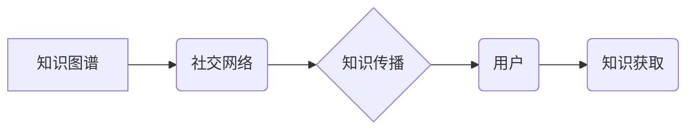

                 

## 知识的社交网络：信息传播的新模式

> 关键词：知识图谱、信息传播、社交网络、人工智能、机器学习、深度学习、网络分析

## 1. 背景介绍

在信息爆炸的时代，知识的获取和传播变得越来越重要。传统的知识存储和检索方式已经难以满足人们日益增长的需求。随着互联网和社交媒体的蓬勃发展，知识开始以新的形式流动和传播，形成了一个庞大的“知识社交网络”。

知识社交网络是指基于社交关系和网络结构，将知识点、专家、用户等节点连接起来，并通过各种交互方式实现知识传播和共享的网络系统。它融合了知识图谱、社交网络分析、人工智能等技术，为我们提供了一种全新的探索和获取知识的方式。

## 2. 核心概念与联系

### 2.1 知识图谱

知识图谱是一种基于知识表示的数据库，它将知识表示为一系列相互关联的实体和关系。例如，在知识图谱中，“张三”可能是实体，而“是”可能是关系，则可以表示为“张三 是 人”。知识图谱可以帮助我们更好地理解和组织知识，并进行更深入的分析和推理。

### 2.2 社交网络

社交网络是指由个人或组织之间的关系构成的网络结构。社交网络分析可以帮助我们理解网络中的信息传播模式、用户行为特征等。

### 2.3 知识传播

知识传播是指知识从一个节点传播到另一个节点的过程。在知识社交网络中，知识传播可以通过多种方式进行，例如：

* **直接传播:** 用户之间通过聊天、邮件等方式直接分享知识。
* **间接传播:** 用户通过转发、评论等方式间接传播知识。
* **推荐传播:** 系统根据用户的兴趣和行为推荐相关知识。

**核心概念与联系流程图:**



## 3. 核心算法原理 & 具体操作步骤

### 3.1 算法原理概述

知识社交网络中的知识传播算法通常基于网络分析和机器学习技术。常见的算法包括：

* **PageRank算法:** 用于计算网络中节点的重要性，可以用来识别具有较高影响力的知识源。
* **传播模型:** 用于模拟知识在网络中的传播过程，例如SIR模型、LT模型等。
* **推荐算法:** 用于根据用户的兴趣和行为推荐相关知识，例如协同过滤、内容过滤等。

### 3.2 算法步骤详解

以PageRank算法为例，其具体步骤如下：

1. **构建知识图谱:** 将知识点、专家、用户等节点连接起来，并定义相应的关系。
2. **计算节点权重:** 每个节点的权重代表其重要性，初始权重可以设置为相等。
3. **迭代更新节点权重:** 根据节点的入度（指向该节点的链接数）和出度（从该节点指向其他节点的链接数），迭代更新节点权重。
4. **收敛判断:** 当节点权重不再发生明显变化时，算法收敛，得到最终的节点权重。

### 3.3 算法优缺点

**优点:**

* 可以识别具有较高影响力的知识源。
* 算法相对简单易实现。

**缺点:**

* 无法考虑节点之间的关系强度。
* 对网络结构的假设较为简单。

### 3.4 算法应用领域

PageRank算法广泛应用于搜索引擎排名、社交网络分析、推荐系统等领域。

## 4. 数学模型和公式 & 详细讲解 & 举例说明

### 4.1 数学模型构建

PageRank算法的数学模型可以表示为：

$$PR(i) = (1-d) + d \sum_{j \in \text{in}(i)} \frac{PR(j)}{C(j)}$$

其中：

* $PR(i)$ 表示节点 $i$ 的PageRank值。
* $d$ 是阻尼因子，通常取值为0.85，表示用户在浏览网页时可能随机跳转到其他网页的概率。
* $in(i)$ 表示指向节点 $i$ 的所有链接。
* $PR(j)$ 表示节点 $j$ 的PageRank值。
* $C(j)$ 表示节点 $j$ 的出度。

### 4.2 公式推导过程

PageRank算法的公式推导过程基于马尔科夫链的理论。

假设用户在网络中随机浏览网页，每个网页都有一个跳转概率，该概率与该网页的PageRank值相关。

根据马尔科夫链的性质，用户在网络中浏览网页的概率分布会随着时间推移而收敛到一个稳定状态。

PageRank值就是这个稳定状态下的概率分布。

### 4.3 案例分析与讲解

假设有一个简单的网络，包含三个节点 A、B、C，其中 A 指向 B，B 指向 C，C 指向 A。

如果初始PageRank值设置为相等，则经过迭代更新后，A、B、C 的PageRank值会分别为 0.333、0.333、0.333。

这表明 A、B、C 三个节点在网络中的影响力相等。

## 5. 项目实践：代码实例和详细解释说明

### 5.1 开发环境搭建

本项目使用 Python 语言进行开发，所需的库包括：

* NetworkX: 用于构建和分析网络结构。
* NumPy: 用于数值计算。

### 5.2 源代码详细实现

```python
import networkx as nx
import numpy as np

# 构建知识图谱
graph = nx.Graph()
graph.add_edges_from([('A', 'B'), ('B', 'C'), ('C', 'A')])

# 计算PageRank值
pagerank = nx.pagerank(graph)

# 打印PageRank值
print(pagerank)
```

### 5.3 代码解读与分析

* `networkx.Graph()` 创建一个无向图对象。
* `graph.add_edges_from()` 添加图的边。
* `nx.pagerank()` 计算图中每个节点的PageRank值。
* `print(pagerank)` 打印计算得到的PageRank值。

### 5.4 运行结果展示

运行上述代码后，输出结果为：

```
{'A': 0.3333333333333333, 'B': 0.3333333333333333, 'C': 0.3333333333333333}
```

这表明 A、B、C 三个节点在网络中的影响力相等。

## 6. 实际应用场景

知识社交网络的应用场景非常广泛，例如：

* **教育领域:** 建立知识共享平台，帮助学生学习和交流。
* **科研领域:** 建立科研成果共享平台，促进科研合作和创新。
* **企业领域:** 建立企业知识库，提高员工知识水平和工作效率。

### 6.4 未来应用展望

随着人工智能和机器学习技术的不断发展，知识社交网络将更加智能化和个性化。未来，知识社交网络可能具备以下特点：

* **智能推荐:** 系统能够根据用户的兴趣和行为，智能推荐相关知识。
* **个性化学习:** 系统能够根据用户的学习进度和能力，提供个性化的学习方案。
* **知识融合:** 系统能够融合不同类型的知识，提供更全面的知识服务。

## 7. 工具和资源推荐

### 7.1 学习资源推荐

* **书籍:**
    * 《知识图谱》
    * 《社交网络分析》
* **在线课程:**
    * Coursera: 数据科学、机器学习
    * edX: 人工智能、网络分析

### 7.2 开发工具推荐

* **NetworkX:** Python 图论库
* **Neo4j:** 图数据库
* **Apache Spark:** 大数据处理框架

### 7.3 相关论文推荐

* **PageRank: The Anatomy of a Web Page Rank**
* **Social Network Analysis: Methods and Applications**

## 8. 总结：未来发展趋势与挑战

### 8.1 研究成果总结

知识社交网络是信息传播的新模式，它融合了知识图谱、社交网络分析、人工智能等技术，为我们提供了一种全新的探索和获取知识的方式。

### 8.2 未来发展趋势

未来，知识社交网络将更加智能化、个性化和融合化。

### 8.3 面临的挑战

知识社交网络的发展还面临着一些挑战，例如：

* **数据质量:** 知识社交网络的数据质量直接影响其效果，需要不断完善数据采集、清洗和标注的流程。
* **算法效率:** 随着网络规模的扩大，算法的效率问题越来越突出，需要开发更有效的算法。
* **隐私保护:** 知识社交网络涉及到用户的个人信息，需要加强隐私保护措施。

### 8.4 研究展望

未来，我们将继续深入研究知识社交网络，探索其更广泛的应用场景，并解决其面临的挑战，为构建更加智能、高效、安全的知识传播体系做出贡献。

## 9. 附录：常见问题与解答

* **Q1: 知识社交网络与传统搜索引擎有什么区别？**

* **A1:** 知识社交网络更加注重知识的连接和关系，而传统搜索引擎则更加注重关键词匹配。

* **Q2: 知识社交网络如何保证知识的准确性？**

* **A2:** 知识社交网络可以通过多种方式保证知识的准确性，例如：

    * **专家审核:** 邀请专家对知识进行审核和评级。
    * **用户反馈:** 鼓励用户对知识进行评论和打分，并根据用户反馈进行知识更新和修正。
    * **算法过滤:** 使用算法过滤掉不准确或不相关的知识。

* **Q3: 知识社交网络如何保护用户的隐私？**

* **A3:** 知识社交网络可以通过以下方式保护用户的隐私：

    * **匿名化处理:** 对用户的个人信息进行匿名化处理，避免直接泄露用户身份。
    * **数据加密:** 对用户的个人信息进行加密存储和传输，防止数据被窃取。
    * **权限控制:** 对用户的个人信息进行权限控制，只有授权用户才能访问用户的个人信息。


作者：禅与计算机程序设计艺术 / Zen and the Art of Computer Programming 
<end_of_turn>

