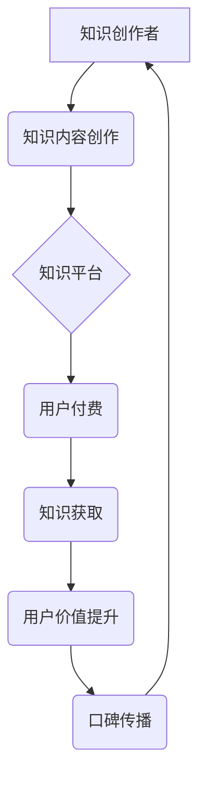

                 

## 知识经济时代下的知识付费创新商业模式运营

> 关键词：知识付费、商业模式、创新、技术驱动、用户体验、数据分析、内容运营、平台生态

### 1. 背景介绍

知识经济时代，信息化浪潮席卷全球，知识成为最宝贵的生产要素。传统商业模式面临着巨大的挑战，而知识付费作为一种新型的商业模式，应运而生。它以知识、技能、经验等为核心产品，通过线上平台向用户提供付费学习服务，满足用户对知识的需求，并为知识创作者提供收益途径。

近年来，知识付费市场蓬勃发展，涌现出众多头部平台和优质内容创作者。从在线课程、直播讲座到付费咨询、会员体系，知识付费模式呈现出多元化趋势。然而，知识付费市场也面临着诸多挑战，例如内容质量参差不齐、用户付费意愿不高、平台竞争激烈等。

### 2. 核心概念与联系

**2.1 知识付费的核心概念**

知识付费是指以知识、技能、经验等为核心产品，通过线上平台向用户提供付费学习服务，用户通过支付费用获取知识和技能，并提升自身价值。

**2.2 知识付费的商业模式**

知识付费的商业模式主要包括以下几种：

* **在线课程:** 提供预录课程、直播课程、互动课程等多种形式的学习内容，用户通过购买课程获得学习权限。
* **付费咨询:** 知识创作者提供一对一或小群咨询服务，用户通过付费咨询获得专业指导和解答。
* **会员体系:** 用户通过付费订阅会员，获得持续更新的学习内容、专属福利和社区互动等权益。
* **知识库:** 提供付费访问的知识库，用户可以搜索、阅读和下载各种知识资源。

**2.3 知识付费的商业模式架构**



**2.4 知识付费的创新点**

* **技术驱动:** 利用互联网、移动互联网、大数据等技术，构建高效便捷的知识付费平台。
* **用户体验:** 注重用户体验，提供个性化学习路径、互动式学习内容、多元化学习方式等。
* **内容生态:** 建立丰富的知识内容生态，吸引优质知识创作者和用户。
* **数据分析:** 利用数据分析，精准定位用户需求，优化内容运营策略。

### 3. 核心算法原理 & 具体操作步骤

**3.1 算法原理概述**

知识付费平台的运营需要依赖于一系列算法，例如推荐算法、内容分发算法、用户画像算法等。这些算法通过分析用户行为数据、内容特征数据等，实现个性化推荐、内容优化、用户运营等功能。

**3.2 算法步骤详解**

* **推荐算法:**

    1. 收集用户行为数据，例如浏览记录、购买记录、点赞记录等。
    2. 分析用户兴趣偏好，构建用户画像。
    3. 根据用户画像和内容特征，计算推荐分数。
    4. 将推荐分数排序，推荐给用户。

* **内容分发算法:**

    1. 分析内容特征，例如主题、标签、作者等。
    2. 结合用户行为数据，计算内容热度。
    3. 根据内容热度和平台规则，进行内容分发。

* **用户画像算法:**

    1. 收集用户基本信息、行为数据、兴趣偏好等数据。
    2. 利用机器学习算法，构建用户画像模型。
    3. 根据用户画像，进行用户分群、个性化运营等。

**3.3 算法优缺点**

* **优点:**

    * 个性化推荐，提升用户体验。
    * 内容优化，提高用户粘性。
    * 用户运营，精准触达目标用户。

* **缺点:**

    * 数据依赖性强，需要大量数据支持。
    * 算法复杂度高，需要专业技术人员维护。
    * 算法偏差问题，可能导致推荐结果不准确。

**3.4 算法应用领域**

* **电商平台:** 商品推荐、用户画像、个性化营销。
* **社交媒体:** 内容推荐、用户匹配、广告投放。
* **教育平台:** 在线课程推荐、学习路径规划、个性化辅导。
* **金融平台:** 产品推荐、风险评估、用户画像。

### 4. 数学模型和公式 & 详细讲解 & 举例说明

**4.1 数学模型构建**

知识付费平台的运营可以构建数学模型来分析用户行为、内容价值、平台收益等因素。例如，可以构建用户价值模型，用数学公式来衡量用户的价值，例如：

$$
User Value = \alpha * Engagement + \beta * Purchase + \gamma * Retention
$$

其中：

* User Value: 用户价值
* Engagement: 用户参与度，例如浏览次数、评论次数等。
* Purchase: 用户购买行为，例如课程购买、会员订阅等。
* Retention: 用户留存率，例如复购率、活跃度等。
* α, β, γ: 权重系数，根据平台运营策略进行调整。

**4.2 公式推导过程**

用户价值模型的推导过程可以基于用户行为数据和平台运营目标进行分析。例如，平台希望提高用户留存率，可以将 Retention 的权重系数 γ 设置为较高的值。

**4.3 案例分析与讲解**

假设一个知识付费平台，用户参与度、购买行为和留存率分别为 100, 50, 80。平台运营策略是提高用户留存率，因此将 Retention 的权重系数 γ 设置为 0.6，Engagement 的权重系数 α 设置为 0.2，Purchase 的权重系数 β 设置为 0.2。

则用户价值为：

$$
User Value = 0.2 * 100 + 0.2 * 50 + 0.6 * 80 = 20 + 10 + 48 = 78
$$

### 5. 项目实践：代码实例和详细解释说明

**5.1 开发环境搭建**

知识付费平台的开发环境可以搭建在云平台上，例如 AWS、Azure、GCP 等。平台需要具备以下功能：

* 用户注册、登录、信息管理
* 内容上传、管理、发布
* 支付处理、订单管理
* 用户学习记录、进度管理
* 社区互动、评论、点赞等

**5.2 源代码详细实现**

以下是一个简单的 Python 代码实例，用于实现用户注册功能：

```python
from flask import Flask, request, render_template

app = Flask(__name__)

@app.route('/register', methods=['GET', 'POST'])
def register():
    if request.method == 'POST':
        username = request.form['username']
        password = request.form['password']
        # 进行用户注册逻辑，例如数据库插入
        return '注册成功!'
    else:
        return render_template('register.html')

if __name__ == '__main__':
    app.run(debug=True)
```

**5.3 代码解读与分析**

* 使用 Flask 框架构建 Web 应用。
* 定义 `/register` 路由，处理用户注册请求。
* 使用 `request.method` 判断请求类型，如果是 POST 请求，则进行用户注册逻辑。
* 使用 `request.form` 获取用户输入的用户名和密码。
* 进行用户注册逻辑，例如数据库插入。

**5.4 运行结果展示**

运行代码后，访问 `http://127.0.0.1:5000/register`，可以进入用户注册页面。填写用户名和密码后，点击注册按钮，即可完成用户注册。

### 6. 实际应用场景

**6.1 在线教育平台**

知识付费平台可以应用于在线教育领域，提供各种类型的在线课程，例如编程、设计、语言学习等。用户可以通过付费订阅课程，获得学习资源和专业指导。

**6.2 专业技能培训平台**

知识付费平台可以提供专业技能培训课程，例如市场营销、财务管理、项目管理等。用户可以通过付费学习，提升自身专业技能，获得职业发展机会。

**6.3 个人成长平台**

知识付费平台可以提供个人成长类课程，例如时间管理、情绪管理、心理健康等。用户可以通过付费学习，提升自身生活质量，实现个人成长。

**6.4 企业内部培训平台**

企业可以利用知识付费平台搭建内部培训平台，提供员工培训课程，提升员工技能水平，促进企业发展。

**6.5 未来应用展望**

随着人工智能、虚拟现实等技术的不断发展，知识付费平台将更加智能化、个性化、沉浸式。未来，知识付费平台将更加深入地融入人们的生活，成为人们获取知识、提升技能、实现自我价值的重要途径。

### 7. 工具和资源推荐

**7.1 学习资源推荐**

* **书籍:**

    * 《知识经济》
    * 《互联网思维》
    * 《商业模式创新》

* **在线课程:**

    * Coursera
    * edX
    * Udemy

**7.2 开发工具推荐**

* **Web 开发框架:** Flask, Django, React, Vue.js
* **数据库:** MySQL, PostgreSQL, MongoDB
* **云平台:** AWS, Azure, GCP

**7.3 相关论文推荐**

* **知识经济与知识付费:**

    * 知识经济与知识付费模式研究
    * 知识付费平台发展趋势及挑战

* **算法与推荐系统:**

    * 基于深度学习的推荐算法
    * 协同过滤算法

### 8. 总结：未来发展趋势与挑战

**8.1 研究成果总结**

知识付费作为一种新型的商业模式，在知识经济时代具有重要的发展意义。通过技术驱动、用户体验优化、内容生态建设等方式，知识付费平台可以有效满足用户对知识的需求，为知识创作者提供收益途径，促进知识经济发展。

**8.2 未来发展趋势**

* **智能化:** 利用人工智能技术，实现个性化推荐、智能内容创作、自动运营等功能。
* **沉浸式体验:** 利用虚拟现实、增强现实等技术，打造沉浸式的学习体验。
* **多元化内容:** 提供更加多元化的知识内容，例如音频、视频、直播、互动游戏等。
* **平台生态:** 建立更加完善的平台生态，吸引更多优质知识创作者和用户。

**8.3 面临的挑战**

* **内容质量:** 知识付费平台需要保证内容质量，避免低质量内容泛滥。
* **用户付费意愿:** 提升用户付费意愿，建立付费学习的文化氛围。
* **平台竞争:** 知识付费市场竞争激烈，平台需要不断创新，提升竞争力。
* **数据安全:** 保护用户数据安全，建立信任机制。

**8.4 研究展望**

未来，知识付费平台将朝着更加智能化、个性化、沉浸式、多元化的方向发展。研究者需要关注以下几个方面：

* **人工智能技术在知识付费平台中的应用:** 如何利用人工智能技术，实现更加精准的推荐、个性化的学习路径、智能化的内容创作等功能。
* **用户付费行为的分析与预测:** 如何分析用户付费行为，预测用户需求，制定更加有效的运营策略。
* **知识付费平台的生态建设:** 如何构建更加完善的平台生态，吸引更多优质知识创作者和用户。
* **知识付费的社会影响:** 如何评估知识付费的社会影响，促进知识共享和社会进步。


### 9. 附录：常见问题与解答

**9.1 如何选择合适的知识付费平台？**

选择知识付费平台时，需要考虑以下因素：

* 平台的专业性：平台是否专注于特定领域，是否拥有优质的知识创作者。
* 内容质量：平台的内容是否丰富、实用、高质量。
* 用户体验：平台的用户界面是否友好、学习体验是否良好。
* 价格体系：平台的收费模式是否合理，是否提供优惠活动。

**9.2 如何提高知识付费平台的竞争力？**

提高知识付费平台的竞争力，需要从以下几个方面入手：

* **内容创新:** 提供更加优质、丰富、多元化的知识内容。
* **用户体验优化:** 提升用户学习体验，提供个性化学习路径、互动式学习内容等。
* **技术驱动:** 利用人工智能、大数据等技术，实现智能化运营、个性化推荐等功能。
* **平台生态建设:** 建立更加完善的平台生态，吸引更多优质知识创作者和用户。

**9.3 知识付费平台如何保障知识产权？**

知识付费平台需要采取以下措施保障知识产权：

* **建立完善的版权保护机制:** 与知识创作者签订版权协议，明确知识产权归属。
* **采用技术手段防范知识盗版:** 利用水印、加密等技术，防止知识内容被盗版。
* **加强平台监管:** 对平台上的知识内容进行审核，打击侵权行为。

**9.4 知识付费平台如何应对用户隐私泄露风险？**

知识付费平台需要采取以下措施应对用户隐私泄露风险：

* **建立完善的隐私保护制度:** 明确用户数据收集、使用、存储等规则，保障用户隐私安全。
* **采用加密技术保护用户数据:** 对用户敏感信息进行加密存储和传输，防止数据泄露。
* **定期进行安全漏洞扫描和修复:** 及时发现和修复平台上的安全漏洞，防止数据泄露。


作者：禅与计算机程序设计艺术 / Zen and the Art of Computer Programming 
<end_of_turn>

