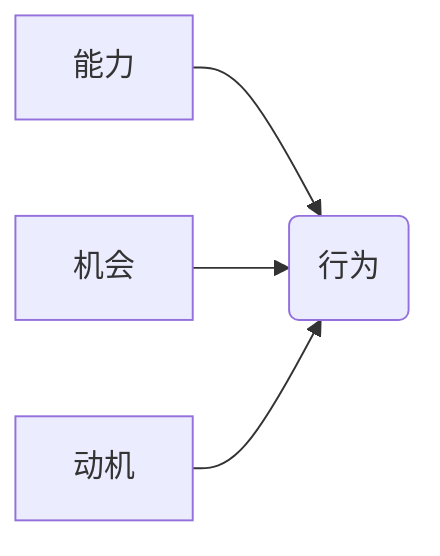

                 

## 福格行为模型：行为改变的三要素

> 关键词：行为改变、福格模型、行为驱动、认知、情感、动机

### 1. 背景介绍

在当今数据驱动、科技飞速发展的时代，理解和预测人类行为变得尤为重要。无论是软件设计、用户体验优化、市场营销策略，还是人工智能的伦理发展，都离不开对人类行为的深刻洞察。福格行为模型（Fogg Behavior Model）作为一种行为改变理论，为我们提供了一个清晰的框架，帮助理解行为发生的条件，并指导我们如何设计更有效的行为改变策略。

本篇文章将深入探讨福格行为模型的核心概念、算法原理、数学模型以及实际应用场景，并结合代码实例和案例分析，帮助读者全面理解该模型的应用价值和实践方法。

### 2. 核心概念与联系

福格行为模型的核心观点是：行为发生是一个由三个要素共同决定的事物，即**能力（Ability）、机会（Opportunity）和动机（Motivation）**。这三个要素相互关联，形成一个行为发生的三要素模型。

**2.1. 能力（Ability）**

能力是指个体执行特定行为所需的技能、知识和资源。如果个体缺乏执行行为所需的技能或资源，那么即使动机和机会都存在，行为也难以发生。例如，想要学习一门新的编程语言，需要具备一定的学习能力、时间和精力，以及学习资源。

**2.2. 机会（Opportunity）**

机会是指个体执行特定行为的便利程度。如果执行行为的门槛过高，或者环境不提供必要的支持，那么即使个体具备能力和动机，行为也难以发生。例如，想要坚持每天锻炼，需要安排时间、找到合适的场所和工具，以及克服懒惰的阻碍。

**2.3. 动机（Motivation）**

动机是指个体执行特定行为的愿望或驱动力。动机可以是积极的，例如为了获得奖励或满足个人目标；也可以是消极的，例如为了避免惩罚或解决问题。动机越强，个体执行行为的可能性就越大。例如，想要减肥，需要有强烈的动机，才能克服美食的诱惑，坚持运动和节食。

**2.4. 三要素关系图**



### 3. 核心算法原理 & 具体操作步骤

福格行为模型的核心算法原理是基于三个要素之间的相互作用关系。

**3.1. 算法原理概述**

福格行为模型认为，只有当三个要素都满足时，行为才会发生。

* **能力 > 0:** 个体具备执行行为所需的技能和资源。
* **机会 > 0:** 个体能够方便地执行行为。
* **动机 > 0:** 个体有足够的愿望或驱动力去执行行为。

**3.2. 算法步骤详解**

1. **识别目标行为:** 首先需要明确想要改变的目标行为是什么。
2. **分析三个要素:** 对目标行为进行分析，评估个体在能力、机会和动机方面的现状。
3. **设计行为改变策略:** 根据分析结果，设计针对性的行为改变策略，例如：
    * **提高能力:** 提供培训、指导、工具等，帮助个体提升执行行为所需的技能和知识。
    * **增加机会:** 简化行为执行流程、提供便利条件、营造支持性环境，降低行为执行的门槛。
    * **增强动机:** 通过奖励、惩罚、情感共鸣等方式，激发个体的执行行为的愿望和驱动力。
4. **实施和评估:** 实施行为改变策略，并定期评估其效果，根据评估结果进行调整和优化。

**3.3. 算法优缺点**

**优点:**

* **简单易懂:** 模型结构清晰，易于理解和应用。
* **实用性强:** 可以应用于各种行为改变场景，例如健康行为、学习行为、消费行为等。
* **可量化评估:** 模型中的三个要素可以进行量化评估，方便跟踪和分析行为改变效果。

**缺点:**

* **过于简化:** 模型没有考虑其他可能影响行为的因素，例如社会文化、个人价值观等。
* **缺乏针对性:** 模型提供的策略过于笼统，需要根据具体情况进行调整和优化。

**3.4. 算法应用领域**

福格行为模型在以下领域具有广泛的应用价值：

* **软件设计:** 设计更易用、更人性化的软件产品。
* **用户体验优化:** 提升用户体验，提高用户参与度和留存率。
* **市场营销:** 设计更有效的营销策略，提高转化率。
* **教育:** 设计更有效的教学方法，提高学习效果。
* **健康管理:** 促进健康行为养成，预防疾病。

### 4. 数学模型和公式 & 详细讲解 & 举例说明

福格行为模型可以用数学公式来表示，其中三个要素的乘积代表行为发生的可能性。

**4.1. 数学模型构建**

$$
P(行为) = Ability * Opportunity * Motivation
$$

其中：

* P(行为) 代表行为发生的可能性。
* Ability 代表个体执行行为的能力。
* Opportunity 代表个体执行行为的机会。
* Motivation 代表个体执行行为的动机。

**4.2. 公式推导过程**

该公式的推导过程基于以下假设：

* 三个要素相互独立，彼此之间没有直接影响。
* 三个要素的取值范围为0到1，其中0表示不存在，1表示完全存在。

**4.3. 案例分析与讲解**

**案例:** 想要养成每天阅读30分钟的习惯。

* **能力:** 具备阅读能力、拥有书籍或电子阅读器、有足够的阅读时间。
* **机会:** 书籍或电子阅读器易于获取、阅读环境舒适安静、没有其他干扰。
* **动机:** 对阅读感兴趣、希望提升知识水平、享受阅读带来的乐趣。

假设：

* Ability = 0.8
* Opportunity = 0.7
* Motivation = 0.9

则：

$$
P(行为) = 0.8 * 0.7 * 0.9 = 0.504
$$

这意味着，在这个案例中，养成每天阅读30分钟习惯的可能性为50.4%。

### 5. 项目实践：代码实例和详细解释说明

为了更好地理解福格行为模型的应用，我们可以通过一个简单的项目实践来进行演示。

**5.1. 开发环境搭建**

本项目使用Python语言进行开发，所需的库包括：

* requests: 用于发送HTTP请求。
* json: 用于处理JSON数据。

**5.2. 源代码详细实现**

```python
import requests
import json

def analyze_behavior(url):
    """
    分析行为数据，评估三个要素的得分。
    """
    response = requests.get(url)
    data = json.loads(response.text)

    # 评估能力得分
    ability_score = data['ability']

    # 评估机会得分
    opportunity_score = data['opportunity']

    # 评估动机得分
    motivation_score = data['motivation']

    return ability_score, opportunity_score, motivation_score

def predict_behavior(ability_score, opportunity_score, motivation_score):
    """
    预测行为发生的可能性。
    """
    behavior_probability = ability_score * opportunity_score * motivation_score
    return behavior_probability

# 示例用法
url = 'https://example.com/behavior_data'
ability_score, opportunity_score, motivation_score = analyze_behavior(url)
behavior_probability = predict_behavior(ability_score, opportunity_score, motivation_score)

print(f'行为发生的可能性: {behavior_probability}')
```

**5.3. 代码解读与分析**

该代码首先定义了一个`analyze_behavior`函数，用于分析行为数据并评估三个要素的得分。该函数接收一个URL作为参数，发送HTTP请求获取数据，并使用JSON库解析数据。

然后，定义了一个`predict_behavior`函数，用于根据三个要素的得分预测行为发生的可能性。该函数使用福格行为模型的公式计算行为发生的可能性。

最后，代码示例演示了如何使用这两个函数来分析行为数据并预测行为发生的可能性。

**5.4. 运行结果展示**

运行该代码后，会输出一个行为发生的可能性值，该值介于0到1之间。

### 6. 实际应用场景

福格行为模型在现实生活中具有广泛的应用场景，例如：

**6.1. 健康行为改变**

* **鼓励用户坚持运动:** 通过提供运动计划、健身追踪工具、社交激励等，提高用户的运动能力、机会和动机。
* **促进健康饮食:** 通过提供营养信息、健康食谱、在线购物平台等，提高用户的健康饮食能力、机会和动机。

**6.2. 学习行为改变**

* **提高学习效率:** 通过提供个性化学习计划、学习资源推荐、在线答疑平台等，提高学生的学习能力、机会和动机。
* **培养学习兴趣:** 通过 gamification 游戏化学习、互动式学习平台、学习社区等，提高学生的学习兴趣和动机。

**6.3. 消费行为改变**

* **引导用户购买绿色产品:** 通过提供环保信息、绿色产品推荐、优惠活动等，提高用户的环保意识、购买意愿和机会。
* **减少用户冲动消费:** 通过提供预算管理工具、消费提醒功能、理性消费引导等，降低用户的冲动消费动机。

**6.4. 未来应用展望**

随着人工智能技术的不断发展，福格行为模型的应用场景将更加广泛。例如，可以利用人工智能技术分析用户的行为数据，更精准地预测用户的行为，并提供更个性化的行为改变策略。

### 7. 工具和资源推荐

**7.1. 学习资源推荐**

* **Fogg Behavior Model Website:** https://www.fogg.com/
* **《行为改变的艺术》:** 作者：BJ Fogg

**7.2. 开发工具推荐**

* **Python:** https://www.python.org/
* **Requests:** https://requests.readthedocs.io/en/latest/
* **JSON:** https://docs.python.org/3/library/json.html

**7.3. 相关论文推荐**

* **Fogg, B. J. (2009). Persuasive technology: Using computers to change what we think and do.**
* **Fogg, B. J. (2003). Tiny Habits: The Small Changes That Change Everything.**

### 8. 总结：未来发展趋势与挑战

**8.1. 研究成果总结**

福格行为模型为行为改变提供了科学的理论框架和实践方法，在各个领域都取得了显著的应用成果。

**8.2. 未来发展趋势**

未来，福格行为模型将朝着以下方向发展：

* **更精准的预测:** 利用人工智能技术分析用户的行为数据，更精准地预测用户的行为。
* **更个性化的策略:** 根据用户的不同特征和需求，提供更个性化的行为改变策略。
* **更有效的评估:** 开发更有效的评估方法，跟踪和分析行为改变效果。

**8.3. 面临的挑战**

福格行为模型也面临一些挑战：

* **模型的局限性:** 模型过于简化，没有考虑其他可能影响行为的因素。
* **数据获取的困难:** 获取高质量的行为数据仍然是一个挑战。
* **伦理问题:** 如何利用行为改变技术，避免侵犯用户的隐私和自由意志，是一个需要认真思考的伦理问题。

**8.4. 研究展望**

未来，需要进一步完善福格行为模型，使其更加完善和适用。同时，还需要加强对行为改变技术的伦理研究，确保其安全、有效和可持续地发展。


### 9. 附录：常见问题与解答

**9.1. 如何提高行为发生的可能性？**

可以通过提高三个要素的得分来提高行为发生的可能性。例如，可以通过学习新技能提高能力、创造便利条件提高机会、设定目标和奖励提高动机。

**9.2. 福格行为模型适用于哪些场景？**

福格行为模型适用于各种行为改变场景，例如健康行为、学习行为、消费行为等。

**9.3. 福格行为模型的局限性是什么？**

福格行为模型过于简化，没有考虑其他可能影响行为的因素，例如社会文化、个人价值观等。

**9.4. 如何评估行为改变的效果？**

可以通过跟踪和分析行为发生的频率、持续时间、强度等指标来评估行为改变的效果。


作者：禅与计算机程序设计艺术 / Zen and the Art of Computer Programming 
<end_of_turn>

