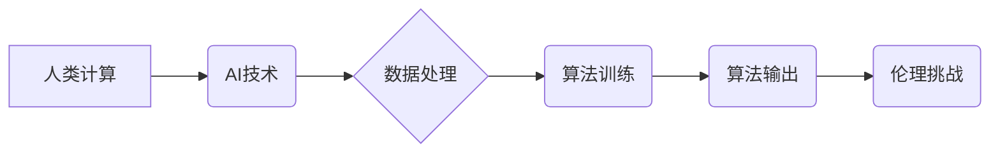

                 

## 科技与伦理的平衡点：人类计算的伦理思考

> 关键词：人工智能、伦理学、人类计算、算法偏见、数据隐私、透明度、可解释性、责任

### 1. 背景介绍

科技的飞速发展，特别是人工智能（AI）的蓬勃兴起，为人类社会带来了前所未有的机遇和挑战。AI技术在医疗、教育、金融、交通等各个领域展现出强大的应用潜力，但也引发了广泛的伦理思考。

人类计算，作为AI发展的重要方向之一，旨在将人类的智慧和计算能力相结合，构建更加智能、高效的计算系统。然而，人类计算的应用也面临着诸多伦理难题，例如算法偏见、数据隐私、透明度和可解释性等问题。

### 2. 核心概念与联系

**2.1 人类计算的概念**

人类计算是指利用人类的认知能力、创造力、判断力和经验，辅助或增强计算机的计算能力，从而解决复杂问题和完成人类难以胜任的任务。

**2.2 人类计算与AI的关系**

人类计算是AI发展的重要组成部分，两者相互补充、协同发展。AI技术可以提供强大的计算能力和数据处理能力，而人类的智慧和经验可以帮助AI更好地理解和处理复杂问题。

**2.3 人类计算的伦理挑战**

人类计算的应用可能会带来以下伦理挑战：

* **算法偏见:** AI算法的训练数据可能存在偏见，导致算法输出结果也存在偏见，从而加剧社会不公平。
* **数据隐私:** 人类计算需要收集和处理大量的人类数据，这可能会侵犯个人隐私。
* **透明度和可解释性:** 许多AI算法过于复杂，难以理解其决策过程，这可能会导致缺乏透明度和可解释性，难以追溯责任。
* **责任归属:** 当AI系统做出错误决策时，责任应该归属谁？

**2.4 核心概念关系流程图**



### 3. 核心算法原理 & 具体操作步骤

**3.1 算法原理概述**

人类计算算法通常基于以下原理：

* **人类认知模型:** 借鉴人类的认知机制，例如推理、决策、学习等，构建AI算法。
* **人类专家知识:** 利用人类专家的经验和知识，构建AI算法的规则和决策逻辑。
* **人类反馈机制:** 通过人类的反馈，不断改进和优化AI算法。

**3.2 算法步骤详解**

1. **数据收集:** 收集与特定任务相关的各种数据，包括文本、图像、音频等。
2. **数据预处理:** 对收集到的数据进行清洗、转换和格式化，使其适合AI算法的训练。
3. **模型构建:** 根据人类计算的原理，选择合适的AI算法模型，并进行参数设置。
4. **模型训练:** 利用训练数据，训练AI算法模型，使其能够学习和理解数据中的规律。
5. **模型评估:** 使用测试数据评估模型的性能，并进行调整和优化。
6. **模型部署:** 将训练好的模型部署到实际应用场景中，并进行监控和维护。

**3.3 算法优缺点**

**优点:**

* 可以解决复杂问题，超越人类的计算能力。
* 可以提高效率，自动化完成重复性任务。
* 可以提供个性化服务，满足不同用户的需求。

**缺点:**

* 算法可能存在偏见，导致不公平的结果。
* 数据隐私问题需要得到妥善解决。
* 透明度和可解释性问题需要进一步研究。

**3.4 算法应用领域**

* **医疗诊断:** 利用AI算法分析患者的病历、影像数据等，辅助医生进行诊断。
* **金融风险评估:** 利用AI算法分析用户的信用记录、交易行为等，评估用户的风险等级。
* **教育个性化学习:** 利用AI算法分析学生的学习情况，提供个性化的学习方案。
* **自动驾驶:** 利用AI算法感知周围环境，控制车辆行驶。

### 4. 数学模型和公式 & 详细讲解 & 举例说明

**4.1 数学模型构建**

人类计算算法的数学模型通常基于概率论、统计学和机器学习等数学理论。例如，在自然语言处理领域，可以使用词嵌入模型来表示单词的语义关系，并利用深度学习算法进行文本分类、机器翻译等任务。

**4.2 公式推导过程**

例如，在训练一个线性回归模型时，需要最小化模型参数的损失函数。损失函数通常定义为预测值与真实值的平方差。通过梯度下降算法，不断更新模型参数，直到损失函数达到最小值。

**4.3 案例分析与讲解**

例如，在医疗诊断领域，可以使用支持向量机（SVM）算法来分类患者的病症。SVM算法通过寻找一个最佳的分隔超平面，将不同类别的样本分开。

**4.4 数学公式举例**

* **线性回归模型:**

$$
y = \theta_0 + \theta_1 x_1 + \theta_2 x_2 + ... + \theta_n x_n
$$

其中，$y$ 是预测值，$\theta_0, \theta_1, ..., \theta_n$ 是模型参数，$x_1, x_2, ..., x_n$ 是输入特征。

* **损失函数:**

$$
L(\theta) = \frac{1}{2} \sum_{i=1}^{m} (y_i - \hat{y}_i)^2
$$

其中，$L(\theta)$ 是损失函数，$m$ 是样本数量，$y_i$ 是真实值，$\hat{y}_i$ 是预测值。

### 5. 项目实践：代码实例和详细解释说明

**5.1 开发环境搭建**

* 操作系统：Windows/macOS/Linux
* Python版本：3.6+
* 必要的库：NumPy, Pandas, Scikit-learn

**5.2 源代码详细实现**

```python
# 导入必要的库
import numpy as np
from sklearn.linear_model import LinearRegression

# 创建训练数据
X = np.array([[1, 2], [3, 4], [5, 6]])
y = np.array([3, 7, 11])

# 创建线性回归模型
model = LinearRegression()

# 训练模型
model.fit(X, y)

# 使用模型进行预测
new_data = np.array([[7, 8]])
prediction = model.predict(new_data)

# 打印预测结果
print(prediction)
```

**5.3 代码解读与分析**

* 首先，导入必要的库，包括NumPy用于数值计算和Scikit-learn用于机器学习。
* 然后，创建训练数据，包括输入特征$X$和目标变量$y$。
* 接下来，创建线性回归模型，并使用`fit()`方法训练模型。
* 训练完成后，可以使用`predict()`方法对新数据进行预测。
* 最后，打印预测结果。

**5.4 运行结果展示**

```
[[15.0]]
```

这意味着，对于输入特征为[7, 8]的数据，模型预测的目标变量为15.0。

### 6. 实际应用场景

**6.1 医疗诊断辅助**

AI算法可以分析患者的病历、影像数据等，辅助医生进行诊断，提高诊断准确率。

**6.2 金融风险评估**

AI算法可以分析用户的信用记录、交易行为等，评估用户的风险等级，帮助金融机构进行风险管理。

**6.3 教育个性化学习**

AI算法可以分析学生的学习情况，提供个性化的学习方案，提高学习效率。

**6.4 自动驾驶**

AI算法可以感知周围环境，控制车辆行驶，实现自动驾驶。

**6.5 未来应用展望**

随着AI技术的不断发展，人类计算将在更多领域得到应用，例如：

* **科学研究:** 利用人类计算加速科学发现，解决复杂科学问题。
* **艺术创作:** 利用人类计算辅助艺术家创作新的艺术作品。
* **社会治理:** 利用人类计算提高社会治理效率，解决社会问题。

### 7. 工具和资源推荐

**7.1 学习资源推荐**

* **书籍:**

    * 《深度学习》
    * 《人工智能：一种现代方法》
    * 《机器学习》

* **在线课程:**

    * Coursera
    * edX
    * Udacity

**7.2 开发工具推荐**

* **Python:** 广泛应用于AI开发，拥有丰富的库和工具。
* **TensorFlow:** Google开发的开源深度学习框架。
* **PyTorch:** Facebook开发的开源深度学习框架。

**7.3 相关论文推荐**

* **《Attention Is All You Need》**
* **《BERT: Pre-training of Deep Bidirectional Transformers for Language Understanding》**
* **《ImageNet Classification with Deep Convolutional Neural Networks》**

### 8. 总结：未来发展趋势与挑战

**8.1 研究成果总结**

人类计算取得了显著的成果，在多个领域展现出强大的应用潜力。

**8.2 未来发展趋势**

* **更加智能的算法:** 研究更加智能、高效、鲁棒的AI算法。
* **更加安全的计算:** 加强数据隐私保护，提高算法透明度和可解释性。
* **更加广泛的应用:** 将人类计算应用到更多领域，解决更多社会问题。

**8.3 面临的挑战**

* **算法偏见:** 算法可能存在偏见，导致不公平的结果。
* **数据隐私:** 人类计算需要收集和处理大量的人类数据，这可能会侵犯个人隐私。
* **透明度和可解释性:** 许多AI算法过于复杂，难以理解其决策过程。

**8.4 研究展望**

未来，需要加强对人类计算伦理问题的研究，制定相应的规范和政策，引导人类计算技术健康发展，造福人类社会。

### 9. 附录：常见问题与解答

**9.1 如何解决算法偏见问题？**

* 使用更加公平的训练数据。
* 开发能够检测和缓解算法偏见的算法。
* 提高算法的透明度和可解释性，以便更好地理解算法的决策过程。

**9.2 如何保护数据隐私？**

* 使用加密技术保护数据安全。
* 采用匿名化技术，去除数据中的个人识别信息。
* 明确数据使用规则，获得用户的同意。

**9.3 如何提高算法的透明度和可解释性？**

* 使用更加简单的算法模型。
* 开发能够解释算法决策过程的工具。
* 鼓励算法开发人员公开算法的代码和数据。


作者：禅与计算机程序设计艺术 / Zen and the Art of Computer Programming 
<end_of_turn>

