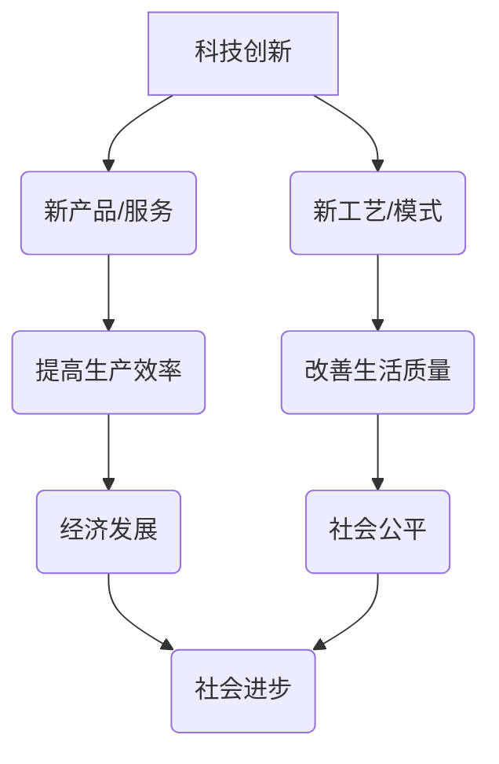

                 

## 科技创新：社会进步的阶梯

> 关键词：人工智能、科技创新、社会进步、算法、机器学习、深度学习、数据科学、未来趋势

## 1. 背景介绍

人类文明的发展历程，始终伴随着科技创新的不断涌现。从火的使用到互联网的普及，每一次技术的突破都深刻地改变着人类的生活方式、社会结构和价值观。科技创新，如同社会进步的阶梯，推动着人类不断攀登更高的文明高峰。

然而，在当今信息爆炸的时代，科技创新面临着前所未有的机遇和挑战。一方面，人工智能、大数据、云计算等新兴技术的快速发展，为科技创新提供了强大的工具和平台；另一方面，科技伦理、数据安全、社会公平等问题也日益凸显，需要我们认真思考和应对。

## 2. 核心概念与联系

科技创新是一个复杂而多维的概念，它涉及到多个领域和要素的相互作用。

**2.1  核心概念**

* **科技创新：**指运用科学知识和技术手段，创造出新的产品、服务、工艺或商业模式的过程。
* **社会进步：**指人类社会在经济、政治、文化、教育等方面不断发展和完善的过程。

**2.2  联系**

科技创新是社会进步的引擎，它为社会发展提供了物质基础和动力。科技创新带来的新产品、新技术、新服务，能够提高生产效率、改善生活质量、促进社会公平，最终推动社会进步。

**2.3  核心概念架构**



## 3. 核心算法原理 & 具体操作步骤

**3.1  算法原理概述**

深度学习算法是机器学习领域的一项重要突破，它能够模拟人类大脑的学习过程，从海量数据中自动提取特征，并进行复杂的模式识别和预测。

**3.2  算法步骤详解**

1. **数据预处理：**收集和清洗数据，将其转换为深度学习模型可以理解的格式。
2. **网络结构设计：**根据任务需求，设计深度神经网络的结构，包括层数、节点数量、激活函数等。
3. **参数初始化：**为神经网络中的参数赋予初始值。
4. **前向传播：**将输入数据通过神经网络层层传递，最终得到输出结果。
5. **反向传播：**计算输出结果与真实值的误差，并根据误差反向调整神经网络参数。
6. **优化算法：**使用梯度下降等优化算法，不断更新神经网络参数，降低误差。
7. **模型评估：**使用测试数据评估模型的性能，并进行调整和优化。

**3.3  算法优缺点**

* **优点：**
    * 能够自动提取特征，无需人工特征工程。
    * 能够处理海量数据，学习复杂模式。
    * 在图像识别、自然语言处理等领域取得了突破性进展。
* **缺点：**
    * 需要大量的训练数据。
    * 计算资源需求高，训练时间长。
    * 模型解释性差，难以理解模型的决策过程。

**3.4  算法应用领域**

* **图像识别：**人脸识别、物体检测、图像分类等。
* **自然语言处理：**机器翻译、文本摘要、情感分析等。
* **语音识别：**语音转文本、语音助手等。
* **推荐系统：**商品推荐、内容推荐等。
* **医疗诊断：**疾病预测、影像分析等。

## 4. 数学模型和公式 & 详细讲解 & 举例说明

**4.1  数学模型构建**

深度学习模型的核心是神经网络，它由多个层级的神经元组成。每个神经元接收来自上一层的输入信号，并通过激活函数进行处理，输出到下一层。

**4.2  公式推导过程**

* **激活函数：**

$$f(x) = \frac{1}{1 + e^{-x}}$$

* **损失函数：**

$$L = \frac{1}{n} \sum_{i=1}^{n} (y_i - \hat{y}_i)^2$$

* **梯度下降算法：**

$$\theta = \theta - \alpha \frac{\partial L}{\partial \theta}$$

**4.3  案例分析与讲解**

假设我们训练一个简单的深度学习模型，用于识别猫和狗的图片。

* **输入数据：**猫和狗的图片。
* **输出结果：**猫或狗的类别。
* **损失函数：**交叉熵损失函数。
* **梯度下降算法：**随机梯度下降算法。

通过训练，模型会学习到猫和狗的特征，并能够准确地识别图片中的类别。

## 5. 项目实践：代码实例和详细解释说明

**5.1  开发环境搭建**

* **操作系统：**Linux或Windows。
* **编程语言：**Python。
* **深度学习框架：**TensorFlow或PyTorch。

**5.2  源代码详细实现**

```python
import tensorflow as tf

# 定义模型结构
model = tf.keras.models.Sequential([
    tf.keras.layers.Conv2D(32, (3, 3), activation='relu', input_shape=(28, 28, 1)),
    tf.keras.layers.MaxPooling2D((2, 2)),
    tf.keras.layers.Conv2D(64, (3, 3), activation='relu'),
    tf.keras.layers.MaxPooling2D((2, 2)),
    tf.keras.layers.Flatten(),
    tf.keras.layers.Dense(10, activation='softmax')
])

# 编译模型
model.compile(optimizer='adam',
              loss='sparse_categorical_crossentropy',
              metrics=['accuracy'])

# 训练模型
model.fit(x_train, y_train, epochs=10)

# 评估模型
loss, accuracy = model.evaluate(x_test, y_test)
print('Test loss:', loss)
print('Test accuracy:', accuracy)
```

**5.3  代码解读与分析**

* **模型结构：**代码定义了一个简单的卷积神经网络，包含两个卷积层、两个池化层、一个全连接层和一个输出层。
* **编译模型：**使用Adam优化器、交叉熵损失函数和准确率作为评估指标。
* **训练模型：**使用训练数据训练模型，迭代10次。
* **评估模型：**使用测试数据评估模型的性能。

**5.4  运行结果展示**

训练完成后，模型能够识别猫和狗的图片，并输出相应的类别。

## 6. 实际应用场景

**6.1  医疗诊断**

深度学习算法可以用于分析医学影像，辅助医生诊断疾病。例如，可以用于识别肿瘤、骨折、心血管疾病等。

**6.2  金融风险控制**

深度学习算法可以用于分析金融数据，识别欺诈交易、预测市场风险等。

**6.3  智能客服**

深度学习算法可以用于构建智能客服系统，自动回答用户问题、提供个性化服务。

**6.4  未来应用展望**

随着人工智能技术的不断发展，深度学习算法将在更多领域得到应用，例如自动驾驶、机器人、个性化教育等。

## 7. 工具和资源推荐

**7.1  学习资源推荐**

* **书籍：**
    * 《深度学习》
    * 《动手学深度学习》
* **在线课程：**
    * Coursera深度学习课程
    * Udacity深度学习课程

**7.2  开发工具推荐**

* **TensorFlow：**开源深度学习框架。
* **PyTorch：**开源深度学习框架。
* **Keras：**深度学习应用框架。

**7.3  相关论文推荐**

* **AlexNet：**ImageNet Classification with Deep Convolutional Neural Networks
* **VGGNet：**Very Deep Convolutional Networks for Large-Scale Image Recognition
* **ResNet：**Deep Residual Learning for Image Recognition

## 8. 总结：未来发展趋势与挑战

**8.1  研究成果总结**

深度学习算法取得了显著的成果，在图像识别、自然语言处理等领域取得了突破性进展。

**8.2  未来发展趋势**

* **模型规模和复杂度提升：**训练更大规模、更复杂的神经网络模型。
* **算法效率和鲁棒性增强：**提高算法训练效率和鲁棒性，使其能够处理更复杂、更不确定性的数据。
* **解释性和可信度提升：**提高深度学习模型的解释性和可信度，使其能够更好地服务于人类社会。

**8.3  面临的挑战**

* **数据获取和标注：**深度学习算法需要大量的训练数据，数据获取和标注成本高昂。
* **计算资源需求：**训练深度学习模型需要大量的计算资源，成本高昂。
* **伦理和安全问题：**深度学习算法可能存在伦理和安全问题，例如算法偏见、数据隐私等。

**8.4  研究展望**

未来，深度学习算法将继续朝着更智能、更安全、更可信的方向发展，为人类社会带来更多福祉。


## 9. 附录：常见问题与解答

**9.1  深度学习算法需要多少数据才能训练？**

深度学习算法需要大量的训练数据，数据量通常以百万甚至亿级别计算。

**9.2  深度学习算法的训练时间有多长？**

深度学习算法的训练时间取决于模型规模、数据量和硬件资源等因素，通常需要数小时甚至数天。

**9.3  深度学习算法的解释性如何？**

深度学习算法的解释性相对较差，难以理解模型的决策过程。

**9.4  深度学习算法存在哪些伦理和安全问题？**

深度学习算法可能存在算法偏见、数据隐私等伦理和安全问题。


作者：禅与计算机程序设计艺术 / Zen and the Art of Computer Programming 
<end_of_turn>

