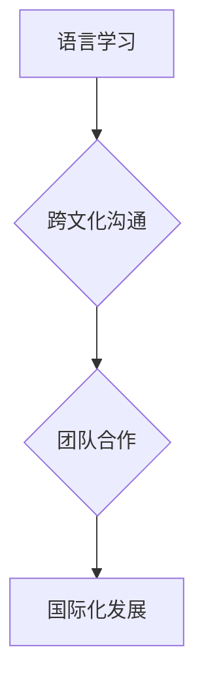

                 

## 程序员的国际化发展：语言与文化障碍

> 关键词：程序员国际化、语言障碍、文化差异、沟通技巧、团队合作、全球软件开发、跨文化管理

### 1. 背景介绍

在全球化时代，软件开发行业呈现出蓬勃发展的态势。随着互联网技术的飞速发展，软件产品无国界地传播，程序员的需求也随之扩大。然而，程序员的国际化发展面临着诸多挑战，其中语言和文化障碍是不可忽视的因素。

#### 1.1  全球软件开发的趋势

近年来，全球软件开发模式日益普及，跨国公司和创业公司纷纷将开发团队分布在全球各地，以获取更丰富的技术资源和降低成本。这种模式的优势在于能够汇聚来自不同国家和地区的优秀人才，促进技术创新和知识共享。

#### 1.2  语言障碍的影响

然而，语言差异是全球软件开发中不可避免的障碍。程序员需要使用英语进行技术交流、阅读文档、参与会议等，而并非所有程序员都具备流利的英语水平。语言障碍会导致沟通不畅，理解偏差，影响项目进度和质量。

#### 1.3  文化差异的挑战

除了语言障碍，文化差异也对程序员的国际化发展产生重大影响。不同文化背景下的人们在工作方式、沟通风格、团队合作模式等方面存在差异，这些差异可能会导致误解和冲突，影响团队协作效率。

### 2. 核心概念与联系

程序员的国际化发展涉及到语言学习、跨文化沟通、团队合作等多个核心概念，这些概念相互关联，共同影响着程序员在全球软件开发环境中的成功。

#### 2.1  语言学习

语言学习是程序员国际化发展的重要基础。掌握英语作为全球软件开发的通用语言，能够帮助程序员更好地理解技术文档、参与技术交流、与国际团队合作。

#### 2.2  跨文化沟通

跨文化沟通是指在不同文化背景下进行有效交流的能力。程序员需要了解不同文化背景下的人们在沟通方式、表达习惯、价值观等方面的差异，才能避免误解和冲突，促进团队合作。

#### 2.3  团队合作

团队合作是软件开发的核心要素。程序员需要具备良好的团队合作精神，能够与来自不同文化背景的同事有效沟通、协作，共同完成项目目标。

**Mermaid 流程图**



### 3. 核心算法原理 & 具体操作步骤

#### 3.1  算法原理概述

在本文中，我们主要探讨一种名为“跨文化沟通算法”的算法，该算法旨在帮助程序员在跨文化环境下进行有效沟通。该算法基于以下核心原理：

* **文化敏感性:** 算法需要识别不同文化背景下的人们在沟通方式、表达习惯、价值观等方面的差异。
* **语言理解:** 算法需要能够理解不同语言的文本和语音，并将其转换为通用的语言。
* **情感识别:** 算法需要能够识别说话者的情感，以便更好地理解其意图。

#### 3.2  算法步骤详解

1. **文化识别:** 算法首先需要识别说话者的文化背景，可以使用地理位置、语言、姓名等信息进行识别。
2. **语言翻译:** 算法将说话者的语言翻译成目标语言，可以使用机器翻译技术或人工翻译。
3. **情感分析:** 算法分析说话者的语气、表情、肢体语言等信息，识别其情感状态。
4. **文化适应:** 算法根据说话者的文化背景和情感状态，调整语言表达方式，使其更符合目标文化背景的沟通习惯。
5. **反馈机制:** 算法收集用户反馈，不断优化算法模型，提高沟通效率。

#### 3.3  算法优缺点

**优点:**

* 能够有效降低语言和文化障碍，促进跨文化沟通。
* 可以提高沟通效率，减少误解和冲突。
* 可以帮助程序员更好地理解不同文化背景下的人们。

**缺点:**

* 算法模型的准确性取决于训练数据，如果训练数据不足或不准确，算法效果可能会受到影响。
* 算法无法完全替代人与人之间的沟通，还需要程序员具备一定的跨文化沟通能力。

#### 3.4  算法应用领域

跨文化沟通算法可以应用于以下领域：

* **全球软件开发:** 帮助程序员在跨文化团队中进行有效沟通。
* **远程协作:** 帮助远程团队成员克服语言和文化障碍，进行高效协作。
* **国际商务:** 帮助企业与来自不同文化背景的客户进行有效沟通。

### 4. 数学模型和公式 & 详细讲解 & 举例说明

#### 4.1  数学模型构建

我们可以使用概率模型来描述跨文化沟通算法的运作机制。假设说话者A来自文化背景C1，接收者B来自文化背景C2，则说话者A的语言表达可以看作是一个随机变量X，其取值空间为所有可能的语言表达。接收者B对语言表达X的理解可以看作是另一个随机变量Y，其取值空间为所有可能的理解结果。

#### 4.2  公式推导过程

我们可以使用贝叶斯公式来计算接收者B对说话者A语言表达X的理解概率P(Y|X)。

$$P(Y|X) = \frac{P(X|Y)P(Y)}{P(X)}$$

其中：

* P(Y|X) 是接收者B对语言表达X的理解概率。
* P(X|Y) 是说话者A在理解为Y的情况下，使用语言表达X的概率。
* P(Y) 是接收者B理解为Y的概率。
* P(X) 是说话者A使用语言表达X的概率。

#### 4.3  案例分析与讲解

例如，假设说话者A来自中国文化背景，使用汉语表达“你好”，接收者B来自美国文化背景，理解为“Hello”。

* P(X|Y) 可以根据文化背景和语言表达之间的关联性进行计算，例如，在汉语文化背景下，“你好”表达的含义与“Hello”较为接近。
* P(Y) 可以根据接收者B的文化背景和语言理解能力进行计算，例如，美国人对英语的理解能力较高。
* P(X) 可以根据说话者A的语言表达习惯进行计算，例如，中国人经常使用“你好”作为问候语。

通过计算上述概率，我们可以得到接收者B对“你好”的理解概率P(Hello|你好)。

### 5. 项目实践：代码实例和详细解释说明

#### 5.1  开发环境搭建

为了实现跨文化沟通算法，我们需要搭建一个开发环境，包括以下软件和工具：

* **编程语言:** Python
* **机器学习库:** TensorFlow 或 PyTorch
* **自然语言处理库:** NLTK 或 spaCy
* **翻译工具:** Google Translate API 或 Microsoft Translator API

#### 5.2  源代码详细实现

以下是一个简单的跨文化沟通算法的Python代码示例：

```python
import nltk
from nltk.translate.bleu_score import sentence_bleu

# 下载语言模型
nltk.download('punkt')
nltk.download('averaged_perceptron_tagger')

# 定义翻译函数
def translate(text, source_language, target_language):
  # 使用翻译工具翻译文本
  translated_text = googletrans.Translator().translate(text, src=source_language, dest=target_language).text
  return translated_text

# 定义情感分析函数
def analyze_emotion(text):
  # 使用情感分析模型分析文本的情感
  # ...

# 定义跨文化沟通函数
def communicate(text, source_culture, target_culture):
  # 翻译文本
  translated_text = translate(text, source_culture, target_culture)
  # 分析文本的情感
  emotion = analyze_emotion(translated_text)
  # 根据文化背景和情感调整语言表达
  # ...
  return adjusted_text

# 示例用法
text = "你好"
source_culture = "zh-CN"
target_culture = "en-US"
adjusted_text = communicate(text, source_culture, target_culture)
print(f"调整后的文本: {adjusted_text}")

# 计算翻译质量
reference_translation = "Hello"
bleu_score = sentence_bleu([reference_translation], translated_text)
print(f"翻译质量: {bleu_score}")
```

#### 5.3  代码解读与分析

该代码示例展示了跨文化沟通算法的基本流程，包括翻译、情感分析和语言调整。

#### 5.4  运行结果展示

运行该代码后，程序将输出调整后的文本和翻译质量得分。

### 6. 实际应用场景

#### 6.1  全球软件开发团队

跨文化沟通算法可以帮助全球软件开发团队成员克服语言和文化障碍，提高沟通效率，促进项目顺利进行。

#### 6.2  远程协作平台

跨文化沟通算法可以集成到远程协作平台中，帮助远程团队成员进行更有效的沟通和协作。

#### 6.3  国际商务平台

跨文化沟通算法可以应用于国际商务平台，帮助企业与来自不同文化背景的客户进行更流畅的沟通和交易。

#### 6.4  未来应用展望

随着人工智能技术的不断发展，跨文化沟通算法将更加智能化、个性化，能够更好地适应不同文化背景下的沟通需求。

### 7. 工具和资源推荐

#### 7.1  学习资源推荐

* **Coursera:** 提供有关跨文化沟通和人工智能的在线课程。
* **edX:** 提供有关语言学和机器学习的在线课程。
* **Udacity:** 提供有关人工智能和软件开发的在线课程。

#### 7.2  开发工具推荐

* **Google Translate API:** 提供机器翻译服务。
* **Microsoft Translator API:** 提供机器翻译服务。
* **NLTK:** 自然语言处理库。
* **spaCy:** 自然语言处理库。

#### 7.3  相关论文推荐

* **Cross-Cultural Communication in Software Development: A Systematic Literature Review**
* **A Survey of Cross-Cultural Communication Models**
* **Machine Translation for Cross-Cultural Communication**

### 8. 总结：未来发展趋势与挑战

#### 8.1  研究成果总结

跨文化沟通算法的研究取得了显著进展，能够有效降低语言和文化障碍，促进跨文化沟通。

#### 8.2  未来发展趋势

未来，跨文化沟通算法将更加智能化、个性化，能够更好地适应不同文化背景下的沟通需求。

#### 8.3  面临的挑战

跨文化沟通算法仍然面临着一些挑战，例如：

* 算法模型的准确性需要进一步提高。
* 算法需要能够处理更复杂的语言表达和文化差异。
* 算法需要能够适应不同的沟通场景和情境。

#### 8.4  研究展望

未来，我们将继续研究跨文化沟通算法，使其更加智能化、高效化，为全球软件开发和跨文化交流提供更强大的支持。

### 9. 附录：常见问题与解答

#### 9.1  Q1: 跨文化沟通算法可以完全替代人与人之间的沟通吗？

**A1:** 跨文化沟通算法可以有效降低语言和文化障碍，但不能完全替代人与人之间的沟通。人与人之间的沟通需要更多的情感理解、非语言表达和文化敏感性，这些方面算法还难以完全模拟。

#### 9.2  Q2: 跨文化沟通算法需要哪些数据进行训练？

**A2:** 跨文化沟通算法需要大量的文本数据、情感数据和文化数据进行训练。这些数据可以来自书籍、文章、网站、社交媒体等多种来源。

#### 9.3  Q3: 如何评估跨文化沟通算法的性能？

**A3:** 跨文化沟通算法的性能可以评估其翻译质量、情感识别准确率、文化适应性等指标。

作者：禅与计算机程序设计艺术 / Zen and the Art of Computer Programming


<end_of_turn>

