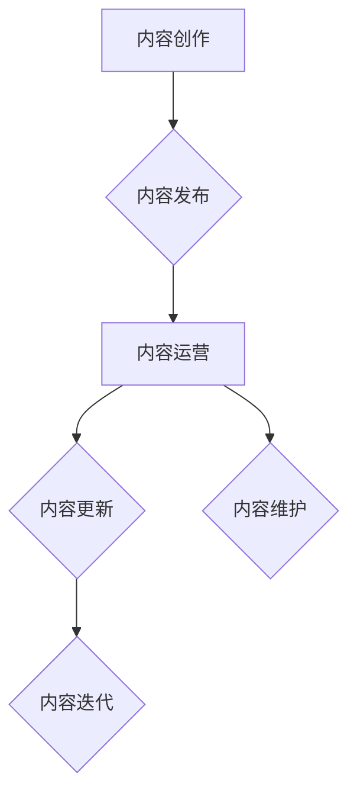

                 

## 程序员的知识付费内容更新与维护策略

> 关键词：知识付费、程序员、内容更新、内容维护、技术博客、在线课程、社区运营、内容策略

## 1. 背景介绍

随着互联网的蓬勃发展和科技行业的快速迭代，程序员的需求量持续增长，同时也催生了知识付费市场的新机遇。程序员群体对技术技能的提升和行业动态的了解有着迫切的需求，而知识付费平台为他们提供了便捷高效的学习途径。

知识付费内容涵盖了广泛的领域，从基础编程语言到高级架构设计，从特定技术框架到行业最佳实践，满足了程序员不同层次的需求。然而，知识付费内容的更新与维护是保证其价值和吸引力的关键环节。

## 2. 核心概念与联系

**2.1 知识付费内容的生命周期**

知识付费内容的生命周期可以概括为以下几个阶段：

* **内容创作阶段:**  程序员将自己的技术经验和知识体系转化为可供学习的内容，例如撰写博客文章、录制视频课程、制作电子书等。
* **内容发布阶段:**  将创作好的内容发布到知识付费平台，例如 Udemy、Coursera、B站等，并进行推广和营销。
* **内容运营阶段:**  持续更新和维护内容，及时回应用户反馈，并根据市场需求进行调整和优化。
* **内容迭代阶段:**  根据用户反馈和技术发展趋势，对内容进行升级和更新，例如添加新章节、更新案例、补充最新技术知识等。

**2.2 内容更新与维护的关联性**

内容更新与维护是知识付费内容生命周期的重要组成部分，它们相互关联，共同影响着内容的价值和吸引力。

* **内容更新:**  及时更新内容可以保证其与时俱进，满足用户不断变化的需求。
* **内容维护:**  持续维护内容可以确保其质量和准确性，提升用户学习体验。

**2.3 内容更新与维护的策略**

* **用户反馈:**  收集用户反馈，了解用户对内容的需求和建议，并根据反馈进行内容更新和调整。
* **技术发展:**  关注技术发展趋势，及时更新内容，包含最新的技术知识和实践经验。
* **市场需求:**  分析市场需求，了解用户对哪些内容感兴趣，并根据需求进行内容创作和更新。

**Mermaid 流程图**



## 3. 核心算法原理 & 具体操作步骤

**3.1 算法原理概述**

知识付费内容更新与维护算法的核心在于高效地分析用户数据、技术趋势和市场需求，并根据分析结果制定合理的更新策略。

**3.2 算法步骤详解**

1. **数据收集:** 收集用户行为数据、技术文档、市场报告等相关信息。
2. **数据分析:** 利用机器学习算法对数据进行分析，识别用户需求、技术趋势和市场热点。
3. **策略制定:** 根据数据分析结果，制定内容更新和维护策略，包括更新频率、更新内容、更新方式等。
4. **内容更新:**  根据策略，更新和维护知识付费内容，例如添加新章节、更新案例、补充最新技术知识等。
5. **效果评估:**  评估内容更新和维护的效果，例如用户参与度、用户反馈、内容下载量等。
6. **策略优化:**  根据效果评估结果，优化内容更新和维护策略，不断提升内容的价值和吸引力。

**3.3 算法优缺点**

* **优点:**  能够高效地分析大量数据，制定合理的更新策略，提高内容的价值和吸引力。
* **缺点:**  需要专业的技术人员进行开发和维护，数据分析结果可能存在偏差，需要不断优化和完善。

**3.4 算法应用领域**

* **知识付费平台:**  用于优化内容更新和维护策略，提高用户学习体验。
* **技术博客:**  用于分析用户阅读习惯，推荐相关内容，提升用户粘性。
* **在线课程:**  用于根据用户学习进度和反馈，个性化推荐学习内容。

## 4. 数学模型和公式 & 详细讲解 & 举例说明

**4.1 数学模型构建**

知识付费内容更新与维护可以构建一个数学模型，用于量化内容价值和更新频率。

* **内容价值:**  可以根据用户参与度、用户反馈、内容下载量等指标进行量化。
* **更新频率:**  可以根据内容更新成本、用户需求、技术发展趋势等因素进行设定。

**4.2 公式推导过程**

* **内容价值公式:**  

$$
Value = \alpha * Engagement + \beta * Feedback + \gamma * Downloads
$$

其中:

*  $Value$：内容价值
*  $Engagement$：用户参与度
*  $Feedback$：用户反馈
*  $Downloads$：内容下载量
*  $\alpha$, $\beta$, $\gamma$：权重系数

* **更新频率公式:**

$$
Frequency = \frac{Value * Trend}{Cost}
$$

其中:

*  $Frequency$：更新频率
*  $Value$：内容价值
*  $Trend$：技术发展趋势
*  $Cost$：更新成本

**4.3 案例分析与讲解**

假设一个编程语言学习平台，其内容价值公式为：

$$
Value = 0.5 * Engagement + 0.3 * Feedback + 0.2 * Downloads
$$

平台数据显示，该平台的编程语言课程用户参与度为 100，用户反馈为 80，内容下载量为 50。

根据公式计算，该课程的内容价值为：

$$
Value = 0.5 * 100 + 0.3 * 80 + 0.2 * 50 = 50 + 24 + 10 = 84
$$

平台分析，该课程的技术发展趋势为 0.8，更新成本为 20。

根据更新频率公式计算，该课程的更新频率为：

$$
Frequency = \frac{84 * 0.8}{20} = 3.36
$$

因此，该课程建议每月更新 3-4 次。

## 5. 项目实践：代码实例和详细解释说明

**5.1 开发环境搭建**

* Python 3.x
* Pandas
* Scikit-learn
* Jupyter Notebook

**5.2 源代码详细实现**

```python
import pandas as pd
from sklearn.cluster import KMeans

# 加载用户数据
data = pd.read_csv('user_data.csv')

# 数据预处理
# ...

# 使用 KMeans 算法进行用户聚类
kmeans = KMeans(n_clusters=3)
data['cluster'] = kmeans.fit_predict(data[['engagement', 'feedback', 'downloads']])

# 分析每个聚类的用户特征
# ...

# 根据聚类结果制定内容更新策略
# ...
```

**5.3 代码解读与分析**

*  代码首先加载用户数据，并进行数据预处理。
*  使用 KMeans 算法对用户进行聚类，将用户分为 3 个类别。
*  分析每个聚类的用户特征，例如平均参与度、平均反馈、平均下载量等。
*  根据聚类结果，制定不同的内容更新策略，例如针对不同用户群体的兴趣和需求进行内容定制。

**5.4 运行结果展示**

运行结果将显示用户聚类情况，以及每个聚类用户的特征分析结果。

## 6. 实际应用场景

**6.1 在线课程平台**

*  根据用户学习进度和反馈，个性化推荐学习内容。
*  根据用户兴趣和需求，开发新的课程和学习资源。

**6.2 技术博客**

*  分析用户阅读习惯，推荐相关内容。
*  根据用户反馈，更新和完善博客文章。

**6.3 社区运营**

*  根据用户参与度和反馈，优化社区运营策略。
*  根据用户需求，组织线上线下活动。

**6.4 未来应用展望**

随着人工智能技术的不断发展，知识付费内容更新与维护将更加智能化和个性化。

*  利用深度学习算法，更精准地分析用户需求和技术趋势。
*  基于用户画像，提供个性化的学习推荐和内容定制。
*  实现内容自动更新和维护，降低人力成本。

## 7. 工具和资源推荐

**7.1 学习资源推荐**

*  **机器学习算法:**  Andrew Ng 的机器学习课程
*  **数据分析工具:**  Pandas、Scikit-learn
*  **内容运营工具:**  Google Analytics、SEMrush

**7.2 开发工具推荐**

*  **Python:**  Python 3.x
*  **数据可视化工具:**  Matplotlib、Seaborn
*  **云计算平台:**  AWS、Azure、GCP

**7.3 相关论文推荐**

*  **内容推荐系统:**  Collaborative Filtering for Implicit Feedback Datasets
*  **用户画像分析:**  User Profiling for Personalized Recommendations
*  **知识图谱:**  A Survey on Knowledge Graph Embedding Techniques

## 8. 总结：未来发展趋势与挑战

**8.1 研究成果总结**

知识付费内容更新与维护算法的研究取得了显著进展，能够有效地分析用户数据、技术趋势和市场需求，并制定合理的更新策略。

**8.2 未来发展趋势**

*  更加智能化和个性化的内容更新与维护。
*  更精准的用户画像分析和内容推荐。
*  基于人工智能的自动内容更新和维护。

**8.3 面临的挑战**

*  数据质量和隐私保护。
*  算法的准确性和可解释性。
*  内容更新与维护的成本控制。

**8.4 研究展望**

未来研究将重点关注以下几个方面:

*  开发更精准、更智能的算法模型。
*  探索新的内容更新与维护模式。
*  研究人工智能在知识付费领域的应用场景。

## 9. 附录：常见问题与解答

**9.1 如何收集用户数据？**

可以通过以下方式收集用户数据:

*  用户行为日志
*  用户反馈调查
*  用户问答记录

**9.2 如何进行数据分析？**

可以使用机器学习算法对数据进行分析，例如 KMeans 聚类、线性回归等。

**9.3 如何制定内容更新策略？**

根据数据分析结果，结合技术发展趋势和市场需求，制定合理的更新策略。

**9.4 如何评估内容更新效果？**

可以通过用户参与度、用户反馈、内容下载量等指标进行评估。


作者：禅与计算机程序设计艺术 / Zen and the Art of Computer Programming 
<end_of_turn>

