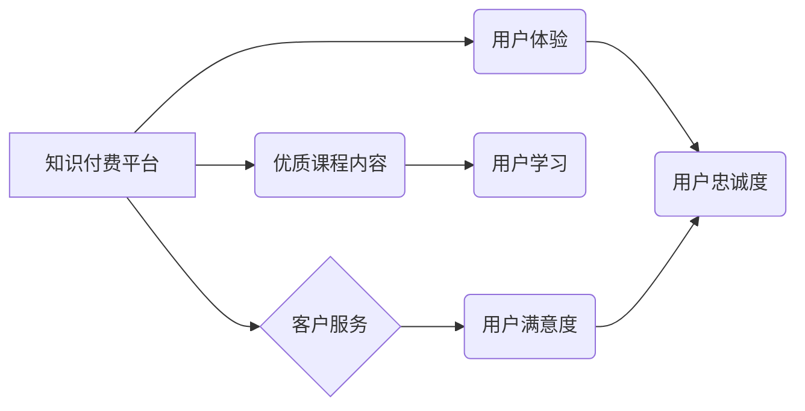

                 

## 程序员知识付费的客户服务与用户体验

> 关键词：知识付费、程序员、客户服务、用户体验、在线教育、社区建设、内容运营、技术博客

## 1. 背景介绍

近年来，随着互联网技术的快速发展和普及，知识付费行业蓬勃发展，其中程序员知识付费市场尤为火爆。程序员作为科技领域的核心力量，对技术知识的需求量巨大，而传统的教育模式难以满足他们的个性化学习需求。知识付费平台以其灵活、便捷、高效的特点，为程序员提供了学习新技术、提升技能的全新途径。

然而，程序员知识付费市场竞争激烈，平台之间差异化竞争日益突出。仅仅依靠优质的课程内容已经无法满足用户需求，如何提供优质的客户服务和用户体验，成为平台发展的重要课题。

## 2. 核心概念与联系

**2.1  知识付费平台**

知识付费平台是指以知识、技能、经验等为核心内容，通过线上平台向用户提供付费学习服务的商业模式。

**2.2  客户服务**

客户服务是指企业为客户提供售前、售中、售后等全方位服务的体系，旨在提升客户满意度和忠诚度。

**2.3  用户体验**

用户体验是指用户在使用产品或服务过程中所感受到的整体感受，包括易用性、可用性、愉悦度等方面。

**2.4  关系图**



## 3. 核心算法原理 & 具体操作步骤

**3.1  算法原理概述**

程序员知识付费平台的客户服务和用户体验优化并非依靠单一的算法，而是需要结合多种技术手段和策略进行综合设计。

**3.2  算法步骤详解**

1. **数据收集与分析:** 利用用户行为数据、反馈信息等进行分析，了解用户需求、痛点和喜好。
2. **个性化推荐:** 基于用户学习历史、兴趣偏好等信息，推荐个性化的课程和学习资源。
3. **智能客服:** 利用自然语言处理技术，构建智能客服系统，快速响应用户咨询，解决常见问题。
4. **用户反馈机制:** 建立完善的用户反馈机制，及时收集用户意见和建议，不断优化平台服务。
5. **社区建设:** 构建线上线下社区，鼓励用户互动交流，分享学习经验，形成学习氛围。

**3.3  算法优缺点**

* **优点:** 能够提高用户学习效率、提升用户满意度，促进平台发展。
* **缺点:** 需要投入大量数据和技术资源，算法模型需要不断迭代优化。

**3.4  算法应用领域**

* **课程推荐:** 根据用户学习历史和兴趣推荐相关课程。
* **学习进度跟踪:** 自动跟踪用户学习进度，提供个性化学习建议。
* **知识问答:** 利用知识图谱和自然语言处理技术，构建智能问答系统，帮助用户解决学习难题。
* **用户社区:** 建立线上线下社区，促进用户互动交流，分享学习经验。

## 4. 数学模型和公式 & 详细讲解 & 举例说明

**4.1  数学模型构建**

用户满意度模型可以采用以下公式进行构建:

$$
User Satisfaction = f(Course Quality, Service Quality, User Experience)
$$

其中:

* **Course Quality:** 课程质量，包括课程内容的深度、广度、实用性等。
* **Service Quality:** 服务质量，包括客服响应速度、问题解决效率、平台稳定性等。
* **User Experience:** 用户体验，包括平台易用性、学习氛围、用户互动性等。

**4.2  公式推导过程**

用户满意度模型的构建基于以下假设:

* 课程质量、服务质量和用户体验是影响用户满意度的主要因素。
* 这些因素之间存在相互影响的关系。

根据以上假设，我们可以构建一个多因素影响的用户满意度模型。

**4.3  案例分析与讲解**

假设一个程序员知识付费平台，其课程质量为 80 分，服务质量为 70 分，用户体验为 90 分。根据公式，我们可以计算出该平台的用户满意度为:

$$
User Satisfaction = f(80, 70, 90)
$$

由于公式的具体形式取决于平台的具体情况，因此无法直接计算出用户满意度的具体数值。但是，我们可以通过分析各个因素的权重和影响程度，来判断该平台的用户满意度水平。

## 5. 项目实践：代码实例和详细解释说明

**5.1  开发环境搭建**

* 操作系统: Ubuntu 20.04 LTS
* 编程语言: Python 3.8
* 开发框架: Django 3.2
* 数据库: PostgreSQL 13

**5.2  源代码详细实现**

以下代码示例展示了如何使用 Django 框架构建一个简单的用户反馈机制:

```python
# models.py
from django.db import models

class Feedback(models.Model):
    user = models.ForeignKey(User, on_delete=models.CASCADE)
    content = models.TextField()
    created_at = models.DateTimeField(auto_now_add=True)

# views.py
from django.shortcuts import render, redirect
from .models import Feedback

def feedback_view(request):
    if request.method == 'POST':
        content = request.POST.get('content')
        feedback = Feedback(user=request.user, content=content)
        feedback.save()
        return redirect('home')
    return render(request, 'feedback.html')
```

**5.3  代码解读与分析**

* `models.py`: 定义了 `Feedback` 模型，用于存储用户反馈信息。
* `views.py`: 定义了 `feedback_view` 视图函数，处理用户提交反馈的请求。

**5.4  运行结果展示**

当用户访问 `feedback_view` 视图函数时，会显示一个反馈表单，用户可以输入反馈内容并提交。提交后，系统会将反馈信息存储到数据库中。

## 6. 实际应用场景

**6.1  课程质量评估**

通过收集用户对课程的反馈，平台可以了解课程的优缺点，及时进行改进和优化。

**6.2  服务质量提升**

通过分析用户对服务的反馈，平台可以识别服务中的问题，并采取措施进行改进。

**6.3  用户体验优化**

通过收集用户对平台体验的反馈，平台可以了解用户需求，并进行相应的优化设计。

**6.4  未来应用展望**

随着人工智能技术的不断发展，程序员知识付费平台的客户服务和用户体验将更加智能化、个性化。例如，可以利用机器学习算法，预测用户需求，提供更精准的推荐服务；利用自然语言处理技术，构建更智能的客服系统，能够更准确地理解用户需求，并提供更有效的解决方案。

## 7. 工具和资源推荐

**7.1  学习资源推荐**

* **书籍:**
    * 《用户体验设计》
    * 《客户服务管理》
    * 《数据分析与挖掘》
* **在线课程:**
    * Coursera: 用户体验设计
    * Udemy: 客户服务管理
    * edX: 数据分析与挖掘

**7.2  开发工具推荐**

* **Django:** Python 框架，用于构建 Web 应用。
* **React:** JavaScript 库，用于构建用户界面。
* **Node.js:** JavaScript 运行环境，用于构建后端服务。

**7.3  相关论文推荐**

* **The Design of Everyday Things** by Don Norman
* **Don't Make Me Think** by Steve Krug
* **Lean Startup** by Eric Ries

## 8. 总结：未来发展趋势与挑战

**8.1  研究成果总结**

程序员知识付费平台的客户服务和用户体验优化是一个不断发展和完善的过程。通过数据分析、算法模型、技术工具等手段，平台可以不断提升用户满意度和忠诚度，促进平台发展。

**8.2  未来发展趋势**

* **人工智能化:** 利用人工智能技术，实现更智能的客户服务和用户体验。
* **个性化定制:** 根据用户的学习需求和习惯，提供个性化的学习方案和服务。
* **社区化发展:** 构建更活跃的学习社区，促进用户互动交流和知识共享。

**8.3  面临的挑战**

* **数据安全:** 保护用户隐私和数据安全。
* **算法偏见:** 避免算法模型产生偏见，确保公平公正的服务。
* **技术迭代:** 持续跟踪技术发展趋势，不断更新平台技术。

**8.4  研究展望**

未来，程序员知识付费平台的客户服务和用户体验优化将更加注重用户需求的个性化、智能化和社区化。


## 9. 附录：常见问题与解答

**9.1  常见问题:**

* 如何提高用户学习效率？
* 如何提升用户满意度？
* 如何构建一个活跃的学习社区？

**9.2  解答:**

* **提高用户学习效率:** 提供个性化学习推荐、智能学习助手、知识问答服务等。
* **提升用户满意度:** 提供优质的课程内容、高效的客户服务、良好的用户体验等。
* **构建一个活跃的学习社区:** 鼓励用户互动交流、分享学习经验、组织线上线下活动等。


作者：禅与计算机程序设计艺术 / Zen and the Art of Computer Programming 
<end_of_turn>

