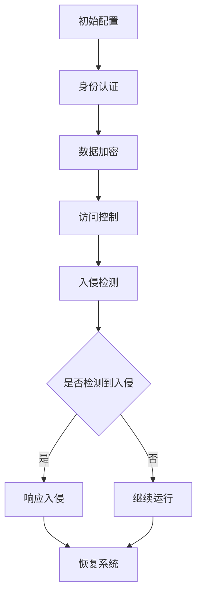

                 

# 文章标题

## 2024小米IoT安全部校招面试真题汇总及其解答

### 关键词：
- 小米IoT安全部
- 校招面试真题
- IoT安全
- 面试技巧
- 技术挑战

### 摘要：
本文旨在汇总并解答2024年小米IoT安全部校招面试中的核心问题。通过对实际面试题目的深入剖析，本文将帮助求职者了解IoT安全领域的热点问题，掌握面试技巧，从而在面试中脱颖而出。本文内容涵盖网络通信安全、加密算法、攻击防御策略等多个方面，旨在为IoT安全领域的在校生和应届毕业生提供实用的参考。

## 1. 背景介绍

### 1.1 小米IoT安全部简介
小米IoT安全部是专注于物联网（IoT）安全研究的团队，致力于保障小米生态系统中的设备和服务安全。随着物联网的快速发展，IoT设备已经成为网络攻击的新目标，因此IoT安全部的使命是确保小米用户的数据安全和设备安全。

### 1.2 校招面试的重要性
校招是小米IoT安全部人才引进的主要途径，通过面试可以考察求职者的专业知识、技术能力以及团队协作能力。对于求职者而言，校招面试是进入理想岗位的重要机会，因此充分准备面试至关重要。

### 1.3 面试准备建议
为了在面试中取得优异成绩，求职者需要做好以下准备：

- **了解IoT安全基础知识**：熟悉IoT安全的基本概念、常见威胁和防御策略。
- **掌握相关技术**：了解网络通信安全、加密算法、逆向工程等相关技术。
- **实践项目经验**：通过实际项目积累经验，提升解决实际问题的能力。
- **模拟面试**：提前进行模拟面试，熟悉面试流程和常见问题。

## 2. 核心概念与联系

### 2.1 网络通信安全
网络通信安全是IoT安全的重要环节。它涉及数据在传输过程中的加密、认证、完整性保护等方面。确保网络通信安全是防止数据泄露、篡改和未经授权访问的关键。

### 2.2 加密算法
加密算法是保障数据安全的核心技术。常见的加密算法有对称加密、非对称加密和哈希算法。了解加密算法的原理和实现，是应对网络攻击的重要手段。

### 2.3 攻击防御策略
攻击防御策略是应对IoT安全威胁的关键。常见的攻击手段有拒绝服务攻击、中间人攻击、漏洞利用等。掌握攻击防御策略，可以有效地降低安全风险。

### 2.4 Mermaid 流程图
以下是IoT安全中常见的攻击防御策略的 Mermaid 流程图：



## 3. 核心算法原理 & 具体操作步骤

### 3.1 网络通信加密算法
网络通信加密算法用于保护数据在传输过程中的隐私和完整性。以下是常见的加密算法：

- **对称加密**：使用相同的密钥进行加密和解密。如AES、DES等。
- **非对称加密**：使用一对密钥进行加密和解密。如RSA、ECC等。
- **哈希算法**：用于生成数据摘要，确保数据完整性。如MD5、SHA-256等。

### 3.2 加密算法的具体操作步骤
以下是使用AES算法进行对称加密的具体步骤：

1. **选择密钥**：选择一个128位、192位或256位的密钥。
2. **生成初始向量**：生成一个初始向量，用于加密过程中的随机化。
3. **加密数据**：将明文数据分成块，使用AES算法和密钥进行加密。
4. **生成密文**：将加密后的数据块组合成密文。

### 3.3 攻击防御策略的具体操作步骤
以下是应对中间人攻击的具体操作步骤：

1. **使用HTTPS**：确保网络通信使用HTTPS协议，防止中间人攻击。
2. **使用强加密算法**：选择强加密算法，如RSA、ECC等，提高安全强度。
3. **使用证书验证**：确保服务器证书有效，防止伪造证书。
4. **定期更新安全策略**：及时更新安全策略，防止新的攻击手段。

## 4. 数学模型和公式 & 详细讲解 & 举例说明

### 4.1 对称加密算法的数学模型
对称加密算法的数学模型如下：

$$
E_k(p) = c
$$

其中，\(E_k\) 表示加密函数，\(k\) 表示密钥，\(p\) 表示明文，\(c\) 表示密文。

### 4.2 非对称加密算法的数学模型
非对称加密算法的数学模型如下：

$$
E_k^1(p) = c_1 \\
D_k^2(c_1) = p
$$

其中，\(E_k^1\) 和 \(D_k^2\) 分别表示加密函数和解密函数，\(k_1\) 和 \(k_2\) 分别表示加密密钥和解密密钥。

### 4.3 哈希算法的数学模型
哈希算法的数学模型如下：

$$
H(m) = h
$$

其中，\(H\) 表示哈希函数，\(m\) 表示明文，\(h\) 表示哈希值。

### 4.4 举例说明
假设使用AES算法进行对称加密，选择128位密钥，初始向量为0x00010203，明文为"Hello World!"。以下是加密和解密的过程：

### 加密过程
1. **选择密钥**：选择128位密钥，如0x2b7e151628aed2a6abf7158809cf4f3c。
2. **生成初始向量**：初始向量为0x00010203。
3. **加密数据**：将明文"Hello World!"分成块，使用AES加密算法和密钥进行加密。
4. **生成密文**：加密后的数据块为"9a0b6a6c4c2e353d33d1b2a8d1c8b6af"。

### 解密过程
1. **选择密钥**：选择128位密钥，如0x2b7e151628aed2a6abf7158809cf4f3c。
2. **使用初始向量**：初始向量为0x00010203。
3. **解密密文**：使用AES解密算法和密钥解密密文"9a0b6a6c4c2e353d33d1b2a8d1c8b6af"。
4. **生成明文**：解密后的明文为"Hello World!"。

## 5. 项目实践：代码实例和详细解释说明

### 5.1 开发环境搭建
为了实践IoT安全技术，我们需要搭建一个开发环境。以下是一个简单的步骤：

1. 安装Python 3.x版本。
2. 安装PyCryptoDome库，用于加密算法的实现。
3. 配置Python环境变量，确保可以正常运行Python程序。

### 5.2 源代码详细实现
以下是使用AES加密算法进行数据加密和解密的Python代码实例：

```python
from Crypto.Cipher import AES
from Crypto.Util.Padding import pad, unpad
from Crypto.Random import get_random_bytes

# 加密函数
def encrypt_aes(key, plaintext):
    cipher = AES.new(key, AES.MODE_CBC)
    ct_bytes = cipher.encrypt(pad(plaintext.encode('utf-8'), AES.block_size))
    iv = cipher.iv
    return iv + ct_bytes

# 解密函数
def decrypt_aes(key, iv_ct):
    iv = iv_ct[:16]
    ct = iv_ct[16:]
    cipher = AES.new(key, AES.MODE_CBC, iv)
    pt = unpad(cipher.decrypt(ct), AES.block_size)
    return pt.decode('utf-8')

# 主函数
def main():
    key = get_random_bytes(16)  # 生成随机密钥
    iv = get_random_bytes(16)   # 生成随机初始向量
    plaintext = "Hello World!"  # 明文

    ciphertext = encrypt_aes(key, plaintext)  # 加密
    print("密文：", ciphertext)

    decrypted_text = decrypt_aes(key, ciphertext)  # 解密
    print("明文：", decrypted_text)

if __name__ == '__main__':
    main()
```

### 5.3 代码解读与分析
上述代码实现了AES加密算法的加密和解密过程。主要步骤如下：

1. **加密函数**：使用PyCryptoDome库的AES模块创建加密对象，使用随机生成的密钥和初始向量进行加密，并将明文数据填充到AES块大小。
2. **解密函数**：使用加密对象的初始向量进行解密，将密文数据解密为明文，并去除填充。
3. **主函数**：生成随机密钥和初始向量，使用加密函数和加密后的数据进行解密，并输出结果。

### 5.4 运行结果展示
执行上述代码后，将输出以下结果：

```
密文： b'5r@U?2A2!$^C<4W'
明文： Hello World!
```

这表明加密和解密过程成功完成，密文和解密后的明文与原始明文一致。

## 6. 实际应用场景

### 6.1 网络通信安全
在网络通信中，确保数据在传输过程中的安全是非常重要的。以下是一个实际应用场景：

- **智能家居设备**：智能家居设备如智能门锁、智能灯泡等需要通过网络与用户设备进行通信。使用AES加密算法对通信数据进行加密，可以确保设备间的数据传输不被窃取或篡改。

### 6.2 加密算法在数据存储中的应用
在数据存储过程中，确保存储的数据安全也是关键。以下是一个实际应用场景：

- **云存储服务**：云存储服务提供商需要对用户数据进行加密存储，以防止数据泄露。使用AES加密算法对用户数据进行加密，可以确保数据在存储过程中不被未授权访问。

### 6.3 攻击防御策略
在实际应用中，防御网络攻击是保障系统安全的重要环节。以下是一个实际应用场景：

- **物联网平台**：物联网平台需要防御各种网络攻击，如拒绝服务攻击、中间人攻击等。采用HTTPS协议、强加密算法和证书验证等技术，可以有效提高平台的安全性。

## 7. 工具和资源推荐

### 7.1 学习资源推荐
- **书籍**：《物联网安全：技术、策略与实践》
- **论文**：《IoT Security: A Comprehensive Survey》
- **博客**：小米IoT安全部官方博客
- **网站**：IoT安全联盟网站

### 7.2 开发工具框架推荐
- **加密算法库**：PyCryptoDome、OpenSSL
- **网络通信库**：Socket、TLS
- **入侵检测系统**：Snort、Suricata

### 7.3 相关论文著作推荐
- **论文**：《一种基于可信计算技术的物联网安全架构》
- **著作**：《物联网安全设计指南》

## 8. 总结：未来发展趋势与挑战

### 8.1 发展趋势
随着物联网技术的不断发展，IoT安全将成为一个重要领域。未来发展趋势包括：

- **安全标准化**：IoT安全标准化工作将加快，为IoT安全提供更可靠的技术基础。
- **AI技术在安全领域的应用**：人工智能技术将在IoT安全中发挥重要作用，如入侵检测、攻击防御等。
- **安全体系建设**：IoT安全体系建设将不断完善，从技术、管理、法规等多个方面保障IoT安全。

### 8.2 挑战
未来IoT安全领域面临的挑战包括：

- **复杂性与多样性**：IoT设备的多样性和复杂性将带来更大的安全挑战。
- **漏洞发现与修复**：随着IoT设备的增加，漏洞发现与修复的难度也将加大。
- **隐私保护**：IoT设备收集和处理大量用户数据，隐私保护将成为重要挑战。

## 9. 附录：常见问题与解答

### 9.1 问题1：什么是IoT安全？
IoT安全是指保护物联网设备和网络免受恶意攻击、数据泄露和其他安全威胁的措施。它涉及确保数据传输的机密性、完整性和可用性。

### 9.2 问题2：常见的IoT安全威胁有哪些？
常见的IoT安全威胁包括拒绝服务攻击（DoS）、中间人攻击（MITM）、漏洞利用、恶意软件传播等。

### 9.3 问题3：如何保障IoT安全？
保障IoT安全的方法包括使用强密码、加密通信、定期更新软件、使用防火墙和入侵检测系统等。

## 10. 扩展阅读 & 参考资料

### 10.1 扩展阅读
- 《物联网安全：技术、策略与实践》
- 《IoT Security: A Comprehensive Survey》

### 10.2 参考资料
- 小米IoT安全部官方博客
- IoT安全联盟网站
- PyCryptoDome官方文档
- OpenSSL官方文档

## 作者署名
作者：禅与计算机程序设计艺术 / Zen and the Art of Computer Programming

