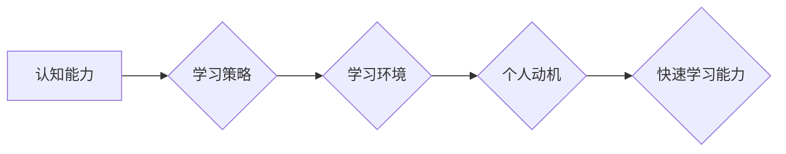

                 

## 1. 背景介绍

在当今瞬息万变的科技时代，学习能力已成为管理者成功的不二法宝。技术迭代速度飞快，新兴技术层出不穷，管理者需要不断学习新知识、掌握新技能，才能带领团队跟上时代步伐，保持竞争力。然而，传统的学习方式往往枯燥乏味，难以满足管理者快速学习的需求。因此，培养高效的快速学习能力，对于管理者而言至关重要。

## 2. 核心概念与联系

**2.1 快速学习能力的定义**

快速学习能力是指在短时间内高效地吸收、理解和应用新知识的能力。它不仅包括知识的获取，更重要的是知识的转化和应用。

**2.2 快速学习能力的构成要素**

快速学习能力的形成是一个复杂的过程，涉及多个要素的协同作用：

* **认知能力:** 包括记忆力、注意力、思维能力等，是学习的基础。
* **学习策略:** 指学习者选择和运用不同的学习方法，例如主动回忆、间隔重复、联想记忆等。
* **学习环境:** 包括学习资源、学习氛围、学习伙伴等，对学习效率有重要影响。
* **个人动机:** 学习者的学习目标、学习兴趣、学习态度等，都会影响学习效果。

**2.3 快速学习能力与管理者的关系**

快速学习能力是管理者成功的重要驱动力。它帮助管理者：

* **洞察市场趋势:** 快速学习新技术和行业知识，帮助管理者洞察市场变化，做出正确的决策。
* **提升团队竞争力:** 管理者需要不断学习新技能，才能带领团队提升效率，增强竞争力。
* **适应不断变化的环境:** 科技发展日新月异，管理者需要不断学习，才能适应不断变化的环境，保持团队的活力。

**2.4 快速学习能力的培养路径**

快速学习能力并非天生的，可以通过刻意练习和学习方法的改进来提升。

**Mermaid 流程图**



## 3. 核心算法原理 & 具体操作步骤

**3.1 算法原理概述**

快速学习算法的核心原理是利用机器学习技术，通过分析大量数据，识别学习模式，并根据这些模式，快速学习新知识。

**3.2 算法步骤详解**

1. **数据收集:** 收集大量与目标知识相关的文本、图像、音频等数据。
2. **数据预处理:** 对收集到的数据进行清洗、格式化、标记等处理，使其适合算法训练。
3. **模型选择:** 选择合适的机器学习模型，例如深度学习模型、支持向量机等。
4. **模型训练:** 利用训练数据，训练机器学习模型，使其能够识别学习模式。
5. **模型评估:** 使用测试数据，评估模型的学习效果，并根据评估结果进行模型调整。
6. **知识提取:** 利用训练好的模型，从新的数据中提取目标知识。

**3.3 算法优缺点**

**优点:**

* 学习速度快，能够在短时间内学习大量知识。
* 自动化程度高，可以减少人工学习的负担。
* 能够处理海量数据，发现隐藏的学习模式。

**缺点:**

* 需要大量的数据进行训练，数据质量对算法效果至关重要。
* 模型训练需要较高的计算资源和技术水平。
* 算法的解释性较差，难以理解模型是如何学习的。

**3.4 算法应用领域**

快速学习算法在各个领域都有广泛的应用，例如：

* **教育领域:** 个性化学习、智能辅导等。
* **医疗领域:** 疾病诊断、药物研发等。
* **金融领域:** 风险评估、投资决策等。
* **商业领域:** 市场预测、客户分析等。

## 4. 数学模型和公式 & 详细讲解 & 举例说明

**4.1 数学模型构建**

快速学习算法通常基于深度学习模型，例如卷积神经网络（CNN）和循环神经网络（RNN）。这些模型可以看作是多层神经网络的组合，每层神经元都连接着上一层的输出，并进行非线性变换。

**4.2 公式推导过程**

深度学习模型的训练过程本质上是一个优化问题，目标是找到模型参数，使得模型的预测结果与真实值之间的误差最小化。常用的优化算法包括梯度下降法和动量法。

**梯度下降法:**

$$
\theta = \theta - \alpha \nabla J(\theta)
$$

其中：

* $\theta$ 是模型参数
* $\alpha$ 是学习率
* $\nabla J(\theta)$ 是损失函数 $J(\theta)$ 的梯度

**动量法:**

$$
v_t = \beta v_{t-1} + \alpha \nabla J(\theta)
$$

$$
\theta = \theta - v_t
$$

其中：

* $v_t$ 是动量项
* $\beta$ 是动量系数

**4.3 案例分析与讲解**

例如，在图像识别任务中，可以使用CNN模型来学习图像特征。CNN模型的每一层神经元都负责提取图像的不同层次的特征。通过训练大量的图像数据，CNN模型能够学习到图像的语义信息，并能够准确地识别图像中的物体。

## 5. 项目实践：代码实例和详细解释说明

**5.1 开发环境搭建**

快速学习算法的开发环境通常需要安装深度学习框架，例如TensorFlow或PyTorch，以及必要的库和工具。

**5.2 源代码详细实现**

以下是一个使用TensorFlow实现简单快速学习算法的代码示例：

```python
import tensorflow as tf

# 定义模型
model = tf.keras.models.Sequential([
  tf.keras.layers.Dense(128, activation='relu', input_shape=(10,)),
  tf.keras.layers.Dense(10, activation='softmax')
])

# 定义损失函数和优化器
model.compile(loss='categorical_crossentropy', optimizer='adam', metrics=['accuracy'])

# 训练模型
model.fit(x_train, y_train, epochs=10)

# 评估模型
loss, accuracy = model.evaluate(x_test, y_test)
print('Loss:', loss)
print('Accuracy:', accuracy)
```

**5.3 代码解读与分析**

这段代码定义了一个简单的多层感知机模型，并使用梯度下降法进行训练。模型的输入是一个10维的向量，输出是一个10类的分类结果。

**5.4 运行结果展示**

训练完成后，可以评估模型的性能，例如计算损失函数和准确率。

## 6. 实际应用场景

**6.1 教育领域**

* **个性化学习:** 根据学生的学习进度和能力，定制个性化的学习方案。
* **智能辅导:** 利用人工智能技术，为学生提供智能化的辅导和答疑服务。

**6.2 医疗领域**

* **疾病诊断:** 利用机器学习算法，分析患者的病历、检查结果等数据，辅助医生进行疾病诊断。
* **药物研发:** 利用人工智能技术，加速药物研发过程，降低研发成本。

**6.3 金融领域**

* **风险评估:** 利用机器学习算法，评估投资风险，帮助投资者做出更明智的决策。
* **欺诈检测:** 利用人工智能技术，识别金融交易中的欺诈行为。

**6.4 未来应用展望**

随着人工智能技术的不断发展，快速学习算法将在更多领域得到应用，例如自动驾驶、机器人、自然语言处理等。

## 7. 工具和资源推荐

**7.1 学习资源推荐**

* **书籍:**
    * 《深度学习》
    * 《机器学习》
* **在线课程:**
    * Coursera
    * edX
    * Udacity

**7.2 开发工具推荐**

* **深度学习框架:** TensorFlow, PyTorch
* **编程语言:** Python

**7.3 相关论文推荐**

* **AlphaGo论文:** https://arxiv.org/abs/1607.02886
* **BERT论文:** https://arxiv.org/abs/1810.04805

## 8. 总结：未来发展趋势与挑战

**8.1 研究成果总结**

快速学习算法在各个领域取得了显著的成果，例如图像识别、自然语言处理、药物研发等。

**8.2 未来发展趋势**

* **模型更加高效:** 研究更轻量级、更高效的深度学习模型。
* **解释性更强:** 研究更易于解释的深度学习模型，提高算法的可信度。
* **跨模态学习:** 研究能够处理多种模态数据的快速学习算法。

**8.3 面临的挑战**

* **数据质量:** 快速学习算法对数据质量要求很高，如何获取高质量的数据是一个挑战。
* **算法可解释性:** 深度学习模型的决策过程难以解释，如何提高算法的可解释性是一个重要问题。
* **伦理问题:** 快速学习算法的应用可能会带来伦理问题，例如算法偏见、数据隐私等，需要引起重视。

**8.4 研究展望**

未来，快速学习算法将继续朝着更高效、更智能、更可解释的方向发展，并在更多领域发挥重要作用。


## 9. 附录：常见问题与解答

**9.1 如何选择合适的快速学习算法？**

选择合适的快速学习算法需要根据具体任务和数据特点进行选择。例如，对于图像识别任务，可以使用CNN模型；对于文本分类任务，可以使用RNN模型。

**9.2 如何提高快速学习算法的效率？**

提高快速学习算法的效率可以从以下几个方面入手：

* 使用更轻量级的模型架构。
* 优化训练参数，例如学习率、批处理大小等。
* 利用硬件加速，例如GPU。

**9.3 如何解决快速学习算法的过拟合问题？**

过拟合是指模型在训练数据上表现很好，但在测试数据上表现较差。解决过拟合问题的方法包括：

* 增加训练数据量。
* 使用正则化技术，例如L1正则化、L2正则化。
* 使用Dropout技术，随机丢弃一部分神经元。


作者：禅与计算机程序设计艺术 / Zen and the Art of Computer Programming 
<end_of_turn>

