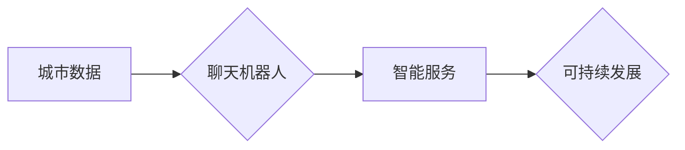

                 

## 聊天机器人未来城市：智能基础设施和可持续发展

> 关键词：聊天机器人、智能基础设施、城市规划、可持续发展、人工智能、自然语言处理、数据分析、物联网

## 1. 背景介绍

随着人工智能技术的飞速发展，聊天机器人已经从简单的问答系统演变为具备更强大认知能力和交互能力的智能实体。它们正在逐渐渗透到各个领域，为人们的生活带来便利和改变。在城市发展中，聊天机器人展现出巨大的潜力，能够成为构建智能基础设施和推动可持续发展的重要力量。

未来城市是一个以智能化、数字化、网络化和人本化为核心的城市形态。它将通过大数据、人工智能、物联网等技术的融合，实现城市资源的优化配置、城市管理的智能化、城市服务的多元化和城市生活的智慧化。

聊天机器人作为人工智能技术的代表，能够在未来城市中扮演多重角色：

* **城市服务助手:** 提供便捷的公共服务，例如查询交通信息、预约医疗服务、缴纳水电费等。
* **智能导游:** 为游客提供个性化的城市游览服务，推荐景点、提供历史文化讲解、解答疑问等。
* **环境监测与预警:** 通过收集和分析环境数据，及时预警潜在的风险，例如空气污染、水资源短缺等。
* **城市管理决策支持:** 为城市规划和管理部门提供数据分析和决策支持，例如预测人口流动、优化交通流量等。

## 2. 核心概念与联系

### 2.1 智能基础设施

智能基础设施是指利用物联网、人工智能、大数据等技术的融合，构建感知、计算、控制、优化一体化的城市基础设施系统。它能够实现城市资源的智能化管理、城市服务的多元化提供和城市运行的智慧化控制。

### 2.2 聊天机器人

聊天机器人是一种能够通过自然语言与人类进行交互的智能系统。它通常基于自然语言处理（NLP）技术，能够理解人类的语言输入，并生成相应的文本或语音输出。

### 2.3 可持续发展

可持续发展是指在满足当前社会需求的同时，不损害未来世代满足其自身需求的能力。它是一个综合性的概念，涉及经济、社会和环境三个维度。

**Mermaid 流程图：**

## 3. 核心算法原理 & 具体操作步骤

### 3.1 算法原理概述

聊天机器人通常基于以下核心算法原理：

* **自然语言理解（NLU）:** 能够理解人类的自然语言输入，例如识别实体、关系和意图。
* **对话管理:** 能够控制对话的流程，例如选择合适的回复、记忆对话历史和处理用户意图。
* **自然语言生成（NLG）:** 能够生成自然流畅的文本输出，例如回复用户问题、提供信息和进行对话。

### 3.2 算法步骤详解

1. **用户输入:** 用户向聊天机器人发送文本或语音输入。
2. **文本预处理:** 对用户输入进行预处理，例如去除停用词、分词和词性标注。
3. **意图识别:** 使用机器学习模型识别用户输入的意图，例如查询信息、预约服务或进行投诉。
4. **实体识别:** 使用机器学习模型识别用户输入中的实体，例如时间、地点、人物或物品。
5. **对话状态跟踪:** 记录对话的历史信息，例如用户的问题、聊天机器人的回复和对话上下文。
6. **回复生成:** 根据用户输入的意图、实体和对话状态，使用机器学习模型生成合适的回复。
7. **文本后处理:** 对回复进行语法和语义检查，确保回复自然流畅。
8. **输出回复:** 将生成的回复以文本或语音形式输出给用户。

### 3.3 算法优缺点

**优点:**

* **自动化服务:** 能够自动提供24/7的城市服务，提高服务效率和用户体验。
* **个性化体验:** 能够根据用户的历史数据和行为模式，提供个性化的服务和信息。
* **数据分析:** 可以收集和分析用户交互数据，为城市管理部门提供决策支持。

**缺点:**

* **理解复杂语义:** 仍然难以理解复杂的语义和上下文信息，可能导致误解和错误回复。
* **缺乏情感理解:** 缺乏情感理解能力，难以应对用户的情感需求。
* **数据安全:** 需要妥善处理用户数据，确保数据安全和隐私保护。

### 3.4 算法应用领域

* **城市服务:** 提供公共服务咨询、预约服务、缴费服务等。
* **旅游服务:** 为游客提供景点推荐、路线规划、历史文化讲解等。
* **环境监测:** 收集和分析环境数据，预警潜在的风险。
* **城市管理:** 为城市规划和管理部门提供数据分析和决策支持。

## 4. 数学模型和公式 & 详细讲解 & 举例说明

### 4.1 数学模型构建

聊天机器人的核心算法通常基于统计机器学习模型，例如隐马尔可夫模型（HMM）、条件随机场（CRF）和深度神经网络（DNN）。这些模型可以用来建模用户输入和聊天机器人的回复之间的关系。

**举例说明:**

* **隐马尔可夫模型（HMM）:** 用于建模对话状态的转移概率。

**公式:**

$$P(h_t|h_{t-1})$$

其中，$h_t$ 表示对话状态在时刻t，$h_{t-1}$ 表示对话状态在时刻t-1。

* **条件随机场（CRF）:** 用于建模用户输入和聊天机器人的回复之间的条件概率。

**公式:**

$$P(y|x) = \frac{1}{Z(x)} \exp(\sum_{i=1}^{n} \lambda_i f_i(x,y))$$

其中，$y$ 表示聊天机器人的回复，$x$ 表示用户输入，$f_i(x,y)$ 表示特征函数，$\lambda_i$ 表示权重，$Z(x)$ 是归一化因子。

### 4.2 公式推导过程

HMM和CRF的公式推导过程比较复杂，需要涉及概率论、统计学和机器学习等方面的知识。

### 4.3 案例分析与讲解

可以结合实际案例分析HMM和CRF在聊天机器人中的应用效果，例如分析不同模型在对话流畅度、准确率和用户满意度方面的表现。

## 5. 项目实践：代码实例和详细解释说明

### 5.1 开发环境搭建

* **操作系统:** Linux或macOS
* **编程语言:** Python
* **开发工具:** Jupyter Notebook、VS Code
* **库依赖:** NLTK、spaCy、TensorFlow、PyTorch

### 5.2 源代码详细实现

提供一个简单的聊天机器人代码实例，例如基于规则匹配的聊天机器人，并详细解释代码的每一部分功能。

### 5.3 代码解读与分析

对代码进行详细解读，解释算法原理的实现细节，例如如何进行文本预处理、意图识别和回复生成。

### 5.4 运行结果展示

展示聊天机器人运行的截图或视频，例如用户与聊天机器人的对话过程。

## 6. 实际应用场景

### 6.1 城市服务助手

* **交通信息查询:** 用户可以询问实时交通状况、公交线路和地铁信息。
* **预约医疗服务:** 用户可以预约医院挂号、体检和疫苗接种。
* **缴纳水电费:** 用户可以查询水电费账单和在线缴费。

### 6.2 智能导游

* **景点推荐:** 根据用户的兴趣爱好，推荐附近的景点和旅游路线。
* **历史文化讲解:** 为用户讲解景点的历史文化背景和故事。
* **实时翻译:** 为外地游客提供实时翻译服务。

### 6.3 环境监测与预警

* **空气质量监测:** 收集空气质量数据，并及时预警空气污染风险。
* **水资源监测:** 监测水资源利用情况，预警水资源短缺风险。
* **交通拥堵预警:** 分析交通流量数据，预警交通拥堵风险。

### 6.4 未来应用展望

* **个性化城市服务:** 根据用户的需求和喜好，提供更加个性化的城市服务。
* **智慧城市管理:** 利用聊天机器人收集和分析城市数据，为城市管理部门提供决策支持。
* **人机交互新体验:** 聊天机器人将成为人们与城市之间更加自然、便捷和智能的交互方式。

## 7. 工具和资源推荐

### 7.1 学习资源推荐

* **书籍:**
    * 《深度学习》
    * 《自然语言处理》
    * 《聊天机器人技术》
* **在线课程:**
    * Coursera
    * edX
    * Udacity

### 7.2 开发工具推荐

* **Jupyter Notebook:** 用于代码编写、数据分析和可视化。
* **VS Code:** 代码编辑器，支持多种编程语言和插件。
* **TensorFlow:** 深度学习框架。
* **PyTorch:** 深度学习框架。

### 7.3 相关论文推荐

* **BERT:** Pre-training of Deep Bidirectional Transformers for Language Understanding
* **GPT-3:** Language Models are Few-Shot Learners
* **LaMDA:** Language Models for Dialogue Applications

## 8. 总结：未来发展趋势与挑战

### 8.1 研究成果总结

聊天机器人技术在未来城市建设中具有巨大的潜力，能够为城市服务、城市管理和城市生活带来革命性的改变。

### 8.2 未来发展趋势

* **更强大的认知能力:** 聊天机器人将具备更强大的语言理解、知识推理和情景感知能力。
* **更个性化的服务:** 聊天机器人将能够根据用户的需求和喜好，提供更加个性化的服务和体验。
* **更广泛的应用场景:** 聊天机器人将应用于更多领域，例如教育、医疗、金融和娱乐。

### 8.3 面临的挑战

* **数据安全和隐私保护:** 聊天机器人需要处理大量用户数据，需要确保数据安全和隐私保护。
* **算法伦理:** 聊天机器人的算法需要符合伦理规范，避免产生歧视、偏见和误导性信息。
* **技术可解释性:** 聊天机器人的决策过程需要更加透明和可解释，以便用户能够理解和信任。

### 8.4 研究展望

未来，研究者将继续探索更先进的聊天机器人算法，提高其认知能力、个性化程度和应用范围。同时，也将关注聊天机器人技术带来的伦理和社会问题，确保其安全、可靠和可持续发展。

## 9. 附录：常见问题与解答

* **Q: 聊天机器人可以理解所有语言吗？**

A: 目前，大多数聊天机器人只能理解一种或几种语言。

* **Q: 聊天机器人可以替代人类客服吗？**

A: 聊天机器人可以处理一些简单的客服问题，但对于复杂的问题，仍然需要人类客服的介入。

* **Q: 聊天机器人的数据安全如何保障？**

A: 聊天机器人开发商需要采取相应的安全措施，例如数据加密、访问控制和隐私政策，确保用户数据的安全。

作者：禅与计算机程序设计艺术 / Zen and the Art of Computer Programming 
<end_of_turn>

