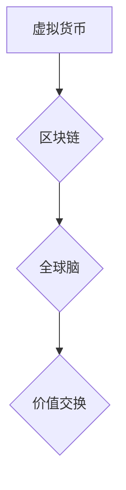

                 

## 虚拟货币经济:全球脑时代的价值交换

> 关键词：虚拟货币、区块链、去中心化、全球脑、价值交换、人工智能、加密货币

## 1. 背景介绍

随着人工智能技术的飞速发展，我们正迈入一个全新的时代——全球脑时代。在这个时代，信息将更加流动，连接更加紧密，人类的认知和创造力将得到前所未有的提升。在这个背景下，虚拟货币作为一种新型的价值交换机制，将扮演越来越重要的角色。

传统货币体系依赖于中央银行和金融机构，存在着效率低下、可操控性强、跨境交易成本高等问题。而虚拟货币，特别是基于区块链技术的加密货币，则具有去中心化、透明、安全等特点，能够有效解决传统货币体系的弊端。

## 2. 核心概念与联系

### 2.1 虚拟货币

虚拟货币是一种使用密码学技术保障安全的数字资产，其价值通过市场供求关系确定。与传统货币不同，虚拟货币不受任何政府或金融机构的控制，交易过程也更加透明和安全。

### 2.2 区块链

区块链是一种分布式账本技术，它将交易记录存储在多个节点上，并通过加密算法进行安全验证。这种去中心化的结构使得区块链具有不可篡改、透明、安全等特点，为虚拟货币的运行提供了坚实的基础。

### 2.3 全球脑

全球脑是指一个由全球网络连接的超级智能系统，它能够整合人类的知识和智慧，并进行复杂的计算和分析。全球脑的出现将极大地改变人类社会，并为虚拟货币经济的发展提供新的机遇。

**核心概念与联系流程图**



## 3. 核心算法原理 & 具体操作步骤

### 3.1 算法原理概述

虚拟货币的运行基于一系列复杂的算法，包括密码学算法、哈希算法、共识算法等。这些算法共同确保了虚拟货币的安全性、透明性和去中心化特性。

* **密码学算法:** 用于加密和解密虚拟货币交易信息，确保交易的安全性。
* **哈希算法:** 用于生成区块的唯一标识，并确保区块链的完整性。
* **共识算法:** 用于验证交易和生成新的区块，确保区块链的去中心化和一致性。

### 3.2 算法步骤详解

1. **交易发起:** 用户发起虚拟货币交易请求。
2. **交易广播:** 交易请求被广播到整个网络。
3. **交易验证:** 节点验证交易的合法性，包括账户余额、签名验证等。
4. **区块打包:** 验证通过的交易被打包成一个区块。
5. **区块验证:** 节点使用共识算法验证区块的合法性，并将其添加到区块链中。
6. **交易确认:** 交易被添加到区块链中后，被视为已确认。

### 3.3 算法优缺点

**优点:**

* **安全性:** 密码学算法和哈希算法确保了交易的安全性。
* **透明性:** 所有交易记录都公开透明地存储在区块链上。
* **去中心化:** 虚拟货币不受任何单一实体控制。

**缺点:**

* **技术复杂性:** 虚拟货币的算法原理和实现较为复杂。
* **可扩展性:** 区块链技术的可扩展性仍然是一个挑战。
* **监管不确定性:** 虚拟货币的监管环境仍然不完善。

### 3.4 算法应用领域

虚拟货币的算法原理和技术应用领域非常广泛，包括但不限于：

* **金融服务:** 数字支付、跨境汇款、去中心化金融等。
* **供应链管理:** 产品溯源、物流追踪、供应链金融等。
* **身份认证:** 数字身份、电子投票、数据安全等。
* **游戏和娱乐:** 游戏虚拟货币、数字资产、虚拟世界等。

## 4. 数学模型和公式 & 详细讲解 & 举例说明

### 4.1 数学模型构建

虚拟货币的价值可以看作是一个复杂的函数，受多种因素影响，例如：

* **供求关系:** 虚拟货币的价值取决于其供给量和需求量。
* **市场情绪:** 投资者对虚拟货币的信心和预期也会影响其价值。
* **技术发展:** 区块链技术的进步和应用场景的拓展也会影响虚拟货币的价值。

我们可以用以下数学模型来描述虚拟货币的价值：

$$V = f(S, D, E)$$

其中：

* $V$ 代表虚拟货币的价值。
* $S$ 代表虚拟货币的供给量。
* $D$ 代表虚拟货币的需求量。
* $E$ 代表市场情绪和技术发展等其他因素的影响。

### 4.2 公式推导过程

由于虚拟货币的价值受多种因素影响，其数学模型的推导过程非常复杂，需要考虑各种经济学、金融学和统计学原理。

例如，我们可以使用以下公式来描述虚拟货币的供给量：

$$S = b \cdot t$$

其中：

* $b$ 代表虚拟货币的总发行量。
* $t$ 代表时间。

我们可以使用以下公式来描述虚拟货币的需求量：

$$D = \alpha \cdot V + \beta \cdot E$$

其中：

* $\alpha$ 代表虚拟货币的价值弹性系数。
* $\beta$ 代表市场情绪和技术发展等其他因素的影响系数。

### 4.3 案例分析与讲解

我们可以通过分析特定虚拟货币的市场表现来验证上述数学模型的有效性。例如，我们可以分析比特币的价值波动，并将其与比特币的供给量、需求量以及市场情绪等因素进行对比。

## 5. 项目实践：代码实例和详细解释说明

### 5.1 开发环境搭建

为了实现虚拟货币的开发，我们需要搭建一个合适的开发环境。常用的开发环境包括：

* **虚拟机:** 可以模拟一个独立的计算机系统，用于开发和测试虚拟货币。
* **云平台:** 可以提供虚拟机、存储、网络等资源，用于开发和部署虚拟货币。

### 5.2 源代码详细实现

虚拟货币的源代码实现非常复杂，涉及到密码学、哈希算法、共识算法等多个方面。这里只提供一个简单的例子，演示如何使用Python语言实现一个简单的虚拟货币交易系统。

```python
class Transaction:
    def __init__(self, sender, receiver, amount):
        self.sender = sender
        self.receiver = receiver
        self.amount = amount

class Blockchain:
    def __init__(self):
        self.chain = []

    def add_block(self, block):
        self.chain.append(block)

# ... 其他方法 ...

# 创建一个虚拟货币交易系统
blockchain = Blockchain()
transaction = Transaction("Alice", "Bob", 10)
blockchain.add_block(transaction)
```

### 5.3 代码解读与分析

这段代码演示了如何使用Python语言实现一个简单的虚拟货币交易系统。

* `Transaction` 类代表一个虚拟货币交易，包含发送者、接收者和交易金额。
* `Blockchain` 类代表一个区块链，包含一系列的区块。
* `add_block()` 方法用于将新的交易块添加到区块链中。

### 5.4 运行结果展示

运行这段代码后，会创建一个简单的虚拟货币交易系统，并记录交易信息到区块链中。

## 6. 实际应用场景

### 6.1 数字支付

虚拟货币可以用于支付商品和服务，无需依赖传统的金融机构。例如，比特币可以用于购买商品和服务，并在全球范围内进行跨境支付。

### 6.2 跨境汇款

虚拟货币可以降低跨境汇款成本和时间，并提高汇款效率。例如，使用比特币进行跨境汇款，可以避免银行汇款手续费和汇率差价。

### 6.3 去中心化金融

虚拟货币可以用于构建去中心化的金融系统，例如去中心化交易所、去中心化贷款平台等。这些平台不受传统金融机构的控制，可以提供更公平、透明和高效的金融服务。

### 6.4 未来应用展望

随着虚拟货币技术的不断发展，其应用场景将更加广泛，例如：

* **数字身份:** 虚拟货币可以用于创建数字身份，并用于身份验证和数据安全。
* **游戏和娱乐:** 虚拟货币可以用于游戏虚拟货币、数字资产和虚拟世界。
* **供应链管理:** 虚拟货币可以用于产品溯源、物流追踪和供应链金融。

## 7. 工具和资源推荐

### 7.1 学习资源推荐

* **书籍:** 《比特币：数字黄金》、《区块链革命》
* **网站:** Bitcoin.org, Ethereum.org, Blockchain.com
* **课程:** Coursera, edX, Udemy

### 7.2 开发工具推荐

* **开发环境:** Visual Studio Code, Atom, Sublime Text
* **区块链开发框架:** Ethereum Solidity, Hyperledger Fabric
* **虚拟货币钱包:** Electrum, Mycelium, Exodus

### 7.3 相关论文推荐

* **比特币白皮书:** https://bitcoin.org/bitcoin.pdf
* **以太坊白皮书:** https://ethereum.org/en/whitepaper/
* **区块链技术综述:** https://arxiv.org/abs/1706.03715

## 8. 总结：未来发展趋势与挑战

### 8.1 研究成果总结

虚拟货币技术已经取得了显著的进展，并为全球经济和社会发展带来了新的机遇。

### 8.2 未来发展趋势

* **技术创新:** 区块链技术将继续发展，并应用于更多领域。
* **监管完善:** 政府和监管机构将制定更加完善的虚拟货币监管政策。
* **生态发展:** 虚拟货币生态系统将更加完善，并出现更多创新应用。

### 8.3 面临的挑战

* **可扩展性:** 区块链技术的可扩展性仍然是一个挑战。
* **安全性:** 虚拟货币系统仍然面临着黑客攻击和诈骗风险。
* **监管不确定性:** 虚拟货币的监管环境仍然不完善。

### 8.4 研究展望

未来，虚拟货币技术将继续发展，并为人类社会带来更多创新和变革。我们需要加强对虚拟货币技术的研究，并积极探索其应用场景，以更好地利用虚拟货币技术为人类社会发展服务。

## 9. 附录：常见问题与解答

### 9.1 什么是虚拟货币？

虚拟货币是一种使用密码学技术保障安全的数字资产，其价值通过市场供求关系确定。

### 9.2 区块链是什么？

区块链是一种分布式账本技术，它将交易记录存储在多个节点上，并通过加密算法进行安全验证。

### 9.3 虚拟货币有哪些应用场景？

虚拟货币的应用场景非常广泛，包括数字支付、跨境汇款、去中心化金融、数字身份、游戏和娱乐等。

### 9.4 虚拟货币的未来发展趋势是什么？

虚拟货币技术的未来发展趋势包括技术创新、监管完善和生态发展。

### 9.5 虚拟货币面临哪些挑战？

虚拟货币面临的可扩展性、安全性、监管不确定性等挑战。


作者：禅与计算机程序设计艺术 / Zen and the Art of Computer Programming 
<end_of_turn>

