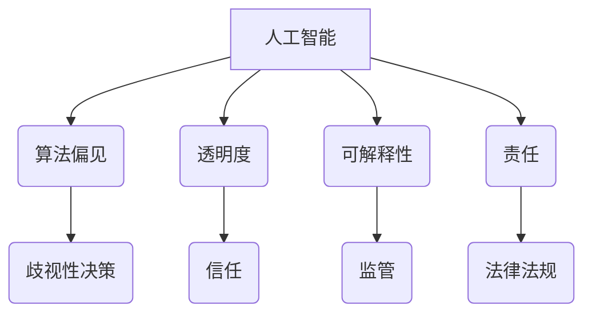

                 

## 道德边界：AI 发展面临的挑战

> 关键词：人工智能、伦理、道德边界、算法偏见、透明度、可解释性、责任

### 1. 背景介绍

人工智能（AI）技术近年来发展迅速，已渗透到各个领域，从医疗保健到金融、交通运输，甚至艺术创作，AI都展现出其强大的应用潜力。然而，随着AI技术的不断进步，其带来的伦理和道德挑战也日益凸显。

AI算法的决策过程往往是复杂的，难以被人类完全理解。这使得AI系统可能产生不可预知的偏见或错误，从而对个人和社会造成负面影响。例如，在招聘、贷款审批等领域，AI算法可能因为训练数据中的偏见而导致歧视性决策，加剧社会不平等。

此外，AI技术的应用也引发了关于隐私、安全和控制权等方面的担忧。AI系统需要大量的数据进行训练，这可能会侵犯个人隐私。同时，AI系统的自主性也可能导致其行为难以预测和控制，从而带来安全风险。

### 2. 核心概念与联系

**2.1 核心概念**

* **人工智能（AI）：** 指能够模拟人类智能行为的计算机系统。
* **算法偏见：** 指AI算法在训练数据中学习到的偏见，导致其对不同群体做出不公平或歧视性的决策。
* **透明度：** 指AI算法决策过程的可解释性和可追踪性。
* **可解释性：** 指能够理解AI算法如何做出决策的能力。
* **责任：** 指AI系统决策产生的后果谁来承担责任。

**2.2 核心概念联系**



**2.3 核心概念原理和架构**

AI算法的决策过程通常涉及以下步骤：

1. **数据收集和预处理：** 收集大量数据并进行清洗、转换和特征提取。
2. **模型训练：** 使用训练数据训练AI模型，学习数据中的模式和规律。
3. **模型评估和优化：** 对训练好的模型进行评估，并根据评估结果进行调整和优化。
4. **模型部署和预测：** 将训练好的模型部署到实际应用场景中，对新的数据进行预测和决策。

在每个步骤中，都可能存在伦理和道德风险。例如，数据收集过程中可能存在隐私泄露的风险，模型训练过程中可能导致算法偏见，模型部署过程中可能导致不可预知的错误。

### 3. 核心算法原理 & 具体操作步骤

**3.1 算法原理概述**

机器学习算法是AI的核心技术之一，它通过学习数据中的模式和规律，自动构建模型，并对新的数据进行预测和决策。常见的机器学习算法包括：

* **监督学习：** 利用标记数据训练模型，例如分类和回归问题。
* **无监督学习：** 利用未标记数据发现数据中的隐藏结构，例如聚类和降维。
* **强化学习：** 通过试错学习，让AI系统在环境中获得最大奖励。

**3.2 算法步骤详解**

以监督学习为例，其具体操作步骤如下：

1. **数据收集和预处理：** 收集包含特征和标签的数据集。
2. **特征工程：** 对数据进行特征提取和转换，以提高模型的学习效率。
3. **模型选择：** 根据具体问题选择合适的机器学习算法。
4. **模型训练：** 使用训练数据训练模型，调整模型参数，使模型能够准确预测标签。
5. **模型评估：** 使用测试数据评估模型的性能，例如准确率、召回率、F1-score等。
6. **模型优化：** 根据评估结果调整模型参数或选择其他算法，提高模型性能。
7. **模型部署：** 将训练好的模型部署到实际应用场景中，对新的数据进行预测。

**3.3 算法优缺点**

**优点：**

* 自动学习：无需人工编程，可以自动从数据中学习规律。
* 高精度：在某些领域，机器学习算法可以达到甚至超过人类的精度。
* 可扩展性：可以处理海量数据，并进行快速预测。

**缺点：**

* 数据依赖：机器学习算法的性能取决于训练数据的质量和数量。
* 算法偏见：训练数据中的偏见可能导致算法产生歧视性决策。
* 可解释性差：机器学习算法的决策过程往往是复杂的，难以被人类理解。

**3.4 算法应用领域**

机器学习算法广泛应用于各个领域，例如：

* **医疗保健：** 疾病诊断、药物研发、个性化治疗。
* **金融：** 欺诈检测、风险评估、投资决策。
* **交通运输：** 自动驾驶、交通流量预测、物流优化。
* **零售：** 商品推荐、客户画像、库存管理。

### 4. 数学模型和公式 & 详细讲解 & 举例说明

**4.1 数学模型构建**

机器学习算法通常使用数学模型来表示数据之间的关系。例如，线性回归模型使用线性方程来预测连续变量，分类模型使用决策边界来区分不同的类别。

**4.2 公式推导过程**

例如，线性回归模型的目标是找到一条直线，使得这条直线与训练数据点的距离最小。可以使用最小二乘法来推导线性回归模型的公式：

$$
\hat{y} = \beta_0 + \beta_1 x
$$

其中：

* $\hat{y}$ 是预测值
* $x$ 是输入特征
* $\beta_0$ 是截距
* $\beta_1$ 是斜率

最小二乘法的目标是找到 $\beta_0$ 和 $\beta_1$ 的值，使得以下损失函数最小：

$$
Loss = \sum_{i=1}^{n} (y_i - \hat{y}_i)^2
$$

其中：

* $y_i$ 是第 $i$ 个数据点的真实值
* $\hat{y}_i$ 是第 $i$ 个数据点的预测值
* $n$ 是数据点的数量

通过对损失函数求导并令其等于零，可以得到 $\beta_0$ 和 $\beta_1$ 的值。

**4.3 案例分析与讲解**

例如，假设我们有一个数据集，包含房屋面积和房屋价格的信息。我们可以使用线性回归模型来预测房屋价格。

训练数据：

| 房屋面积 (平方米) | 房屋价格 (万元) |
|---|---|
| 60 | 100 |
| 80 | 150 |
| 100 | 200 |
| 120 | 250 |

使用最小二乘法，我们可以得到以下线性回归模型：

$$
\hat{y} = 50 + 1.5x
$$

其中：

* $\hat{y}$ 是预测的房屋价格
* $x$ 是房屋面积

如果我们想要预测一个面积为 150 平方米的房屋的价格，我们可以将 $x$ 代入模型中：

$$
\hat{y} = 50 + 1.5 * 150 = 275
$$

因此，我们预测这个面积为 150 平方米的房屋的价格为 275 万元。

### 5. 项目实践：代码实例和详细解释说明

**5.1 开发环境搭建**

可以使用 Python 语言和相关的机器学习库，例如 scikit-learn，来实现机器学习算法。

**5.2 源代码详细实现**

```python
from sklearn.linear_model import LinearRegression
import numpy as np

# 训练数据
X = np.array([[60], [80], [100], [120]])
y = np.array([100, 150, 200, 250])

# 创建线性回归模型
model = LinearRegression()

# 训练模型
model.fit(X, y)

# 预测新数据
new_data = np.array([[150]])
prediction = model.predict(new_data)

# 打印预测结果
print(prediction)
```

**5.3 代码解读与分析**

这段代码首先导入必要的库，然后定义训练数据和目标变量。接着，创建线性回归模型并使用 `fit()` 方法训练模型。最后，使用 `predict()` 方法对新数据进行预测，并打印预测结果。

**5.4 运行结果展示**

运行这段代码，输出结果为：

```
[275.0]
```

这与我们之前手动计算的结果一致。

### 6. 实际应用场景

**6.1 医疗保健**

AI算法可以用于疾病诊断、药物研发、个性化治疗等领域。例如，AI系统可以分析患者的医疗影像数据，辅助医生诊断疾病；AI算法可以分析大量的药物数据，加速药物研发过程；AI系统可以根据患者的基因信息和生活习惯，制定个性化的治疗方案。

**6.2 金融**

AI算法可以用于欺诈检测、风险评估、投资决策等领域。例如，AI系统可以分析交易数据，识别异常交易行为，防止欺诈；AI算法可以评估贷款申请者的信用风险，帮助银行做出贷款决策；AI系统可以分析市场数据，进行股票投资预测。

**6.3 交通运输**

AI算法可以用于自动驾驶、交通流量预测、物流优化等领域。例如，自动驾驶汽车利用 AI 算法感知周围环境，并做出驾驶决策；AI系统可以分析交通流量数据，预测交通拥堵情况，优化交通信号灯控制；AI算法可以优化物流路线，提高运输效率。

**6.4 未来应用展望**

随着AI技术的不断发展，其应用场景将更加广泛。例如，AI将被应用于教育、娱乐、艺术创作等领域，为人类生活带来更多便利和乐趣。

### 7. 工具和资源推荐

**7.1 学习资源推荐**

* **在线课程：** Coursera、edX、Udacity 等平台提供丰富的机器学习课程。
* **书籍：** 《深入理解机器学习》、《Python机器学习实战》等书籍对机器学习有深入的讲解。
* **博客和论坛：** 机器学习相关的博客和论坛，例如 Towards Data Science、Machine Learning Mastery 等，可以获取最新的技术资讯和学习资源。

**7.2 开发工具推荐**

* **Python：** 机器学习开发的常用语言，拥有丰富的库和工具。
* **scikit-learn：** Python 的机器学习库，提供各种算法和工具。
* **TensorFlow：** Google 开发的深度学习框架。
* **PyTorch：** Facebook 开发的深度学习框架。

**7.3 相关论文推荐**

* **《机器学习》** by Tom Mitchell
* **《深度学习》** by Ian Goodfellow, Yoshua Bengio, and Aaron Courville

### 8. 总结：未来发展趋势与挑战

**8.1 研究成果总结**

近年来，AI技术取得了长足的进步，在各个领域都展现出强大的应用潜力。机器学习算法的不断发展，使得AI系统能够自动学习和决策，并取得了令人瞩目的成果。

**8.2 未来发展趋势**

未来，AI技术将朝着以下几个方向发展：

* **更强大的计算能力：** 随着硬件技术的进步，AI系统将能够处理更复杂的数据，并进行更复杂的计算。
* **更强大的算法：** 研究人员将继续开发更强大的机器学习算法，提高AI系统的性能和效率。
* **更广泛的应用场景：** AI技术将被应用到更多领域，为人类生活带来更多便利和乐趣。

**8.3 面临的挑战**

AI技术的发展也面临着一些挑战：

* **算法偏见：** 训练数据中的偏见可能导致AI系统产生歧视性决策，需要开发更公平的算法和数据处理方法。
* **透明度和可解释性：** AI算法的决策过程往往是复杂的，难以被人类理解，需要提高AI系统的透明度和可解释性。
* **责任和伦理：** AI系统的决策可能会产生负面影响，需要明确AI系统的责任和伦理规范。

**8.4 研究展望**

未来，需要加强对AI伦理和社会影响的研究，制定相应的法律法规和政策，引导AI技术健康发展，造福人类社会。

### 9. 附录：常见问题与解答

**9.1 如何解决算法偏见问题？**

* 使用更公平的训练数据，例如多样化的样本和代表性强的样本。
* 开发更公平的算法，例如对抗性训练和公平性约束。
* 对算法进行定期评估和监控，及时发现和解决偏见问题。

**9.2 如何提高AI系统的透明度和可解释性？**

* 使用可解释的机器学习算法，例如规则学习和决策树。
* 开发可视化工具，帮助人类理解AI系统的决策过程。
* 建立AI系统的解释框架，明确AI系统如何做出决策的依据。

**9.3 如何明确AI系统的责任和伦理规范？**

* 制定相应的法律法规和政策，明确AI系统的责任和义务。
* 建立AI伦理委员会，制定AI发展的伦理准则。
* 加强AI技术的社会监督，确保AI技术应用符合社会道德规范。


作者：禅与计算机程序设计艺术 / Zen and the Art of Computer Programming<end_of_turn>

