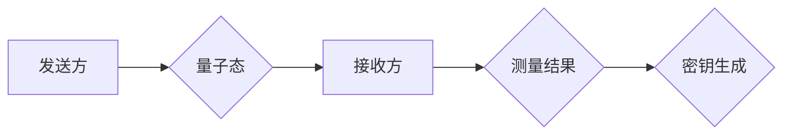

                 

## 量子通信：原理、现状与未来展望

> 关键词：量子通信、量子纠缠、量子密钥分发、量子网络、量子安全

### 1. 背景介绍

在信息时代，数据安全和隐私保护日益受到重视。传统的通信方式面临着越来越多的安全威胁，例如网络攻击、窃听和数据泄露。量子通信作为一种新兴的通信技术，利用量子力学原理，具有极高的安全性，被认为是未来通信领域的重要发展方向。

量子通信的核心优势在于其基于量子力学的不可克隆性原理。任何试图窃听或拦截量子信息的行为都会不可避免地改变量子态，从而被发送方和接收方察觉。这使得量子通信具有天然的保密性，能够有效地防止信息泄露。

### 2. 核心概念与联系

#### 2.1 量子纠缠

量子纠缠是量子通信的基础。它指的是两个或多个量子粒子之间的一种特殊关联，即使它们相隔很远，彼此的状态也相互影响。当测量其中一个粒子的状态时，另一个粒子的状态也会瞬时确定，无论它们相隔多远。

#### 2.2 量子密钥分发（QKD）

量子密钥分发是利用量子纠缠实现安全的密钥交换协议。它允许两个用户在任何潜在的窃听者面前安全地共享一个秘密密钥。

**Mermaid 流程图**



### 3. 核心算法原理 & 具体操作步骤

#### 3.1 算法原理概述

量子密钥分发算法的基本原理是利用量子叠加态和测量不确定性来实现密钥的安全交换。发送方和接收方通过共享量子态，并对这些量子态进行测量，从而生成一个秘密密钥。

#### 3.2 算法步骤详解

1. **量子态准备:** 发送方使用量子比特（qubit）来准备量子态，例如Bell态。
2. **量子态传输:** 发送方将量子态通过光纤或其他量子信道传输给接收方。
3. **量子态测量:** 接收方对接收到的量子态进行测量，并记录测量结果。
4. **密钥协商:** 发送方和接收方公开地比较测量结果，并根据预先约定的规则筛选出公共部分，形成一个秘密密钥。

#### 3.3 算法优缺点

**优点:**

* **安全性高:** 基于量子力学原理，具有不可克隆性，能够有效防止信息泄露。
* **抗攻击性强:** 即使攻击者拥有强大的计算能力，也无法破解量子密钥。

**缺点:**

* **技术复杂:** 量子通信技术尚处于发展初期，需要复杂的设备和技术支持。
* **距离限制:** 量子态传输距离有限，需要构建量子网络来实现长距离通信。

#### 3.4 算法应用领域

* **金融安全:** 保护金融交易数据安全。
* **政府信息安全:** 保护国家机密信息安全。
* **医疗信息安全:** 保护患者隐私信息安全。
* **军事通信安全:** 保护军事通信信息安全。

### 4. 数学模型和公式 & 详细讲解 & 举例说明

#### 4.1 数学模型构建

量子密钥分发算法的数学模型主要基于量子叠加态和测量不确定性。

* **量子叠加态:** 量子比特可以处于叠加态，即同时处于0和1状态。
* **测量不确定性:** 测量量子态会破坏其叠加态，导致其坍缩到一个确定的状态。

#### 4.2 公式推导过程

假设发送方和接收方共享一个Bell态，其数学表示为：

$$|\psi\rangle = \frac{1}{\sqrt{2}}(|00\rangle + |11\rangle)$$

其中，$|00\rangle$和$|11\rangle$分别表示两个量子比特都处于0和1状态。

当发送方和接收方对共享的Bell态进行测量时，测量结果会服从以下概率分布：

* **发送方测量结果为0，接收方测量结果为0的概率为1/2。**
* **发送方测量结果为0，接收方测量结果为1的概率为1/2。**
* **发送方测量结果为1，接收方测量结果为0的概率为1/2。**
* **发送方测量结果为1，接收方测量结果为1的概率为1/2。**

#### 4.3 案例分析与讲解

在实际应用中，发送方和接收方会使用不同的测量基来对量子态进行测量。通过比较测量结果，并根据预先约定的规则筛选出公共部分，可以生成一个秘密密钥。

例如，发送方和接收方可以约定使用Z基和X基进行测量。如果发送方测量结果为0，接收方测量结果也为0，则表示他们共享了一个0密钥位。如果发送方测量结果为1，接收方测量结果也为1，则表示他们共享了一个1密钥位。

### 5. 项目实践：代码实例和详细解释说明

#### 5.1 开发环境搭建

量子通信的项目实践通常需要使用量子计算平台和编程语言。一些常用的量子计算平台包括IBM Quantum Experience、Google Quantum AI、Microsoft Azure Quantum等。常用的编程语言包括Python、Qiskit、Cirq等。

#### 5.2 源代码详细实现

以下是一个使用Qiskit库实现量子密钥分发算法的简单代码示例：

```python
from qiskit import QuantumCircuit, Aer, execute

# 创建量子电路
qc = QuantumCircuit(2)

# 创建Bell态
qc.h(0)
qc.cx(0, 1)

# 测量量子比特
qc.measure(0, 0)
qc.measure(1, 1)

# 模拟运行电路
simulator = Aer.get_backend('qasm_simulator')
job = execute(qc, simulator, shots=1024)
result = job.result()
counts = result.get_counts(qc)

# 打印测量结果
print(counts)
```

#### 5.3 代码解读与分析

这段代码首先创建了一个包含两个量子比特的量子电路。然后，它使用Hadamard门和CNOT门来创建Bell态。最后，它对两个量子比特进行测量，并打印测量结果。

#### 5.4 运行结果展示

运行这段代码后，你会得到一个包含测量结果的字典。例如，如果测量结果为：

```
{
    '00': 512,
    '11': 512
}
```

则表示发送方和接收方共享了512个0密钥位和512个1密钥位。

### 6. 实际应用场景

#### 6.1 金融安全

量子密钥分发可以用于保护金融交易数据安全。银行和金融机构可以使用量子通信来实现安全的密钥交换，从而防止网络攻击和数据泄露。

#### 6.2 政府信息安全

政府机构需要保护国家机密信息安全。量子通信可以为政府机构提供安全的通信渠道，防止敏感信息被窃取。

#### 6.3 医疗信息安全

医疗信息包含患者的隐私数据，需要得到高度保护。量子通信可以用于保护患者隐私信息安全，防止医疗数据泄露。

#### 6.4 未来应用展望

随着量子通信技术的不断发展，其应用场景将会更加广泛。例如，量子通信可以用于构建量子网络，实现全球范围内的安全通信；量子通信可以用于量子互联网，实现更加安全和高效的数据传输；量子通信可以用于量子计算，实现更加强大的计算能力。

### 7. 工具和资源推荐

#### 7.1 学习资源推荐

* **书籍:**
    * 量子通信原理与应用
    * 量子信息科学
* **在线课程:**
    * Coursera: Quantum Computing for Everyone
    * edX: Introduction to Quantum Computing
* **网站:**
    * IBM Quantum Experience: https://quantum-computing.ibm.com/
    * Google Quantum AI: https://quantumai.google/

#### 7.2 开发工具推荐

* **Qiskit:** https://qiskit.org/
* **Cirq:** https://quantumai.google/cirq
* **PennyLane:** https://pennylane.ai/

#### 7.3 相关论文推荐

* **BB84协议:** Bennett, C. H., & Brassard, G. (1984). Quantum cryptography: Public key distribution and coin tossing. Proceedings of IEEE International Conference on Computers, Systems and Signal Processing, 175-179.
* **E91协议:** Ekert, A. K. (1991). Quantum cryptography based on Bell's theorem. Physical Review Letters, 67(6), 661.

### 8. 总结：未来发展趋势与挑战

#### 8.1 研究成果总结

量子通信技术已经取得了显著的进展，例如量子密钥分发协议的实现、量子网络的构建、量子通信系统的实验验证等。

#### 8.2 未来发展趋势

* **量子网络的构建:** 建立全球范围内的量子网络，实现安全可靠的量子通信。
* **量子互联网的实现:** 利用量子通信技术构建量子互联网，实现更加安全和高效的数据传输。
* **量子计算的应用:** 将量子通信技术与量子计算技术结合，实现更加强大的计算能力。

#### 8.3 面临的挑战

* **技术复杂性:** 量子通信技术仍然面临着技术复杂性和成本高昂的挑战。
* **距离限制:** 量子态传输距离有限，需要构建量子网络来实现长距离通信。
* **安全漏洞:** 量子通信系统也可能存在安全漏洞，需要不断研究和改进。

#### 8.4 研究展望

未来，量子通信技术将继续发展，并应用于越来越多的领域。随着技术的进步，量子通信将成为未来通信领域的重要发展方向，为人类社会带来更加安全、高效和便捷的通信体验。

### 9. 附录：常见问题与解答

#### 9.1 量子通信和传统通信的区别是什么？

量子通信利用量子力学原理实现安全通信，而传统通信则依赖于经典物理学原理。量子通信具有不可克隆性，能够有效防止信息泄露，而传统通信容易受到网络攻击和窃听。

#### 9.2 量子通信的应用场景有哪些？

量子通信的应用场景包括金融安全、政府信息安全、医疗信息安全、量子网络、量子互联网等。

#### 9.3 量子通信技术面临哪些挑战？

量子通信技术面临的技术挑战包括技术复杂性、距离限制和安全漏洞。


作者：禅与计算机程序设计艺术 / Zen and the Art of Computer Programming 
<end_of_turn>

