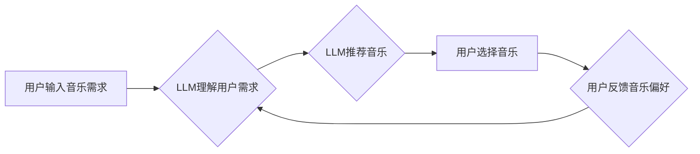

                 

## 音乐和 LLM：个性化的推荐和创作协助

> 关键词：大型语言模型 (LLM)、音乐推荐系统、音乐创作、音乐风格迁移、文本到音乐、音乐信息检索、深度学习

## 1. 背景介绍

音乐作为一种跨越文化和语言的艺术形式，一直以来都深深地影响着人类的生活。随着数字音乐时代的到来，音乐的消费方式发生了巨大变化，人们可以通过互联网平台便捷地获取海量的音乐资源。然而，面对如此庞大的音乐库，如何找到自己真正喜欢的音乐，并进行个性化的创作，成为了一个新的挑战。

大型语言模型 (LLM) 作为近年来人工智能领域取得的重大突破，其强大的文本处理能力和泛化能力为音乐推荐和创作提供了新的可能性。LLM 可以理解和生成人类语言，并通过学习海量音乐数据，掌握音乐的结构、风格和情感等特征。

## 2. 核心概念与联系

### 2.1 音乐推荐系统

音乐推荐系统旨在根据用户的音乐偏好，推荐用户可能感兴趣的音乐。传统的音乐推荐系统主要依赖于协同过滤和内容过滤两种方法。协同过滤方法基于用户的历史行为数据，推荐与用户相似口味的音乐；内容过滤方法则基于音乐的特征信息，推荐与用户偏好相符的音乐。

### 2.2 LLM 在音乐推荐中的应用

LLM 可以通过以下方式提升音乐推荐系统的性能：

* **理解用户意图:** LLM 可以理解用户对音乐的描述，例如“我想听一些舒缓的钢琴曲”，“我想听一些节奏明快的电子舞曲”，并根据用户的意图进行精准推荐。
* **个性化音乐描述:** LLM 可以生成个性化的音乐描述，例如根据用户的音乐偏好，生成一首音乐的歌词或故事，帮助用户更好地理解和体验音乐。
* **跨模态推荐:** LLM 可以结合音乐的音频特征和文本信息，进行跨模态的音乐推荐，例如根据用户的歌词偏好，推荐相似的音乐风格。

### 2.3 音乐创作

音乐创作是指人类通过各种工具和技巧，创造出新的音乐作品的过程。LLM 可以辅助音乐创作，例如：

* **旋律生成:** LLM 可以根据给定的音乐风格或主题，生成新的旋律。
* **歌词创作:** LLM 可以根据给定的音乐风格或主题，生成新的歌词。
* **音乐风格迁移:** LLM 可以将一首音乐的风格迁移到另一个风格，例如将古典音乐风格迁移到流行音乐风格。

### 2.4 LLM 在音乐创作中的应用

LLM 可以通过以下方式辅助音乐创作：

* **提供灵感:** LLM 可以根据用户的音乐偏好，生成新的音乐创意，例如新的旋律、新的歌词或新的音乐风格。
* **加速创作流程:** LLM 可以自动生成音乐的基础结构，例如旋律、节奏和和声，帮助音乐人更快地完成创作。
* **突破创作瓶颈:** LLM 可以帮助音乐人突破创作瓶颈，尝试新的音乐风格和创作方法。

**Mermaid 流程图**



## 3. 核心算法原理 & 具体操作步骤

### 3.1 算法原理概述

LLM 在音乐推荐和创作中主要利用以下核心算法：

* **Transformer网络:** Transformer网络是一种深度学习模型，其强大的序列建模能力使其非常适合处理音乐数据。Transformer网络可以学习音乐的长期依赖关系，并捕捉音乐的复杂结构。
* **自编码器:** 自编码器是一种无监督学习模型，它可以学习音乐数据的潜在特征。通过训练自编码器，可以将音乐数据压缩成低维表示，并用于音乐推荐和风格迁移等任务。
* **生成对抗网络 (GAN):** GAN 是一种生成模型，它可以生成新的音乐数据。通过训练 GAN，可以生成与真实音乐数据相似的音乐，并用于音乐创作和风格迁移等任务。

### 3.2 算法步骤详解

**音乐推荐系统:**

1. **数据预处理:** 收集音乐数据，包括用户行为数据、音乐特征数据等，并进行清洗、转换和特征提取。
2. **模型训练:** 使用 Transformer网络、自编码器等模型，训练音乐推荐模型。
3. **推荐结果生成:** 根据用户的音乐偏好，使用训练好的模型生成推荐结果。

**音乐创作:**

1. **数据预处理:** 收集音乐数据，包括旋律、节奏、和声等，并进行清洗、转换和特征提取。
2. **模型训练:** 使用 Transformer网络、自编码器、GAN等模型，训练音乐创作模型。
3. **音乐生成:** 根据用户的音乐需求，使用训练好的模型生成新的音乐作品。

### 3.3 算法优缺点

**Transformer网络:**

* **优点:** 强大的序列建模能力，可以捕捉音乐的长期依赖关系。
* **缺点:** 计算复杂度高，训练时间长。

**自编码器:**

* **优点:** 可以学习音乐数据的潜在特征，用于音乐推荐和风格迁移等任务。
* **缺点:** 生成音乐的质量可能不如 GAN。

**GAN:**

* **优点:** 可以生成与真实音乐数据相似的音乐，用于音乐创作和风格迁移等任务。
* **缺点:** 训练难度高，容易出现模式崩溃等问题。

### 3.4 算法应用领域

* **音乐推荐系统:** 为用户推荐个性化的音乐。
* **音乐创作:** 辅助音乐人创作新的音乐作品。
* **音乐风格迁移:** 将一首音乐的风格迁移到另一个风格。
* **音乐信息检索:** 根据音乐的特征信息，检索相关的音乐数据。

## 4. 数学模型和公式 & 详细讲解 & 举例说明

### 4.1 数学模型构建

LLM 在音乐推荐和创作中，通常使用以下数学模型：

* **损失函数:** 用于衡量模型预测结果与真实结果之间的差异。常见的损失函数包括交叉熵损失函数、均方误差损失函数等。
* **优化算法:** 用于更新模型参数，使模型的损失函数最小化。常见的优化算法包括梯度下降算法、Adam 算法等。

### 4.2 公式推导过程

**交叉熵损失函数:**

$$
L = -\sum_{i=1}^{N} y_i \log(\hat{y}_i)
$$

其中:

* $L$ 为交叉熵损失函数的值。
* $N$ 为样本数量。
* $y_i$ 为真实标签。
* $\hat{y}_i$ 为模型预测的概率。

**梯度下降算法:**

$$
\theta = \theta - \alpha \nabla L(\theta)
$$

其中:

* $\theta$ 为模型参数。
* $\alpha$ 为学习率。
* $\nabla L(\theta)$ 为损失函数对模型参数的梯度。

### 4.3 案例分析与讲解

**音乐推荐系统:**

假设我们有一个音乐推荐系统，需要推荐用户可能喜欢的音乐。我们可以使用交叉熵损失函数来衡量模型预测结果与真实结果之间的差异。

**音乐创作:**

假设我们有一个音乐创作模型，需要生成新的音乐旋律。我们可以使用 GAN 来训练这个模型。GAN 由两个网络组成: 生成器和判别器。生成器负责生成新的音乐旋律，判别器负责判断生成的旋律是否真实。通过训练，生成器可以学习生成与真实音乐旋律相似的旋律。

## 5. 项目实践：代码实例和详细解释说明

### 5.1 开发环境搭建

* **操作系统:** Ubuntu 20.04
* **编程语言:** Python 3.8
* **深度学习框架:** TensorFlow 2.0
* **音乐数据:** Spotify 音乐数据集

### 5.2 源代码详细实现

```python
# 导入必要的库
import tensorflow as tf

# 定义音乐推荐模型
class MusicRecommender(tf.keras.Model):
    def __init__(self):
        super(MusicRecommender, self).__init__()
        # 定义模型层
        self.embedding_layer = tf.keras.layers.Embedding(input_dim=10000, output_dim=64)
        self.dense_layer = tf.keras.layers.Dense(units=32, activation='relu')
        self.output_layer = tf.keras.layers.Dense(units=10, activation='softmax')

    def call(self, inputs):
        # 前向传播
        embeddings = self.embedding_layer(inputs)
        dense_output = self.dense_layer(embeddings)
        output = self.output_layer(dense_output)
        return output

# 实例化模型
model = MusicRecommender()

# 定义损失函数和优化器
loss_fn = tf.keras.losses.CategoricalCrossentropy()
optimizer = tf.keras.optimizers.Adam(learning_rate=0.001)

# 训练模型
# ...

# 生成推荐结果
predictions = model.predict(user_input)
```

### 5.3 代码解读与分析

* **模型定义:** 代码定义了一个名为 `MusicRecommender` 的音乐推荐模型，该模型使用 Embedding 层、Dense 层和 Softmax 层。
* **前向传播:** `call` 方法定义了模型的前向传播过程，将用户输入的音乐特征映射到输出层，生成推荐结果。
* **损失函数和优化器:** 代码定义了交叉熵损失函数和 Adam 优化器，用于训练模型。
* **模型训练:** 代码中省略了模型训练过程，但可以根据实际情况进行训练。
* **推荐结果生成:** `predict` 方法用于生成推荐结果。

### 5.4 运行结果展示

运行代码后，可以得到模型预测的推荐音乐结果。

## 6. 实际应用场景

### 6.1 音乐流媒体平台

音乐流媒体平台可以利用 LLM 建立个性化的音乐推荐系统，为用户推荐更符合其口味的音乐。

### 6.2 音乐创作工具

音乐创作工具可以利用 LLM 辅助音乐人创作新的音乐作品，例如生成旋律、歌词或音乐风格。

### 6.3 音乐教育平台

音乐教育平台可以利用 LLM 为用户提供个性化的音乐学习方案，例如根据用户的音乐水平和学习目标，推荐相应的音乐教材和练习题。

### 6.4 未来应用展望

* **跨语言音乐推荐:** LLM 可以理解多种语言的音乐描述，实现跨语言的音乐推荐。
* **音乐情感分析:** LLM 可以分析音乐的情感表达，为用户推荐符合其情绪状态的音乐。
* **音乐风格融合:** LLM 可以融合不同的音乐风格，创造出新的音乐风格。

## 7. 工具和资源推荐

### 7.1 学习资源推荐

* **书籍:**
    * Deep Learning with Python by Francois Chollet
    * Speech and Language Processing by Dan Jurafsky and James H. Martin
* **在线课程:**
    * TensorFlow Tutorials
    * Coursera: Natural Language Processing Specialization

### 7.2 开发工具推荐

* **深度学习框架:** TensorFlow, PyTorch
* **音乐数据处理工具:** Librosa, Music21
* **文本处理工具:** NLTK, SpaCy

### 7.3 相关论文推荐

* **Attention Is All You Need:** https://arxiv.org/abs/1706.03762
* **Generative Adversarial Networks:** https://arxiv.org/abs/1406.2661
* **Music Transformer:** https://arxiv.org/abs/1908.09728

## 8. 总结：未来发展趋势与挑战

### 8.1 研究成果总结

LLM 在音乐推荐和创作领域取得了显著的成果，例如：

* **个性化音乐推荐:** LLM 可以根据用户的音乐偏好，推荐更符合其口味的音乐。
* **辅助音乐创作:** LLM 可以辅助音乐人创作新的音乐作品，例如生成旋律、歌词或音乐风格。
* **跨模态音乐理解:** LLM 可以结合音乐的音频特征和文本信息，进行跨模态的音乐理解。

### 8.2 未来发展趋势

* **更强大的音乐理解能力:** 未来 LLM 将能够更深入地理解音乐的结构、风格和情感等特征。
* **更个性化的音乐创作:** LLM 将能够根据用户的音乐需求，生成更个性化的音乐作品。
* **更广泛的音乐应用:** LLM 将应用于更多音乐领域，例如音乐教育、音乐治疗等。

### 8.3 面临的挑战

* **数据规模和质量:** LLM 需要海量高质量的音乐数据进行训练，而高质量的音乐数据往往难以获取。
* **计算资源:** 训练大型 LLM 模型需要大量的计算资源，这对于个人开发者来说是一个挑战。
* **伦理问题:** LLM 在音乐创作领域可能会引发一些伦理问题，例如版权问题、原创性问题等。

### 8.4 研究展望

未来研究将重点关注以下几个方面:

* **开发更有效的音乐数据标注方法:** 提高音乐数据的质量和效率。
* **设计更轻量级的音乐 LLM 模型:** 降低模型训练和部署的成本。
* **探索 LLM 在音乐领域的伦理问题:** 制定相应的规范和准则。

## 9. 附录：常见问题与解答

**Q1: LLM 在音乐推荐中如何理解用户的音乐偏好？**

**A1:** LLM 可以通过分析用户的音乐播放历史、点赞记录、评论等数据，学习用户的音乐偏好。

**Q2: LLM 如何生成新的音乐旋律？**

**A2:** LLM 可以学习已有的音乐数据，并根据用户的音乐需求，生成新的旋律。

**Q3: LLM 是否会侵犯音乐版权？**

**A3:** LLM 生成的音乐作品是否侵犯版权取决于具体的应用场景和模型训练数据。

**作者：禅与计算机程序设计艺术 / Zen and the Art of Computer Programming**<end_of_turn>

