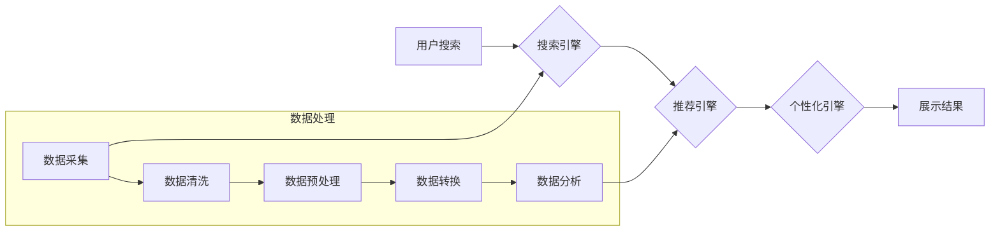

                 

## AI 大模型在电商搜索推荐中的数据处理技术：应对大规模实时数据的挑战

> 关键词：电商搜索推荐、大模型、实时数据、数据处理技术、推荐算法、自然语言处理、机器学习

## 1. 背景介绍

随着电商行业的蓬勃发展，搜索推荐系统已成为电商平台的核心竞争力之一。用户在海量商品中快速找到心仪商品，并获得个性化的推荐，是提升用户体验、促进交易的关键。传统基于规则或协同过滤的推荐算法在面对海量数据和用户多样化需求时，已显露出其局限性。

近年来，大模型技术在自然语言处理、计算机视觉等领域取得了突破性进展，为电商搜索推荐带来了新的机遇。大模型具备强大的语义理解、知识表示和泛化能力，能够从海量文本、图像、用户行为等数据中学习到更丰富的商品特征和用户偏好，从而提供更精准、个性化的推荐结果。

然而，大模型在电商搜索推荐中的应用也面临着诸多挑战：

* **数据规模和实时性:** 电商平台每天产生海量用户行为数据，这些数据具有高实时性要求，需要实时处理和更新模型。
* **数据质量和多样性:** 电商数据包含文本、图像、商品属性等多种类型，数据质量参差不齐，需要进行有效的数据清洗、预处理和融合。
* **模型训练和部署:** 大模型训练需要大量的计算资源和时间，部署到生产环境中也需要考虑模型的效率和可扩展性。
* **算法解释性和可控性:** 大模型的决策过程较为复杂，缺乏可解释性，难以进行模型评估和调优。

## 2. 核心概念与联系

### 2.1  电商搜索推荐系统

电商搜索推荐系统旨在帮助用户快速找到所需商品，并根据用户的兴趣和需求提供个性化的商品推荐。系统通常由以下几个模块组成：

* **搜索引擎:** 处理用户搜索词，返回相关商品列表。
* **推荐引擎:** 基于用户历史行为、商品特征等信息，推荐用户可能感兴趣的商品。
* **个性化引擎:** 根据用户的个人信息、偏好和行为，对搜索结果和推荐结果进行个性化定制。
* **展示引擎:** 将搜索结果和推荐结果以用户友好的方式展示给用户。

### 2.2  大模型技术

大模型是指参数量巨大、训练数据量庞大的深度学习模型。大模型通常采用Transformer架构，具有强大的语义理解、文本生成和知识表示能力。

### 2.3  数据处理技术

数据处理技术是指对电商平台海量数据进行清洗、预处理、转换和分析的技术。

**数据处理技术与大模型技术在电商搜索推荐系统中的关系:**

大模型需要大量高质量的数据进行训练，而数据处理技术可以帮助清洗、预处理和转换电商平台的海量数据，使其更适合大模型的训练。同时，大模型的训练结果可以用于改进数据处理技术，例如使用大模型进行文本分类、商品相似度计算等，提高数据处理的准确性和效率。

**Mermaid 流程图:**



## 3. 核心算法原理 & 具体操作步骤

### 3.1  算法原理概述

在电商搜索推荐系统中，大模型通常用于以下几个方面：

* **商品理解:** 利用大模型对商品标题、描述、属性等文本信息进行语义分析，提取商品的关键词、类别、特征等信息，构建商品的语义向量表示。
* **用户画像:** 利用大模型对用户的历史搜索记录、购买记录、浏览记录等行为数据进行分析，构建用户的兴趣偏好、购买习惯等画像。
* **推荐模型:** 利用大模型对商品和用户的语义向量表示进行匹配，预测用户对商品的兴趣和点击概率，从而生成推荐结果。

### 3.2  算法步骤详解

1. **数据收集:** 收集电商平台的用户行为数据、商品信息数据等。
2. **数据清洗:** 对收集到的数据进行清洗，去除重复数据、无效数据、噪声数据等。
3. **数据预处理:** 对数据进行格式转换、文本处理、特征工程等预处理，使其更适合大模型的训练。
4. **模型训练:** 选择合适的预训练大模型，并根据电商平台的数据进行微调训练，得到个性化的推荐模型。
5. **模型部署:** 将训练好的模型部署到生产环境中，实时处理用户请求，生成推荐结果。
6. **模型评估:** 定期评估模型的性能，并根据评估结果进行模型调优和更新。

### 3.3  算法优缺点

**优点:**

* **精准度高:** 大模型能够从海量数据中学习到更丰富的特征和模式，从而提供更精准的推荐结果。
* **个性化强:** 大模型可以根据用户的个性化需求进行定制化推荐，提升用户体验。
* **泛化能力强:** 大模型能够对新的商品和用户进行泛化学习，适应不断变化的市场需求。

**缺点:**

* **训练成本高:** 大模型训练需要大量的计算资源和时间，成本较高。
* **数据依赖性强:** 大模型的性能依赖于训练数据的质量和数量，数据不足或质量低劣会导致模型性能下降。
* **可解释性差:** 大模型的决策过程较为复杂，难以进行解释和理解。

### 3.4  算法应用领域

大模型在电商搜索推荐系统中的应用领域非常广泛，例如：

* **商品推荐:** 根据用户的兴趣和需求，推荐相关的商品。
* **搜索结果排序:** 根据用户的搜索词和历史行为，对搜索结果进行排序，提升用户搜索体验。
* **个性化广告:** 根据用户的兴趣和行为，推送个性化的广告。
* **用户画像分析:** 分析用户的行为数据，构建用户的兴趣偏好、购买习惯等画像。

## 4. 数学模型和公式 & 详细讲解 & 举例说明

### 4.1  数学模型构建

在电商搜索推荐系统中，大模型通常采用基于Transformer的架构，例如BERT、RoBERTa、GPT等。这些模型通过多层Transformer编码器和解码器结构，学习商品和用户的语义表示。

**Transformer架构:**

Transformer架构由以下几个关键模块组成：

* **编码器:** 将输入的商品和用户文本信息编码成语义向量表示。
* **解码器:** 根据编码器的输出，生成推荐结果。
* **注意力机制:** 用于捕捉文本中不同词语之间的关系，提高模型的语义理解能力。
* **多头注意力:** 使用多个注意力头，从不同的角度捕捉文本信息。

### 4.2  公式推导过程

Transformer架构的具体公式推导过程较为复杂，涉及到矩阵运算、激活函数等多个方面。

**注意力机制公式:**

$$
Attention(Q, K, V) = softmax(\frac{QK^T}{\sqrt{d_k}})V
$$

其中：

* $Q$：查询矩阵
* $K$：键矩阵
* $V$：值矩阵
* $d_k$：键向量的维度

### 4.3  案例分析与讲解

例如，在商品推荐场景中，可以使用BERT模型对商品标题和描述进行编码，得到商品的语义向量表示。然后，将用户的搜索词也编码成语义向量，并使用注意力机制计算商品和搜索词之间的相关性。最后，根据相关性得分，对商品进行排序，推荐给用户。

## 5. 项目实践：代码实例和详细解释说明

### 5.1  开发环境搭建

* Python 3.7+
* PyTorch 1.7+
* CUDA 10.2+
* 其他依赖库：transformers, numpy, pandas等

### 5.2  源代码详细实现

```python
from transformers import AutoTokenizer, AutoModel

# 加载预训练模型和词典
model_name = "bert-base-uncased"
tokenizer = AutoTokenizer.from_pretrained(model_name)
model = AutoModel.from_pretrained(model_name)

# 对商品标题和描述进行编码
product_text = "这款智能手机拥有强大的性能和出色的拍照功能。"
input_ids = tokenizer.encode(product_text, add_special_tokens=True)
outputs = model(input_ids)

# 获取商品的语义向量表示
last_hidden_state = outputs.last_hidden_state
product_embedding = last_hidden_state[0]

# 对用户的搜索词进行编码
user_query = "智能手机推荐"
user_input_ids = tokenizer.encode(user_query, add_special_tokens=True)
user_outputs = model(user_input_ids)

# 获取用户的语义向量表示
user_embedding = user_outputs.last_hidden_state[0]

# 计算商品和用户的语义相似度
similarity = cosine_similarity(product_embedding, user_embedding)

# 根据相似度排序商品
```

### 5.3  代码解读与分析

* 使用预训练模型BERT对商品和用户的文本信息进行编码，得到语义向量表示。
* 使用注意力机制计算商品和用户的语义相似度。
* 根据相似度排序商品，推荐给用户。

### 5.4  运行结果展示

运行代码后，可以得到商品和用户的语义相似度，并根据相似度排序商品，展示给用户。

## 6. 实际应用场景

### 6.1  电商平台商品推荐

* **个性化推荐:** 根据用户的历史购买记录、浏览记录、收藏记录等信息，推荐用户可能感兴趣的商品。
* **新品推荐:** 推送新上市的商品，吸引用户关注。
* **关联推荐:** 根据用户购买的商品，推荐相关的商品，例如购买手机的用户，可能会推荐手机壳、充电器等配件。

### 6.2  搜索结果排序

* **提升搜索效率:** 根据用户的搜索词和历史行为，对搜索结果进行排序，提升用户搜索效率。
* **个性化搜索:** 根据用户的兴趣和偏好，对搜索结果进行个性化排序，提供更精准的搜索结果。

### 6.3  广告投放

* **精准广告投放:** 根据用户的兴趣和行为，推送个性化的广告，提高广告点击率和转化率。
* **广告效果优化:** 利用大模型分析广告数据，优化广告投放策略，提升广告效果。

### 6.4  未来应用展望

* **多模态推荐:** 将文本、图像、视频等多模态数据融合在一起，提供更丰富的商品信息和推荐结果。
* **实时推荐:** 利用大模型的实时推理能力，提供更及时、更精准的推荐结果。
* **个性化服务:** 利用大模型分析用户的需求和偏好，提供更个性化的服务，例如定制化商品推荐、个性化客服服务等。

## 7. 工具和资源推荐

### 7.1  学习资源推荐

* **书籍:**
    * 《深度学习》
    * 《自然语言处理》
    * 《Transformer模型》
* **在线课程:**
    * Coursera: 深度学习
    * Udacity: 自然语言处理
    * fast.ai: 深度学习

### 7.2  开发工具推荐

* **Python:** 
    * PyTorch
    * TensorFlow
* **数据处理工具:**
    * Pandas
    * NumPy
* **模型部署工具:**
    * Docker
    * Kubernetes

### 7.3  相关论文推荐

* **BERT: Pre-training of Deep Bidirectional Transformers for Language Understanding**
* **RoBERTa: A Robustly Optimized BERT Pretraining Approach**
* **Attention Is All You Need**

## 8. 总结：未来发展趋势与挑战

### 8.1  研究成果总结

大模型技术在电商搜索推荐系统中的应用取得了显著成果，能够提供更精准、个性化的推荐结果，提升用户体验和商业价值。

### 8.2  未来发展趋势

* **模型规模和能力提升:** 未来大模型的规模和能力将会进一步提升，能够处理更复杂的数据，提供更精准的推荐结果。
* **多模态融合:** 大模型将融合文本、图像、视频等多模态数据，提供更丰富的商品信息和推荐结果。
* **实时推荐:** 大模型的实时推理能力将会得到提升，能够提供更及时、更精准的推荐结果。
* **可解释性增强:** 研究者将致力于提高大模型的可解释性，使模型的决策过程更加透明，更容易被理解和信任。

### 8.3  面临的挑战

* **数据质量和安全:** 大模型的训练需要大量高质量的数据，数据质量和安全问题需要得到重视。
* **模型训练成本:** 大模型的训练成本较高，需要投入大量的计算资源和时间。
* **模型部署和维护:** 大模型的部署和维护需要考虑模型的效率和可扩展性。
* **伦理和社会影响:** 大模型的应用可能带来一些伦理和社会影响，需要进行充分的评估和监管。

### 8.4  研究展望

未来，大模型技术在电商搜索推荐系统中的应用将会更加广泛和深入，为用户提供更智能、更个性化的购物体验。研究者将继续探索大模型的潜力，解决其面临的挑战，推动大模型技术在电商领域的创新发展。

## 9. 附录：常见问题与解答

**Q1: 大模型的训练需要多少数据？**

A1: 大模型的训练需要海量数据，通常需要数十亿甚至上百亿个样本。

**Q2: 大模型的训练成本很高吗？**

A2: 是的，大模型的训练成本很高，需要投入大量的计算资源和时间。

**Q3: 如何评估大模型的性能？**

A3: 大模型的性能可以评估指标，例如准确率、召回率、F1-score等。

**Q4: 如何部署大模型到生产环境中？**

A4: 可以使用Docker、Kubernetes等工具部署大模型到生产环境中。

**Q5: 大模型的决策过程是否透明？**

A5: 目前大模型的决策过程较为复杂，缺乏透明度。研究者正在致力于提高大模型的可解释性。


作者：禅与计算机程序设计艺术 / Zen and the Art of Computer Programming<end_of_turn>

