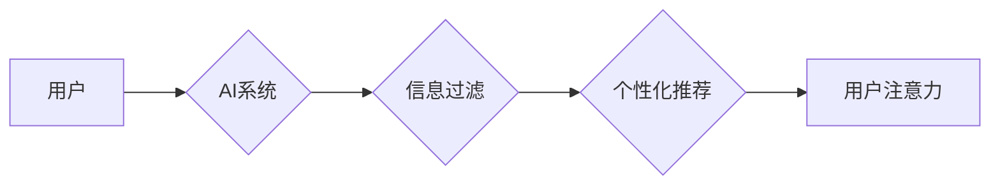

                 

## 关键词：人工智能、注意力流、深度学习、认知科学、注意力管理、未来工作、未来生活

## 1. 背景介绍

在信息爆炸的时代，人类的注意力正受到前所未有的挑战。从社交媒体的推送通知到电子邮件的轰炸，我们每天都被各种信息源包围，难以集中精力完成重要任务。与此同时，人工智能（AI）技术飞速发展，正在深刻地改变着我们的生活和工作方式。AI 能够自动处理大量数据，识别模式，并提供个性化的服务，这为我们带来了便利的同时，也加剧了对我们注意力的竞争。

如何有效地管理注意力，在信息洪流中保持专注，成为当今社会面临的重要课题。而AI技术，恰恰可以为我们提供一些新的思路和工具。

## 2. 核心概念与联系

### 2.1 人类注意力流

人类的注意力流是一个复杂的过程，涉及到认知、神经科学和心理学等多个领域。简单来说，注意力流是指我们对特定信息或任务的集中和持续关注。它是一个动态的过程，会受到各种因素的影响，例如：

* **内在因素:**  个体差异、情绪、认知能力、目标和动机等。
* **外在因素:** 环境噪音、信息密度、任务难度、社交互动等。

### 2.2 AI 与注意力流

AI技术可以模拟和理解人类的注意力机制，并将其应用于各种场景。例如：

* **个性化推荐:** AI算法可以根据用户的历史行为和偏好，预测用户感兴趣的内容，并将其推荐给用户，从而引导用户的注意力。
* **信息过滤:** AI可以识别和过滤掉无关或低价值的信息，帮助用户集中精力处理重要信息。
* **注意力训练:** AI可以设计个性化的注意力训练游戏和应用程序，帮助用户提高注意力集中能力。

### 2.3  AI 影响注意力流的机制

AI技术对人类注意力流的影响是多方面的：

* **信息过载:** AI驱动的个性化推荐和信息过滤可能会导致信息过载，因为用户更容易接触到大量与自己兴趣相关的信息。
* **注意力碎片化:** AI驱动的社交媒体和游戏可能会导致注意力碎片化，因为用户更容易被各种刺激分散注意力。
* **认知偏差:** AI算法可能会产生认知偏差，例如过滤掉与用户观点相悖的信息，从而影响用户的认知和决策。

**Mermaid 流程图**



## 3. 核心算法原理 & 具体操作步骤

### 3.1 算法原理概述

注意力机制是深度学习领域的重要发展方向，它能够模拟人类的注意力机制，帮助模型更好地理解和处理信息。

注意力机制的核心思想是：在处理信息时，模型应该关注与当前任务最相关的部分，而忽略无关的部分。

### 3.2 算法步骤详解

1. **输入数据:** 将输入数据（例如文本、图像）转换为模型可以理解的格式。
2. **编码:** 使用编码器网络对输入数据进行编码，生成每个元素的表示向量。
3. **注意力计算:** 计算每个元素的注意力权重，权重表示该元素对当前任务的 relevance。
4. **加权求和:** 根据注意力权重对编码后的表示向量进行加权求和，得到最终的输出。

### 3.3 算法优缺点

**优点:**

* 能够提高模型的准确性和效率。
* 可以处理长序列数据。
* 可以解释模型的决策过程。

**缺点:**

* 计算复杂度较高。
* 需要大量的训练数据。

### 3.4 算法应用领域

* **自然语言处理:** 机器翻译、文本摘要、问答系统等。
* **计算机视觉:** 图像识别、目标检测、图像 captioning 等。
* **语音识别:** 语音转文本、语音合成等。

## 4. 数学模型和公式 & 详细讲解 & 举例说明

### 4.1 数学模型构建

注意力机制的数学模型通常基于以下公式：

**注意力权重:**

$$
a_{ij} = \frac{exp(e_{ij})}{\sum_{k=1}^{n} exp(e_{ik})}
$$

其中：

* $a_{ij}$ 是元素 $i$ 对元素 $j$ 的注意力权重。
* $e_{ij}$ 是元素 $i$ 和元素 $j$ 之间的相似度得分。
* $n$ 是所有元素的数量。

**加权求和:**

$$
c_i = \sum_{j=1}^{n} a_{ij} h_j
$$

其中：

* $c_i$ 是元素 $i$ 的最终表示向量。
* $h_j$ 是元素 $j$ 的编码向量。

### 4.2 公式推导过程

注意力权重的计算公式基于 softmax 函数，它将所有元素的相似度得分转换为概率分布，使得每个元素的注意力权重在 0 到 1 之间。

加权求和公式将每个元素的编码向量与对应的注意力权重相乘，然后求和，得到最终的表示向量。

### 4.3 案例分析与讲解

例如，在机器翻译任务中，注意力机制可以帮助模型关注源语言中与目标语言单词相关的部分，从而提高翻译的准确性。

## 5. 项目实践：代码实例和详细解释说明

### 5.1 开发环境搭建

* Python 3.6+
* TensorFlow 或 PyTorch

### 5.2 源代码详细实现

```python
import tensorflow as tf

# 定义注意力机制层
class AttentionLayer(tf.keras.layers.Layer):
    def __init__(self, units):
        super(AttentionLayer, self).__init__()
        self.W1 = tf.keras.layers.Dense(units)
        self.W2 = tf.keras.layers.Dense(units)
        self.V = tf.keras.layers.Dense(1)

    def call(self, inputs):
        # inputs: [batch_size, seq_len, units]
        h = self.W1(inputs)
        a = tf.nn.tanh(self.W2(inputs))
        scores = self.V(tf.math.multiply(h, a))
        attention_weights = tf.nn.softmax(scores, axis=1)
        context_vector = tf.math.multiply(attention_weights, inputs)
        context_vector = tf.reduce_sum(context_vector, axis=1)
        return context_vector
```

### 5.3 代码解读与分析

* `AttentionLayer` 类定义了一个注意力机制层。
* `W1` 和 `W2` 是两个全连接层，用于计算注意力权重。
* `V` 是一个全连接层，用于计算注意力得分。
* `call` 方法实现注意力机制的计算过程。

### 5.4 运行结果展示

运行上述代码，可以得到每个时间步的注意力权重分布，以及最终的上下文向量。

## 6. 实际应用场景

### 6.1 工作场景

* **智能办公助手:** AI 驱动的办公助手可以根据用户的任务和需求，自动筛选和整理信息，提高工作效率。
* **个性化学习平台:** AI 可以根据学生的学习进度和能力，提供个性化的学习内容和练习，帮助学生更好地掌握知识。
* **远程协作:** AI 可以帮助远程团队成员更好地沟通和协作，例如自动生成会议记录、翻译异语等。

### 6.2 生活场景

* **智能家居:** AI 可以根据用户的习惯和喜好，自动控制家居设备，例如调节灯光、温度、音乐等。
* **健康管理:** AI 可以分析用户的健康数据，提供个性化的健康建议和提醒。
* **娱乐休闲:** AI 可以根据用户的兴趣爱好，推荐个性化的娱乐内容，例如电影、音乐、游戏等。

### 6.4 未来应用展望

随着 AI 技术的不断发展，其对人类注意力流的影响将更加深远。未来，我们可能会看到：

* **更个性化的 AI 体验:** AI 将能够更加精准地理解用户的需求和偏好，提供更加个性化的服务和体验。
* **更智能的注意力管理工具:** AI 将能够帮助用户更好地管理注意力，提高工作和学习效率。
* **新的注意力经济模式:** AI 将可能改变我们获取和利用信息的模式，带来新的注意力经济模式。

## 7. 工具和资源推荐

### 7.1 学习资源推荐

* **书籍:**
    * 《深度学习》
    * 《Attention Is All You Need》
* **在线课程:**
    * Coursera: 深度学习
    * Udacity: 自然语言处理

### 7.2 开发工具推荐

* **TensorFlow:** 开源深度学习框架
* **PyTorch:** 开源深度学习框架
* **Keras:** 高级深度学习 API

### 7.3 相关论文推荐

* 《Attention Is All You Need》
* 《BERT: Pre-training of Deep Bidirectional Transformers for Language Understanding》
* 《Transformer-XL: Attentive Language Models Beyond a Fixed-Length Context》

## 8. 总结：未来发展趋势与挑战

### 8.1 研究成果总结

AI技术在模拟和理解人类注意力机制方面取得了显著进展，并成功应用于各种领域。注意力机制能够提高模型的准确性和效率，并为我们提供新的思路和工具来管理注意力。

### 8.2 未来发展趋势

* **更强大的注意力模型:** 研究人员将继续探索更强大的注意力模型，例如跨模态注意力、自注意力等。
* **更广泛的应用场景:** 注意力机制将应用于更多领域，例如医疗、金融、教育等。
* **更深入的认知理解:** AI技术将帮助我们更深入地理解人类注意力机制，并开发出更有效的注意力管理策略。

### 8.3 面临的挑战

* **计算复杂度:** 训练大型注意力模型需要大量的计算资源。
* **数据隐私:** AI模型的训练需要大量数据，如何保护用户数据隐私是一个重要的挑战。
* **伦理问题:** AI技术可能会对人类注意力产生负面影响，例如导致注意力碎片化、认知偏差等，需要认真考虑其伦理问题。

### 8.4 研究展望

未来，AI技术将继续推动人类注意力流的研究和发展，为我们提供更智能、更便捷的生活和工作体验。


## 9. 附录：常见问题与解答

**Q1: 注意力机制是如何工作的？**

A1: 注意力机制通过计算每个元素的注意力权重，来决定模型对哪些元素更关注。权重越高，模型对该元素的关注度就越高。

**Q2: 注意力机制有哪些应用场景？**

A2: 注意力机制应用于各种领域，例如机器翻译、文本摘要、图像识别、语音识别等。

**Q3: 如何训练注意力机制模型？**

A3: 训练注意力机制模型需要使用大量的训练数据，并采用合适的优化算法。

**作者：禅与计算机程序设计艺术 / Zen and the Art of Computer Programming**<end_of_turn>

