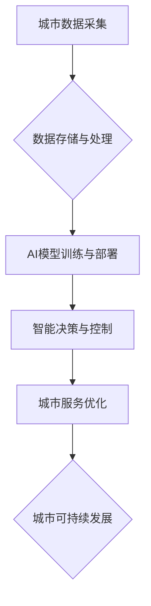

                 

## AI与人类计算：打造可持续发展的城市生活

> 关键词：人工智能、城市计算、可持续发展、数据驱动、智能优化、人类-计算机交互、城市规划、资源管理、环境保护

## 1. 背景介绍

城市化进程的加速和人口增长的持续推动着城市规模的不断扩大，也给城市的可持续发展带来了前所未有的挑战。传统城市管理模式面临着资源短缺、环境污染、交通拥堵、公共服务效率低下等问题。如何利用科技手段提升城市管理水平，构建更加智慧、高效、可持续的城市生活，成为全球范围内亟待解决的难题。

人工智能（AI）作为第四次工业革命的重要驱动力，正在深刻地改变着各行各业，也为城市可持续发展提供了新的机遇。AI技术能够通过对海量数据的分析和学习，实现对城市运行状态的精准感知、预测和控制，从而帮助城市优化资源配置、提升服务效率、降低环境影响，最终构建更加宜居、可持续的城市生态系统。

## 2. 核心概念与联系

城市计算是指利用计算技术和数据分析手段，对城市运行状态进行实时监测、分析和决策，以实现城市管理的智能化和优化。AI与城市计算的结合，形成了一个全新的城市智能化发展模式，即“AI驱动的城市计算”。

**AI驱动的城市计算架构**



**核心概念原理和架构**

* **城市数据采集:** 通过传感器网络、物联网设备、社交媒体等多种途径，收集城市各领域的实时数据，例如交通流量、环境监测、公共设施使用情况、居民生活轨迹等。
* **数据存储与处理:** 将采集到的城市数据进行存储、清洗、整合和分析，构建城市数据平台，为AI模型训练和应用提供数据支撑。
* **AI模型训练与部署:** 利用机器学习、深度学习等AI算法，对城市数据进行分析和建模，训练出能够预测城市运行状态、识别城市问题、提供解决方案的AI模型，并将其部署到城市管理系统中。
* **智能决策与控制:** 基于AI模型的预测和分析结果，对城市各领域进行智能决策和控制，例如优化交通流量、调整能源消耗、预警环境污染等。
* **城市服务优化:** 通过智能决策和控制，提升城市公共服务效率和质量，例如智能交通管理、智慧医疗、精准应急等。
* **城市可持续发展:** 通过优化资源配置、降低环境影响、提升居民生活质量，实现城市可持续发展目标。

## 3. 核心算法原理 & 具体操作步骤

### 3.1  算法原理概述

在AI驱动的城市计算中，常用的算法包括机器学习、深度学习、强化学习等。

* **机器学习:** 通过训练模型，让模型从数据中学习规律，并根据学习到的规律对新数据进行预测或分类。例如，可以利用机器学习算法对城市交通流量进行预测，从而优化交通信号灯控制策略。
* **深度学习:** 是一种更高级的机器学习算法，利用多层神经网络模拟人类大脑的学习过程，能够处理更复杂的数据，例如图像、语音、文本等。例如，可以利用深度学习算法识别城市环境中的污染源，并提供相应的解决方案。
* **强化学习:** 通过训练智能体与环境交互，让智能体学习如何通过采取不同的行动来获得最大奖励。例如，可以利用强化学习算法训练智能交通系统，使其能够根据实时路况动态调整交通流量，从而缓解交通拥堵。

### 3.2  算法步骤详解

以机器学习算法为例，其基本步骤如下：

1. **数据收集与预处理:** 收集相关城市数据，并进行清洗、转换、特征提取等预处理工作，使其能够被机器学习算法所使用。
2. **模型选择:** 根据具体应用场景选择合适的机器学习算法，例如线性回归、逻辑回归、决策树、支持向量机等。
3. **模型训练:** 利用训练数据对选定的机器学习算法进行训练，调整模型参数，使其能够学习到城市数据中的规律。
4. **模型评估:** 利用测试数据对训练好的模型进行评估，例如计算模型的准确率、召回率、F1-score等指标，评估模型的性能。
5. **模型部署:** 将训练好的模型部署到城市管理系统中，使其能够对实时数据进行预测或分类，并提供决策支持。

### 3.3  算法优缺点

**优点:**

* **数据驱动:** 基于海量数据的分析和学习，能够提供更加精准、科学的决策支持。
* **智能化:** 自动化决策过程，提高决策效率和准确性。
* **可持续性:** 通过优化资源配置和降低环境影响，促进城市可持续发展。

**缺点:**

* **数据依赖:** 需要大量高质量的数据进行训练和验证，数据质量直接影响模型性能。
* **算法复杂性:** 一些AI算法的训练和部署需要较高的技术水平和计算资源。
* **伦理风险:** AI算法的决策可能会存在偏见或不公平性，需要进行伦理评估和监管。

### 3.4  算法应用领域

AI算法在城市计算领域有着广泛的应用，例如：

* **智能交通管理:** 预测交通流量、优化交通信号灯控制、缓解交通拥堵。
* **智慧能源管理:** 预测能源需求、优化能源分配、降低能源消耗。
* **环境监测与保护:** 识别污染源、预测环境变化、制定环境保护措施。
* **公共安全保障:** 预警犯罪风险、识别危险事件、提高应急响应效率。
* **城市规划与发展:** 分析城市发展趋势、优化城市布局、促进城市可持续发展。

## 4. 数学模型和公式 & 详细讲解 & 举例说明

### 4.1  数学模型构建

在AI驱动的城市计算中，常用的数学模型包括线性回归模型、逻辑回归模型、支持向量机模型、神经网络模型等。

**线性回归模型:** 用于预测连续型变量，例如城市交通流量。其数学模型如下：

$$y = \beta_0 + \beta_1x_1 + \beta_2x_2 + ... + \beta_nx_n + \epsilon$$

其中：

* $y$ 是预测变量
* $x_1, x_2, ..., x_n$ 是解释变量
* $\beta_0, \beta_1, \beta_2, ..., \beta_n$ 是模型参数
* $\epsilon$ 是误差项

**逻辑回归模型:** 用于预测分类型变量，例如城市环境质量。其数学模型如下：

$$P(y=1|x) = \frac{1}{1 + e^{-( \beta_0 + \beta_1x_1 + \beta_2x_2 + ... + \beta_nx_n)}}$$

其中：

* $P(y=1|x)$ 是预测变量 $y$ 为 1 的概率
* $x_1, x_2, ..., x_n$ 是解释变量
* $\beta_0, \beta_1, \beta_2, ..., \beta_n$ 是模型参数

### 4.2  公式推导过程

模型参数的估计可以通过最小二乘法或最大似然估计等方法进行。例如，线性回归模型的参数估计可以通过最小二乘法求解，其目标函数为：

$$J(\beta) = \sum_{i=1}^{n}(y_i - \hat{y}_i)^2$$

其中：

* $J(\beta)$ 是损失函数
* $\beta$ 是模型参数
* $y_i$ 是实际观测值
* $\hat{y}_i$ 是模型预测值

通过求解损失函数的最小值，可以得到模型参数的最佳估计值。

### 4.3  案例分析与讲解

例如，可以利用线性回归模型预测城市交通流量。假设我们收集了城市交通流量和时间、日期、天气等相关数据，可以建立一个线性回归模型，将交通流量作为预测变量，时间、日期、天气等因素作为解释变量。通过训练模型，可以得到交通流量与这些因素之间的关系，并利用模型预测未来交通流量。

## 5. 项目实践：代码实例和详细解释说明

### 5.1  开发环境搭建

* **操作系统:** Ubuntu 20.04 LTS
* **编程语言:** Python 3.8
* **深度学习框架:** TensorFlow 2.0
* **数据处理库:** Pandas, NumPy
* **可视化库:** Matplotlib, Seaborn

### 5.2  源代码详细实现

```python
import pandas as pd
from sklearn.linear_model import LinearRegression
from sklearn.model_selection import train_test_split
from sklearn.metrics import mean_squared_error

# 加载数据
data = pd.read_csv('traffic_data.csv')

# 选择特征和目标变量
features = ['time', 'date', 'weather']
target = 'traffic_flow'

# 将数据分为训练集和测试集
X_train, X_test, y_train, y_test = train_test_split(data[features], data[target], test_size=0.2)

# 创建线性回归模型
model = LinearRegression()

# 训练模型
model.fit(X_train, y_train)

# 预测测试集数据
y_pred = model.predict(X_test)

# 计算模型性能
mse = mean_squared_error(y_test, y_pred)
print(f'Mean Squared Error: {mse}')

# 可视化预测结果
import matplotlib.pyplot as plt
plt.scatter(y_test, y_pred)
plt.xlabel('Actual Traffic Flow')
plt.ylabel('Predicted Traffic Flow')
plt.title('Linear Regression Model Performance')
plt.show()
```

### 5.3  代码解读与分析

* **数据加载:** 使用Pandas库加载城市交通数据。
* **特征选择:** 选择时间、日期、天气等因素作为预测交通流量的特征。
* **数据分割:** 将数据分为训练集和测试集，用于模型训练和性能评估。
* **模型创建:** 使用Scikit-learn库中的LinearRegression类创建线性回归模型。
* **模型训练:** 使用训练集数据训练模型，学习交通流量与特征之间的关系。
* **模型预测:** 使用训练好的模型预测测试集数据的交通流量。
* **性能评估:** 使用均方误差（MSE）作为模型性能指标，评估模型的预测精度。
* **结果可视化:** 使用Matplotlib库绘制实际交通流量与预测交通流量之间的散点图，直观展示模型的预测效果。

### 5.4  运行结果展示

运行代码后，会输出模型的均方误差值，以及实际交通流量与预测交通流量之间的散点图。

## 6. 实际应用场景

### 6.1  智能交通管理

AI驱动的城市计算可以帮助城市优化交通流量，缓解交通拥堵。例如，可以利用AI算法预测交通流量，动态调整交通信号灯控制策略，优化道路通行效率。

### 6.2  智慧能源管理

AI算法可以帮助城市优化能源分配，降低能源消耗。例如，可以利用AI算法预测能源需求，动态调整能源供应，避免能源浪费。

### 6.3  环境监测与保护

AI算法可以帮助城市监测环境质量，识别污染源，制定环境保护措施。例如，可以利用AI算法分析空气质量数据，识别污染源，并提供相应的解决方案。

### 6.4  未来应用展望

随着AI技术的不断发展，AI驱动的城市计算将在未来发挥更加重要的作用。例如，可以利用AI算法实现城市智能化决策，构建更加智慧、高效、可持续的城市生态系统。

## 7. 工具和资源推荐

### 7.1  学习资源推荐

* **在线课程:** Coursera, edX, Udacity
* **书籍:** "Deep Learning" by Ian Goodfellow, "Hands-On Machine Learning with Scikit-Learn, Keras & TensorFlow" by Aurélien Géron
* **博客:** Towards Data Science, Machine Learning Mastery

### 7.2  开发工具推荐

* **编程语言:** Python
* **深度学习框架:** TensorFlow, PyTorch
* **数据处理库:** Pandas, NumPy
* **可视化库:** Matplotlib, Seaborn

### 7.3  相关论文推荐

* "Urban Computing: Concepts, Methodologies, Tools, and Applications" by Xiaofeng Wang
* "Smart Cities: An Overview" by David C. Parkes
* "Artificial Intelligence for Smart Cities" by Michael Wooldridge

## 8. 总结：未来发展趋势与挑战

### 8.1  研究成果总结

AI驱动的城市计算已经取得了显著的成果，例如在交通管理、能源管理、环境保护等领域取得了突破性的进展。

### 8.2  未来发展趋势

* **更智能的算法:** 发展更智能、更强大的AI算法，例如强化学习、迁移学习等，提高城市计算的智能化水平。
* **更丰富的应用场景:** 将AI技术应用到更多城市领域，例如城市规划、公共安全、医疗保健等，构建更加智慧、高效的城市生态系统。
* **更强大的计算能力:** 发展更强大的计算能力，例如云计算、边缘计算等，支持AI算法的训练和部署。

### 8.3  面临的挑战

* **数据安全与隐私保护:** 城市数据涉及到居民的隐私信息，需要加强数据安全和隐私保护措施。
* **算法公平性与可解释性:** AI算法可能会存在偏见或不公平性，需要提高算法的公平性和可解释性。
* **技术伦理与社会影响:** AI技术的应用需要考虑其伦理和社会影响，需要制定相应的规范和政策。

### 8.4  研究展望

未来，AI驱动的城市计算将继续朝着更智能、更可持续的方向发展，为构建更加智慧、高效、可持续的城市生活做出更大的贡献。


## 9. 附录：常见问题与解答

**Q1: AI驱动的城市计算需要哪些数据？**

**A1:** AI驱动的城市计算需要各种城市数据，例如交通流量、环境监测、公共设施使用情况、居民生活轨迹等。

**Q2: AI算法的训练需要哪些资源？**

**A2:** AI算法的训练需要大量的计算资源、数据存储空间和专业人才。

**Q3: AI驱动的城市计算会带来哪些伦理风险？**

**A3:** AI算法的决策可能会存在偏见或不公平性，需要加强算法的公平性和可解释性，并制定相应的伦理规范和政策。


作者：禅与计算机程序设计艺术 / Zen and the Art of Computer Programming<end_of_turn>

