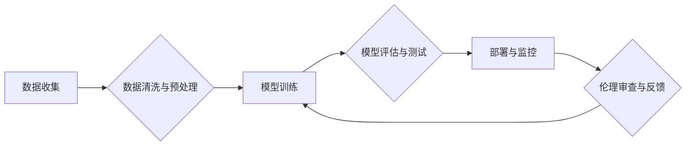

                 

## AI伦理新篇章：LLM发展中的道德考量

> 关键词：大型语言模型 (LLM)、人工智能伦理、偏见、公平性、透明度、可解释性、责任

### 1. 背景介绍

近年来，大型语言模型 (LLM) 作为人工智能领域最具突破性的进展之一，展现出令人惊叹的文本生成、翻译、摘要和对话能力。这些模型通过学习海量文本数据，掌握了语言的复杂规律，并能够生成逼真、流畅的文本。然而，LLM 的强大能力也引发了广泛的伦理关注。

LLM 的训练数据往往包含人类社会中的各种偏见和歧视，这可能导致模型生成带有偏见和歧视性的文本，加剧社会不公。此外，LLM 的决策过程通常是复杂的，难以理解，这使得其行为难以解释和监督，也增加了模型可能被滥用以进行恶意攻击或传播虚假信息的风险。

因此，在 LLM 发展蓬勃之际，探讨其伦理问题，建立相应的规范和机制，至关重要。

### 2. 核心概念与联系

**2.1  大型语言模型 (LLM)**

大型语言模型 (LLM) 是一种基于深度学习的统计模型，能够理解和生成人类语言。它们通常由 Transformer 架构构成，并通过大量的文本数据进行训练。

**2.2  人工智能伦理**

人工智能伦理是指在人工智能技术发展和应用过程中，遵循道德原则和社会规范，确保人工智能技术安全、可控、可持续发展的伦理准则。

**2.3  LLM 伦理问题**

LLM 的伦理问题主要体现在以下几个方面：

* **偏见和歧视:** LLM 训练数据可能包含社会偏见，导致模型生成带有偏见和歧视性的文本。
* **隐私和安全:** LLM 可能泄露训练数据中的敏感信息，或被用于进行隐私侵犯。
* **透明度和可解释性:** LLM 的决策过程复杂，难以理解，这使得其行为难以解释和监督。
* **责任和问责:** 当 LLM 产生负面后果时，如何界定责任和追究问责？

**2.4  LLM 伦理框架**

为了解决 LLM 伦理问题，需要建立相应的伦理框架，包括：

* **数据治理:** 确保训练数据质量，减少偏见和歧视。
* **模型评估和测试:** 对模型进行全面评估，识别潜在的伦理风险。
* **透明度和可解释性:** 提高模型的透明度和可解释性，方便理解和监督。
* **责任和问责:** 明确模型开发和使用者的责任和义务。

**Mermaid 流程图**



### 3. 核心算法原理 & 具体操作步骤

**3.1  算法原理概述**

LLM 的核心算法是基于 Transformer 架构的深度神经网络。Transformer 模型利用自注意力机制，能够捕捉文本序列中长距离依赖关系，从而实现更准确的语言理解和生成。

**3.2  算法步骤详解**

1. **数据预处理:** 将文本数据进行清洗、分词、标记等预处理操作，使其适合模型训练。
2. **模型构建:** 根据 Transformer 架构构建模型，包括编码器、解码器和注意力机制等模块。
3. **模型训练:** 使用大量的文本数据对模型进行训练，通过调整模型参数，使其能够生成符合语义和语法规则的文本。
4. **模型评估:** 使用测试数据对模型进行评估，衡量其生成文本的质量和准确性。
5. **模型部署:** 将训练好的模型部署到实际应用场景中，例如聊天机器人、文本摘要等。

**3.3  算法优缺点**

**优点:**

* 能够捕捉文本序列中长距离依赖关系，实现更准确的语言理解和生成。
* 训练效率高，能够处理海量文本数据。
* 应用广泛，可用于各种自然语言处理任务。

**缺点:**

* 模型参数量大，需要大量的计算资源进行训练。
* 训练数据对模型性能影响很大，如果训练数据存在偏见，模型也可能生成带有偏见的结果。
* 模型的决策过程复杂，难以解释和监督。

**3.4  算法应用领域**

LLM 的应用领域非常广泛，包括：

* **自然语言理解:** 文本分类、情感分析、问答系统等。
* **自然语言生成:** 文本摘要、机器翻译、对话系统等。
* **代码生成:** 自动生成代码、代码补全等。
* **创意写作:** 生成诗歌、小说、剧本等。

### 4. 数学模型和公式 & 详细讲解 & 举例说明

**4.1  数学模型构建**

LLM 的数学模型通常基于概率论和统计学，其核心是使用神经网络学习文本数据的概率分布。

**4.2  公式推导过程**

LLM 的训练过程本质上是通过最大化似然函数来学习模型参数。

假设训练数据为一个文本序列 $\{x_1, x_2, ..., x_T\}$, 其中每个 $x_i$ 是一个单词。模型的目标是学习一个概率分布 $p(x_T | x_1, x_2, ..., x_{T-1})$，即给定前 $T-1$ 个单词，预测第 $T$ 个单词的概率。

最大似然估计的目标函数为：

$$
\mathcal{L} = \prod_{t=1}^{T} p(x_t | x_1, x_2, ..., x_{t-1})
$$

通过优化这个目标函数，模型可以学习到最符合训练数据的概率分布。

**4.3  案例分析与讲解**

例如，在机器翻译任务中，LLM 可以学习到一个从源语言到目标语言的概率分布。给定一个源语言句子，模型可以根据这个概率分布生成一个最可能的翻译句子。

### 5. 项目实践：代码实例和详细解释说明

**5.1  开发环境搭建**

LLM 的开发环境通常需要安装 Python、深度学习框架 (例如 TensorFlow 或 PyTorch) 和一些自然语言处理库 (例如 NLTK 或 spaCy)。

**5.2  源代码详细实现**

由于 LLMs 的代码实现非常复杂，这里只提供一个简单的文本生成示例代码：

```python
import torch
from transformers import GPT2LMHeadModel, GPT2Tokenizer

# 加载预训练模型和词典
model_name = "gpt2"
tokenizer = GPT2Tokenizer.from_pretrained(model_name)
model = GPT2LMHeadModel.from_pretrained(model_name)

# 输入文本
input_text = "The quick brown fox jumps over the"

# Token化输入文本
input_ids = tokenizer.encode(input_text, return_tensors="pt")

# 生成文本
output = model.generate(input_ids, max_length=50)

# 解码输出文本
generated_text = tokenizer.decode(output[0], skip_special_tokens=True)

# 打印生成文本
print(generated_text)
```

**5.3  代码解读与分析**

这段代码首先加载预训练的 GPT-2 模型和词典。然后，将输入文本 token 化，并使用模型生成文本。最后，将生成的 token 解码成文本并打印出来。

**5.4  运行结果展示**

运行这段代码后，会输出一个基于输入文本生成的续写文本。例如，输入文本为 "The quick brown fox jumps over the"，生成的续写文本可能为 "The quick brown fox jumps over the lazy dog."。

### 6. 实际应用场景

LLM 在各个领域都有着广泛的应用场景：

**6.1  聊天机器人:** LLM 可以用于构建更智能、更自然的聊天机器人，能够理解用户的意图并提供更精准的回复。

**6.2  文本摘要:** LLM 可以自动生成文本摘要，帮助用户快速了解文章内容。

**6.3  机器翻译:** LLM 可以实现更准确、更流畅的机器翻译，打破语言障碍。

**6.4  代码生成:** LLM 可以自动生成代码，提高开发效率。

**6.5  创意写作:** LLM 可以辅助人类进行创意写作，例如生成诗歌、小说、剧本等。

**6.6  未来应用展望**

随着 LLMs 的不断发展，其应用场景将会更加广泛，例如：

* **个性化教育:** 根据学生的学习情况，提供个性化的学习内容和辅导。
* **医疗诊断:** 辅助医生进行疾病诊断，提高诊断准确率。
* **法律服务:** 自动分析法律文件，提供法律建议。

### 7. 工具和资源推荐

**7.1  学习资源推荐**

* **书籍:**

    * 《深度学习》 (Deep Learning) - Ian Goodfellow, Yoshua Bengio, Aaron Courville
    * 《自然语言处理》 (Natural Language Processing) - Jurafsky & Martin

* **在线课程:**

    * Coursera: 自然语言处理 Specialization
    * edX: Deep Learning

**7.2  开发工具推荐**

* **深度学习框架:** TensorFlow, PyTorch
* **自然语言处理库:** NLTK, spaCy
* **预训练模型库:** Hugging Face Transformers

**7.3  相关论文推荐**

* **Attention Is All You Need** - Vaswani et al. (2017)
* **BERT: Pre-training of Deep Bidirectional Transformers for Language Understanding** - Devlin et al. (2018)
* **GPT-3: Language Models are Few-Shot Learners** - Brown et al. (2020)

### 8. 总结：未来发展趋势与挑战

**8.1  研究成果总结**

近年来，LLM 研究取得了显著进展，模型规模不断扩大，性能不断提升。

**8.2  未来发展趋势**

* **模型规模进一步扩大:** 更大的模型规模能够带来更强的语言理解和生成能力。
* **多模态 LLMs:** 将文本与其他模态 (例如图像、音频) 相结合，实现更全面的信息理解和生成。
* **可解释性增强:** 研究更可解释的 LLMs，帮助理解模型的决策过程。

**8.3  面临的挑战**

* **数据偏见:** 训练数据中的偏见可能导致模型生成带有偏见的结果。
* **安全风险:** LLMs 可能被用于生成虚假信息、进行恶意攻击等。
* **伦理问题:** LLMs 的应用引发了诸多伦理问题，需要制定相应的规范和机制。

**8.4  研究展望**

未来，LLM 研究需要更加关注数据质量、模型可解释性和伦理问题，确保 LLMs 的安全、可控和可持续发展。

### 9. 附录：常见问题与解答

**9.1  LLM 的训练需要多少计算资源？**

LLM 的训练需要大量的计算资源，例如 GPU 和 TPU。模型规模越大，训练所需的计算资源越多。

**9.2  如何解决 LLM 训练数据中的偏见问题？**

可以通过多种方法解决 LLM 训练数据中的偏见问题，例如：

* 使用更全面、更均衡的训练数据。
* 使用去偏见算法对训练数据进行预处理。
* 在模型训练过程中加入对抗训练，提高模型对偏见的鲁棒性。

**9.3  如何评估 LLM 的性能？**

LLM 的性能可以通过多种指标进行评估，例如：

* perplexity
* BLEU
* ROUGE

**9.4  LLM 的应用有哪些伦理风险？**

LLM 的应用可能存在以下伦理风险：

* 产生带有偏见和歧视性的文本。
* 泄露训练数据中的敏感信息。
* 被用于进行恶意攻击或传播虚假信息。

**9.5  如何应对 LLMs 带来的伦理挑战？**

应对 LLMs 带来的伦理挑战需要多方面的努力，例如：

* 制定相应的伦理规范和政策。
* 开发更安全、更可控的 LLMs。
* 加强公众对 LLMs 的认知和监督。


作者：禅与计算机程序设计艺术 / Zen and the Art of Computer Programming 
<end_of_turn>

