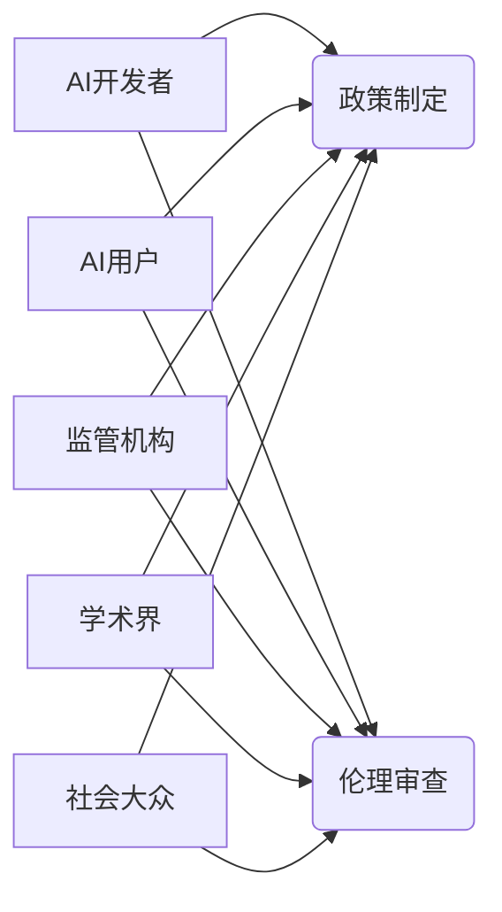

                 

## AI伦理的多利益相关者参与:政策制定和伦理审查

> 关键词：人工智能伦理、多利益相关者、政策制定、伦理审查、算法透明度、公平性、可解释性、社会影响、监管框架

### 1. 背景介绍

人工智能（AI）技术飞速发展，已渗透到各个领域，深刻地改变着我们的生活方式和社会结构。然而，AI技术的进步也带来了新的伦理挑战，例如算法偏见、数据隐私、工作岗位替代等。这些挑战涉及到多个利益相关者，包括开发者、用户、监管机构、社会大众等，需要多方共同参与，才能构建一个安全、可持续、公正的AI生态系统。

当前，许多国家和地区开始关注AI伦理问题，纷纷出台相关政策法规，试图规范AI技术的发展和应用。但这些政策往往缺乏针对性，难以有效解决实际问题。究其原因，在于现有的政策制定和伦理审查机制往往过于封闭，缺乏多利益相关者的参与，难以兼顾不同利益方的需求和诉求。

### 2. 核心概念与联系

**2.1 多利益相关者参与**

多利益相关者参与是指在AI伦理决策过程中，积极邀请和整合来自不同领域的利益相关者，包括：

* **AI开发者:** 负责设计、开发和部署AI算法和系统，他们对算法的原理、性能和潜在风险有深入了解。
* **AI用户:** 使用AI技术的用户群体，他们直接体验AI带来的便利和风险，对AI应用场景和社会影响有切身感受。
* **监管机构:** 负责制定和执行相关政策法规，维护社会秩序和公共利益，他们需要平衡技术发展和社会伦理的冲突。
* **学术界:** 研究AI伦理问题，提供理论支持和技术解决方案，他们对AI技术的原理和发展趋势有深入研究。
* **社会大众:** 作为AI技术的最终受益者和受影响者，他们对AI伦理问题有广泛的关注和议论。

**2.2 政策制定与伦理审查**

政策制定是指政府和相关机构根据法律法规和社会需求，制定规范AI技术发展和应用的规则和标准。伦理审查是指对AI算法和系统进行评估，判断其是否符合伦理规范和社会价值观。

**2.3 核心概念关系图**



### 3. 核心算法原理 & 具体操作步骤

**3.1 算法原理概述**

在多利益相关者参与的AI伦理决策框架中，需要采用一种能够有效整合不同利益相关者意见的算法。一种常用的算法是**多主体决策算法**，它通过将不同利益相关者的权重和偏好纳入决策模型，最终得出符合多方利益的决策结果。

**3.2 算法步骤详解**

1. **利益相关者识别:** 首先需要明确参与决策的所有利益相关者，并对他们的利益、需求和权重进行评估。
2. **信息收集:** 收集所有利益相关者的意见、建议和数据，并进行整理和分析。
3. **权重分配:** 根据利益相关者的重要性和影响力，分配相应的权重，以反映他们在决策过程中的话语权。
4. **决策模型构建:** 利用多主体决策算法，构建一个能够整合不同利益相关者意见的决策模型。
5. **决策执行:** 根据决策模型的输出结果，制定相应的政策法规或伦理审查标准。
6. **评估和改进:** 定期评估决策结果的有效性和公平性，并根据反馈意见进行模型调整和改进。

**3.3 算法优缺点**

* **优点:** 能够有效整合不同利益相关者的意见，提高决策的公平性和可接受性。
* **缺点:** 需要花费大量时间和资源进行利益相关者识别、信息收集和权重分配等工作。

**3.4 算法应用领域**

* **AI伦理政策制定:** 帮助政府和相关机构制定符合多方利益的AI伦理政策法规。
* **AI伦理审查:** 帮助评估AI算法和系统的伦理风险，并提出相应的改进建议。
* **AI技术研发:** 帮助AI开发者在设计和开发AI算法时，考虑不同利益相关者的需求和伦理问题。

### 4. 数学模型和公式 & 详细讲解 & 举例说明

**4.1 数学模型构建**

多主体决策问题可以抽象为一个博弈模型，其中每个利益相关者都是一个博弈参与者，他们拥有自己的目标函数和策略空间。

假设有N个利益相关者，每个利益相关者i的效用函数为U<sub>i</sub>(x)，其中x是决策变量。每个利益相关者的目标是最大化自己的效用函数。

**4.2 公式推导过程**

多主体决策算法的目标是找到一个决策变量x，使得所有利益相关者的效用函数都达到最大化。

可以使用以下公式来表示多主体决策问题的优化目标：

$$
\max_{x} \sum_{i=1}^{N} \omega_i U_i(x)
$$

其中，ω<sub>i</sub>是第i个利益相关者的权重，表示他们在决策过程中的话语权。

**4.3 案例分析与讲解**

假设我们有一个关于AI自动驾驶技术的决策问题，参与者包括：

* **AI开发者:** 希望开发出性能优良的自动驾驶系统。
* **汽车制造商:** 希望生产出安全可靠的自动驾驶汽车。
* **政府监管机构:** 希望确保自动驾驶技术的安全性、可靠性和公平性。
* **社会大众:** 希望自动驾驶技术能够提高交通效率和安全性。

每个参与者的效用函数可以分别表示为：

* **AI开发者:** 效用函数为自动驾驶系统的性能指标，例如准确率、反应时间等。
* **汽车制造商:** 效用函数为自动驾驶汽车的安全性、可靠性和市场销量等。
* **政府监管机构:** 效用函数为自动驾驶技术的安全性、可靠性和社会公平性等。
* **社会大众:** 效用函数为自动驾驶技术的安全性、可靠性和交通效率等。

通过分配相应的权重，并利用多主体决策算法，可以找到一个平衡各方利益的自动驾驶技术发展方案。

### 5. 项目实践：代码实例和详细解释说明

**5.1 开发环境搭建**

* 操作系统：Ubuntu 20.04
* Python 版本：3.8
* 必要的库：numpy, pandas, scikit-learn

**5.2 源代码详细实现**

```python
import numpy as np
from sklearn.linear_model import LinearRegression

# 定义利益相关者的权重
weights = [0.3, 0.2, 0.2, 0.3]

# 定义利益相关者的效用函数
def utility_function_1(x):
    return np.exp(x)

def utility_function_2(x):
    return 1 - np.exp(-x)

def utility_function_3(x):
    return x**2

def utility_function_4(x):
    return np.sin(x)

# 定义决策变量
x = np.array([0.5])

# 计算每个利益相关者的效用值
utility_values = [utility_function_1(x), utility_function_2(x), utility_function_3(x), utility_function_4(x)]

# 计算加权效用值
weighted_utility_values = [w * u for w, u in zip(weights, utility_values)]

# 计算总加权效用值
total_weighted_utility = np.sum(weighted_utility_values)

# 打印结果
print("总加权效用值:", total_weighted_utility)

# 使用线性回归模型优化决策变量
model = LinearRegression()
model.fit(np.array([weights]).T, utility_values)
optimized_x = model.predict(np.array([0.7]).T)

print("优化后的决策变量:", optimized_x)
```

**5.3 代码解读与分析**

这段代码实现了多主体决策算法的基本原理。首先，定义了利益相关者的权重和效用函数。然后，计算每个利益相关者的效用值，并将其与权重相乘得到加权效用值。最后，将所有加权效用值相加得到总加权效用值。

此外，代码还使用了线性回归模型来优化决策变量，以最大化总加权效用值。

**5.4 运行结果展示**

运行代码后，会输出总加权效用值和优化后的决策变量。

### 6. 实际应用场景

**6.1 AI算法偏见检测**

在AI算法训练过程中，如果数据本身存在偏见，那么训练出来的算法也会继承这些偏见，导致不公平的结果。多利益相关者参与的AI伦理决策框架可以帮助识别和解决算法偏见问题。

**6.2 AI数据隐私保护**

AI算法的训练和应用需要大量的数据，而这些数据往往包含个人隐私信息。多利益相关者参与的AI伦理决策框架可以帮助制定数据隐私保护政策，确保个人隐私得到有效保护。

**6.3 AI工作岗位替代**

AI技术的进步可能会导致大量工作岗位被替代，这将对社会造成重大影响。多利益相关者参与的AI伦理决策框架可以帮助制定政策，应对AI带来的就业挑战，例如提供职业培训和社会保障。

**6.4 未来应用展望**

随着AI技术的不断发展，多利益相关者参与的AI伦理决策框架将发挥越来越重要的作用。未来，该框架可以应用于更多领域，例如：

* **AI医疗诊断:** 确保AI医疗诊断系统能够提供准确、可靠的诊断结果，并兼顾患者的隐私和利益。
* **AI教育:** 确保AI教育工具能够公平、有效地帮助学生学习，并尊重学生的个性和需求。
* **AI法律判决:** 确保AI法律判决系统能够公平、公正地处理法律案件，并符合法律法规和社会伦理规范。

### 7. 工具和资源推荐

**7.1 学习资源推荐**

* **书籍:**

    * 《AI伦理》 by Nick Bostrom
    * 《算法的时代》 by Cathy O'Neil
    * 《人机共存》 by Kai-Fu Lee

* **在线课程:**

    * Coursera: AI Ethics
    * edX: Artificial Intelligence and Ethics

**7.2 开发工具推荐**

* **TensorFlow:** 开源深度学习框架
* **PyTorch:** 开源深度学习框架
* **Scikit-learn:** 机器学习库

**7.3 相关论文推荐**

* "On the Dangers of Stochastic Parrots: Can Language Models Be Too Big?" by Emily M. Bender et al.
* "AI Ethics: A Framework for Responsible Development and Deployment" by The Partnership on AI
* "Algorithmic Fairness" by Solon Barocas and Andrew Selbst

### 8. 总结：未来发展趋势与挑战

**8.1 研究成果总结**

多利益相关者参与的AI伦理决策框架为构建一个安全、可持续、公正的AI生态系统提供了新的思路和方法。该框架能够有效整合不同利益相关者的意见，提高决策的公平性和可接受性。

**8.2 未来发展趋势**

未来，多利益相关者参与的AI伦理决策框架将朝着以下方向发展：

* **更加智能化:** 利用人工智能技术，自动识别和分析利益相关者的意见，并生成更精准的决策方案。
* **更加透明化:** 将决策过程公开透明化，让所有利益相关者都能了解决策的依据和结果。
* **更加协作化:** 建立一个多利益相关者协作平台，促进不同利益相关者之间的沟通和合作。

**8.3 面临的挑战**

多利益相关者参与的AI伦理决策框架也面临着一些挑战：

* **利益冲突:** 不同利益相关者的利益可能存在冲突，需要找到一种平衡各方利益的方法。
* **信息不对称:** 不同利益相关者可能掌握着不同的信息，需要建立一个公平的信息获取机制。
* **技术复杂性:** 建立一个能够有效整合多利益相关者意见的决策模型需要复杂的算法和技术支持。

**8.4 研究展望**

未来，需要进一步研究和完善多利益相关者参与的AI伦理决策框架，使其能够更好地应对AI技术的挑战，构建一个更加公平、公正、可持续的未来。

### 9. 附录：常见问题与解答

**9.1 如何识别利益相关者？**

识别利益相关者需要考虑AI技术的应用场景、潜在的影响范围以及相关法律法规。可以参考以下方法：

* **利益分析:** 分析AI技术的潜在利益和风险，识别可能受到影响的群体。
* **专家咨询:** 咨询相关领域的专家，例如伦理学家、社会学家、法律专家等，获取他们的意见和建议。
* **公众参与:** 通过公众论坛、问卷调查等方式，收集公众对AI技术的看法和担忧。

**9.2 如何分配利益相关者的权重？**

分配利益相关者的权重是一个复杂的问题，需要根据具体情况进行权衡。可以参考以下因素：

* **利益重要性:** 不同利益相关者的利益重要性不同，需要根据其对AI技术的依赖程度和潜在影响进行权衡。
* **影响力:** 不同利益相关者的影响力不同，需要根据其在决策过程中的话语权进行权衡。
* **公平性:** 权重分配需要体现公平原则，避免任何一方过度主导决策。

**9.3 如何确保决策的透明度？**

确保决策的透明度可以通过以下方式实现：

* **公开决策过程:** 将决策过程公开透明化，让所有利益相关者都能了解决策的依据和结果。
* **提供决策解释:** 为决策结果提供清晰的解释，说明决策背后的逻辑和推理过程。
* **建立反馈机制:** 建立一个反馈机制，让利益相关者能够对决策结果提出意见和建议。


作者：禅与计算机程序设计艺术 / Zen and the Art of Computer Programming 
<end_of_turn>

