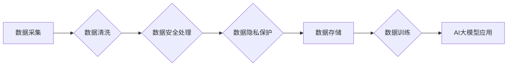

                 

## AI大模型助力电商搜索推荐业务的数据治理工具选型

> 关键词：AI大模型、电商搜索推荐、数据治理、工具选型、数据质量、数据安全、数据隐私

## 1. 背景介绍

随着电商行业的蓬勃发展，搜索推荐系统已成为电商平台的核心竞争力之一。AI大模型的出现为电商搜索推荐业务带来了新的机遇，其强大的学习能力和泛化能力能够帮助电商平台更精准地理解用户需求，提供更个性化的商品推荐，从而提升用户体验和转化率。然而，AI大模型的应用也带来了新的挑战，特别是数据治理方面。

电商平台的数据通常是海量、复杂、多样的，存在着数据质量、数据安全、数据隐私等问题。如果这些问题得不到有效解决，将会严重影响AI大模型的训练效果和应用效果，甚至可能导致平台的运营风险。因此，选择合适的AI大模型助力电商搜索推荐业务的数据治理工具至关重要。

## 2. 核心概念与联系

### 2.1 数据治理

数据治理是指对数据生命周期进行全面的管理，包括数据质量、数据安全、数据隐私、数据可用性、数据可信度等方面。其目标是确保数据能够被正确地收集、存储、处理、分析和使用，从而为业务决策提供可靠的支撑。

### 2.2 AI大模型

AI大模型是指在海量数据上训练的深度学习模型，其参数数量巨大，能够学习到复杂的模式和关系。在电商搜索推荐业务中，AI大模型可以用于用户画像、商品推荐、搜索结果排序等多个环节，提升用户体验和商业价值。

### 2.3 数据治理工具

数据治理工具是指用于帮助企业管理数据质量、数据安全、数据隐私等方面的软件工具。这些工具可以帮助企业自动化数据治理流程，提高数据治理效率，降低数据治理成本。

**数据治理工具与AI大模型的关系**

AI大模型的应用需要依赖于高质量、安全、隐私的训练数据。数据治理工具可以帮助企业确保AI大模型的训练数据满足这些要求，从而提升AI大模型的训练效果和应用效果。

**Mermaid 流程图**



## 3. 核心算法原理 & 具体操作步骤

### 3.1 算法原理概述

数据治理工具通常采用多种算法和技术来实现数据质量、数据安全、数据隐私等方面的管理。常见的算法包括：

* **数据清洗算法**: 用于处理数据中的缺失值、重复值、错误值等问题，例如：均值填充、中位数填充、K-近邻插值等。
* **数据安全算法**: 用于保护数据免受未授权访问、篡改、泄露等威胁，例如：加密算法、访问控制机制、数据脱敏技术等。
* **数据隐私算法**: 用于保护用户个人信息不被滥用，例如：差分隐私、联邦学习等。

### 3.2 算法步骤详解

**数据清洗算法为例**

1. **数据收集**: 从各种数据源收集数据，例如数据库、文件、API等。
2. **数据预处理**: 对数据进行格式转换、编码转换等预处理操作，使其能够被算法处理。
3. **缺失值处理**: 使用合适的算法填充缺失值，例如均值填充、中位数填充、K-近邻插值等。
4. **重复值处理**: 识别和删除重复数据，避免数据冗余。
5. **错误值处理**: 识别和修正错误数据，例如数值错误、文本错误等。
6. **数据验证**: 对清洗后的数据进行验证，确保数据质量满足要求。

### 3.3 算法优缺点

**数据清洗算法的优缺点**

* **优点**: 可以有效地提高数据质量，为后续数据分析和模型训练提供可靠的数据基础。
* **缺点**: 算法选择和参数设置需要根据具体的数据特点进行调整，否则可能会导致数据质量下降。

### 3.4 算法应用领域

数据治理算法广泛应用于各个领域，例如：

* **电商**: 数据清洗、数据安全、数据隐私保护
* **金融**: 风险管理、欺诈检测、客户画像
* **医疗**: 疾病诊断、药物研发、患者管理
* **教育**: 学生评估、课程推荐、个性化学习

## 4. 数学模型和公式 & 详细讲解 & 举例说明

### 4.1 数学模型构建

数据治理工具通常采用数学模型来描述数据质量、数据安全、数据隐私等方面的指标。例如，数据完整性可以用以下公式表示：

$$
完整性 = \frac{实际数据量}{预期数据量}
$$

其中，实际数据量是指实际收集到的数据量，预期数据量是指预期的完整数据量。

### 4.2 公式推导过程

数据完整性公式的推导过程如下：

1. 假设数据完整性是指数据中没有缺失值。
2. 实际数据量是指包含所有数据的量。
3. 预期数据量是指包含所有数据的量。
4. 因此，数据完整性可以表示为实际数据量与预期数据量的比值。

### 4.3 案例分析与讲解

假设一个电商平台收集了1000个用户的购买记录，但其中有100个用户的购买记录缺失，则该平台的用户购买记录的完整性为：

$$
完整性 = \frac{1000 - 100}{1000} = 0.9
$$

这意味着该平台的用户购买记录完整度为90%。

## 5. 项目实践：代码实例和详细解释说明

### 5.1 开发环境搭建

* 操作系统：Linux
* Python版本：3.7+
* 必要的库：pandas, numpy, scikit-learn

### 5.2 源代码详细实现

```python
import pandas as pd

# 数据加载
data = pd.read_csv('user_purchase_data.csv')

# 缺失值处理
data['purchase_amount'].fillna(data['purchase_amount'].mean(), inplace=True)

# 数据清洗
data = data.drop_duplicates()

# 数据验证
print(data.info())
```

### 5.3 代码解读与分析

* 数据加载：使用pandas库读取CSV文件中的用户购买数据。
* 缺失值处理：使用均值填充方法填充缺失的购买金额。
* 数据清洗：使用drop_duplicates方法删除重复数据。
* 数据验证：使用data.info()方法查看数据信息，包括数据类型、缺失值数量等。

### 5.4 运行结果展示

运行上述代码后，将输出用户购买数据的统计信息，包括数据类型、缺失值数量、重复数据数量等。

## 6. 实际应用场景

AI大模型助力电商搜索推荐业务的数据治理工具可以应用于以下场景：

* **用户画像**: 通过数据治理工具清洗和处理用户行为数据，构建更精准的用户画像，为个性化推荐提供数据支持。
* **商品推荐**: 通过数据治理工具处理商品信息数据，识别商品之间的关联关系，为用户推荐更相关的商品。
* **搜索结果排序**: 通过数据治理工具处理用户搜索词数据，分析用户搜索意图，为用户提供更精准的搜索结果排序。

### 6.4 未来应用展望

随着AI技术的不断发展，数据治理工具将更加智能化、自动化，能够更好地支持AI大模型的应用。未来，数据治理工具将能够：

* 自动识别和处理数据质量问题。
* 自动执行数据安全和隐私保护措施。
* 自动生成数据质量报告，帮助企业了解数据质量状况。

## 7. 工具和资源推荐

### 7.1 学习资源推荐

* **书籍**:
    * 《数据治理：从概念到实践》
    * 《数据质量管理》
* **在线课程**:
    * Coursera: Data Governance
    * Udemy: Data Governance Fundamentals

### 7.2 开发工具推荐

* **Apache NiFi**: 流式数据处理平台
* **Apache Kafka**: 分布式流式数据平台
* **Talend**: 数据集成和数据质量管理工具

### 7.3 相关论文推荐

* **Data Governance for AI: A Survey**
* **Towards a Framework for Data Governance in AI Systems**

## 8. 总结：未来发展趋势与挑战

### 8.1 研究成果总结

AI大模型助力电商搜索推荐业务的数据治理工具已取得了一定的成果，能够有效地提高数据质量、数据安全、数据隐私，为AI大模型的应用提供可靠的数据基础。

### 8.2 未来发展趋势

未来，数据治理工具将更加智能化、自动化，能够更好地支持AI大模型的应用。

* **自动化数据治理**: 利用机器学习等技术，自动识别和处理数据质量问题。
* **智能数据安全**: 利用人工智能技术，自动执行数据安全和隐私保护措施。
* **数据治理平台**: 建立统一的数据治理平台，整合各种数据治理工具，提供更全面的数据治理服务。

### 8.3 面临的挑战

数据治理工具的应用也面临着一些挑战：

* **数据标准化**: 不同数据源的数据格式和结构可能不同，需要进行标准化处理。
* **数据安全**: 数据治理工具需要能够保护数据免受未授权访问、篡改、泄露等威胁。
* **数据隐私**: 数据治理工具需要能够保护用户个人信息不被滥用。

### 8.4 研究展望

未来，需要进一步研究以下问题：

* 如何更好地实现数据标准化和数据互操作性。
* 如何利用人工智能技术，提高数据治理工具的智能化和自动化程度。
* 如何更好地平衡数据治理与数据利用之间的关系，确保数据安全和隐私的同时，也能够充分利用数据价值。

## 9. 附录：常见问题与解答

**常见问题**:

* 如何选择合适的AI大模型助力电商搜索推荐业务的数据治理工具？
* 如何评估数据治理工具的性能？
* 如何进行数据治理工具的部署和维护？

**解答**:

* 选择合适的AI大模型助力电商搜索推荐业务的数据治理工具需要根据企业的具体需求和数据特点进行评估。
* 数据治理工具的性能可以评估其能够处理的数据量、处理速度、数据质量提升效果等方面。
* 数据治理工具的部署和维护需要根据工具的特性和企业环境进行规划，并定期进行监控和更新。


作者：禅与计算机程序设计艺术 / Zen and the Art of Computer Programming 
<end_of_turn>

