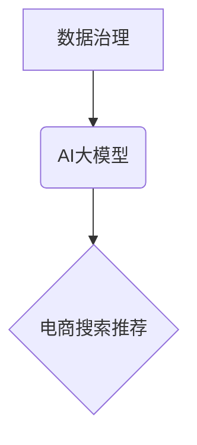

                 

## AI大模型助力电商搜索推荐业务的数据治理能力评估体系应用实践指南

> 关键词：AI大模型、电商搜索推荐、数据治理、评估体系、应用实践

## 1. 背景介绍

随着电商行业的蓬勃发展，搜索推荐系统已成为电商平台的核心竞争力之一。传统的搜索推荐系统主要依赖于基于规则和特征工程的方法，但随着用户行为的复杂化和数据量的激增，这些方法逐渐难以满足用户的个性化需求和平台的业务发展。

近年来，大规模语言模型（LLM）的快速发展为电商搜索推荐带来了新的机遇。LLM 拥有强大的语义理解和文本生成能力，能够更好地理解用户需求，并推荐更精准、更相关的商品。然而，LLM 的应用也带来了新的挑战，例如数据安全、模型偏见、算法可解释性等。

数据治理是确保数据质量、安全和合规性的关键环节，对于 AI 大模型的应用尤为重要。电商平台需要建立完善的数据治理体系，才能有效地利用 AI 大模型提升搜索推荐系统的性能，同时保障用户隐私和数据安全。

## 2. 核心概念与联系

### 2.1 数据治理

数据治理是指对数据生命周期进行全面的管理，包括数据质量、数据安全、数据隐私、数据合规性等方面。其目标是确保数据准确、完整、一致、安全和可信，为业务决策和 AI 模型训练提供高质量的数据支撑。

### 2.2 AI大模型

AI大模型是指在海量数据上训练的深度学习模型，具有强大的泛化能力和学习能力。例如，GPT-3、BERT、LaMDA 等都是著名的 AI 大模型。

### 2.3 电商搜索推荐

电商搜索推荐是指根据用户的搜索行为、浏览历史、购买记录等信息，推荐用户可能感兴趣的商品。

**核心概念关系图**



## 3. 核心算法原理 & 具体操作步骤

### 3.1 算法原理概述

电商搜索推荐系统通常采用基于协同过滤、基于内容过滤、基于深度学习等算法。

* **协同过滤:** 

根据用户的历史行为，预测用户对商品的喜好。

* **内容过滤:** 

根据商品的属性和描述，推荐与用户兴趣相符的商品。

* **深度学习:** 

利用深度神经网络，学习用户和商品之间的复杂关系，进行更精准的推荐。

### 3.2 算法步骤详解

以基于深度学习的推荐算法为例，其步骤如下：

1. **数据预处理:** 收集用户行为数据、商品信息数据等，进行清洗、转换、特征提取等操作。
2. **模型训练:** 利用深度学习模型，训练出能够预测用户对商品的偏好的模型。
3. **模型评估:** 使用测试数据评估模型的性能，例如准确率、召回率、NDCG 等指标。
4. **模型部署:** 将训练好的模型部署到线上环境，用于实时推荐商品。
5. **模型监控:** 持续监控模型的性能，并进行模型更新和优化。

### 3.3 算法优缺点

**优点:**

* 能够学习用户和商品之间的复杂关系，提供更精准的推荐。
* 能够处理海量数据，并进行实时推荐。

**缺点:**

* 需要大量的训练数据，训练成本较高。
* 模型解释性较差，难以理解模型的推荐逻辑。

### 3.4 算法应用领域

* 电商平台商品推荐
* 内容平台个性化推荐
* 社交网络好友推荐
* 音乐平台歌曲推荐

## 4. 数学模型和公式 & 详细讲解 & 举例说明

### 4.1 数学模型构建

基于深度学习的推荐算法通常采用用户-商品评分矩阵作为输入，并利用神经网络进行学习。用户-商品评分矩阵是一个稀疏矩阵，其中每个元素表示用户对商品的评分。

### 4.2 公式推导过程

常用的深度学习推荐算法包括协同过滤模型（如矩阵分解）、神经网络推荐模型（如深度协同过滤、自编码器）等。这些模型的公式推导过程较为复杂，涉及到线性代数、微积分等数学知识。

**举例说明:**

协同过滤模型的损失函数通常采用均方误差（MSE）:

$$
Loss = \frac{1}{N} \sum_{u,i} (r_{ui} - \hat{r}_{ui})^2
$$

其中：

* $N$ 是用户-商品评分矩阵中非零元素的数量。
* $r_{ui}$ 是用户 $u$ 对商品 $i$ 的真实评分。
* $\hat{r}_{ui}$ 是模型预测的用户 $u$ 对商品 $i$ 的评分。

### 4.3 案例分析与讲解

通过对实际电商平台数据的分析，可以发现用户行为具有明显的个性化特征，传统的协同过滤模型难以捕捉到这些特征。因此，需要采用更先进的深度学习模型，例如深度协同过滤模型，来进行推荐。

## 5. 项目实践：代码实例和详细解释说明

### 5.1 开发环境搭建

* Python 3.x
* TensorFlow/PyTorch 等深度学习框架
* Jupyter Notebook 等开发环境

### 5.2 源代码详细实现

```python
import tensorflow as tf

# 定义用户-商品评分矩阵
ratings = tf.constant([[5, 4, 3],
                      [4, 5, 2],
                      [3, 2, 5]])

# 定义深度协同过滤模型
class DeepCF(tf.keras.Model):
    def __init__(self):
        super(DeepCF, self).__init__()
        self.user_embedding = tf.keras.layers.Embedding(input_dim=3, output_dim=16)
        self.item_embedding = tf.keras.layers.Embedding(input_dim=3, output_dim=16)
        self.dense = tf.keras.layers.Dense(1)

    def call(self, user_id, item_id):
        user_embedding = self.user_embedding(user_id)
        item_embedding = self.item_embedding(item_id)
        concat = tf.keras.layers.concatenate([user_embedding, item_embedding])
        output = self.dense(concat)
        return output

# 实例化模型
model = DeepCF()

# 编译模型
model.compile(optimizer='adam', loss='mse')

# 训练模型
model.fit(x=[tf.constant([0]), tf.constant([1]), tf.constant([2])],
          y=ratings,
          epochs=10)

# 预测用户对商品的评分
prediction = model(tf.constant([0]), tf.constant([0]))
print(prediction)
```

### 5.3 代码解读与分析

* 代码首先定义了用户-商品评分矩阵。
* 然后定义了深度协同过滤模型，包含用户嵌入层、商品嵌入层和全连接层。
* 模型使用 Adam 优化器和均方误差损失函数进行训练。
* 最后，使用训练好的模型预测用户对商品的评分。

### 5.4 运行结果展示

运行代码后，可以得到模型训练的损失函数曲线和预测结果。

## 6. 实际应用场景

### 6.1 商品推荐

AI 大模型可以根据用户的历史购买记录、浏览记录、搜索记录等信息，推荐用户可能感兴趣的商品。

### 6.2 个性化搜索

AI 大模型可以理解用户的搜索意图，并提供更精准、更相关的搜索结果。

### 6.3 内容推荐

AI 大模型可以根据用户的阅读习惯、观看历史等信息，推荐用户可能感兴趣的内容。

### 6.4 未来应用展望

* 更精准的个性化推荐
* 更智能的搜索体验
* 更丰富的用户互动

## 7. 工具和资源推荐

### 7.1 学习资源推荐

* **书籍:**

* 《深度学习》
* 《自然语言处理》

* **在线课程:**

* Coursera
* edX

### 7.2 开发工具推荐

* TensorFlow
* PyTorch
* scikit-learn

### 7.3 相关论文推荐

* Attention Is All You Need
* BERT: Pre-training of Deep Bidirectional Transformers for Language Understanding

## 8. 总结：未来发展趋势与挑战

### 8.1 研究成果总结

AI 大模型在电商搜索推荐领域取得了显著的成果，能够提供更精准、更个性化的推荐服务。

### 8.2 未来发展趋势

* 模型规模和能力的进一步提升
* 多模态数据融合
* 模型解释性和可信度的增强

### 8.3 面临的挑战

* 数据安全和隐私保护
* 模型偏见和公平性
* 模型可解释性和可控性

### 8.4 研究展望

未来研究将重点关注解决上述挑战，并探索 AI 大模型在电商搜索推荐领域的更多应用场景。

## 9. 附录：常见问题与解答

* **Q1: 如何评估 AI 大模型的推荐性能？**

* **A1:** 常用的评估指标包括准确率、召回率、NDCG 等。

* **Q2: 如何解决 AI 大模型的模型偏见问题？**

* **A2:** 可以通过数据预处理、模型设计和训练策略等方式来缓解模型偏见。

* **Q3: 如何保证 AI 大模型的模型安全和隐私保护？**

* **A3:** 可以采用数据加密、模型联邦学习等技术来保障模型安全和隐私。


作者：禅与计算机程序设计艺术 / Zen and the Art of Computer Programming 
<end_of_turn>

