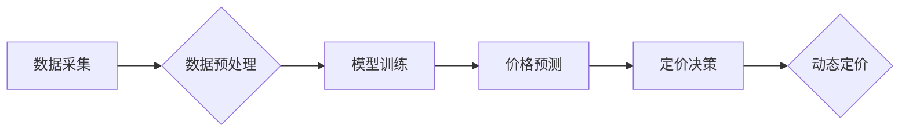

                 

## AI大模型在电商平台动态定价策略中的应用

> 关键词：电商平台、动态定价、AI大模型、机器学习、预测分析、优化算法、价格敏感度、市场竞争

## 1. 背景介绍

在当今激烈的电商市场竞争中，价格策略扮演着至关重要的角色。传统的定价方法往往依赖于经验和主观判断，难以适应市场瞬息万变的需求和竞争环境。随着人工智能技术的快速发展，特别是大模型技术的突破，AI大模型在电商平台动态定价策略中的应用成为一个备受关注的热点。

AI大模型能够通过学习海量数据，识别复杂的市场规律和用户行为模式，从而实现更加精准、高效、智能的定价决策。它可以帮助电商平台：

* **提高定价准确性:** 基于用户画像、商品属性、市场趋势等多维度数据，AI大模型可以预测不同用户群体的价格敏感度，并根据实时市场变化动态调整价格，从而实现更精准的定价策略。
* **优化利润率:** 通过对不同价格点下的销量和利润率进行分析，AI大模型可以帮助电商平台找到最优的定价区间，最大化利润。
* **增强竞争力:** 在竞争激烈的市场环境下，AI大模型可以帮助电商平台实时监测竞争对手的价格策略，并根据市场变化进行灵活调整，从而保持竞争优势。
* **提升用户体验:** AI大模型可以根据用户的购买历史、浏览记录等数据，提供个性化的价格推荐，提升用户的购物体验。

## 2. 核心概念与联系

### 2.1  电商平台动态定价策略

电商平台动态定价策略是指根据市场变化、用户需求等因素，实时调整商品价格的策略。与传统的固定定价相比，动态定价策略更加灵活、精准，能够更好地适应市场竞争和用户需求的变化。

### 2.2  AI大模型

AI大模型是指训练规模庞大、参数数量众多的人工智能模型。它能够通过学习海量数据，识别复杂的模式和规律，并进行预测、决策等高级任务。

### 2.3  核心概念联系

AI大模型在电商平台动态定价策略中的应用，主要通过以下几个环节实现：

1. **数据采集:** 收集用户行为数据、商品属性数据、市场价格数据等多维度数据。
2. **数据预处理:** 对收集到的数据进行清洗、转换、特征工程等处理，使其能够被AI大模型有效学习。
3. **模型训练:** 利用AI大模型算法，对预处理后的数据进行训练，构建能够预测用户需求和市场变化的模型。
4. **价格预测:** 基于训练好的模型，对未来商品需求和市场价格进行预测。
5. **定价决策:** 根据预测结果，动态调整商品价格，实现最优的定价策略。

**Mermaid 流程图**



## 3. 核心算法原理 & 具体操作步骤

### 3.1  算法原理概述

AI大模型在电商平台动态定价策略中的应用，主要采用以下几种算法：

* **机器学习算法:** 
    * **回归算法:** 用于预测商品价格，例如线性回归、逻辑回归、支持向量机等。
    * **分类算法:** 用于预测用户对不同价格点的购买意愿，例如决策树、随机森林、神经网络等。
* **深度学习算法:** 
    * **卷积神经网络(CNN):** 用于提取商品图像特征，预测商品价格。
    * **循环神经网络(RNN):** 用于分析用户行为序列，预测用户对商品价格的敏感度。
* **强化学习算法:** 用于优化定价策略，例如Q学习、SARSA等。

### 3.2  算法步骤详解

以机器学习算法为例，具体操作步骤如下：

1. **数据收集:** 收集用户行为数据、商品属性数据、市场价格数据等多维度数据。
2. **数据预处理:** 对收集到的数据进行清洗、转换、特征工程等处理，使其能够被机器学习算法有效学习。
3. **模型选择:** 根据具体需求选择合适的机器学习算法，例如线性回归、逻辑回归等。
4. **模型训练:** 利用训练数据对模型进行训练，调整模型参数，使其能够准确预测商品价格。
5. **模型评估:** 利用测试数据对模型进行评估，评估模型的预测精度。
6. **模型部署:** 将训练好的模型部署到电商平台，用于实时预测商品价格。

### 3.3  算法优缺点

**优点:**

* **精准度高:** 基于海量数据训练，能够识别复杂的市场规律和用户行为模式，实现更加精准的定价预测。
* **效率高:** 自动化决策流程，能够快速响应市场变化，实现动态定价。
* **可扩展性强:** 可以根据需要添加新的数据源和算法模型，不断提升定价策略的精准度和效率。

**缺点:**

* **数据依赖性强:** 模型的预测精度依赖于数据质量和数据量，数据不足或数据质量低会影响模型的性能。
* **解释性差:** 一些深度学习算法的决策过程难以解释，难以理解模型是如何做出定价决策的。
* **伦理风险:** 算法可能存在偏见，导致不公平的定价策略，需要谨慎考虑伦理风险。

### 3.4  算法应用领域

AI大模型在电商平台动态定价策略中的应用，不仅限于商品价格的调整，还可以应用于以下领域:

* **促销活动优化:** 根据用户行为数据和市场趋势，优化促销活动的时间、力度和目标用户群体。
* **库存管理:** 预测商品需求，优化库存水平，降低库存成本。
* **个性化推荐:** 根据用户的购买历史和浏览记录，推荐个性化的商品和价格。

## 4. 数学模型和公式 & 详细讲解 & 举例说明

### 4.1  数学模型构建

在电商平台动态定价策略中，常用的数学模型包括线性回归模型、逻辑回归模型和神经网络模型。

**线性回归模型:**

假设商品价格 $p$ 与以下因素有关:

* 用户画像特征 $x_1$, $x_2$, ..., $x_n$
* 商品属性特征 $y_1$, $y_2$, ..., $y_m$
* 市场价格趋势 $z$

则线性回归模型可以表示为:

$$p = \beta_0 + \beta_1x_1 + \beta_2x_2 + ... + \beta_nx_n + \gamma_1y_1 + \gamma_2y_2 + ... + \gamma_my_m + \delta z + \epsilon$$

其中:

* $\beta_i$, $\gamma_j$, $\delta$ 为模型参数
* $\epsilon$ 为随机误差项

**逻辑回归模型:**

用于预测用户对不同价格点的购买意愿，将购买意愿转化为概率值。

$$P(购买) = \frac{1}{1 + e^{-( \beta_0 + \beta_1x_1 + \beta_2x_2 + ... + \beta_nx_n + \gamma_1y_1 + \gamma_2y_2 + ... + \gamma_my_m + \delta z )}}$$

其中:

* $P(购买)$ 为用户购买的概率
* $\beta_i$, $\gamma_j$, $\delta$ 为模型参数

**神经网络模型:**

可以学习更复杂的非线性关系，用于预测商品价格和用户购买意愿。

### 4.2  公式推导过程

具体的公式推导过程涉及到大量的数学知识，例如微积分、线性代数、概率论等。

### 4.3  案例分析与讲解

以线性回归模型为例，假设我们想要预测商品价格，已知以下数据:

* 用户年龄 $x_1$
* 用户收入 $x_2$
* 商品类别 $y_1$
* 市场价格趋势 $z$

我们可以使用线性回归模型进行预测，并通过模型参数的调整，找到最优的定价策略。

## 5. 项目实践：代码实例和详细解释说明

### 5.1  开发环境搭建

* Python 3.x
* TensorFlow 或 PyTorch 等深度学习框架
* Jupyter Notebook 或 VS Code 等开发环境

### 5.2  源代码详细实现

```python
# 导入必要的库
import pandas as pd
from sklearn.linear_model import LinearRegression

# 加载数据
data = pd.read_csv('电商数据.csv')

# 数据预处理
# ...

# 训练模型
model = LinearRegression()
model.fit(data[['用户年龄', '用户收入', '商品类别', '市场价格趋势']], data['商品价格'])

# 预测价格
new_data = pd.DataFrame({
    '用户年龄': [25],
    '用户收入': [50000],
    '商品类别': [1],
    '市场价格趋势': [1.05]
})
predicted_price = model.predict(new_data)

# 打印预测结果
print(predicted_price)
```

### 5.3  代码解读与分析

* 首先，导入必要的库，并加载电商数据。
* 然后，对数据进行预处理，例如特征工程、数据归一化等。
* 接着，使用线性回归模型训练模型，并使用训练好的模型预测新的商品价格。

### 5.4  运行结果展示

运行代码后，会输出预测的商品价格。

## 6. 实际应用场景

AI大模型在电商平台动态定价策略中的应用，已经成为现实。许多电商平台都在积极探索和实践，取得了显著的成果。

### 6.1  案例分析

* **亚马逊:** 利用AI大模型分析用户行为数据和市场趋势，实现商品价格的动态调整，提高利润率。
* **阿里巴巴:** 利用AI大模型预测用户对不同价格点的购买意愿，优化促销活动的效果。
* **京东:** 利用AI大模型分析商品库存数据，优化库存管理，降低库存成本。

### 6.2  未来应用展望

随着人工智能技术的不断发展，AI大模型在电商平台动态定价策略中的应用将更加广泛和深入。

* **个性化定价:** 根据用户的购买历史、浏览记录等数据，提供个性化的价格推荐，提升用户体验。
* **动态促销:** 根据用户行为数据和市场趋势，动态调整促销活动的时间、力度和目标用户群体，提高促销活动的效率。
* **跨平台定价:** 利用AI大模型分析跨平台的用户行为数据，实现跨平台的动态定价策略，提高整体竞争力。

## 7. 工具和资源推荐

### 7.1  学习资源推荐

* **书籍:**
    * 《深度学习》
    * 《机器学习实战》
    * 《Python机器学习》
* **在线课程:**
    * Coursera
    * edX
    * Udacity

### 7.2  开发工具推荐

* **Python:** 
    * TensorFlow
    * PyTorch
    * scikit-learn
* **Jupyter Notebook:** 
    * VS Code

### 7.3  相关论文推荐

* **《Recurrent Neural Networks for Dynamic Pricing》**
* **《Deep Learning for Dynamic Pricing》**
* **《Reinforcement Learning for Dynamic Pricing》**

## 8. 总结：未来发展趋势与挑战

### 8.1  研究成果总结

AI大模型在电商平台动态定价策略中的应用取得了显著的成果，能够提高定价准确性、优化利润率、增强竞争力、提升用户体验等。

### 8.2  未来发展趋势

* **模型更加复杂:** 随着人工智能技术的不断发展，AI大模型将更加复杂，能够学习更复杂的市场规律和用户行为模式。
* **数据更加丰富:** 数据将成为AI大模型训练的基石，未来电商平台将收集更加丰富的数据，例如用户画像、商品属性、市场价格、用户行为等。
* **应用更加广泛:** AI大模型的应用将更加广泛，不仅限于商品价格的调整，还将应用于促销活动优化、库存管理、个性化推荐等领域。

### 8.3  面临的挑战

* **数据质量:** AI大模型的性能依赖于数据质量，数据不足或数据质量低会影响模型的性能。
* **算法解释性:** 一些深度学习算法的决策过程难以解释，难以理解模型是如何做出定价决策的。
* **伦理风险:** 算法可能存在偏见，导致不公平的定价策略，需要谨慎考虑伦理风险。

### 8.4  研究展望

未来，研究者将继续探索AI大模型在电商平台动态定价策略中的应用，解决上述挑战，推动AI技术在电商领域的更广泛应用。

## 9. 附录：常见问题与解答

**Q1: AI大模型的定价策略是否会损害用户的利益？**

A1: AI大模型的定价策略旨在实现最优的定价策略，既要考虑平台的利益，也要考虑用户的利益。

**Q2: AI大模型的定价策略是否会影响市场竞争？**

A2: AI大模型的定价策略可以帮助电商平台提高竞争力，但同时也需要考虑市场公平竞争的问题。

**Q3: 如何评估AI大模型的定价策略效果？**

A3: 可以通过多种指标来评估AI大模型的定价策略效果，例如利润率、销量、用户满意度等。


作者：禅与计算机程序设计艺术 / Zen and the Art of Computer Programming 
<end_of_turn>

