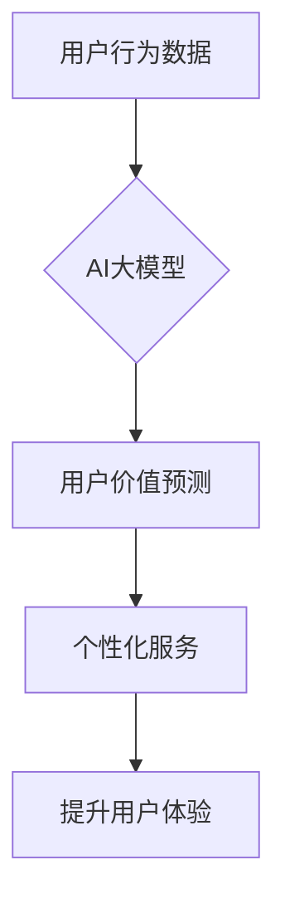

                 

## AI大模型在电商平台用户价值预测中的应用

> 关键词：AI大模型、用户价值预测、电商平台、推荐系统、深度学习、自然语言处理、数据挖掘

## 1. 背景介绍

在当今数据爆炸的时代，电商平台面临着日益激烈的竞争。如何精准地预测用户的价值，并提供个性化的服务，成为提升用户体验、提高转化率和促进商业增长的关键。传统的用户价值预测方法往往依赖于用户的历史行为数据，例如购买记录、浏览历史等，但这些数据往往难以捕捉用户的潜在需求和意图。

近年来，随着深度学习技术的快速发展，AI大模型在用户价值预测领域展现出巨大的潜力。AI大模型能够从海量的数据中学习复杂的模式和关系，并对用户的行为进行更深入的理解，从而实现更精准的用户价值预测。

## 2. 核心概念与联系

### 2.1 用户价值预测

用户价值预测是指通过分析用户的行为数据、特征数据等，预测用户在未来一段时间内对电商平台的贡献度，例如购买金额、复购率、忠诚度等。

### 2.2 AI大模型

AI大模型是指在海量数据上训练的深度学习模型，具有强大的泛化能力和学习能力。常见的AI大模型包括Transformer、BERT、GPT等。

### 2.3 关联性

AI大模型能够通过学习用户的行为数据、特征数据等，发现用户之间的关联性，例如用户兴趣、购买习惯、社交关系等。这些关联性可以帮助电商平台更精准地预测用户的价值。

**Mermaid 流程图**



## 3. 核心算法原理 & 具体操作步骤

### 3.1 算法原理概述

用户价值预测的AI大模型通常基于深度学习算法，例如多层感知机（MLP）、卷积神经网络（CNN）、循环神经网络（RNN）等。这些算法能够从用户的历史行为数据中学习复杂的模式和关系，并预测用户的未来行为。

### 3.2 算法步骤详解

1. **数据收集和预处理:** 收集用户的行为数据、特征数据等，并进行清洗、转换、编码等预处理操作。
2. **模型选择和训练:** 选择合适的深度学习模型，并根据训练数据进行模型训练。
3. **模型评估和调参:** 使用测试数据对模型进行评估，并根据评估结果对模型参数进行调参，以提高模型的预测精度。
4. **模型部署和应用:** 将训练好的模型部署到电商平台，并将其应用于用户价值预测。

### 3.3 算法优缺点

**优点:**

* 能够从海量数据中学习复杂的模式和关系，实现更精准的用户价值预测。
* 具有强大的泛化能力，能够对新的用户进行预测。

**缺点:**

* 需要大量的训练数据，否则模型的预测精度会降低。
* 训练过程耗时较长，需要强大的计算资源。
* 模型的解释性较差，难以理解模型是如何进行预测的。

### 3.4 算法应用领域

* **用户画像构建:** 根据用户的行为数据和特征数据，构建用户的画像，了解用户的兴趣、需求、购买习惯等。
* **个性化推荐:** 根据用户的价值预测结果，推荐个性化的商品和服务。
* **精准营销:** 根据用户的价值预测结果，进行精准的营销推广，提高营销效果。
* **客户关系管理:** 根据用户的价值预测结果，对客户进行分级管理，提供差异化的服务。

## 4. 数学模型和公式 & 详细讲解 & 举例说明

### 4.1 数学模型构建

用户价值预测模型通常采用回归模型，例如线性回归、逻辑回归、支持向量机等。这些模型的目标是预测用户的未来行为，例如购买金额、复购率等。

**线性回归模型:**

$$
y = \beta_0 + \beta_1x_1 + \beta_2x_2 + ... + \beta_nx_n + \epsilon
$$

其中：

* $y$ 是用户价值预测结果
* $\beta_0, \beta_1, ..., \beta_n$ 是模型参数
* $x_1, x_2, ..., x_n$ 是用户的特征数据
* $\epsilon$ 是误差项

### 4.2 公式推导过程

线性回归模型的参数可以通过最小二乘法进行估计。最小二乘法是指寻找使模型预测值与实际值之间的误差平方和最小的参数值。

### 4.3 案例分析与讲解

假设我们想要预测用户的购买金额，用户的特征数据包括年龄、收入、购买频率等。我们可以使用线性回归模型来构建用户价值预测模型。

通过训练数据，我们可以估计模型参数，例如：

* $\beta_0 = 100$
* $\beta_1 = 5$
* $\beta_2 = 2$

这意味着，用户的购买金额与年龄、收入、购买频率之间存在线性关系。

## 5. 项目实践：代码实例和详细解释说明

### 5.1 开发环境搭建

* Python 3.6+
* TensorFlow/PyTorch
* Jupyter Notebook

### 5.2 源代码详细实现

```python
import tensorflow as tf

# 定义模型
model = tf.keras.Sequential([
    tf.keras.layers.Dense(64, activation='relu', input_shape=(5,)),
    tf.keras.layers.Dense(32, activation='relu'),
    tf.keras.layers.Dense(1)
])

# 编译模型
model.compile(optimizer='adam', loss='mse')

# 训练模型
model.fit(X_train, y_train, epochs=10)

# 评估模型
loss = model.evaluate(X_test, y_test)
print('Loss:', loss)
```

### 5.3 代码解读与分析

* 首先，我们定义了一个简单的深度学习模型，包含三个全连接层。
* 然后，我们使用Adam优化器和均方误差损失函数对模型进行编译。
* 接着，我们使用训练数据对模型进行训练，训练10个epochs。
* 最后，我们使用测试数据对模型进行评估，并打印模型的损失值。

### 5.4 运行结果展示

运行结果会显示模型的损失值，可以用来评估模型的预测精度。

## 6. 实际应用场景

### 6.1 用户画像构建

AI大模型可以从用户的行为数据、特征数据等中学习用户的兴趣、需求、购买习惯等，构建用户的画像。例如，可以根据用户的购买记录、浏览历史等数据，构建用户的兴趣画像，了解用户的偏好商品类别、品牌等。

### 6.2 个性化推荐

AI大模型可以根据用户的价值预测结果，推荐个性化的商品和服务。例如，可以根据用户的购买金额、复购率等数据，推荐高价值用户的专属商品和服务。

### 6.3 精准营销

AI大模型可以根据用户的价值预测结果，进行精准的营销推广，提高营销效果。例如，可以根据用户的购买金额、忠诚度等数据，进行精准的广告投放，提高广告转化率。

### 6.4 未来应用展望

随着AI技术的不断发展，AI大模型在电商平台用户价值预测领域的应用将更加广泛和深入。例如，可以利用自然语言处理技术，分析用户的评论、反馈等文本数据，更深入地了解用户的需求和意图。

## 7. 工具和资源推荐

### 7.1 学习资源推荐

* **书籍:**
    * 深度学习
    * 自然语言处理
* **在线课程:**
    * Coursera
    * edX
    * Udacity

### 7.2 开发工具推荐

* **Python:** 
* **TensorFlow/PyTorch:** 深度学习框架
* **Jupyter Notebook:** 数据分析和可视化工具

### 7.3 相关论文推荐

* **BERT: Pre-training of Deep Bidirectional Transformers for Language Understanding**
* **Attention Is All You Need**
* **Recurrent Neural Networks for Sequence Learning**

## 8. 总结：未来发展趋势与挑战

### 8.1 研究成果总结

AI大模型在电商平台用户价值预测领域取得了显著的成果，能够实现更精准的用户价值预测，并为电商平台提供个性化服务、精准营销等应用。

### 8.2 未来发展趋势

* **模型更加复杂:** 未来，AI大模型将更加复杂，能够学习更复杂的模式和关系，实现更精准的用户价值预测。
* **数据更加丰富:** 未来，电商平台将收集更多类型的用户数据，例如用户画像、行为轨迹等，为AI大模型提供更丰富的训练数据。
* **应用更加广泛:** 未来，AI大模型将应用于电商平台的更多领域，例如用户运营、供应链管理等。

### 8.3 面临的挑战

* **数据隐私:** 

AI大模型需要大量的用户数据进行训练，如何保护用户数据隐私是一个重要的挑战。
* **模型解释性:** AI大模型的预测结果难以解释，如何提高模型的解释性是一个重要的研究方向。
* **计算资源:** 训练大型AI大模型需要大量的计算资源，如何降低训练成本是一个重要的挑战。

### 8.4 研究展望

未来，AI大模型在电商平台用户价值预测领域的应用将更加深入和广泛，为电商平台带来更大的价值。


## 9. 附录：常见问题与解答

**Q1: AI大模型的训练数据需要多么庞大？**

A1: AI大模型的训练数据量取决于模型的复杂度和任务的难度。一般来说，需要至少几万条数据，最好是百万级别的数据才能训练出效果较好的模型。

**Q2: 如何评估AI大模型的预测精度？**

A2: 可以使用多种指标来评估AI大模型的预测精度，例如均方误差（MSE）、平均绝对误差（MAE）、R-squared等。

**Q3: 如何保护用户数据隐私？**

A3: 可以采用多种技术来保护用户数据隐私，例如数据脱敏、联邦学习等。

作者：禅与计算机程序设计艺术 / Zen and the Art of Computer Programming 


<end_of_turn>

