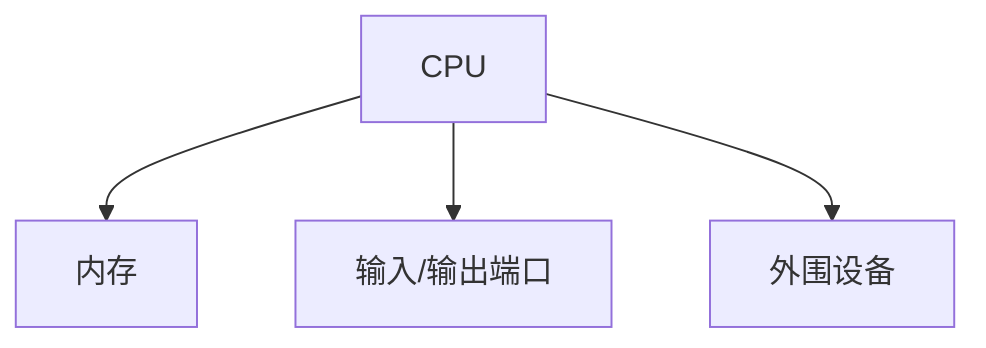

                 

# 文章标题

**嵌入式系统入门：微控制器上的创新**

关键词：嵌入式系统、微控制器、创新、编程、硬件、软件开发

## 摘要

本文旨在为初学者提供嵌入式系统入门的全面指南，特别是针对在微控制器上的创新应用。我们将探讨嵌入式系统的基本概念、微控制器的原理及其在创新中的应用，并通过实例代码来展示如何在实际项目中实现这些概念。本文还将介绍相关的开发工具和资源，并总结未来发展趋势与挑战。

## 1. 背景介绍

### 1.1 嵌入式系统概述

嵌入式系统是一种专用的计算机系统，通常包括硬件和软件两部分。它们设计用于执行特定的任务，如温度控制、汽车引擎管理、智能家居等。与通用计算机系统不同，嵌入式系统通常体积较小、功耗较低且对可靠性要求较高。

### 1.2 微控制器的概念

微控制器（Microcontroller）是一种集成电路，集成了中央处理单元（CPU）、内存、输入/输出端口以及其他外围设备，如定时器、串行通信接口等。微控制器的设计目的是简化嵌入式系统的设计，使其能够直接在硬件上执行各种操作。

### 1.3 微控制器在创新中的应用

微控制器在各类创新应用中发挥着关键作用，从智能家居、物联网（IoT）到工业自动化和医疗设备。随着技术的发展，微控制器的性能不断提高，价格越来越低，使得它们在各类创新应用中变得愈加普及。

## 2. 核心概念与联系

### 2.1 微控制器的架构

微控制器的核心是CPU，它负责执行指令。CPU连接到内存，用于存储程序和数据。输入/输出端口用于与外部设备通信。以下是微控制器的基本架构图：



### 2.2 微控制器的编程

微控制器的编程通常使用C语言或汇编语言。C语言是一种高级编程语言，易于理解和使用。汇编语言则更接近机器语言，提供了对硬件的直接控制。

### 2.3 微控制器与传感器的集成

微控制器可以通过传感器获取环境数据，如温度、湿度、光线等。这些数据可以用于控制硬件设备或传输到远程服务器进行分析。

## 3. 核心算法原理 & 具体操作步骤

### 3.1 温度控制系统

一个简单的温度控制系统可以通过微控制器和温度传感器来实现。以下是具体的操作步骤：

1. **硬件连接**：将温度传感器连接到微控制器的输入端口。
2. **编程**：编写C语言程序，读取温度传感器的数据。
3. **控制逻辑**：根据读取的温度数据，控制加热器或冷却器的开关。
4. **测试**：在实际环境中测试系统的性能和稳定性。

### 3.2 示例代码

以下是使用C语言编写的温度控制系统的示例代码：

```c
#include <stdio.h>
#include <unistd.h>

#define HEATER_PIN 5 // 定义加热器控制端口
#define COOLER_PIN 6 // 定义冷却器控制端口

void setup() {
    // 初始化端口
    pinMode(HEATER_PIN, OUTPUT);
    pinMode(COOLER_PIN, OUTPUT);
}

void loop() {
    int temperature = readTemperature(); // 读取温度

    if (temperature > 30) {
        digitalWrite(HEATER_PIN, HIGH); // 开启加热器
        digitalWrite(COOLER_PIN, LOW); // 关闭冷却器
    } else {
        digitalWrite(HEATER_PIN, LOW); // 关闭加热器
        digitalWrite(COOLER_PIN, HIGH); // 开启冷却器
    }

    delay(1000); // 每隔1秒执行一次循环
}

int readTemperature() {
    // 假设有一个函数read_analog()用于读取温度传感器的数据
    return read_analog(A0); 
}
```

## 4. 数学模型和公式 & 详细讲解 & 举例说明

### 4.1 温度控制中的PID控制算法

PID（比例-积分-微分）控制算法是嵌入式系统中常用的控制算法。它通过调整比例、积分和微分三个参数来优化控制效果。以下是PID控制算法的基本公式：

$$
u(t) = K_p e(t) + K_i \int_{0}^{t} e(\tau)d\tau + K_d \frac{de(t)}{dt}
$$

其中，$u(t)$ 是控制输出，$e(t)$ 是误差（目标值与实际值之差），$K_p$、$K_i$、$K_d$ 分别是比例、积分和微分系数。

### 4.2 示例讲解

假设我们需要控制一个房间温度在25摄氏度，当前温度为23摄氏度。我们可以设置如下PID参数：

- $K_p = 1$
- $K_i = 0.1$
- $K_d = 0.01$

首先，计算误差：

$$
e(t) = 25 - 23 = 2
$$

然后，计算控制输出：

$$
u(t) = 1 \times 2 + 0.1 \times \int_{0}^{t} 2d\tau + 0.01 \frac{de(t)}{dt}
$$

由于微分项在这里可以忽略，我们得到：

$$
u(t) = 2 + 0.1 \times 2t = 2 + 0.2t
$$

随着时间的推移，控制输出将逐步增加，使房间温度逐渐接近25摄氏度。

## 5. 项目实践：代码实例和详细解释说明

### 5.1 开发环境搭建

为了实践嵌入式系统，我们需要搭建一个开发环境。这里我们使用Arduino作为开发平台，因为它易于使用且支持多种微控制器。

- 下载并安装Arduino IDE。
- 连接Arduino板到电脑。
- 选择正确的微控制器和串行端口。

### 5.2 源代码详细实现

以下是一个简单的温度控制系统源代码，使用了PID控制算法：

```c
#include <PID_v1.h>

// 定义PID参数
double Setpoint, Input, Output;
double Kp = 2.2, Ki = 0.1, Kd = 0.05;

// 创建PID对象
PID myPID(&Input, &Output, &Setpoint, Kp, Ki, Kd, DIRECT);

void setup() {
    // 初始化串口通信
    Serial.begin(9600);
    
    // 初始化PID
    Input = readTemperature();
    Setpoint = 25;
    myPID.SetMode(AUTOMATIC);
    myPID.SetTunings(Kp, Ki, Kd);
}

void loop() {
    Input = readTemperature();
    myPID.Compute();

    if (Output > 0) {
        digitalWrite(HEATER_PIN, HIGH);
        digitalWrite(COOLER_PIN, LOW);
    } else {
        digitalWrite(HEATER_PIN, LOW);
        digitalWrite(COOLER_PIN, HIGH);
    }

    // 显示温度和输出值
    Serial.print("Temperature: ");
    Serial.print(Input);
    Serial.print(" | Output: ");
    Serial.println(Output);
    
    delay(100);
}

int readTemperature() {
    // 假设有一个函数read_analog()用于读取温度传感器的数据
    return read_analog(A0);
}
```

### 5.3 代码解读与分析

- **初始化部分**：我们初始化串口通信，设置PID参数，并将PID模式设置为自动。
- **循环部分**：在每次循环中，我们读取温度传感器数据，使用PID算法计算输出值，并根据输出值控制加热器或冷却器。
- **显示部分**：我们通过串口输出当前温度和PID的输出值，用于调试和监控。

### 5.4 运行结果展示

在实际运行中，我们可以在串口中看到温度值和PID输出值的实时变化。当温度低于设定值时，PID输出值为正，加热器开启；当温度高于设定值时，PID输出值为负，冷却器开启。

## 6. 实际应用场景

### 6.1 温度控制系统

温度控制系统是微控制器应用中最常见的场景之一。从家庭恒温器到工业生产线，微控制器都扮演着关键角色。

### 6.2 智能家居

智能家居系统中的许多设备，如灯光控制、门锁、温度和湿度传感器，都依赖于微控制器来实现自动化和远程控制。

### 6.3 工业自动化

在工业自动化中，微控制器用于控制各种机械和设备，如机器人、自动化生产线和数控机床。

### 6.4 医疗设备

医疗设备中的许多功能，如血压监测、体温监测和输液控制，都依赖于微控制器来实现。

## 7. 工具和资源推荐

### 7.1 学习资源推荐

- **书籍**：《微控制器原理与应用》、《嵌入式系统设计》。
- **论文**：搜索IEEE Xplore、ACM Digital Library等数据库。
- **博客**：查看GitHub上的嵌入式系统相关项目。
- **网站**：Arduino官方教程、Adafruit Learning System。

### 7.2 开发工具框架推荐

- **开发环境**：Arduino IDE、Eclipse。
- **编程语言**：C、C++、Python。
- **硬件**：Arduino板、Raspberry Pi。

### 7.3 相关论文著作推荐

- **论文**：《嵌入式系统设计与实现》、《物联网嵌入式系统架构》。
- **著作**：《嵌入式系统原理与应用》、《物联网技术与应用》。

## 8. 总结：未来发展趋势与挑战

### 8.1 发展趋势

- **物联网（IoT）**：随着物联网的普及，嵌入式系统将在更多领域得到应用。
- **人工智能（AI）**：嵌入式系统将逐渐集成AI功能，提高自动化水平。
- **边缘计算**：嵌入式系统将在边缘计算中发挥关键作用，减少数据传输延迟。

### 8.2 挑战

- **功耗**：随着设备变得越来越小，功耗成为了一个重要挑战。
- **安全性**：嵌入式系统面临着网络攻击和数据泄露的风险。
- **兼容性**：不同的硬件平台和软件框架之间的兼容性是一个挑战。

## 9. 附录：常见问题与解答

### 9.1 嵌入式系统是什么？

嵌入式系统是一种专用的计算机系统，用于执行特定任务，如温度控制、汽车引擎管理等。

### 9.2 微控制器有哪些特点？

微控制器具有集成度高、功耗低、可靠性高、成本低等特点。

### 9.3 如何学习嵌入式系统？

可以通过阅读相关书籍、参加在线课程、实践项目等方式来学习嵌入式系统。

## 10. 扩展阅读 & 参考资料

- **书籍**：《嵌入式系统设计教程》、《微控制器应用技术》。
- **论文**：搜索IEEE Xplore、ACM Digital Library等数据库。
- **博客**：查看GitHub上的嵌入式系统相关项目。
- **网站**：Arduino官方教程、Adafruit Learning System。

作者：禅与计算机程序设计艺术 / Zen and the Art of Computer Programming

[本文完]

